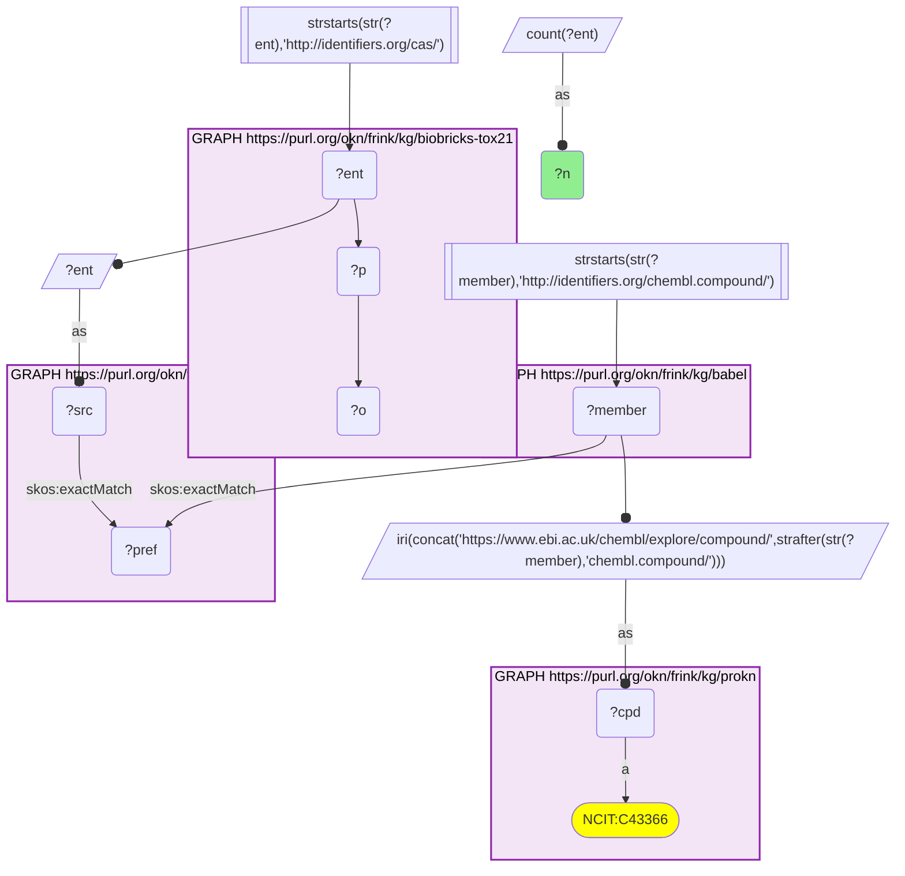
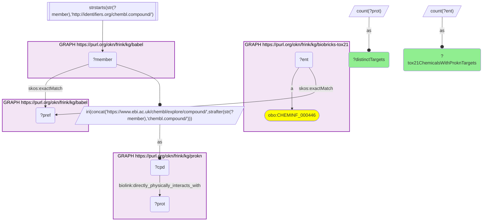
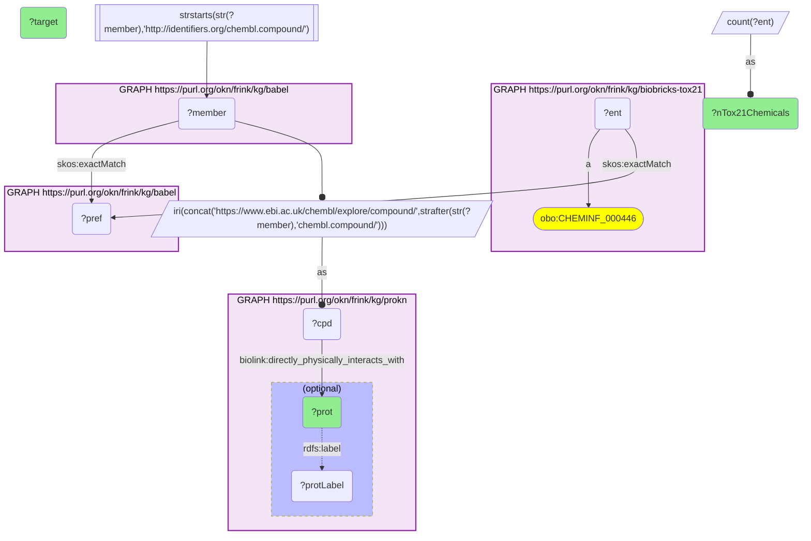
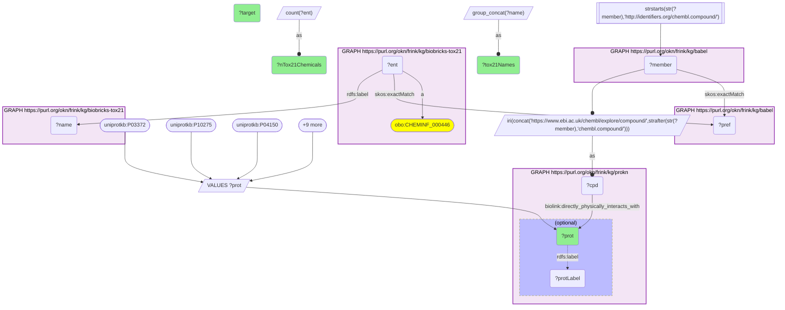

# Tox21 library chemicals and the protein targets ProKN records for them, joined through Babel (CAS → ChEMBL)

- **Date:** 2026-09-26
- **Model:** claude-opus-5-5
- **External MCP servers:** PubMed
- **SPARQL endpoint:** https://apps.okn.us/federation/sparql
- **Generated by:** mcp-okn v0.1.0 (build 7d8000e)
- **Contents:** 4 queries · 4 query diagrams

## Knowledge graphs used

- `biobricks-tox21` — <https://purl.org/okn/frink/kg/biobricks-tox21>
- `babel` — <https://purl.org/okn/frink/kg/babel>
- `prokn` — <https://purl.org/okn/frink/kg/prokn>

## Conversation

👤 **User**

Crosswalk: `biobricks-tox21` × `prokn` on **CAS → ChEMBL, bridged through `babel`** (crosswalk `CB2-cas-tox21-prokn-via-babel`, verified_count 2,462). biobricks-tox21 keys each Tox21 library chemical on its CAS Registry Number, and the chemical node IS its CAS IRI (`http://identifiers.org/cas/{cas}`, typed `obo:CHEMINF_000446`); prokn keys its compounds on ChEMBL IRIs (`https://www.ebi.ac.uk/chembl/explore/compound/CHEMBL{n}`, `obo:NCIT_C43366`) and carries no CAS. babel (the Translator Babel identifier cliques) links them: the CAS IRI is already in babel's form and `skos:exactMatch`es its clique's preferred id; the same clique holds the compound's `http://identifiers.org/chembl.compound/CHEMBL{n}` member, which is rewritten to prokn's form. Both babel hops must be staged in nested `SELECT DISTINCT` subqueries, with the ChEMBL scheme filter outside them, or the join times out.

Research question: Which Tox21-library chemicals are ChEMBL compounds in ProKN (CAS → ChEMBL via Babel), and what protein targets does ProKN record for them — in particular for the nuclear receptors that Tox21's assays are built around?

Why the join is required: biobricks-tox21 knows *which chemicals are in the Tox21 10K screening library* (CAS number and name) but nothing about their biology: in the federation it carries no assay results and no targets. ProKN knows *which proteins a compound directly physically binds* (`biolink:directly_physically_interacts_with`, from ChEMBL mechanism data) but has no CAS numbers and no notion of the Tox21 library. With no shared identifier scheme, only the babel bridge lets a Tox21 chemical be read together with its known molecular target.

---

🧠 **Assistant**

The babel bridge maps **2,462 Tox21 chemicals** onto ProKN ChEMBL compounds (the crosswalk skeleton reproduces its verified count exactly). Of those, **834 chemicals** carry at least one ProKN `directly_physically_interacts_with` target, covering **281 distinct targets**. The targets hit by the most Tox21 chemicals:

| ProKN target | Tox21 chemicals binding it |
| --- | --- |
| Glucocorticoid receptor (P04150) | 56 |
| Histamine H1 receptor (P35367) | 38 |
| Sodium channel alpha subunit (ChEMBL target) | 36 |
| GABA-A receptor; anion channel (ChEMBL target) | 33 |
| Cyclooxygenase (ChEMBL target) | 31 |
| 5-hydroxytryptamine receptor 2A (P28223) | 30 |
| D(2) dopamine receptor (P14416) | 29 |
| Sodium-dependent noradrenaline transporter (P23975) | 21 |
| Progesterone receptor (P06401) | 20 |
| Beta-1 adrenergic receptor (P08588) | 20 |
| Beta-2 adrenergic receptor (P07550) | 19 |
| Muscarinic acetylcholine receptor M3 (P20309) | 18 |
| Muscarinic acetylcholine receptor M1 (P11229) | 16 |
| Voltage-gated L-type calcium channel (ChEMBL target) | 16 |
| 5-hydroxytryptamine receptor 2C (P28335) | 15 |

**Nuclear receptors.** Tox21's assay panel is built around nuclear-receptor and stress signaling. Restricting the join to 12 nuclear receptors, ProKN names a known ligand among the Tox21 chemicals for nine of them:

| ProKN nuclear receptor | Tox21 chemicals | Examples (Tox21 names) |
| --- | --- | --- |
| Glucocorticoid receptor (P04150) | 56 | Dexamethasone, Budesonide, Fluticasone propionate, Mometasone furoate, Mifepristone, Cyproterone acetate |
| Progesterone receptor (P06401) | 20 | Progesterone, Levonorgestrel, Medroxyprogesterone acetate, Mifepristone, Cyproterone acetate, Danazol |
| Androgen receptor (P10275) | 15 | Testosterone, 17-Methyltestosterone, Stanozolol, Bicalutamide, Flutamide, Nilutamide, Cyproterone acetate |
| Estrogen receptor (P03372) | 14 | 17beta-Estradiol, 17alpha-Ethinylestradiol, Diethylstilbestrol, Tamoxifen, Raloxifene, Fulvestrant |
| Mineralocorticoid receptor (P08235) | 9 | Spironolactone, Eplerenone, Canrenone, Drospirenone, Deoxycorticosterone acetate |
| PPAR-gamma (P37231) | 9 | Rosiglitazone, Pioglitazone hydrochloride, Troglitazone, Muraglitazar, Tesaglitazar |
| Vitamin D3 receptor (P11473) | 7 | Calcitriol, Calcipotriene, Paricalcitol, Alfacalcidol, Vitamin D3 |
| Estrogen receptor beta (Q92731) | 3 | Raloxifene hydrochloride, Chlorotrianisene, Estramustine |
| Retinoic acid receptor RXR-alpha (P19793) | 1 | Danthron |

Three receptors in the query list returned no bridged Tox21 chemical: the aryl hydrocarbon receptor (P35869) and thyroid hormone receptors alpha and beta (P10827, P10828).

**Why it answers the question.** Each row joins a fact only biobricks-tox21 holds (this CAS-numbered chemical is in the Tox21 library) with a fact only ProKN holds (this compound binds this protein, per ChEMBL's mechanism-of-action data). The result is a target-annotated slice of the Tox21 library: about a third of the bridged chemicals (834 of 2,462) come with a known molecular target, and those targets are overwhelmingly drug targets: GPCRs, ion channels, and steroid nuclear receptors. For the nuclear receptors in particular, the joined rows are the *known reference ligands* for the receptor pathways Tox21 screens. Examples are the corticosteroids on GR, progestins on PR, anabolic steroids and antiandrogens on AR, estrogens and SERMs on ER, and glitazones on PPAR-gamma. Several chemicals appear on more than one receptor. Mifepristone is on both GR and PR; cyproterone acetate is on GR, PR and AR; drospirenone is on PR and MR. That is the cross-reactivity a receptor-panel screen is designed to expose.

**Caveats.** (1) The federation's biobricks-tox21 graph holds only library membership (CAS, name, type, source). It carries **no Tox21 assay activity calls**, so this join shows which Tox21 chemicals have a *known* target, not which were *active* in a Tox21 assay. (2) ProKN's targets come from ChEMBL mechanism data, so they cover approved and clinical drugs well and environmental chemicals hardly at all. The ~1,600 bridged chemicals with no ProKN target are present in ProKN but have no curated mechanism there. (3) Some ProKN targets are ChEMBL *target* nodes for protein families or complexes, such as the sodium channel alpha subunit, the GABA-A receptor, and cyclooxygenase. They are minted under the same `ebi.ac.uk/chembl/explore/compound/` path as compounds, so treat them as family-level targets. (4) Counts are DISTINCT Tox21 CAS chemicals. The name column lists every Tox21 label on the counted chemicals, and some chemicals carry more than one label, so names can outnumber chemicals (estrogen receptor: 14 chemicals, 17 names). The library also holds salts and esters of a parent drug, such as the many corticosteroid esters on GR. babel can put one id in two cliques, so every query counts chemicals and targets, never cliques. (5) An absent receptor (AhR, TR-alpha/beta) means only that ProKN records no mechanism-of-action link from a bridged Tox21 chemical to it. It does not mean no Tox21 chemical acts on it.

## Literature validation

The identifier join is **validated by construction**. CAS Registry Numbers and ChEMBL ids are registered, exact-string compound identifiers, and babel asserts their equivalence through a shared clique; no name matching is used. The hand-verified crosswalk `CB2-cas-tox21-prokn-via-babel` (verified_count 2,462) reproduces live.

Claims checked against PubMed:

- **Tox21 screens a ~10K library of environmental chemicals and drugs against nuclear-receptor pathways**: the Tox21 10K library was profiled for ERα agonist/antagonist activity, with assay performance judged against known ERα reference compounds (PMID 25012808, [DOI](https://doi.org/10.1038/srep05664)). The program's qHTS panel covers stress-related and nuclear-receptor signaling assays (PMID 25904095, [DOI](https://doi.org/10.1177/1087057115581317)). An AR screen of the same library recovered known agonists such as testosterone (PMID 28478275, [DOI](https://doi.org/10.1016/j.tox.2017.05.001)).
- **Mifepristone → GR and PR**: mifepristone is a non-selective GR, AR and PR antagonist (and a PPARγ agonist) (PMID 41985637, [DOI](https://doi.org/10.1016/j.jsbmb.2026.107025)). It was first identified by its antiglucocorticoid activity and is the first clinically effective progesterone antagonist (PMID 42054659, [DOI](https://doi.org/10.5041/RMMJ.10576)).
- **Cyproterone acetate → AR and PR**: described as an anti-androgen and progestogen synthetic steroid (PMID 31197615, [DOI](https://doi.org/10.1007/s10646-019-02063-9)). Its GR link in ProKN was not separately confirmed here.
- **Rosiglitazone / pioglitazone → PPAR-gamma**: thiazolidinediones such as rosiglitazone and pioglitazone are PPARγ ligands used in type 2 diabetes (PMID 37146924, [DOI](https://doi.org/10.1016/j.phrs.2023.106786)).
- **Spironolactone / eplerenone → mineralocorticoid receptor**: both are steroidal mineralocorticoid receptor antagonists (PMID 42770069, [DOI](https://doi.org/10.7759/cureus.114995)).
- **Calcitriol, calcipotriol, paricalcitol → vitamin D receptor**: calcitriol is the natural VDR agonist; calcipotriol and paricalcitol are clinically established VDR ligands (PMID 41897332, [DOI](https://doi.org/10.3390/biom16030396)).

Not confirmed: the single RXR-alpha row (Danthron) was not checked and should be treated as ProKN's assertion only.

Sources retrieved from PubMed.

**Validated.** The join uses shared registered identifiers bridged by babel, the rows ran live against all three graphs, and the nuclear-receptor ligand assignments highlighted are backed by literature. The one unchecked row (Danthron → RXR-alpha) is flagged above.

## SPARQL queries executed

#### Query 1

_2026-09-27T00:21:42+00:00 · `biobricks-tox21`, `babel`, `prokn`_

```sparql
SELECT (COUNT(DISTINCT ?ent) AS ?n) WHERE {
  { SELECT DISTINCT ?ent ?member WHERE {
    { SELECT DISTINCT ?ent ?pref WHERE {
        { SELECT DISTINCT ?ent ?src WHERE { GRAPH <https://purl.org/okn/frink/kg/biobricks-tox21> { ?ent ?p ?o } FILTER(STRSTARTS(STR(?ent),'http://identifiers.org/cas/')) BIND(?ent AS ?src) } }
        GRAPH <https://purl.org/okn/frink/kg/babel> { ?src <http://www.w3.org/2004/02/skos/core#exactMatch> ?pref } } }
    GRAPH <https://purl.org/okn/frink/kg/babel> { ?member <http://www.w3.org/2004/02/skos/core#exactMatch> ?pref } } }
  FILTER(STRSTARTS(STR(?member),'http://identifiers.org/chembl.compound/'))
  BIND(IRI(CONCAT('https://www.ebi.ac.uk/chembl/explore/compound/',STRAFTER(STR(?member),'chembl.compound/'))) AS ?cpd)
  GRAPH <https://purl.org/okn/frink/kg/prokn> { ?cpd a <http://purl.obolibrary.org/obo/NCIT_C43366> }
}
```



_1 row(s)_

| n |
| --- |
| 2462 |

#### Query 2

_2026-09-27T00:22:48+00:00 · `biobricks-tox21`, `babel`, `prokn`_

```sparql
PREFIX biolink: <https://w3id.org/biolink/vocab/>
PREFIX skos: <http://www.w3.org/2004/02/skos/core#>
SELECT (COUNT(DISTINCT ?ent) AS ?tox21ChemicalsWithProknTargets) (COUNT(DISTINCT ?prot) AS ?distinctTargets) WHERE {
  { SELECT DISTINCT ?ent ?cpd WHERE {
    { SELECT DISTINCT ?ent ?member WHERE {
      { SELECT DISTINCT ?ent ?pref WHERE {
          { SELECT DISTINCT ?ent WHERE { GRAPH <https://purl.org/okn/frink/kg/biobricks-tox21> { ?ent a <http://purl.obolibrary.org/obo/CHEMINF_000446> } } }
          GRAPH <https://purl.org/okn/frink/kg/babel> { ?ent skos:exactMatch ?pref } } }
      GRAPH <https://purl.org/okn/frink/kg/babel> { ?member skos:exactMatch ?pref } } }
    FILTER(STRSTARTS(STR(?member),'http://identifiers.org/chembl.compound/'))
    BIND(IRI(CONCAT('https://www.ebi.ac.uk/chembl/explore/compound/',STRAFTER(STR(?member),'chembl.compound/'))) AS ?cpd) } }
  GRAPH <https://purl.org/okn/frink/kg/prokn> { ?cpd biolink:directly_physically_interacts_with ?prot }
}
```



_1 row(s)_

| tox21ChemicalsWithProknTargets | distinctTargets |
| --- | --- |
| 834 | 281 |

#### Query 3

_2026-09-27T00:22:48+00:00 · `biobricks-tox21`, `babel`, `prokn`_

```sparql
PREFIX biolink: <https://w3id.org/biolink/vocab/>
PREFIX rdfs: <http://www.w3.org/2000/01/rdf-schema#>
PREFIX skos: <http://www.w3.org/2004/02/skos/core#>
SELECT ?prot (SAMPLE(?protLabel) AS ?target) (COUNT(DISTINCT ?ent) AS ?nTox21Chemicals) WHERE {
  { SELECT DISTINCT ?ent ?cpd WHERE {
    { SELECT DISTINCT ?ent ?member WHERE {
      { SELECT DISTINCT ?ent ?pref WHERE {
          { SELECT DISTINCT ?ent WHERE { GRAPH <https://purl.org/okn/frink/kg/biobricks-tox21> { ?ent a <http://purl.obolibrary.org/obo/CHEMINF_000446> } } }
          GRAPH <https://purl.org/okn/frink/kg/babel> { ?ent skos:exactMatch ?pref } } }
      GRAPH <https://purl.org/okn/frink/kg/babel> { ?member skos:exactMatch ?pref } } }
    FILTER(STRSTARTS(STR(?member),'http://identifiers.org/chembl.compound/'))
    BIND(IRI(CONCAT('https://www.ebi.ac.uk/chembl/explore/compound/',STRAFTER(STR(?member),'chembl.compound/'))) AS ?cpd) } }
  GRAPH <https://purl.org/okn/frink/kg/prokn> {
    ?cpd biolink:directly_physically_interacts_with ?prot .
    OPTIONAL { ?prot rdfs:label ?protLabel . FILTER(!REGEX(?protLabel, '^(CHEMBL[0-9]+|[A-Z][0-9][A-Z0-9]{3}[0-9])$')) } }
} GROUP BY ?prot ORDER BY DESC(?nTox21Chemicals) LIMIT 15
```



_15 row(s) — showing first 3_

| prot | target | nTox21Chemicals |
| --- | --- | --- |
| http://purl.uniprot.org/uniprot/P04150 | Glucocorticoid receptor | 56 |
| http://purl.uniprot.org/uniprot/P35367 | Histamine H1 receptor | 38 |
| https://www.ebi.ac.uk/chembl/explore/compound/CHEMBL2331043 | Sodium channel alpha subunit | 36 |

#### Query 4

_2026-09-27T00:22:48+00:00 · `biobricks-tox21`, `babel`, `prokn`_

```sparql
PREFIX biolink: <https://w3id.org/biolink/vocab/>
PREFIX rdfs: <http://www.w3.org/2000/01/rdf-schema#>
PREFIX skos: <http://www.w3.org/2004/02/skos/core#>
SELECT ?prot (SAMPLE(?protLabel) AS ?target) (COUNT(DISTINCT ?ent) AS ?nTox21Chemicals) (GROUP_CONCAT(DISTINCT ?name; separator=" | ") AS ?tox21Names) WHERE {
  VALUES ?prot { <http://purl.uniprot.org/uniprot/P03372> <http://purl.uniprot.org/uniprot/P10275> <http://purl.uniprot.org/uniprot/P04150> <http://purl.uniprot.org/uniprot/P06401> <http://purl.uniprot.org/uniprot/P35869> <http://purl.uniprot.org/uniprot/P37231> <http://purl.uniprot.org/uniprot/P10827> <http://purl.uniprot.org/uniprot/P10828> <http://purl.uniprot.org/uniprot/P19793> <http://purl.uniprot.org/uniprot/Q92731> <http://purl.uniprot.org/uniprot/P11473> <http://purl.uniprot.org/uniprot/P08235> }
  { SELECT DISTINCT ?ent ?cpd WHERE {
    { SELECT DISTINCT ?ent ?member WHERE {
      { SELECT DISTINCT ?ent ?pref WHERE {
          { SELECT DISTINCT ?ent WHERE { GRAPH <https://purl.org/okn/frink/kg/biobricks-tox21> { ?ent a <http://purl.obolibrary.org/obo/CHEMINF_000446> } } }
          GRAPH <https://purl.org/okn/frink/kg/babel> { ?ent skos:exactMatch ?pref } } }
      GRAPH <https://purl.org/okn/frink/kg/babel> { ?member skos:exactMatch ?pref } } }
    FILTER(STRSTARTS(STR(?member),'http://identifiers.org/chembl.compound/'))
    BIND(IRI(CONCAT('https://www.ebi.ac.uk/chembl/explore/compound/',STRAFTER(STR(?member),'chembl.compound/'))) AS ?cpd) } }
  GRAPH <https://purl.org/okn/frink/kg/prokn> {
    ?cpd biolink:directly_physically_interacts_with ?prot .
    OPTIONAL { ?prot rdfs:label ?protLabel . FILTER(!REGEX(?protLabel, '^(CHEMBL[0-9]+|[A-Z][0-9][A-Z0-9]{3}[0-9])$')) } }
  GRAPH <https://purl.org/okn/frink/kg/biobricks-tox21> { ?ent rdfs:label ?name }
} GROUP BY ?prot ORDER BY DESC(?nTox21Chemicals)
```



_9 row(s) — showing first 5_

| prot | target | nTox21Chemicals | tox21Names |
| --- | --- | --- | --- |
| http://purl.uniprot.org/uniprot/P04150 | Glucocorticoid receptor | 56 | Betamethasone \| Desonide \| Prednisolone \| Hydrocortisone \| Dexamethasone \| Cortisone acetate \| Hydrocortisone acetate \| Desoximetasone \| Rimexolone \| Fluorometholone \| Cyproterone acetate \| Hydrocortisone buteprate \| Amcinonide \| Budesonide \| Prednisolone acetate \| Prednisone \| Fluprednisolone \| Methylprednisolone acetate \| Beclazone \| Betamethasone dipropionate \| Triamcinolone hexacetonide \| Hydrocortisone valerate \| Triamcinolone diacetate \| Fluocinolone acetonide \| Hydrocortisone sodium phosphate \| Halobetasol propionate \| Alclometasone dipropionate \| Prednicarbate \| Dexamethasone sodium phosphate \| Difluprednate \| Meprednisone \| Fluticasone propionate \| Betamethasone valerate \| Flumethasone pivalate \| Hydrocortisone 21-hemisuccinate sodium salt \| Loteprednol etabonate \| Methylprednisolone succinate \| Paramethasone acetate \| Mometasone furoate \| Hydrocortisone 17-butyrate \| Deflazacort \| Methylprednisolone \| Flurandrenolide \| Betamethasone 21-phosphate disodium \| Fluocinonide \| Triamcinolone \| Medrysone \| Mifepristone \| Halcinonide \| Clocortolone pivalate \| Dexamethasone acetate \| Clobetasol propionate \| Flunisolide \| Prednisolone tebutate \| Triamcinolone acetonide \| Diflorasone diacetate |
| http://purl.uniprot.org/uniprot/P06401 | Progesterone receptor | 20 | Gestodene \| Norethindrone \| Hydroxyprogesterone caproate \| Mifepristone \| Progesterone \| Megestrol acetate \| Drospirenone \| Danazol \| Norethynodrel \| Norgestimate \| Cyproterone acetate \| Allylestrenol \| Chlormadinone acetate \| Ethynodiol diacetate \| Levonorgestrel \| Norethindrone acetate \| Norgestrel \| Medroxyprogesterone acetate \| Desogestrel \| Etonogestrel \| Dydrogesterone |
| http://purl.uniprot.org/uniprot/P10275 | Androgen receptor | 15 | Fluoxymestrone \| Stanozolol \| Ethylestrenol \| Bicalutamide \| Flutamide \| Danazol \| Nilutamide \| Nandrolone decanoate \| Cyproterone acetate \| Oxymetholone \| Nandrolone phenylpropionate \| Nandrolone phenpropionate \| Testosterone \| Testosterone propionate \| 17-Methyltestosterone \| Methandrostenolone |
| http://purl.uniprot.org/uniprot/P03372 | Estrogen receptor | 14 | Estradiol valerate \| 17beta-Estradiol \| Estradiol \| Clomiphene citrate (1:1) \| Mestranol \| Estrone \| Tamoxifen \| Tamoxifen citrate \| Estradiol cypionate \| Diethylstilbestrol \| 17alpha-Ethinylestradiol \| Fulvestrant \| Dienestrol \| Ethinylestradiol \| Raloxifene \| Estradiol acetate \| Estropipate |
| http://purl.uniprot.org/uniprot/P08235 | Mineralocorticoid receptor | 9 | Desoxycorticosterone pivalate \| Felodipine \| Drospirenone \| Canrenone \| Nimodipine \| Eplerenone \| Canrenoate potassium \| Deoxycorticosterone acetate \| Spironolactone |
