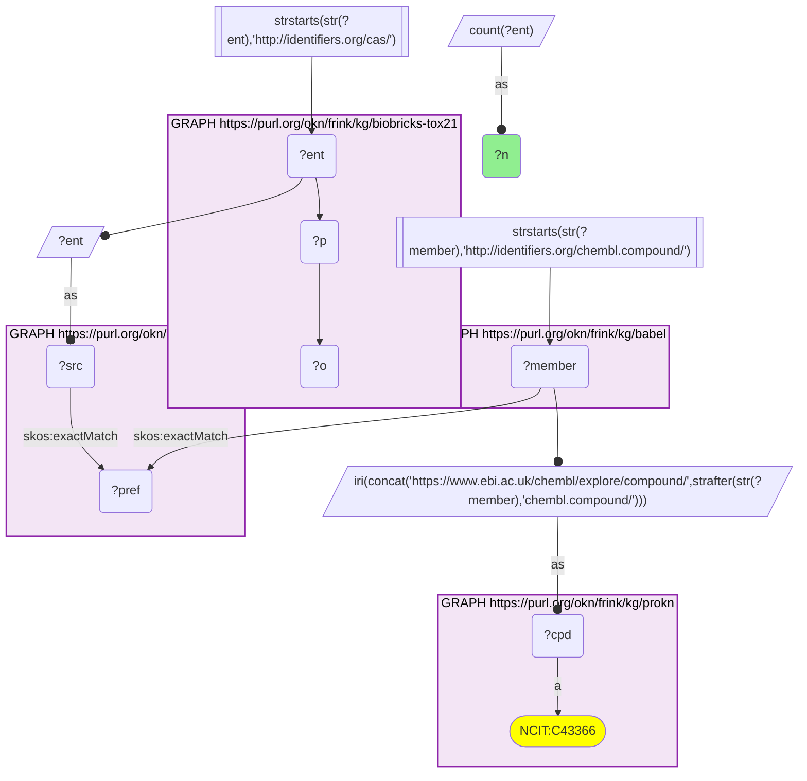
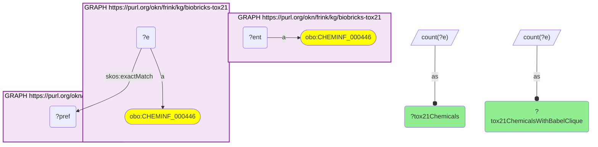
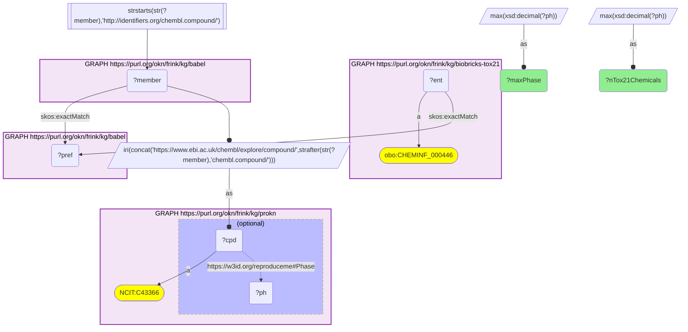
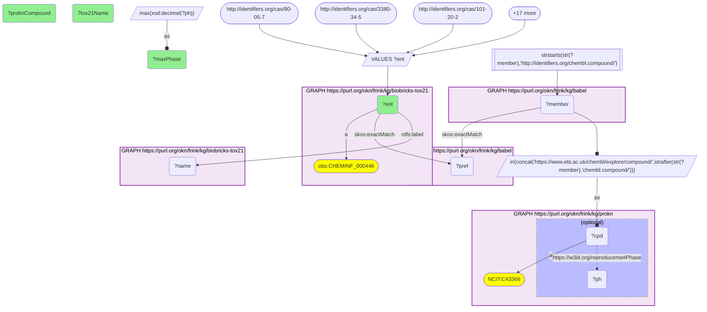
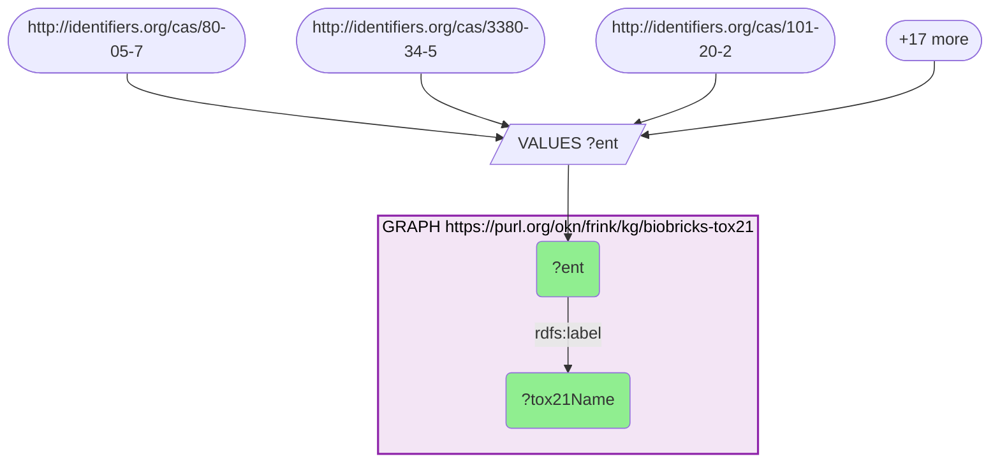

# How much of the Tox21 library reaches ProKN through Babel (CAS → ChEMBL), and how many bridged chemicals are drugs

- **Date:** 2026-09-26
- **Model:** claude-opus-5-5
- **External MCP servers:** PubMed
- **SPARQL endpoint:** https://apps.okn.us/federation/sparql
- **Generated by:** mcp-okn v0.1.0 (build 7d8000e)
- **Contents:** 5 queries · 5 query diagrams

## Knowledge graphs used

- `biobricks-tox21` — <https://purl.org/okn/frink/kg/biobricks-tox21>
- `babel` — <https://purl.org/okn/frink/kg/babel>
- `prokn` — <https://purl.org/okn/frink/kg/prokn>

## Conversation

👤 **User**

Crosswalk: `biobricks-tox21` × `prokn` on **CAS → ChEMBL, bridged through `babel`** (crosswalk `CB2-cas-tox21-prokn-via-babel`, verified_count 2,462). biobricks-tox21 keys each Tox21 library chemical on its CAS Registry Number, and the chemical node IS its CAS IRI (`http://identifiers.org/cas/{cas}`, typed `obo:CHEMINF_000446`); prokn keys its compounds on ChEMBL IRIs (`https://www.ebi.ac.uk/chembl/explore/compound/CHEMBL{n}`, `obo:NCIT_C43366`) and carries no CAS. babel (the Translator Babel identifier cliques) links them: the CAS IRI is already in babel's form and `skos:exactMatch`es its clique's preferred id; the same clique holds the compound's `http://identifiers.org/chembl.compound/CHEMBL{n}` member, which is rewritten to prokn's form. Both babel hops must be staged in nested `SELECT DISTINCT` subqueries, with the ChEMBL scheme filter outside them, or the join times out.

Research question: How much of the Tox21 chemical library reaches ProKN through Babel, and how many of the bridged chemicals are approved or clinical-stage drugs in ProKN's ChEMBL record — including familiar environmental chemicals that turn out to carry a drug record?

Why the join is required: biobricks-tox21 defines *the Tox21 10K screening library*, a mix of environmental chemicals and drugs keyed by CAS, but says nothing about which of them are medicines. ProKN carries ChEMBL's compound record, including the highest clinical phase a compound has reached (`reproduceme:Phase`), but has no CAS numbers and no notion of the Tox21 library. With no shared identifier scheme, only the babel bridge can split the Tox21 library into drugs and non-drugs.

---

🧠 **Assistant**

**Coverage.** The Tox21 graph holds **8,947** CAS-keyed chemicals. **8,554** of them (95.6%) resolve to a babel clique, and **2,462** (27.5% of the library) reach a ProKN ChEMBL compound; the crosswalk skeleton reproduces its verified count exactly.

**Clinical stage of the 2,462 bridged chemicals** (highest ChEMBL phase recorded on the ProKN compound):

| Max phase in ProKN | Tox21 chemicals | Share of bridged |
| --- | --- | --- |
| 4 (approved) | 1,320 | 53.6% |
| 3 | 243 | 9.9% |
| 2 | 524 | 21.3% |
| 1 | 28 | 1.1% |
| 0.5 (early phase 1) | 4 | 0.2% |
| −1 (clinical, phase unknown) | 74 | 3.0% |
| no phase recorded | 269 | 10.9% |

So **1,320 Tox21 chemicals (14.8% of the whole library) are approved drugs** in ProKN's ChEMBL record, and another **799** (phases 0.5–3) have reached clinical trials. That makes 2,119 approved-or-clinical chemicals, 86.1% of the bridged set. Only 269 bridged chemicals carry no phase at all.

**Familiar environmental chemicals.** A probe of 20 well-known environmental and dietary chemicals by CAS found 18 in the Tox21 graph. Glyphosate (1071-83-6) and formaldehyde (50-00-0) are absent under those CAS numbers. 12 of the 18 reach ProKN:

| Tox21 chemical (CAS) | ProKN compound | Max phase |
| --- | --- | --- |
| Triclosan (3380-34-5) | CHEMBL849 | 4 |
| Permethrin (52645-53-1) | CHEMBL1525 | 4 |
| Nicotine (54-11-5) | CHEMBL3 | 4 |
| Caffeine (58-08-2) | CHEMBL113 | 4 |
| Resveratrol (501-36-0) | CHEMBL165 | 3 |
| Triclocarban (101-20-2) | CHEMBL1076347 | 2 |
| Toluene (108-88-3) | CHEMBL9113 | 2 |
| Glutaraldehyde (111-30-8) | CHEMBL1235482 | 2 |
| Genistein (446-72-0) | CHEMBL44 | 2 |
| p,p'-DDT (50-29-3) | CHEMBL416898 | 2 |
| Lindane (58-89-9) | CHEMBL1200921 | none recorded |
| Bisphenol A (80-05-7) | CHEMBL418971 | none recorded |

The other six are in Tox21 but do not reach a ProKN compound through babel: arsenic oxide (As2O3), atrazine, benzene, cadmium chloride, di(2-ethylhexyl) phthalate, and PFOA.

**Why it answers the question.** Tox21 alone cannot say which of its chemicals are medicines, and ProKN alone cannot say which compounds are in the Tox21 library. Joining them splits the library. About a quarter of it is ChEMBL-registered in ProKN, and within that quarter the majority are approved drugs. The drug-annotated slice of Tox21 is therefore large: 1,320 approved drugs, versus 269 bridged chemicals with no clinical record. The environmental probe shows the boundary is blurry. Triclosan, permethrin, nicotine and caffeine are Tox21 test chemicals of environmental or consumer-exposure interest, yet ChEMBL records each as an approved drug. Industrial chemicals such as toluene, glutaraldehyde and DDT carry a phase-2 record. Classic contaminants (BPA, DEHP, PFOA, atrazine, benzene, cadmium) either have no clinical phase or no ProKN compound at all.

**Caveats.** (1) The phase is ChEMBL's max-phase field as carried by ProKN (`reproduceme:Phase`). The conventions used above are ChEMBL's: 4 = approved; 1–3 = trial phase; 0.5 = early phase 1; −1 = clinical, phase unknown; no value = no clinical record. ProKN stores some values twice (integer and decimal), so each chemical's phase is the MAX over its compounds. (2) ChEMBL assigns a phase whenever a compound appears in a clinical-trial record. A phase 2 on toluene or DDT should not be read as a therapeutic program; the underlying trials were not examined here. (3) "Does not reach ProKN" means the babel clique has no ChEMBL member, or ProKN lacks that ChEMBL compound. The query does not distinguish the two. (4) Counts are DISTINCT Tox21 CAS chemicals, never babel cliques; babel can place one id in two cliques. A parent drug and a salt form registered under separate CAS numbers count separately. (5) The federation's biobricks-tox21 graph carries no assay results, so this is a statement about library composition, not about Tox21 activity.

## Literature validation

The identifier join is **validated by construction**. CAS Registry Numbers and ChEMBL ids are registered, exact-string compound identifiers, and babel asserts their equivalence through a shared clique; no name matching is used. The hand-verified crosswalk `CB2-cas-tox21-prokn-via-babel` (verified_count 2,462) reproduces live.

Claims checked against PubMed:

- **The Tox21 10K library mixes environmental chemicals and drugs**: the U.S. Tox21 program screened "approximately 10,000 (10K) environmental chemicals and drugs" (PMID 25012808, [DOI](https://doi.org/10.1038/srep05664)).
- **Permethrin is a clinical drug**: 5% permethrin cream is a comparator treatment for classic scabies in a randomized trial against oral ivermectin (PMID 42209017, [DOI](https://doi.org/10.1136/dtb.2026.000021)).
- **Caffeine is a clinical drug**: preterm infants in a randomized trial on apnea of prematurity were receiving caffeine citrate as standard treatment (PMID 42443459, [DOI](https://doi.org/10.1038/s41390-026-05285-w)).
- **Nicotine is a clinical drug**: nicotine replacement therapy is an established smoking-cessation treatment, used as the comparator in a Cochrane review (PMID 42642048, [DOI](https://doi.org/10.1002/14651858.CD010216.pub11)).
- **Triclosan has clinical use**: a 2-year randomized trial tested a 0.3% triclosan toothpaste on periodontal parameters (PMID 31560794, [DOI](https://doi.org/10.1002/JPER.18-0501)).

Not checked: the ChEMBL phase-2 records for toluene, glutaraldehyde, triclocarban and DDT, and the phase semantics themselves (from ChEMBL documentation, not PubMed). They are reported as ProKN states them.

Sources retrieved from PubMed.

**Validated.** The join uses shared registered identifiers bridged by babel, all counts ran live against the three graphs, and the drug status of the highlighted environmental chemicals is backed by literature. The industrial chemicals' phase records are flagged as unexamined.

## SPARQL queries executed

#### Query 1

_2026-09-27T00:26:08+00:00 · `biobricks-tox21`, `babel`, `prokn`_

```sparql
SELECT (COUNT(DISTINCT ?ent) AS ?n) WHERE {
  { SELECT DISTINCT ?ent ?member WHERE {
    { SELECT DISTINCT ?ent ?pref WHERE {
        { SELECT DISTINCT ?ent ?src WHERE { GRAPH <https://purl.org/okn/frink/kg/biobricks-tox21> { ?ent ?p ?o } FILTER(STRSTARTS(STR(?ent),'http://identifiers.org/cas/')) BIND(?ent AS ?src) } }
        GRAPH <https://purl.org/okn/frink/kg/babel> { ?src <http://www.w3.org/2004/02/skos/core#exactMatch> ?pref } } }
    GRAPH <https://purl.org/okn/frink/kg/babel> { ?member <http://www.w3.org/2004/02/skos/core#exactMatch> ?pref } } }
  FILTER(STRSTARTS(STR(?member),'http://identifiers.org/chembl.compound/'))
  BIND(IRI(CONCAT('https://www.ebi.ac.uk/chembl/explore/compound/',STRAFTER(STR(?member),'chembl.compound/'))) AS ?cpd)
  GRAPH <https://purl.org/okn/frink/kg/prokn> { ?cpd a <http://purl.obolibrary.org/obo/NCIT_C43366> }
}
```



_1 row(s)_

| n |
| --- |
| 2462 |

#### Query 2

_2026-09-27T00:26:21+00:00 · `biobricks-tox21`, `babel`_

```sparql
PREFIX skos: <http://www.w3.org/2004/02/skos/core#>
SELECT ?tox21Chemicals ?tox21ChemicalsWithBabelClique WHERE {
  { SELECT (COUNT(DISTINCT ?ent) AS ?tox21Chemicals) WHERE {
      GRAPH <https://purl.org/okn/frink/kg/biobricks-tox21> { ?ent a <http://purl.obolibrary.org/obo/CHEMINF_000446> } } }
  { SELECT (COUNT(DISTINCT ?e) AS ?tox21ChemicalsWithBabelClique) WHERE {
      { SELECT DISTINCT ?e ?pref WHERE {
          { SELECT DISTINCT ?e WHERE { GRAPH <https://purl.org/okn/frink/kg/biobricks-tox21> { ?e a <http://purl.obolibrary.org/obo/CHEMINF_000446> } } }
          GRAPH <https://purl.org/okn/frink/kg/babel> { ?e skos:exactMatch ?pref } } } } }
}
```



_1 row(s)_

| tox21Chemicals | tox21ChemicalsWithBabelClique |
| --- | --- |
| 8947 | 8554 |

#### Query 3

_2026-09-27T00:26:40+00:00 · `biobricks-tox21`, `babel`, `prokn`_

```sparql
PREFIX skos: <http://www.w3.org/2004/02/skos/core#>
PREFIX xsd: <http://www.w3.org/2001/XMLSchema#>
SELECT ?maxPhase (COUNT(?ent) AS ?nTox21Chemicals) WHERE {
 { SELECT ?ent (MAX(xsd:decimal(?ph)) AS ?maxPhase) WHERE {
  { SELECT DISTINCT ?ent ?cpd WHERE {
    { SELECT DISTINCT ?ent ?member WHERE {
      { SELECT DISTINCT ?ent ?pref WHERE {
          { SELECT DISTINCT ?ent WHERE { GRAPH <https://purl.org/okn/frink/kg/biobricks-tox21> { ?ent a <http://purl.obolibrary.org/obo/CHEMINF_000446> } } }
          GRAPH <https://purl.org/okn/frink/kg/babel> { ?ent skos:exactMatch ?pref } } }
      GRAPH <https://purl.org/okn/frink/kg/babel> { ?member skos:exactMatch ?pref } } }
    FILTER(STRSTARTS(STR(?member),'http://identifiers.org/chembl.compound/'))
    BIND(IRI(CONCAT('https://www.ebi.ac.uk/chembl/explore/compound/',STRAFTER(STR(?member),'chembl.compound/'))) AS ?cpd) } }
  GRAPH <https://purl.org/okn/frink/kg/prokn> { ?cpd a <http://purl.obolibrary.org/obo/NCIT_C43366> OPTIONAL { ?cpd <https://w3id.org/reproduceme#Phase> ?ph } }
 } GROUP BY ?ent }
} GROUP BY ?maxPhase ORDER BY DESC(?maxPhase)
```



_7 row(s) — showing first 3_

| maxPhase | nTox21Chemicals |
| --- | --- |
| 4.0 | 1320 |
| 3.0 | 243 |
| 2.0 | 524 |

#### Query 4

_2026-09-27T00:26:40+00:00 · `biobricks-tox21`, `babel`, `prokn`_

```sparql
PREFIX skos: <http://www.w3.org/2004/02/skos/core#>
PREFIX xsd: <http://www.w3.org/2001/XMLSchema#>
PREFIX rdfs: <http://www.w3.org/2000/01/rdf-schema#>
SELECT ?ent (SAMPLE(?name) AS ?tox21Name) (SAMPLE(?cpd) AS ?proknCompound) (MAX(xsd:decimal(?ph)) AS ?maxPhase) WHERE {
  VALUES ?ent { <http://identifiers.org/cas/80-05-7> <http://identifiers.org/cas/3380-34-5> <http://identifiers.org/cas/101-20-2> <http://identifiers.org/cas/108-88-3> <http://identifiers.org/cas/117-81-7> <http://identifiers.org/cas/1912-24-9> <http://identifiers.org/cas/1071-83-6> <http://identifiers.org/cas/335-67-1> <http://identifiers.org/cas/446-72-0> <http://identifiers.org/cas/50-00-0> <http://identifiers.org/cas/111-30-8> <http://identifiers.org/cas/71-43-2> <http://identifiers.org/cas/10108-64-2> <http://identifiers.org/cas/1327-53-3> <http://identifiers.org/cas/58-89-9> <http://identifiers.org/cas/50-29-3> <http://identifiers.org/cas/52645-53-1> <http://identifiers.org/cas/58-08-2> <http://identifiers.org/cas/54-11-5> <http://identifiers.org/cas/501-36-0> }
  { SELECT DISTINCT ?ent ?cpd WHERE {
    { SELECT DISTINCT ?ent ?member WHERE {
      { SELECT DISTINCT ?ent ?pref WHERE {
          { SELECT DISTINCT ?ent WHERE { GRAPH <https://purl.org/okn/frink/kg/biobricks-tox21> { ?ent a <http://purl.obolibrary.org/obo/CHEMINF_000446> } } }
          GRAPH <https://purl.org/okn/frink/kg/babel> { ?ent skos:exactMatch ?pref } } }
      GRAPH <https://purl.org/okn/frink/kg/babel> { ?member skos:exactMatch ?pref } } }
    FILTER(STRSTARTS(STR(?member),'http://identifiers.org/chembl.compound/'))
    BIND(IRI(CONCAT('https://www.ebi.ac.uk/chembl/explore/compound/',STRAFTER(STR(?member),'chembl.compound/'))) AS ?cpd) } }
  GRAPH <https://purl.org/okn/frink/kg/prokn> { ?cpd a <http://purl.obolibrary.org/obo/NCIT_C43366> OPTIONAL { ?cpd <https://w3id.org/reproduceme#Phase> ?ph } }
  GRAPH <https://purl.org/okn/frink/kg/biobricks-tox21> { ?ent rdfs:label ?name }
} GROUP BY ?ent ORDER BY DESC(?maxPhase)
```



_12 row(s) — showing first 3_

| ent | tox21Name | proknCompound | maxPhase |
| --- | --- | --- | --- |
| http://identifiers.org/cas/3380-34-5 | Triclosan | https://www.ebi.ac.uk/chembl/explore/compound/CHEMBL849 | 4.0 |
| http://identifiers.org/cas/52645-53-1 | Permethrin | https://www.ebi.ac.uk/chembl/explore/compound/CHEMBL1525 | 4.0 |
| http://identifiers.org/cas/54-11-5 | Nicotine | https://www.ebi.ac.uk/chembl/explore/compound/CHEMBL3 | 4.0 |

#### Query 5

_2026-09-27T00:26:40+00:00 · `biobricks-tox21`_

```sparql
PREFIX rdfs: <http://www.w3.org/2000/01/rdf-schema#>
SELECT ?ent ?tox21Name WHERE {
  VALUES ?ent { <http://identifiers.org/cas/80-05-7> <http://identifiers.org/cas/3380-34-5> <http://identifiers.org/cas/101-20-2> <http://identifiers.org/cas/108-88-3> <http://identifiers.org/cas/117-81-7> <http://identifiers.org/cas/1912-24-9> <http://identifiers.org/cas/1071-83-6> <http://identifiers.org/cas/335-67-1> <http://identifiers.org/cas/446-72-0> <http://identifiers.org/cas/50-00-0> <http://identifiers.org/cas/111-30-8> <http://identifiers.org/cas/71-43-2> <http://identifiers.org/cas/10108-64-2> <http://identifiers.org/cas/1327-53-3> <http://identifiers.org/cas/58-89-9> <http://identifiers.org/cas/50-29-3> <http://identifiers.org/cas/52645-53-1> <http://identifiers.org/cas/58-08-2> <http://identifiers.org/cas/54-11-5> <http://identifiers.org/cas/501-36-0> }
  GRAPH <https://purl.org/okn/frink/kg/biobricks-tox21> { ?ent rdfs:label ?tox21Name }
} ORDER BY ?tox21Name
```



_18 row(s) — showing first 5_

| ent | tox21Name |
| --- | --- |
| http://identifiers.org/cas/1327-53-3 | Arsenic oxide (As2O3) |
| http://identifiers.org/cas/1912-24-9 | Atrazine |
| http://identifiers.org/cas/71-43-2 | Benzene |
| http://identifiers.org/cas/80-05-7 | Bisphenol A |
| http://identifiers.org/cas/10108-64-2 | Cadmium chloride |
