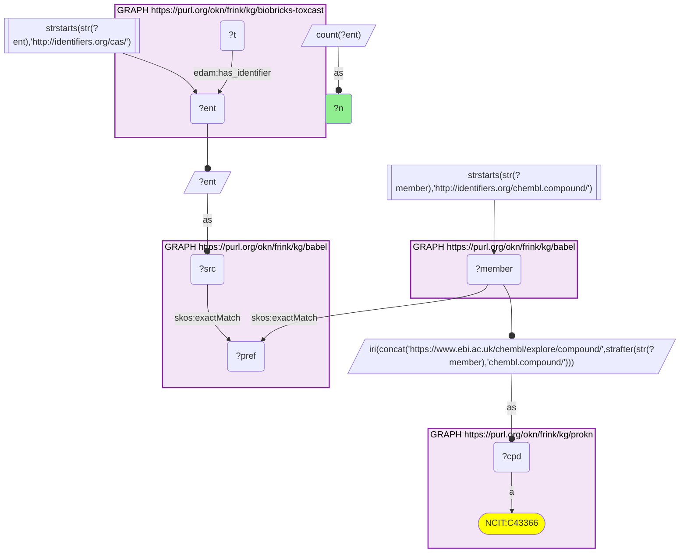
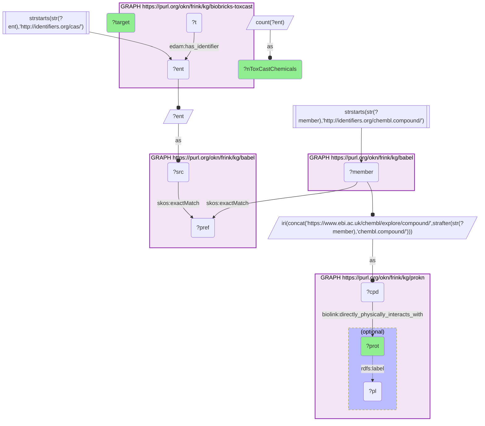
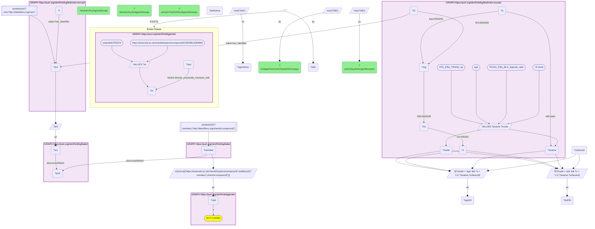
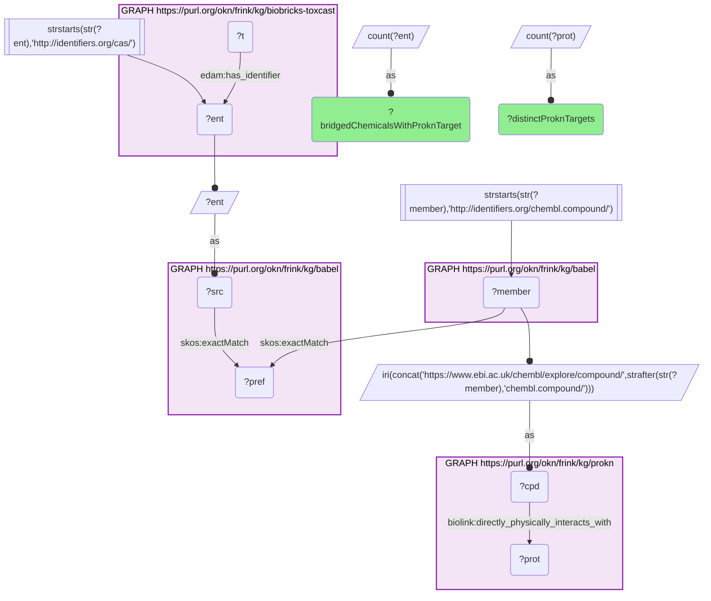

# ToxCast chemicals joined to ProKN's ChEMBL compounds through Babel (CAS → ChEMBL): do ER assay calls match ProKN's recorded mechanism?

- **Date:** 2026-09-26
- **Model:** claude-opus-5-5
- **External MCP servers:** PubMed
- **SPARQL endpoint:** https://apps.okn.us/federation/sparql
- **Generated by:** mcp-okn v0.1.0 (build 7d8000e)
- **Contents:** 5 queries · 5 query diagrams

## Knowledge graphs used

- `biobricks-toxcast` — <https://purl.org/okn/frink/kg/biobricks-toxcast>
- `babel` — <https://purl.org/okn/frink/kg/babel>
- `prokn` — <https://purl.org/okn/frink/kg/prokn>

## Conversation

👤 **User**

Crosswalk: `biobricks-toxcast` × `prokn` on **CAS → ChEMBL, bridged through `babel`** (crosswalk `CB3-cas-toxcast-prokn-via-babel`, verified_count 2,504). ToxCast keys every chemical on a CAS IRI hung off its `Chemical_Entity` node with `edam:has_identifier` (`http://identifiers.org/cas/{cas}`, the same form babel uses, so the left side needs no rewrite); ProKN keys its compounds on ChEMBL IRIs (`https://www.ebi.ac.uk/chembl/explore/compound/CHEMBL{n}`, typed `obo:NCIT_C43366`). The two graphs share no chemical identifier scheme — ToxCast carries CAS and DTXSID, ProKN carries ChEMBL, InChIKey and PubChem. babel (the Translator Babel identifier cliques) links them: the CAS IRI `skos:exactMatch`es its clique's preferred id, and the same clique holds the compound's `http://identifiers.org/chembl.compound/CHEMBL{n}` member, whose local id is rebuilt into ProKN's explore-compound IRI. Both babel hops must be staged in nested `SELECT DISTINCT` subqueries with the scheme FILTER outside them, or the join times out.

Research question: Which ToxCast chemicals reach ProKN's ChEMBL compounds through Babel (CAS → ChEMBL), and for the estrogen-receptor family, do ToxCast's agonist- and antagonist-mode activity calls line up with the mechanism of action ProKN records for the same chemical?

Why the join is required: ToxCast knows *what a chemical did in a high-throughput assay* (hitcall 0/1 per assay endpoint, from EPA InvitroDB) but records no protein target and no mechanism — its assay names are strings, not ontology terms, and its chemicals carry no drug identifier. ProKN knows *which protein a compound physically binds and with what action* (`biolink:directly_physically_interacts_with`, plus an AGONIST / ANTAGONIST / MODULATOR mechanism label on the reified statement, from ChEMBL) but has no assay data at all. Neither graph shares an identifier with the other, so without the babel bridge an environmental chemical's in-vitro activity profile and its curated pharmacological mechanism cannot be put on the same row.

---

🧠 **Assistant**

The babel bridge joins **2,504 ToxCast CAS-keyed chemicals** to ProKN ChEMBL compounds — the crosswalk skeleton reproduces its verified count exactly. Of those, **846 carry at least one ProKN `directly_physically_interacts_with` target**, spanning **282 distinct targets**.

## What ProKN says the ToxCast library binds

| ProKN target | ToxCast chemicals |
| --- | --- |
| Glucocorticoid receptor (P04150) | 56 |
| Histamine H1 receptor (P35367) | 38 |
| Sodium channel alpha subunit (ChEMBL family target) | 36 |
| Cyclooxygenase (ChEMBL family target) | 33 |
| GABA-A receptor; anion channel (ChEMBL family target) | 33 |
| 5-hydroxytryptamine receptor 2A (P28223) | 30 |
| D(2) dopamine receptor (P14416) | 29 |
| Sodium-dependent noradrenaline transporter (P23975) | 21 |
| Beta-1 adrenergic receptor (P08588) | 20 |
| Progesterone receptor (P06401) | 20 |
| Beta-2 adrenergic receptor (P07550) | 19 |
| Muscarinic acetylcholine receptor M3 (P20309) | 18 |
| Voltage-gated L-type calcium channel (ChEMBL family target) | 17 |
| Muscarinic acetylcholine receptor M1 (P11229) | 16 |
| Sodium-dependent serotonin transporter (P31645) | 15 |
| Androgen receptor (P10275) | 15 |
| 5-hydroxytryptamine receptor 2C (P28335) | 15 |
| Estrogen receptor (P03372) | 14 |

## The estrogen-receptor family, chemical by chemical

Taking ProKN's two ER nodes (UniProt `P03372` and the ChEMBL family target `CHEMBL2093866`) and ToxCast's six ER endpoints — four agonist-mode (`ATG_ERa_TRANS_up`, `TOX21_ERa_BLA_Agonist_ratio`, `TOX21_ERa_LUC_VM7_Agonist`, `OT_ER_ERaERa_0480`) and two antagonist-mode (`TOX21_ERa_BLA_Antagonist_ratio`, `TOX21_ERa_LUC_VM7_Antagonist_0.5nM_E2`) — 22 bridged chemicals have both an ER mechanism in ProKN and at least one ER hitcall in ToxCast:

| ToxCast chemical | CAS | ProKN ER action | Agonist assays active / tested | Antagonist assays active / tested |
| --- | --- | --- | --- | --- |
| Diethylstilbestrol | 56-53-1 | AGONIST | 4 / 4 | 2 / 2 |
| 17alpha-Ethinylestradiol | 57-63-6 | AGONIST | 4 / 4 | 1 / 2 |
| 17beta-Estradiol | 50-28-2 | AGONIST | 4 / 4 | 1 / 2 |
| Estrone | 53-16-7 | AGONIST | 4 / 4 | 1 / 2 |
| Mestranol | 72-33-3 | AGONIST | 4 / 4 | 0 / 2 |
| Estradiol cypionate | 313-06-4 | AGONIST | 2 / 3 | 1 / 2 |
| Estradiol acetate | 4245-41-4 | AGONIST | 2 / 2 | 1 / 2 |
| Estradiol valerate | 979-32-8 | AGONIST | 2 / 2 | 0 / 2 |
| Dienestrol | 84-17-3 | AGONIST | 2 / 2 | 0 / 2 |
| Estropipate | 7280-37-7 | AGONIST | 2 / 2 | 0 / 2 |
| Diethylstilbestrol diphosphate | 522-40-7 | AGONIST | 2 / 2 | 0 / 2 |
| Quinestrol | 152-43-2 | AGONIST | 2 / 2 | 0 / 2 |
| Allylestrenol | 432-60-0 | AGONIST | 2 / 2 | 0 / 2 |
| Fulvestrant | 129453-61-8 | DEGRADER/ANTAGONIST | 1 / 4 | 2 / 2 |
| Estriol | 50-27-1 | MODULATOR | 4 / 4 | 0 / 2 |
| Tamoxifen citrate | 54965-24-1 | MODULATOR | 2 / 4 | 2 / 2 |
| Clomiphene citrate (1:1) | 50-41-9 | MODULATOR | 1 / 4 | 2 / 2 |
| (Z)-4-Hydroxytamoxifen | 68047-06-3 | MODULATOR | 1 / 2 | 2 / 2 |
| Bazedoxifene acetate | 198481-33-3 | MODULATOR | 0 / 2 | 2 / 2 |
| Raloxifene | 84449-90-1 | MODULATOR | 0 / 2 | 2 / 2 |
| Toremifene citrate | 89778-27-8 | MODULATOR | 0 / 3 | 2 / 2 |
| Cyclofenil | 2624-43-3 | MODULATOR | 0 / 2 | 0 / 2 |

## Does the ER annotation predict ToxCast activity?

| ProKN says ER binder | Bridged chemicals tested in ER assays | Active in ≥1 agonist-mode assay | Active in ≥2 agonist-mode assays | Active in ≥1 antagonist-mode assay |
| --- | --- | --- | --- | --- |
| yes | 22 | 18 (82%) | 15 (68%) | 13 (59%) |
| no | 2,355 | 584 (24.8%) | 179 (7.6%) | 576 (24.5%) |

**Why it answers the question.** Each row of the middle table carries one fact from each graph that the other graph does not have: ToxCast's assay-by-assay hitcall, and ProKN's curated ChEMBL mechanism label for the same molecule. Read together they agree, and they agree *directionally*, not just on presence/absence. All 13 chemicals ProKN labels **AGONIST** were active in at least two agonist-mode endpoints, and 12 of the 13 were active in every agonist-mode endpoint in which they were tested — the classic estrogen set (17beta-estradiol, estrone, ethinylestradiol, mestranol, the estradiol esters, diethylstilbestrol and dienestrol). Conversely, the SERM/SERD block — raloxifene, bazedoxifene, toremifene, fulvestrant, 4-hydroxytamoxifen, clomiphene — is active in the antagonist-mode endpoints and largely silent or weak in agonist mode, exactly the inverse pattern. The contrast table quantifies the signal: an ER annotation in ProKN raises the chance of a multi-assay agonist hit in ToxCast from 7.6% to 68%, a nine-fold enrichment. The two graphs were built from entirely different evidence (EPA in-vitro screening vs ChEMBL mechanism curation) and were, until this bridge, unjoinable — the agreement is therefore a genuine cross-source confirmation, not a restatement.

**Two rows that do not fit, stated plainly.** *Estriol* is labelled MODULATOR by ChEMBL but reads as a full agonist in all four ToxCast agonist endpoints. *Allylestrenol* is labelled an ER AGONIST by ChEMBL and is agonist-active in both endpoints it was tested in, yet it is used clinically as a progestogen, not an estrogen (see literature validation) — this is a case where the assay data and the KG annotation agree with each other but not obviously with the drug's clinical class, and it is worth treating as a flag on the ChEMBL mechanism record rather than as a finding.

**Antagonist-mode caveat.** Six of the 13 ProKN-labelled agonists also score a hit in an antagonist-mode endpoint. This is a known property of the assay format, not a contradiction: antagonist-mode readouts measure loss of signal and are confounded by cytotoxicity and assay interference, the most prominent source of false positives in the ToxCast ER battery. The antagonist-mode column should not be read as evidence of antagonism on its own. This is also why the "active in ≥1 antagonist-mode assay" rate for the non-ER background (24.5%) is nearly identical to the agonist-mode background rate — it carries almost no specificity.

**Other caveats.** (a) Coverage: 2,504 of ToxCast's CAS-keyed chemicals reach ProKN; only 846 of those carry any ProKN protein-interaction edge, so the mechanism layer is available for about a third of the bridged set. (b) The hitcall value in ToxCast is 0.0/1.0 per chemical–assay measure group; a chemical is counted active for an endpoint if any of its measure groups for that endpoint returned 1.0. (c) "Tested" counts only the six endpoints named above, so the denominators differ per chemical (2, 3 or 4 agonist-mode endpoints) and are shown in the table rather than assumed. (d) ProKN's interaction partners come in two kinds: single UniProt proteins, and ChEMBL *target* nodes standing for a protein family or complex (sodium channel alpha subunit, cyclooxygenase, GABA-A receptor, the ER family node). The family nodes are minted under the same `ebi.ac.uk/chembl/explore/compound/` path as compounds, so they look like compound IRIs but are targets; both ER forms were included here. (e) babel can place one id in two cliques, so every count is of DISTINCT ToxCast chemicals or DISTINCT targets, never of cliques.

## Literature validation

The identifier join is **validated by construction**. CAS and ChEMBL are registered, exact-string chemical identifiers, and babel asserts their equivalence through a shared clique; no name or structure matching is used. The hand-verified crosswalk `CB3-cas-toxcast-prokn-via-babel` (verified_count 2,504) reproduced live in the first logged query.

The pharmacological claims the write-up rests on were checked against PubMed:

- **The ToxCast/Tox21 ER assay battery, and the agonist/antagonist distinction**: the EPA ER network model integrates 18 in-vitro high-throughput ER assays (binding, dimerization, chromatin binding, transcriptional activation, ER-dependent proliferation) to classify a chemical as ER agonist or antagonist, and identifies **cytotoxicity as the most prominent cause of false-positive activity**, particularly in antagonist mode (PMID 26272952, [DOI](https://doi.org/10.1093/toxsci/kfv168)). This supports both the assay-mode framing and the antagonist-mode caveat above.
- **17beta-estradiol, estrone and diethylstilbestrol as ERα agonists; tamoxifen and afimoxifene (4-hydroxytamoxifen) as ERα antagonists**: these six compounds are used as the canonical ERα agonist and antagonist ligand sets in a molecular-docking study of estrogen/antiestrogen binding (PMID 32019136, [DOI](https://doi.org/10.3390/ijms21030893)).
- **SERMs are tissue-selective ER agonist/antagonists**: tamoxifen is an anti-estrogen in the breast with estrogen agonist activity in the uterus; raloxifene and bazedoxifene are likewise mixed agonist/antagonist agents (PMID 30895900, [DOI](https://doi.org/10.1080/13697137.2019.1568403)). This is the literature basis for expecting the MODULATOR block to score in antagonist mode while reading weak or negative in agonist mode.
- **Fulvestrant is a selective estrogen receptor degrader (SERD)**, offering receptor blockade and degradation rather than partial agonism (PMID 42657161, [DOI](https://doi.org/10.3389/fonc.2026.1855542)) — consistent with ProKN's `DEGRADER/ANTAGONIST` label and with its 2/2 antagonist-mode hits.
- **Allylestrenol is used clinically as a progestogen**, appearing among oral progestogens prescribed for threatened miscarriage (PMID 34704273, [DOI](https://doi.org/10.1111/jcpt.13536)). No support was found for an estrogen-receptor agonist indication, so ChEMBL's ER AGONIST mechanism label for this compound **could not be confirmed** and is reported here as a flag, not as a result.

Sources retrieved from PubMed.

**Validated.** The join runs on shared registered identifiers bridged by babel, every number above comes from a query that ran live against both graphs, and the direction-of-effect agreement between ToxCast hitcalls and ProKN's ChEMBL mechanism labels is supported by the ER pharmacology literature — with the two non-conforming rows (estriol, allylestrenol) reported rather than smoothed over.

## SPARQL queries executed

#### Query 1

_2026-09-27T00:20:08+00:00 · `biobricks-toxcast`, `babel`, `prokn`_

```sparql
SELECT (COUNT(DISTINCT ?ent) AS ?n) WHERE {
  { SELECT DISTINCT ?ent ?member WHERE {
    { SELECT DISTINCT ?ent ?pref WHERE {
        { SELECT DISTINCT ?ent ?src WHERE { GRAPH <https://purl.org/okn/frink/kg/biobricks-toxcast> { ?t <http://edamontology.org/has_identifier> ?ent } FILTER(STRSTARTS(STR(?ent),'http://identifiers.org/cas/')) BIND(?ent AS ?src) } }
        GRAPH <https://purl.org/okn/frink/kg/babel> { ?src <http://www.w3.org/2004/02/skos/core#exactMatch> ?pref } } }
    GRAPH <https://purl.org/okn/frink/kg/babel> { ?member <http://www.w3.org/2004/02/skos/core#exactMatch> ?pref } } }
  FILTER(STRSTARTS(STR(?member),'http://identifiers.org/chembl.compound/'))
  BIND(IRI(CONCAT('https://www.ebi.ac.uk/chembl/explore/compound/',STRAFTER(STR(?member),'chembl.compound/'))) AS ?cpd)
  GRAPH <https://purl.org/okn/frink/kg/prokn> { ?cpd a <http://purl.obolibrary.org/obo/NCIT_C43366> }
}
```



_1 row(s)_

| n |
| --- |
| 2504 |

#### Query 2

_2026-09-27T00:20:33+00:00 · `biobricks-toxcast`, `babel`, `prokn`_

```sparql
PREFIX skos: <http://www.w3.org/2004/02/skos/core#>
PREFIX rdfs: <http://www.w3.org/2000/01/rdf-schema#>
SELECT ?prot (SAMPLE(?pl) AS ?target) (COUNT(DISTINCT ?ent) AS ?nToxCastChemicals) WHERE {
  { SELECT DISTINCT ?ent ?member WHERE {
    { SELECT DISTINCT ?ent ?pref WHERE {
        { SELECT DISTINCT ?ent ?src WHERE { GRAPH <https://purl.org/okn/frink/kg/biobricks-toxcast> { ?t <http://edamontology.org/has_identifier> ?ent } FILTER(STRSTARTS(STR(?ent),'http://identifiers.org/cas/')) BIND(?ent AS ?src) } }
        GRAPH <https://purl.org/okn/frink/kg/babel> { ?src skos:exactMatch ?pref } } }
    GRAPH <https://purl.org/okn/frink/kg/babel> { ?member skos:exactMatch ?pref } } }
  FILTER(STRSTARTS(STR(?member),'http://identifiers.org/chembl.compound/'))
  BIND(IRI(CONCAT('https://www.ebi.ac.uk/chembl/explore/compound/',STRAFTER(STR(?member),'chembl.compound/'))) AS ?cpd)
  GRAPH <https://purl.org/okn/frink/kg/prokn> {
    ?cpd <https://w3id.org/biolink/vocab/directly_physically_interacts_with> ?prot .
    OPTIONAL { ?prot rdfs:label ?pl FILTER(!REGEX(?pl, '^(CHEMBL[0-9]+|[A-Z][0-9][A-Z0-9]{3}[0-9]|[A-Z][0-9][A-Z0-9]{3}[0-9]-PRO_[0-9]+)$')) } }
} GROUP BY ?prot ORDER BY DESC(?nToxCastChemicals) LIMIT 18
```



_18 row(s) — showing first 3_

| prot | target | nToxCastChemicals |
| --- | --- | --- |
| http://purl.uniprot.org/uniprot/P04150 | Glucocorticoid receptor | 56 |
| http://purl.uniprot.org/uniprot/P35367 | Histamine H1 receptor | 38 |
| https://www.ebi.ac.uk/chembl/explore/compound/CHEMBL2331043 | Sodium channel alpha subunit | 36 |

#### Query 3

_2026-09-27T00:21:00+00:00 · `biobricks-toxcast`, `babel`, `prokn`_

```sparql
PREFIX skos: <http://www.w3.org/2004/02/skos/core#>
PREFIX rdf: <http://www.w3.org/1999/02/22-rdf-syntax-ns#>
PREFIX rdfs: <http://www.w3.org/2000/01/rdf-schema#>
SELECT ?ent (SAMPLE(?cname) AS ?toxcastChemical) (GROUP_CONCAT(DISTINCT ?action; separator="/") AS ?proknErAction)
  (COUNT(DISTINCT ?agoTested) AS ?agonistAssaysTested) (COUNT(DISTINCT ?agoHit) AS ?agonistActive)
  (COUNT(DISTINCT ?antTested) AS ?antagonistAssaysTested) (COUNT(DISTINCT ?antHit) AS ?antagonistActive) WHERE {
  { SELECT DISTINCT ?ent ?cpd WHERE {
    { SELECT DISTINCT ?ent ?member WHERE {
      { SELECT DISTINCT ?ent ?pref WHERE {
          { SELECT DISTINCT ?ent ?src WHERE { GRAPH <https://purl.org/okn/frink/kg/biobricks-toxcast> { ?t <http://edamontology.org/has_identifier> ?ent } FILTER(STRSTARTS(STR(?ent),'http://identifiers.org/cas/')) BIND(?ent AS ?src) } }
          GRAPH <https://purl.org/okn/frink/kg/babel> { ?src skos:exactMatch ?pref } } }
      GRAPH <https://purl.org/okn/frink/kg/babel> { ?member skos:exactMatch ?pref } } }
    FILTER(STRSTARTS(STR(?member),'http://identifiers.org/chembl.compound/'))
    BIND(IRI(CONCAT('https://www.ebi.ac.uk/chembl/explore/compound/',STRAFTER(STR(?member),'chembl.compound/'))) AS ?cpd) } }
  GRAPH <https://purl.org/okn/frink/kg/prokn> {
    VALUES ?er { <http://purl.uniprot.org/uniprot/P03372> <https://www.ebi.ac.uk/chembl/explore/compound/CHEMBL2093866> }
    ?st rdf:subject ?cpd ; rdf:predicate <https://w3id.org/biolink/vocab/directly_physically_interacts_with> ; rdf:object ?er ;
        <http://purl.allotrope.org/ontologies/result#AFR_0003142> ?action . }
  GRAPH <https://purl.org/okn/frink/kg/biobricks-toxcast> {
    ?t2 <http://edamontology.org/has_identifier> ?ent ; rdfs:label ?cname ; <http://purl.obolibrary.org/obo/RO_0000056> ?mg .
    ?a <http://www.bioassayontology.org/bao#BAO_0000209> ?mg ; rdfs:label ?aname .
    VALUES (?aname ?mode) { ("ATG_ERa_TRANS_up" "ago") ("TOX21_ERa_BLA_Agonist_ratio" "ago") ("TOX21_ERa_LUC_VM7_Agonist" "ago") ("OT_ER_ERaERa_0480" "ago") ("TOX21_ERa_BLA_Antagonist_ratio" "ant") ("TOX21_ERa_LUC_VM7_Antagonist_0.5nM_E2" "ant") }
    ?mg <http://purl.obolibrary.org/obo/OBI_0000299> ?hc . ?hc <http://semanticscience.org/resource/SIO_000300> ?v }
  BIND(IF(?mode="ago", ?aname, ?unbound) AS ?agoTested)
  BIND(IF(?mode="ago" && ?v="1.0", ?aname, ?unbound) AS ?agoHit)
  BIND(IF(?mode="ant", ?aname, ?unbound) AS ?antTested)
  BIND(IF(?mode="ant" && ?v="1.0", ?aname, ?unbound) AS ?antHit)
} GROUP BY ?ent ORDER BY ?proknErAction DESC(?agonistActive) DESC(?antagonistActive)
```



```mermaid
graph TD
classDef projected fill:lightgreen;
classDef literal fill:orange;
classDef iri fill:yellow;
  q2v33("?a")
  q2v30("?action")
  q2v21("?agoHit")
  q2v22("?agoTested")
  q2v3("?agonistActive"):::projected 
  q2v4("?agonistAssaysTested"):::projected 
  q2v18("?aname")
  q2v15("?antHit")
  q2v20("?antTested")
  q2v1("?antagonistActive"):::projected 
  q2v2("?antagonistAssaysTested"):::projected 
  q2v34("?cname")
  q2v24("?cpd")
  q2v7("?ent"):::projected 
  q2v28("?er")
  q2v35("?hc")
  q2v23("?member")
  q2v32("?mg")
  q2v16("?mode")
  q2v27("?pref")
  q2v5("?proknErAction"):::projected 
  q2v25("?src")
  q2v29("?st")
  q2v26("?t")
  q2v31("?t2")
  q2v6("?toxcastChemical"):::projected 
  q2v19("?unbound")
  q2v17("?v")
  q2f0[["strstarts(str(?member),'http://identifiers.org/chembl.compound/')"]]
  q2f0 --> q2v23
  q2f1[["strstarts(str(?ent),'http://identifiers.org/cas/')"]]
  q2f1 --> q2v7
  subgraph q2graph0["GRAPH https://purl.org/okn/frink/kg/biobricks-toxcast"]
    style q2graph0 fill:#f3e5f5,stroke:#8e24aa,stroke-width:2px,color:#000;
    q2v26 --"edam:has_identifier"--> q2v7
  end
  q2bind0[/"?ent"/]
  q2v7 --o q2bind0
  q2bind0 --as--o q2v25
  subgraph q2graph1["GRAPH https://purl.org/okn/frink/kg/babel"]
    style q2graph1 fill:#f3e5f5,stroke:#8e24aa,stroke-width:2px,color:#000;
    q2v25 --"skos:exactMatch"--> q2v27
  end
  subgraph q2graph2["GRAPH https://purl.org/okn/frink/kg/babel"]
    style q2graph2 fill:#f3e5f5,stroke:#8e24aa,stroke-width:2px,color:#000;
    q2v23 --"skos:exactMatch"--> q2v27
  end
  q2bind1[/"iri(concat('https://www.ebi.ac.uk/chembl/explore/compound/',strafter(str(?member),'chembl.compound/')))"/]
  q2v23 --o q2bind1
  q2bind1 --as--o q2v24
  subgraph q2graph3["GRAPH https://purl.org/okn/frink/kg/prokn"]
    style q2graph3 fill:#f3e5f5,stroke:#8e24aa,stroke-width:2px,color:#000;
    q2graph3c4(["biolink:directly_physically_interacts_with"]):::iri 
    q2graph3bind2[/"VALUES ?er"/]
    q2graph3bind2-->q2v28
    q2graph3bind20(["uniprotkb:P03372"])
    q2graph3bind20 --> q2graph3bind2
    q2graph3bind21(["https://www.ebi.ac.uk/chembl/explore/compound/CHEMBL2093866"])
    q2graph3bind21 --> q2graph3bind2
    q2v29 --"rdf:predicate"--> q2graph3c4
    q2v29 --"http://purl.allotrope.org/ontologies/result#AFR_0003142"--> q2v30
    q2v29 --"rdf:object"--> q2v28
    q2v29 --"rdf:subject"--> q2v24
  end
  subgraph q2graph4["GRAPH https://purl.org/okn/frink/kg/biobricks-toxcast"]
    style q2graph4 fill:#f3e5f5,stroke:#8e24aa,stroke-width:2px,color:#000;
    q2v31 --"RO:0000056"--> q2v32
    q2v33 --"bao:0000209"--> q2v32
    q2v31 --"edam:has_identifier"--> q2v7
    q2v31 --"rdfs:label"--> q2v34
    q2v33 --"rdfs:label"--> q2v18
    q2graph4bind3[/"VALUES ?aname ?mode"/]
    q2graph4bind3-->q2v18
    q2graph4bind3-->q2v16
    q2graph4bind30(["ATG_ERa_TRANS_up"])
    q2graph4bind30 --> q2graph4bind3
    q2graph4bind31(["ago"])
    q2graph4bind31 --> q2graph4bind3
    q2graph4bind32(["TOX21_ERa_BLA_Agonist_ratio"])
    q2graph4bind32 --> q2graph4bind3
    q2graph4bind3more([+9 more])
    q2graph4bind3more --> q2graph4bind3
    q2v35 --"sio:000300"--> q2v17
    q2v32 --"OBI:0000299"--> q2v35
  end
  q2bind4[/"if(?mode = 'ago',?aname,?unbound)"/]
  q2v16 --o q2bind4
  q2v18 --o q2bind4
  q2v19 --o q2bind4
  q2bind4 --as--o q2v22
  q2bind5[/"if(?mode = 'ago' && ?v = '1.0',?aname,?unbound)"/]
  q2v16 --o q2bind5
  q2v17 --o q2bind5
  q2v18 --o q2bind5
  q2v19 --o q2bind5
  q2bind5 --as--o q2v21
  q2bind6[/"if(?mode = 'ant',?aname,?unbound)"/]
  q2v16 --o q2bind6
  q2v18 --o q2bind6
  q2v19 --o q2bind6
  q2bind6 --as--o q2v20
  q2bind7[/"if(?mode = 'ant' && ?v = '1.0',?aname,?unbound)"/]
  q2v16 --o q2bind7
  q2v17 --o q2bind7
  q2v18 --o q2bind7
  q2v19 --o q2bind7
  q2bind7 --as--o q2v15
  q2bind8[/"group_concat(?action)"/]
  q2bind8 --as--o q2v5
  q2bind9[/"count(?agoTested)"/]
  q2bind9 --as--o q2v4
  q2bind10[/"count(?agoHit)"/]
  q2bind10 --as--o q2v3
  q2bind11[/"count(?antTested)"/]
  q2bind11 --as--o q2v2
  q2bind12[/"count(?antHit)"/]
  q2bind12 --as--o q2v1
```

_22 row(s) — showing first 3_

| ent | toxcastChemical | proknErAction | agonistAssaysTested | agonistActive | antagonistAssaysTested | antagonistActive |
| --- | --- | --- | --- | --- | --- | --- |
| http://identifiers.org/cas/56-53-1 | Diethylstilbestrol | AGONIST | 4 | 4 | 2 | 2 |
| http://identifiers.org/cas/57-63-6 | 17alpha-Ethinylestradiol | AGONIST | 4 | 4 | 2 | 1 |
| http://identifiers.org/cas/50-28-2 | 17beta-Estradiol | AGONIST | 4 | 4 | 2 | 1 |

#### Query 4

_2026-09-27T00:21:16+00:00 · `biobricks-toxcast`, `babel`, `prokn`_

```sparql
PREFIX skos: <http://www.w3.org/2004/02/skos/core#>
PREFIX rdfs: <http://www.w3.org/2000/01/rdf-schema#>
SELECT ?proknSaysEstrogenReceptor (COUNT(?ent) AS ?bridgedChemicalsTestedInErAssays)
  (SUM(IF(?agoActive >= 1, 1, 0)) AS ?activeInAnyAgonistAssay)
  (SUM(IF(?agoActive >= 2, 1, 0)) AS ?activeInTwoOrMoreAgonistAssays)
  (SUM(IF(?antActive >= 1, 1, 0)) AS ?activeInAnyAntagonistAssay) WHERE {
 { SELECT ?ent ?proknSaysEstrogenReceptor (COUNT(DISTINCT ?agoHit) AS ?agoActive) (COUNT(DISTINCT ?antHit) AS ?antActive) WHERE {
  { SELECT ?ent (MAX(?isEr) AS ?proknSaysEstrogenReceptor) WHERE {
    { SELECT DISTINCT ?ent ?member WHERE {
      { SELECT DISTINCT ?ent ?pref WHERE {
          { SELECT DISTINCT ?ent ?src WHERE { GRAPH <https://purl.org/okn/frink/kg/biobricks-toxcast> { ?t <http://edamontology.org/has_identifier> ?ent } FILTER(STRSTARTS(STR(?ent),'http://identifiers.org/cas/')) BIND(?ent AS ?src) } }
          GRAPH <https://purl.org/okn/frink/kg/babel> { ?src skos:exactMatch ?pref } } }
      GRAPH <https://purl.org/okn/frink/kg/babel> { ?member skos:exactMatch ?pref } } }
    FILTER(STRSTARTS(STR(?member),'http://identifiers.org/chembl.compound/'))
    BIND(IRI(CONCAT('https://www.ebi.ac.uk/chembl/explore/compound/',STRAFTER(STR(?member),'chembl.compound/'))) AS ?cpd)
    GRAPH <https://purl.org/okn/frink/kg/prokn> { ?cpd a <http://purl.obolibrary.org/obo/NCIT_C43366> }
    BIND(EXISTS { GRAPH <https://purl.org/okn/frink/kg/prokn> { VALUES ?er { <http://purl.uniprot.org/uniprot/P03372> <https://www.ebi.ac.uk/chembl/explore/compound/CHEMBL2093866> } ?cpd <https://w3id.org/biolink/vocab/directly_physically_interacts_with> ?er } } AS ?isEr)
  } GROUP BY ?ent }
  GRAPH <https://purl.org/okn/frink/kg/biobricks-toxcast> {
    ?t2 <http://edamontology.org/has_identifier> ?ent ; <http://purl.obolibrary.org/obo/RO_0000056> ?mg .
    ?a <http://www.bioassayontology.org/bao#BAO_0000209> ?mg ; rdfs:label ?aname .
    VALUES (?aname ?mode) { ("ATG_ERa_TRANS_up" "ago") ("TOX21_ERa_BLA_Agonist_ratio" "ago") ("TOX21_ERa_LUC_VM7_Agonist" "ago") ("OT_ER_ERaERa_0480" "ago") ("TOX21_ERa_BLA_Antagonist_ratio" "ant") ("TOX21_ERa_LUC_VM7_Antagonist_0.5nM_E2" "ant") }
    ?mg <http://purl.obolibrary.org/obo/OBI_0000299> ?hc . ?hc <http://semanticscience.org/resource/SIO_000300> ?v }
  BIND(IF(?mode="ago" && ?v="1.0", ?aname, ?unbound) AS ?agoHit)
  BIND(IF(?mode="ant" && ?v="1.0", ?aname, ?unbound) AS ?antHit)
 } GROUP BY ?ent ?proknSaysEstrogenReceptor }
} GROUP BY ?proknSaysEstrogenReceptor
```



_2 row(s)_

| proknSaysEstrogenReceptor | bridgedChemicalsTestedInErAssays | activeInAnyAgonistAssay | activeInTwoOrMoreAgonistAssays | activeInAnyAntagonistAssay |
| --- | --- | --- | --- | --- |
| False | 2355 | 584 | 179 | 576 |
| True | 22 | 18 | 15 | 13 |

#### Query 5

_2026-09-27T00:21:24+00:00 · `biobricks-toxcast`, `babel`, `prokn`_

```sparql
PREFIX skos: <http://www.w3.org/2004/02/skos/core#>
SELECT (COUNT(DISTINCT ?ent) AS ?bridgedChemicalsWithProknTarget) (COUNT(DISTINCT ?prot) AS ?distinctProknTargets) WHERE {
  { SELECT DISTINCT ?ent ?member WHERE {
    { SELECT DISTINCT ?ent ?pref WHERE {
        { SELECT DISTINCT ?ent ?src WHERE { GRAPH <https://purl.org/okn/frink/kg/biobricks-toxcast> { ?t <http://edamontology.org/has_identifier> ?ent } FILTER(STRSTARTS(STR(?ent),'http://identifiers.org/cas/')) BIND(?ent AS ?src) } }
        GRAPH <https://purl.org/okn/frink/kg/babel> { ?src skos:exactMatch ?pref } } }
    GRAPH <https://purl.org/okn/frink/kg/babel> { ?member skos:exactMatch ?pref } } }
  FILTER(STRSTARTS(STR(?member),'http://identifiers.org/chembl.compound/'))
  BIND(IRI(CONCAT('https://www.ebi.ac.uk/chembl/explore/compound/',STRAFTER(STR(?member),'chembl.compound/'))) AS ?cpd)
  GRAPH <https://purl.org/okn/frink/kg/prokn> { ?cpd <https://w3id.org/biolink/vocab/directly_physically_interacts_with> ?prot }
}
```



_1 row(s)_

| bridgedChemicalsWithProknTarget | distinctProknTargets |
| --- | --- |
| 846 | 282 |
