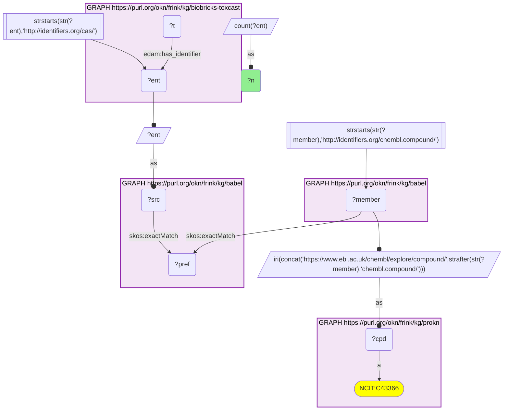
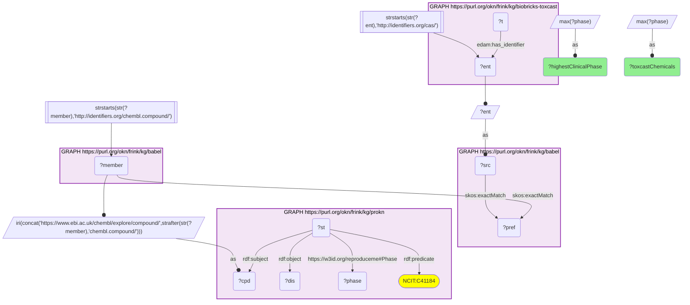
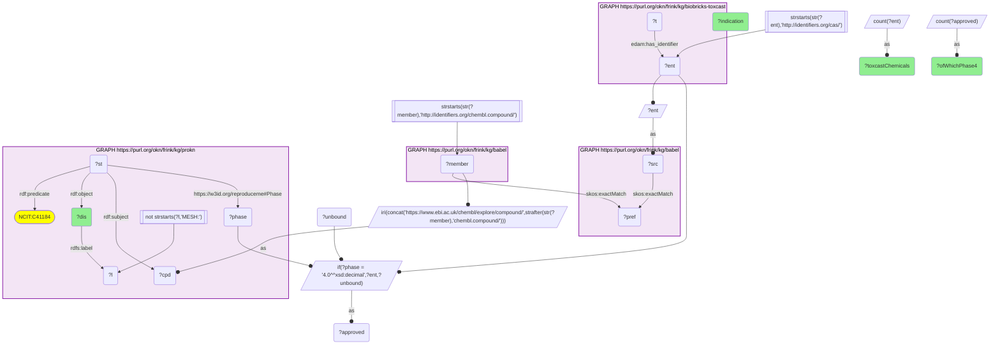
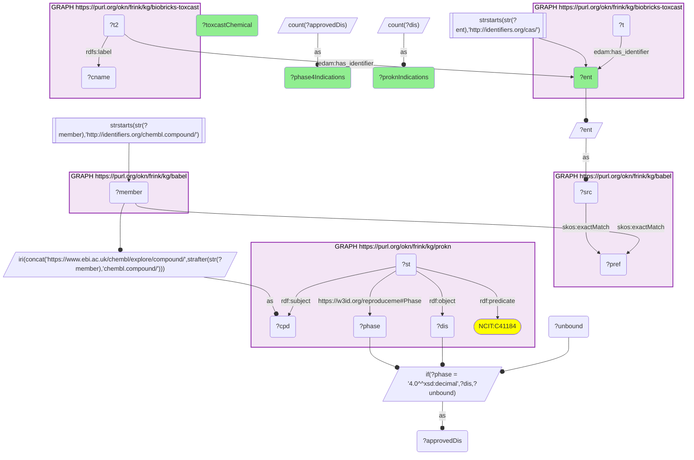
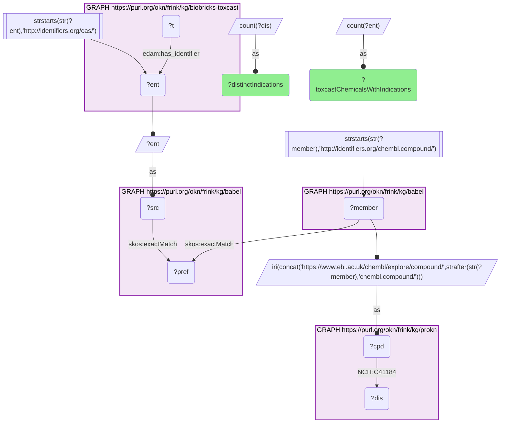

# Which ToxCast test chemicals are also drugs? ProKN's ChEMBL indications and clinical phases, reached through Babel (CAS → ChEMBL)

- **Date:** 2026-09-26
- **Model:** claude-opus-5-5
- **External MCP servers:** PubMed
- **SPARQL endpoint:** https://apps.okn.us/federation/sparql
- **Generated by:** mcp-okn v0.1.0 (build 7d8000e)
- **Contents:** 5 queries · 5 query diagrams

## Knowledge graphs used

- `biobricks-toxcast` — <https://purl.org/okn/frink/kg/biobricks-toxcast>
- `babel` — <https://purl.org/okn/frink/kg/babel>
- `prokn` — <https://purl.org/okn/frink/kg/prokn>

## Conversation

👤 **User**

Crosswalk: `biobricks-toxcast` × `prokn` on **CAS → ChEMBL, bridged through `babel`** (crosswalk `CB3-cas-toxcast-prokn-via-babel`, verified_count 2,504). ToxCast keys every chemical on a CAS IRI attached to its `Chemical_Entity` node by `edam:has_identifier` (`http://identifiers.org/cas/{cas}`, already in babel's identifiers.org form, so the left side needs no rewrite); ProKN keys its compounds on ChEMBL IRIs (`https://www.ebi.ac.uk/chembl/explore/compound/CHEMBL{n}`, typed `obo:NCIT_C43366`). Neither graph carries the other's identifier scheme — ToxCast has CAS and DTXSID, ProKN has ChEMBL, InChIKey and PubChem. babel (the Translator Babel identifier cliques) bridges them: the CAS IRI `skos:exactMatch`es its clique's preferred id, the same clique holds the `http://identifiers.org/chembl.compound/CHEMBL{n}` member, and that member's local id is rebuilt into ProKN's explore-compound IRI. Both babel hops must be staged in nested `SELECT DISTINCT` subqueries with the scheme FILTER applied outside them, or the join times out.

Research question: For the ToxCast chemicals that are also ProKN compounds, which clinical indications does ProKN list, and at what clinical phase — i.e. which environmental test chemicals are also drugs, and how far did each one get clinically?

Why the join is required: ToxCast is an environmental-screening library: it records assay hitcalls for chemicals selected from EPA-relevant inventories, and holds no drug status, no indication and no clinical phase. ProKN carries ChEMBL's indication layer — `obo:NCIT_C41184` (Indication) edges from a compound to a MeSH disease node, each reified statement carrying the maximum clinical phase for that compound–indication pair — but holds no toxicological screening data and no CAS. Without the babel bridge there is no way to ask which entries in an environmental test library are, in fact, medicines.

---

🧠 **Assistant**

**1,671 of the 2,504 bridged ToxCast chemicals (67%) carry at least one clinical indication in ProKN**, spanning **1,442 distinct MeSH indications**. The crosswalk skeleton reproduced its verified count of 2,504 exactly. Put plainly: two-thirds of the ToxCast chemicals that reach ProKN are not merely drug-*like*, they have a documented clinical indication, and most of them are approved.

## How far did they get?

Highest clinical phase recorded for any indication of the chemical:

| Highest phase | ToxCast chemicals |
| --- | --- |
| 4 (approved) | 1,088 |
| 3 | 247 |
| 2 | 254 |
| 1 | 52 |
| 0.5 (early phase 1) | 13 |
| -1 (phase not known) | 17 |

The remaining **833 bridged chemicals have no indication edge at all** — they are ChEMBL compounds that ProKN knows structurally but that carry no clinical record.

## What are they indicated for?

| MeSH indication | ToxCast chemicals | of which at phase 4 |
| --- | --- | --- |
| cancer (D009369) | 262 | 88 |
| breast neoplasm (D001943) | 196 | 17 |
| Cardiovascular Diseases (D002318) | 186 | 117 |
| Pain (D010146) | 162 | 39 |
| HIV infection (D015658) | 152 | 20 |
| Depressive Disorder (D003866) | 149 | 29 |
| severe acute respiratory syndrome (D045169) | 140 | 0 |
| prostate cancer (D064129) | 140 | 0 |
| hypertension (D006973) | 129 | 62 |
| adult lymphoma (D008223) | 119 | 10 |
| schizophrenia (D012559) | 119 | 14 |
| Diabetes Mellitus, Type 2 (D003924) | 111 | 18 |
| Infections (D007239) | 109 | 58 |
| Carcinoma, Non-Small-Cell Lung (D002289) | 108 | 5 |
| heart failure (D006333) | 107 | 29 |

## Which chemicals have the broadest clinical record?

| ToxCast chemical | CAS | ProKN indications | of which at phase 4 |
| --- | --- | --- | --- |
| Dexamethasone | 50-02-2 | 271 | 71 |
| Cyclophosphamide monohydrate | 6055-19-2 | 216 | 6 |
| Prednisone | 53-03-2 | 203 | 67 |
| Prednisolone | 50-24-8 | 153 | 57 |
| Aspirin | 50-78-2 | 150 | 16 |
| Methylprednisolone | 83-43-2 | 141 | 16 |
| Sirolimus | 53123-88-9 | 137 | 5 |
| Methotrexate | 59-05-2 | 135 | 12 |
| Metformin | 657-24-9 | 134 | 1 |
| Cisplatin | 15663-27-1 | 129 | 1 |
| N-Acetyl-L-cysteine | 616-91-1 | 121 | 4 |
| Tacrolimus | 104987-11-3 | 120 | 0 |
| Etoposide | 33419-42-0 | 120 | 4 |
| Acetaminophen | 103-90-2 | 117 | 13 |
| Mycophenolate mofetil | 128794-94-5 | 116 | 1 |

**Why it answers the question.** The question is only askable across the bridge: ToxCast says nothing about clinical status and ProKN says nothing about CAS or assays, so the drug identity of an environmental test chemical exists in neither graph alone. Joined, the answer is concrete and quantified. The intersection is dominated not by pesticides or industrial chemicals but by **mainstream medicines**: corticosteroids (dexamethasone, prednisone, prednisolone, methylprednisolone), cytotoxics (cyclophosphamide, methotrexate, cisplatin, etoposide), transplant immunosuppressants (sirolimus, tacrolimus, mycophenolate mofetil) and household analgesics (aspirin, acetaminophen). The indication table shows the same thing from the disease side: oncology, cardiovascular disease, pain and psychiatry supply most of the volume.

The phase column separates two very different kinds of entry, and this is the finding that the raw indication counts would hide. **Cardiovascular Diseases, hypertension and Infections are majority phase 4** (117/186, 62/129, 58/109) — these are settled, approved uses. **severe acute respiratory syndrome and prostate cancer have 140 chemicals each and zero at phase 4** — every one of those edges is a trial-stage record, the signature of large-scale drug-repurposing campaigns rather than of approved therapy. Reading indication breadth without the phase would rank a compound trialled 140 times and approved never alongside one approved for 70 conditions. The same caution applies per chemical: cyclophosphamide has 216 indications but only 6 at phase 4, while dexamethasone has 271 with 71 approved.

**Caveats.** (a) Indication counts are ChEMBL's curated drug-indication records as ProKN reifies them, which mix approved labels with registered clinical trials; the phase on each reified statement is the maximum phase for that compound–indication pair, and `-1` means the phase is unknown, not early. (b) MeSH nodes in ProKN carry several synonymous labels (for example D009369 has both "Neoplasms" and "cancer"); the tables show one sampled label per node, and the MeSH accession is given so the node, not the label, identifies the indication. (c) The indication axis is coarse in places — "cancer" and "Infections" are umbrella terms that a compound can be attached to without a specific tumour type or pathogen. (d) Coverage runs one way: these are ToxCast chemicals that reach ProKN, not all of ToxCast and not all of ChEMBL. (e) babel can place one id in two cliques, so every figure counts DISTINCT ToxCast chemicals or DISTINCT indication nodes, never cliques.

## Literature validation

The identifier join is **validated by construction**. CAS and ChEMBL are registered, exact-string chemical identifiers, and babel asserts their equivalence through a shared clique; no name or structure matching is involved. The hand-verified crosswalk `CB3-cas-toxcast-prokn-via-babel` (verified_count 2,504) reproduced live in the first logged query.

The claims the write-up rests on were checked against PubMed:

- **The ToxCast library is an EPA screening library assembled from regulatory and toxicity inventories** — 310 chemicals in Phase I, 1,878 by Phase II, more than 3,800 in Phase III, 96% of them also screened in Tox21, with library coverage assessed against toxicity, regulatory and exposure inventories by CAS Registry Number (PMID 27367298, [DOI](https://doi.org/10.1021/acs.chemrestox.6b00135)). This establishes what the left-hand side of the join is — an environmental-screening library keyed on CAS — and therefore why finding 1,671 clinically indicated compounds inside it is a cross-domain result rather than a tautology.
- **Dexamethasone is a potent glucocorticoid with anti-inflammatory and immunosuppressive properties**, used across inflammatory and autoimmune disease (PMID 39627850, [DOI](https://doi.org/10.1002/ame2.12518)). Consistent with its position at the top of the indication-breadth table (271 indications, 71 at phase 4).
- **N-acetylcysteine is the established antidote for paracetamol (acetaminophen) overdose** (PMID 42573610, [DOI](https://doi.org/10.1007/s00210-026-05800-0)). Worth noting because acetaminophen (117 indications) and N-acetyl-L-cysteine (121 indications) both appear in the same table — the drug and its antidote are both ToxCast test chemicals.
- **Metformin is a glucose-lowering pharmacotherapy for diabetes** and is discussed as a first-line alternative to insulin in gestational diabetes (PMID 42597015, [DOI](https://doi.org/10.1002/pmf2.70224)). Metformin's 134 ProKN indications with only 1 at phase 4 is therefore a statement about the breadth of metformin *trials*, not about approved labels.
- No literature check was performed on the individual indication–compound pairs behind the aggregate counts; those are ChEMBL's curation as ProKN reproduces it, and are reported as such rather than asserted as clinical fact.

Sources retrieved from PubMed.

**Validated.** The join uses shared registered identifiers bridged by babel, every count above came from a query that ran live against both graphs, and the drug-identity claims used to interpret the tables are literature-supported — with the phase column carrying the interpretive weight that indication breadth alone cannot.

## SPARQL queries executed

#### Query 1

_2026-09-27T00:26:59+00:00 · `biobricks-toxcast`, `babel`, `prokn`_

```sparql
SELECT (COUNT(DISTINCT ?ent) AS ?n) WHERE {
  { SELECT DISTINCT ?ent ?member WHERE {
    { SELECT DISTINCT ?ent ?pref WHERE {
        { SELECT DISTINCT ?ent ?src WHERE { GRAPH <https://purl.org/okn/frink/kg/biobricks-toxcast> { ?t <http://edamontology.org/has_identifier> ?ent } FILTER(STRSTARTS(STR(?ent),'http://identifiers.org/cas/')) BIND(?ent AS ?src) } }
        GRAPH <https://purl.org/okn/frink/kg/babel> { ?src <http://www.w3.org/2004/02/skos/core#exactMatch> ?pref } } }
    GRAPH <https://purl.org/okn/frink/kg/babel> { ?member <http://www.w3.org/2004/02/skos/core#exactMatch> ?pref } } }
  FILTER(STRSTARTS(STR(?member),'http://identifiers.org/chembl.compound/'))
  BIND(IRI(CONCAT('https://www.ebi.ac.uk/chembl/explore/compound/',STRAFTER(STR(?member),'chembl.compound/'))) AS ?cpd)
  GRAPH <https://purl.org/okn/frink/kg/prokn> { ?cpd a <http://purl.obolibrary.org/obo/NCIT_C43366> }
}
```



_1 row(s)_

| n |
| --- |
| 2504 |

#### Query 2

_2026-09-27T00:27:08+00:00 · `biobricks-toxcast`, `babel`, `prokn`_

```sparql
PREFIX skos: <http://www.w3.org/2004/02/skos/core#>
PREFIX rdf: <http://www.w3.org/1999/02/22-rdf-syntax-ns#>
SELECT ?highestClinicalPhase (COUNT(?ent) AS ?toxcastChemicals) WHERE {
 { SELECT ?ent (MAX(?phase) AS ?highestClinicalPhase) WHERE {
   { SELECT DISTINCT ?ent ?cpd WHERE {
     { SELECT DISTINCT ?ent ?member WHERE {
       { SELECT DISTINCT ?ent ?pref WHERE {
           { SELECT DISTINCT ?ent ?src WHERE { GRAPH <https://purl.org/okn/frink/kg/biobricks-toxcast> { ?t <http://edamontology.org/has_identifier> ?ent } FILTER(STRSTARTS(STR(?ent),'http://identifiers.org/cas/')) BIND(?ent AS ?src) } }
           GRAPH <https://purl.org/okn/frink/kg/babel> { ?src skos:exactMatch ?pref } } }
       GRAPH <https://purl.org/okn/frink/kg/babel> { ?member skos:exactMatch ?pref } } }
     FILTER(STRSTARTS(STR(?member),'http://identifiers.org/chembl.compound/'))
     BIND(IRI(CONCAT('https://www.ebi.ac.uk/chembl/explore/compound/',STRAFTER(STR(?member),'chembl.compound/'))) AS ?cpd) } }
   GRAPH <https://purl.org/okn/frink/kg/prokn> {
     ?st rdf:subject ?cpd ; rdf:predicate <http://purl.obolibrary.org/obo/NCIT_C41184> ; rdf:object ?dis ; <https://w3id.org/reproduceme#Phase> ?phase }
 } GROUP BY ?ent }
} GROUP BY ?highestClinicalPhase ORDER BY DESC(?highestClinicalPhase)
```



_6 row(s) — showing first 3_

| highestClinicalPhase | toxcastChemicals |
| --- | --- |
| 4.0 | 1088 |
| 3.0 | 247 |
| 2.0 | 254 |

#### Query 3

_2026-09-27T00:27:20+00:00 · `biobricks-toxcast`, `babel`, `prokn`_

```sparql
PREFIX skos: <http://www.w3.org/2004/02/skos/core#>
PREFIX rdf: <http://www.w3.org/1999/02/22-rdf-syntax-ns#>
PREFIX rdfs: <http://www.w3.org/2000/01/rdf-schema#>
SELECT ?dis (SAMPLE(?l) AS ?indication) (COUNT(DISTINCT ?ent) AS ?toxcastChemicals)
       (COUNT(DISTINCT ?approved) AS ?ofWhichPhase4) WHERE {
   { SELECT DISTINCT ?ent ?cpd WHERE {
     { SELECT DISTINCT ?ent ?member WHERE {
       { SELECT DISTINCT ?ent ?pref WHERE {
           { SELECT DISTINCT ?ent ?src WHERE { GRAPH <https://purl.org/okn/frink/kg/biobricks-toxcast> { ?t <http://edamontology.org/has_identifier> ?ent } FILTER(STRSTARTS(STR(?ent),'http://identifiers.org/cas/')) BIND(?ent AS ?src) } }
           GRAPH <https://purl.org/okn/frink/kg/babel> { ?src skos:exactMatch ?pref } } }
       GRAPH <https://purl.org/okn/frink/kg/babel> { ?member skos:exactMatch ?pref } } }
     FILTER(STRSTARTS(STR(?member),'http://identifiers.org/chembl.compound/'))
     BIND(IRI(CONCAT('https://www.ebi.ac.uk/chembl/explore/compound/',STRAFTER(STR(?member),'chembl.compound/'))) AS ?cpd) } }
   GRAPH <https://purl.org/okn/frink/kg/prokn> {
     ?st rdf:subject ?cpd ; rdf:predicate <http://purl.obolibrary.org/obo/NCIT_C41184> ; rdf:object ?dis ; <https://w3id.org/reproduceme#Phase> ?phase .
     ?dis rdfs:label ?l FILTER(!STRSTARTS(?l,'MESH:')) }
   BIND(IF(?phase = 4.0, ?ent, ?unbound) AS ?approved)
} GROUP BY ?dis ORDER BY DESC(?toxcastChemicals) LIMIT 15
```



_15 row(s) — showing first 3_

| dis | indication | toxcastChemicals | ofWhichPhase4 |
| --- | --- | --- | --- |
| https://www.ncbi.nlm.nih.gov/mesh/?term=D009369 | cancer | 262 | 88 |
| https://www.ncbi.nlm.nih.gov/mesh/?term=D001943 | breast neoplasm | 196 | 17 |
| https://www.ncbi.nlm.nih.gov/mesh/?term=D002318 | Cardiovascular Diseases | 186 | 117 |

#### Query 4

_2026-09-27T00:27:32+00:00 · `biobricks-toxcast`, `babel`, `prokn`_

```sparql
PREFIX skos: <http://www.w3.org/2004/02/skos/core#>
PREFIX rdf: <http://www.w3.org/1999/02/22-rdf-syntax-ns#>
PREFIX rdfs: <http://www.w3.org/2000/01/rdf-schema#>
SELECT ?ent (SAMPLE(?cname) AS ?toxcastChemical) (COUNT(DISTINCT ?dis) AS ?proknIndications)
       (COUNT(DISTINCT ?approvedDis) AS ?phase4Indications) WHERE {
   { SELECT DISTINCT ?ent ?cpd WHERE {
     { SELECT DISTINCT ?ent ?member WHERE {
       { SELECT DISTINCT ?ent ?pref WHERE {
           { SELECT DISTINCT ?ent ?src WHERE { GRAPH <https://purl.org/okn/frink/kg/biobricks-toxcast> { ?t <http://edamontology.org/has_identifier> ?ent } FILTER(STRSTARTS(STR(?ent),'http://identifiers.org/cas/')) BIND(?ent AS ?src) } }
           GRAPH <https://purl.org/okn/frink/kg/babel> { ?src skos:exactMatch ?pref } } }
       GRAPH <https://purl.org/okn/frink/kg/babel> { ?member skos:exactMatch ?pref } } }
     FILTER(STRSTARTS(STR(?member),'http://identifiers.org/chembl.compound/'))
     BIND(IRI(CONCAT('https://www.ebi.ac.uk/chembl/explore/compound/',STRAFTER(STR(?member),'chembl.compound/'))) AS ?cpd) } }
   GRAPH <https://purl.org/okn/frink/kg/prokn> {
     ?st rdf:subject ?cpd ; rdf:predicate <http://purl.obolibrary.org/obo/NCIT_C41184> ; rdf:object ?dis ; <https://w3id.org/reproduceme#Phase> ?phase }
   GRAPH <https://purl.org/okn/frink/kg/biobricks-toxcast> { ?t2 <http://edamontology.org/has_identifier> ?ent ; rdfs:label ?cname }
   BIND(IF(?phase = 4.0, ?dis, ?unbound) AS ?approvedDis)
} GROUP BY ?ent ORDER BY DESC(?proknIndications) LIMIT 15
```



_15 row(s) — showing first 3_

| ent | toxcastChemical | proknIndications | phase4Indications |
| --- | --- | --- | --- |
| http://identifiers.org/cas/50-02-2 | Dexamethasone | 271 | 71 |
| http://identifiers.org/cas/6055-19-2 | Cyclophosphamide monohydrate | 216 | 6 |
| http://identifiers.org/cas/53-03-2 | Prednisone | 203 | 67 |

#### Query 5

_2026-09-27T00:27:43+00:00 · `biobricks-toxcast`, `babel`, `prokn`_

```sparql
PREFIX skos: <http://www.w3.org/2004/02/skos/core#>
PREFIX rdf: <http://www.w3.org/1999/02/22-rdf-syntax-ns#>
SELECT (COUNT(DISTINCT ?ent) AS ?toxcastChemicalsWithIndications) (COUNT(DISTINCT ?dis) AS ?distinctIndications) WHERE {
   { SELECT DISTINCT ?ent ?cpd WHERE {
     { SELECT DISTINCT ?ent ?member WHERE {
       { SELECT DISTINCT ?ent ?pref WHERE {
           { SELECT DISTINCT ?ent ?src WHERE { GRAPH <https://purl.org/okn/frink/kg/biobricks-toxcast> { ?t <http://edamontology.org/has_identifier> ?ent } FILTER(STRSTARTS(STR(?ent),'http://identifiers.org/cas/')) BIND(?ent AS ?src) } }
           GRAPH <https://purl.org/okn/frink/kg/babel> { ?src skos:exactMatch ?pref } } }
       GRAPH <https://purl.org/okn/frink/kg/babel> { ?member skos:exactMatch ?pref } } }
     FILTER(STRSTARTS(STR(?member),'http://identifiers.org/chembl.compound/'))
     BIND(IRI(CONCAT('https://www.ebi.ac.uk/chembl/explore/compound/',STRAFTER(STR(?member),'chembl.compound/'))) AS ?cpd) } }
   GRAPH <https://purl.org/okn/frink/kg/prokn> { ?cpd <http://purl.obolibrary.org/obo/NCIT_C41184> ?dis }
}
```



_1 row(s)_

| toxcastChemicalsWithIndications | distinctIndications |
| --- | --- |
| 1671 | 1442 |
