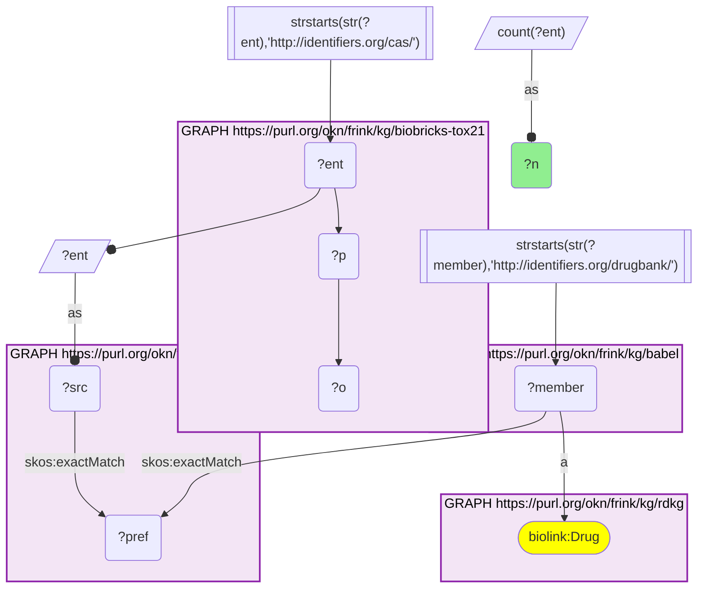
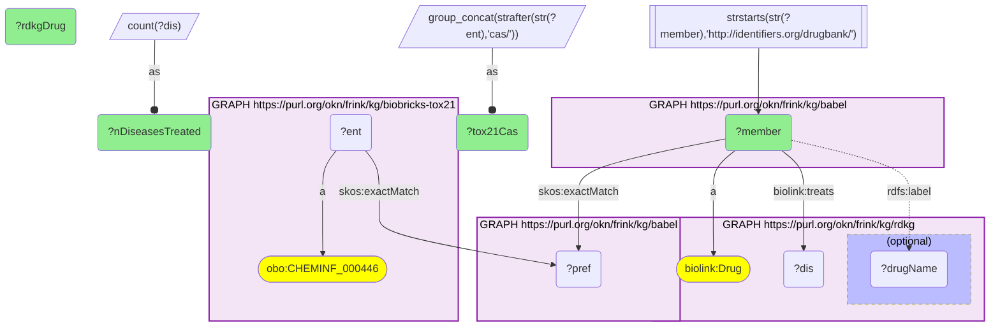
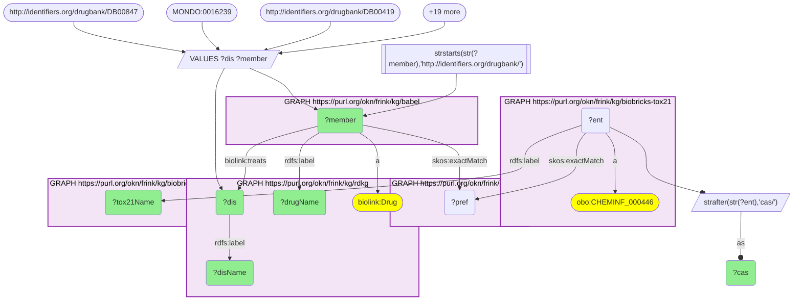
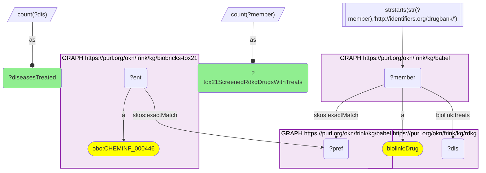

# RDKG drugs in the Tox21 screening library and the diseases RDKG says they treat, joined through Babel (CAS → DrugBank)

- **Date:** 2026-09-26
- **Model:** claude-opus-5-5
- **External MCP servers:** PubMed
- **SPARQL endpoint:** https://apps.okn.us/federation/sparql
- **Generated by:** mcp-okn v0.1.0 (build 7d8000e)
- **Contents:** 4 queries · 4 query diagrams

## Knowledge graphs used

- `biobricks-tox21` — <https://purl.org/okn/frink/kg/biobricks-tox21>
- `babel` — <https://purl.org/okn/frink/kg/babel>
- `rdkg` — <https://purl.org/okn/frink/kg/rdkg>

## Conversation

👤 **User**

Crosswalk: `biobricks-tox21` × `rdkg` on **CAS → DrugBank, bridged through `babel`** (crosswalk `DB3-cas-tox21-rdkg-via-babel`, verified_count 920). biobricks-tox21 keys each Tox21 library chemical on its CAS Registry Number, and the chemical node IS its CAS IRI (`http://identifiers.org/cas/{cas}`, typed `obo:CHEMINF_000446`); rdkg keys its drugs on DrugBank IRIs (`http://identifiers.org/drugbank/DB{n}`, `biolink:Drug`) and carries no CAS. babel (the Translator Babel identifier cliques) links them: the CAS IRI `skos:exactMatch`es its clique's preferred id, and the same clique holds the DrugBank member, already in rdkg's IRI form, so neither side needs a rewrite. Both babel hops must be staged in nested `SELECT DISTINCT` subqueries, with the DrugBank scheme filter outside them, or the join times out.

Research question: Which RDKG drugs are in the Tox21 screening library (DrugBank ← CAS via Babel), and which diseases does RDKG say they treat — both the drugs with the broadest reach and classic orphan drugs with their signature rare disease?

Why the join is required: biobricks-tox21 knows *which chemicals are in the Tox21 10K toxicology screening library* (CAS number and name) but nothing about their clinical use. RDKG knows *which diseases a DrugBank drug treats* (`biolink:treats` → MONDO / Orphanet disease nodes) but has no CAS numbers and no notion of the Tox21 library. With no shared identifier, only the babel bridge can put a drug's toxicology-library membership next to its RDKG indications.

---

🧠 **Assistant**

The babel bridge maps **920 Tox21 chemicals** onto RDKG DrugBank drugs (the crosswalk skeleton reproduces its verified count exactly). **858 Tox21-screened RDKG drugs** carry at least one `biolink:treats` edge, together reaching **2,817 distinct diseases**.

**Broadest reach.** The Tox21-screened drugs that RDKG links to the most diseases:

| DrugBank | RDKG drug | Tox21 CAS | Diseases treated (RDKG) |
| --- | --- | --- | --- |
| DB01234 | Dexamethasone | 50-02-2 | 290 |
| DB00635 | Prednisone | 53-03-2 | 229 |
| DB00860 | Prednisolone | 50-24-8 | 220 |
| DB00959 | Methylprednisolone | 83-43-2 | 195 |
| DB00515 | Cisplatin | 15663-27-1 | 190 |
| DB01380 | Cortisone acetate | 50-04-4 | 182 |
| DB01229 | Paclitaxel | 33069-62-4 | 180 |
| DB00620 | Triamcinolone | 124-94-7 | 162 |
| DB00773 | Etoposide | 33419-42-0 | 161 |
| DB00741 | Hydrocortisone | 50-23-7 | 158 |
| DB00443 | Betamethasone | 378-44-9 | 154 |
| DB00563 | Methotrexate | 59-05-2 | 142 |

**Classic orphan drugs.** Eight well-known rare-disease drugs are in the Tox21 library, and RDKG links each to its signature rare disease:

| RDKG drug (DrugBank) | Tox21 CAS | Signature disease in RDKG |
| --- | --- | --- |
| Cysteamine (DB00847) | 60-23-1 | cystinosis |
| Miglustat (DB00419) | 72599-27-0 | Gaucher disease type I; Niemann-Pick disease type C |
| Penicillamine (DB00859) | 52-67-5 | Wilson disease; cystinuria |
| Triethylenetetramine (trientine, DB06824) | 112-24-3 | Wilson disease |
| Riluzole (DB00740) | 1744-22-5 | amyotrophic lateral sclerosis type 1 |
| Sirolimus (DB00877) | 53123-88-9 | lymphangioleiomyomatosis |
| Lenalidomide (DB00480) | 191732-72-6 | myelodysplastic syndrome; plasma cell myeloma |
| Thalidomide (DB01041) | 50-35-1 | plasma cell myeloma |

**Why it answers the question.** Each row sets a fact only biobricks-tox21 holds (this CAS-numbered chemical is in the Tox21 toxicology library) beside a fact only RDKG holds (this DrugBank drug treats this disease). Neither graph could produce the row alone. The result has two sides. The drugs with the widest RDKG reach are general-purpose agents, so their Tox21 profiles are relevant across hundreds of diseases. These are systemic corticosteroids and cytotoxic chemotherapy (cisplatin, paclitaxel, etoposide, methotrexate). The library also holds narrowly targeted orphan drugs: cysteamine for cystinosis, miglustat for Gaucher and Niemann-Pick type C, the copper chelators penicillamine and trientine for Wilson disease, riluzole for ALS, sirolimus for lymphangioleiomyomatosis, and lenalidomide and thalidomide for myeloma. For these, a Tox21 in-vitro profile is available for a drug whose patient population is small.

**Caveats.** (1) The federation's biobricks-tox21 graph holds only library membership (CAS, name). It carries **no Tox21 assay activity calls**, so "in the Tox21 library" means *screened*, not *active*. Which assays these drugs are active in cannot be answered from the federation. (2) RDKG's `biolink:treats` edges are not restricted to rare diseases; they also reach common conditions. The disease counts are all diseases RDKG links to the drug, not a rare-disease subset, and some are grouped or overlapping nodes (e.g. MONDO terms alongside rdaccelerate `MONDO_GROUPED_*` and Orphanet nodes). (3) The orphan-drug table was assembled by naming drug–disease pairs and confirming each edge and bridge in a logged query. It is a spotlight, not an exhaustive list. (4) Counts are DISTINCT Tox21 chemicals, RDKG drugs and disease nodes. babel can place one id in two cliques, so no count is over cliques.

## Literature validation

The identifier join is **validated by construction**. CAS Registry Numbers and DrugBank ids are registered, exact-string identifiers, and babel asserts their equivalence through a shared clique; no name matching is used. The hand-verified crosswalk `DB3-cas-tox21-rdkg-via-babel` (verified_count 920) reproduces live.

Each orphan drug–disease pair shown was checked against PubMed:

- **Cysteamine → cystinosis**: infants with nephropathic cystinosis were managed with oral cysteamine therapy, and early diagnosis allows timely cysteamine initiation (PMID 42779591, [DOI](https://doi.org/10.3339/ckd.25.032)).
- **Miglustat → Gaucher disease type 1 and Niemann-Pick type C**: miglustat is an oral substrate-reduction therapy for type 1 Gaucher disease, with reported benefit on CNS manifestations in Niemann-Pick type C (PMID 18339196, [DOI](https://doi.org/10.1111/j.1651-2227.2008.00656.x)).
- **Penicillamine and trientine → Wilson disease**: D-penicillamine and trientine are the chelating agents used in Wilson disease (PMID 42753766, [DOI](https://doi.org/10.1055/a-2931-1893)).
- **Penicillamine → cystinuria**: D-penicillamine is a cystine-binding medication indicated in cystinuria (PMID 42378189, [DOI](https://doi.org/10.1159/000553298)).
- **Riluzole → ALS**: riluzole is an approved ALS therapy with a modest survival benefit (PMID 42666355, [DOI](https://doi.org/10.2147/DDDT.S626069)).
- **Sirolimus → lymphangioleiomyomatosis**: the phase III MILES trial led to FDA approval of sirolimus for lymphangioleiomyomatosis (PMID 36927115, [DOI](https://doi.org/10.1177/17407745231158906)).
- **Lenalidomide → myelodysplastic syndrome**: lenalidomide's benefit in lower-risk MDS with del(5q) is well established (PMID 42782853, [DOI](https://doi.org/10.3390/curroncol33090506)).
- **Thalidomide and lenalidomide → multiple myeloma**: immunomodulatory drugs reshaped myeloma therapy, from thalidomide's repurposing to lenalidomide's Rd backbone (PMID 42721415, [DOI](https://doi.org/10.1200/JCO-26-00545)).

The broad-reach table carries counts only, with no per-disease claims, so it was not literature-checked row by row.

Sources retrieved from PubMed.

**Validated.** The join uses shared registered identifiers bridged by babel, every row ran live against the three graphs, and every orphan drug–disease pair highlighted is backed by literature.

## SPARQL queries executed

#### Query 1

_2026-09-27T00:30:23+00:00 · `biobricks-tox21`, `babel`, `rdkg`_

```sparql
SELECT (COUNT(DISTINCT ?ent) AS ?n) WHERE {
  { SELECT DISTINCT ?ent ?member WHERE {
    { SELECT DISTINCT ?ent ?pref WHERE {
        { SELECT DISTINCT ?ent ?src WHERE { GRAPH <https://purl.org/okn/frink/kg/biobricks-tox21> { ?ent ?p ?o } FILTER(STRSTARTS(STR(?ent),'http://identifiers.org/cas/')) BIND(?ent AS ?src) } }
        GRAPH <https://purl.org/okn/frink/kg/babel> { ?src <http://www.w3.org/2004/02/skos/core#exactMatch> ?pref } } }
    GRAPH <https://purl.org/okn/frink/kg/babel> { ?member <http://www.w3.org/2004/02/skos/core#exactMatch> ?pref } } }
  FILTER(STRSTARTS(STR(?member),'http://identifiers.org/drugbank/'))
  GRAPH <https://purl.org/okn/frink/kg/rdkg> { ?member a <https://w3id.org/biolink/vocab/Drug> }
}
```



_1 row(s)_

| n |
| --- |
| 920 |

#### Query 2

_2026-09-27T00:30:43+00:00 · `biobricks-tox21`, `babel`, `rdkg`_

```sparql
PREFIX biolink: <https://w3id.org/biolink/vocab/>
PREFIX rdfs: <http://www.w3.org/2000/01/rdf-schema#>
PREFIX skos: <http://www.w3.org/2004/02/skos/core#>
SELECT ?member (SAMPLE(?drugName) AS ?rdkgDrug) (GROUP_CONCAT(DISTINCT STRAFTER(STR(?ent),'cas/'); separator=", ") AS ?tox21Cas) (COUNT(DISTINCT ?dis) AS ?nDiseasesTreated) WHERE {
  { SELECT DISTINCT ?ent ?member WHERE {
    { SELECT DISTINCT ?ent ?member WHERE {
      { SELECT DISTINCT ?ent ?pref WHERE {
          { SELECT DISTINCT ?ent WHERE { GRAPH <https://purl.org/okn/frink/kg/biobricks-tox21> { ?ent a <http://purl.obolibrary.org/obo/CHEMINF_000446> } } }
          GRAPH <https://purl.org/okn/frink/kg/babel> { ?ent skos:exactMatch ?pref } } }
      GRAPH <https://purl.org/okn/frink/kg/babel> { ?member skos:exactMatch ?pref } } }
    FILTER(STRSTARTS(STR(?member),'http://identifiers.org/drugbank/')) } }
  GRAPH <https://purl.org/okn/frink/kg/rdkg> { ?member a biolink:Drug ; biolink:treats ?dis . OPTIONAL { ?member rdfs:label ?drugName } }
} GROUP BY ?member ORDER BY DESC(?nDiseasesTreated) LIMIT 12
```



_12 row(s) — showing first 3_

| member | rdkgDrug | tox21Cas | nDiseasesTreated |
| --- | --- | --- | --- |
| http://identifiers.org/drugbank/DB01234 | Dexamethasone | 50-02-2 | 290 |
| http://identifiers.org/drugbank/DB00635 | Prednisone | 53-03-2 | 229 |
| http://identifiers.org/drugbank/DB00860 | Prednisolone | 50-24-8 | 220 |

#### Query 3

_2026-09-27T00:30:43+00:00 · `biobricks-tox21`, `babel`, `rdkg`_

```sparql
PREFIX biolink: <https://w3id.org/biolink/vocab/>
PREFIX rdfs: <http://www.w3.org/2000/01/rdf-schema#>
PREFIX skos: <http://www.w3.org/2004/02/skos/core#>
SELECT ?member ?drugName ?tox21Name ?cas ?dis ?disName WHERE {
  VALUES (?member ?dis) {
    (<http://identifiers.org/drugbank/DB00847> <http://purl.obolibrary.org/obo/MONDO_0016239>)
    (<http://identifiers.org/drugbank/DB00419> <http://purl.obolibrary.org/obo/MONDO_0009265>)
    (<http://identifiers.org/drugbank/DB00419> <https://rdaccelerate.org/resource/MONDO_GROUPED_16306_16307_16308_16309_16310>)
    (<http://identifiers.org/drugbank/DB00859> <http://purl.obolibrary.org/obo/MONDO_0010200>)
    (<http://identifiers.org/drugbank/DB00859> <https://rdaccelerate.org/resource/MONDO_GROUPED_9067_19745_19746>)
    (<http://identifiers.org/drugbank/DB06824> <http://purl.obolibrary.org/obo/MONDO_0010200>)
    (<http://identifiers.org/drugbank/DB00740> <http://purl.obolibrary.org/obo/MONDO_0007103>)
    (<http://identifiers.org/drugbank/DB00877> <https://rdaccelerate.org/resource/MONDO_GROUPED_6277_11705>)
    (<http://identifiers.org/drugbank/DB00480> <http://purl.obolibrary.org/obo/MONDO_0018881>)
    (<http://identifiers.org/drugbank/DB00480> <http://purl.obolibrary.org/obo/MONDO_0009693>)
    (<http://identifiers.org/drugbank/DB01041> <http://purl.obolibrary.org/obo/MONDO_0009693>)
  }
  { SELECT DISTINCT ?ent ?member WHERE {
    { SELECT DISTINCT ?ent ?member WHERE {
      { SELECT DISTINCT ?ent ?pref WHERE {
          { SELECT DISTINCT ?ent WHERE { GRAPH <https://purl.org/okn/frink/kg/biobricks-tox21> { ?ent a <http://purl.obolibrary.org/obo/CHEMINF_000446> } } }
          GRAPH <https://purl.org/okn/frink/kg/babel> { ?ent skos:exactMatch ?pref } } }
      GRAPH <https://purl.org/okn/frink/kg/babel> { ?member skos:exactMatch ?pref } } }
    FILTER(STRSTARTS(STR(?member),'http://identifiers.org/drugbank/')) } }
  BIND(STRAFTER(STR(?ent),'cas/') AS ?cas)
  GRAPH <https://purl.org/okn/frink/kg/rdkg> { ?member a biolink:Drug ; rdfs:label ?drugName ; biolink:treats ?dis . ?dis rdfs:label ?disName }
  GRAPH <https://purl.org/okn/frink/kg/biobricks-tox21> { ?ent rdfs:label ?tox21Name }
} ORDER BY ?drugName ?disName
```



_11 row(s) — showing first 3_

| member | drugName | tox21Name | cas | dis | disName |
| --- | --- | --- | --- | --- | --- |
| http://identifiers.org/drugbank/DB00847 | Cysteamine | Cysteamine | 60-23-1 | http://purl.obolibrary.org/obo/MONDO_0016239 | cystinosis |
| http://identifiers.org/drugbank/DB00480 | Lenalidomide | Lenalidomide | 191732-72-6 | http://purl.obolibrary.org/obo/MONDO_0018881 | myelodysplastic syndrome |
| http://identifiers.org/drugbank/DB00480 | Lenalidomide | Lenalidomide | 191732-72-6 | http://purl.obolibrary.org/obo/MONDO_0009693 | plasma cell myeloma |

#### Query 4

_2026-09-27T00:30:43+00:00 · `biobricks-tox21`, `babel`, `rdkg`_

```sparql
PREFIX biolink: <https://w3id.org/biolink/vocab/>
PREFIX skos: <http://www.w3.org/2004/02/skos/core#>
SELECT (COUNT(DISTINCT ?member) AS ?tox21ScreenedRdkgDrugsWithTreats) (COUNT(DISTINCT ?dis) AS ?diseasesTreated) WHERE {
  { SELECT DISTINCT ?ent ?member WHERE {
    { SELECT DISTINCT ?ent ?member WHERE {
      { SELECT DISTINCT ?ent ?pref WHERE {
          { SELECT DISTINCT ?ent WHERE { GRAPH <https://purl.org/okn/frink/kg/biobricks-tox21> { ?ent a <http://purl.obolibrary.org/obo/CHEMINF_000446> } } }
          GRAPH <https://purl.org/okn/frink/kg/babel> { ?ent skos:exactMatch ?pref } } }
      GRAPH <https://purl.org/okn/frink/kg/babel> { ?member skos:exactMatch ?pref } } }
    FILTER(STRSTARTS(STR(?member),'http://identifiers.org/drugbank/')) } }
  GRAPH <https://purl.org/okn/frink/kg/rdkg> { ?member a biolink:Drug ; biolink:treats ?dis }
}
```



_1 row(s)_

| tox21ScreenedRdkgDrugsWithTreats | diseasesTreated |
| --- | --- |
| 858 | 2817 |
