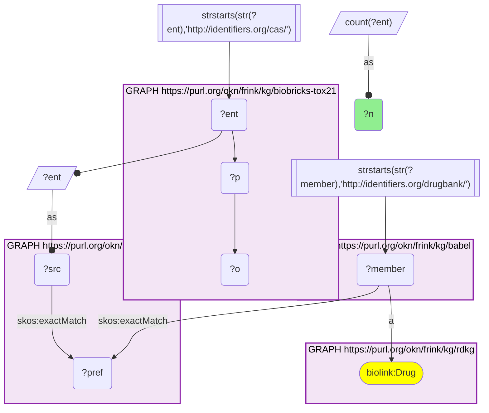
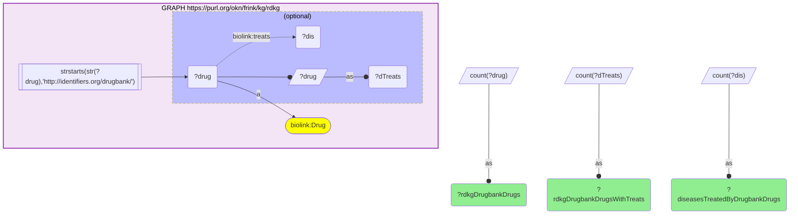
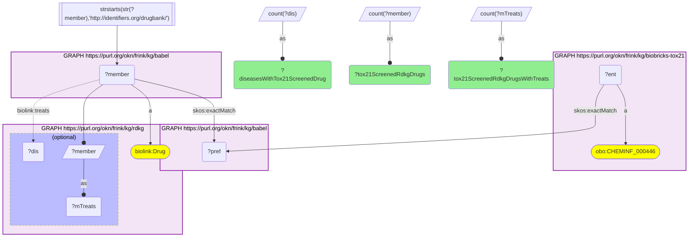
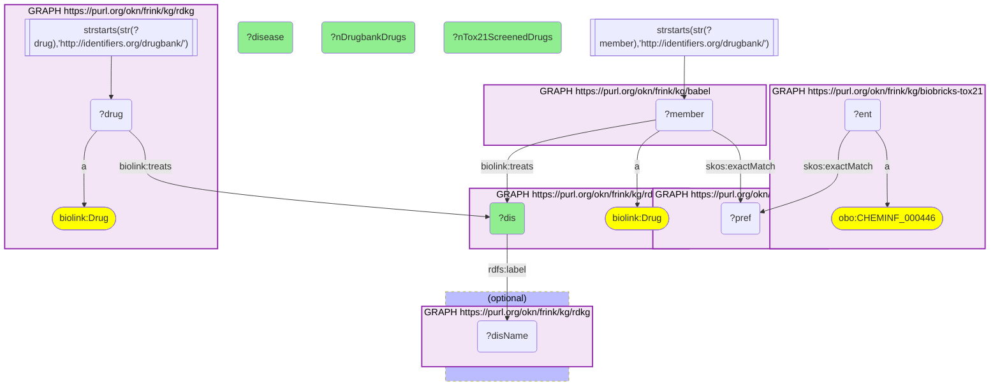

```mermaid
graph TD
classDef projected fill:lightgreen;
classDef literal fill:orange;
classDef iri fill:yellow;
  q3v2("?atLeastHalfScreened"):::projected 
  q3v12("?dis")
  q3v4("?diseases"):::projected 
  q3v13("?drug")
  q3v15("?ent")
  q3v1("?fullyScreened"):::projected 
  q3v14("?member")
  q3v11("?nAll")
  q3v9("?nT")
  q3v10("?nT0")
  q3v3("?noScreenedDrug"):::projected 
  q3v16("?pref")
  subgraph q3graph0["GRAPH https://purl.org/okn/frink/kg/rdkg"]
    style q3graph0 fill:#f3e5f5,stroke:#8e24aa,stroke-width:2px,color:#000;
    q3graph0c2(["biolink:Drug"]):::iri 
    q3graph0f0[["strstarts(str(?drug),'http://identifiers.org/drugbank/')"]]
    q3graph0f0 --> q3v13
    q3v13 --"a"--> q3graph0c2
    q3v13 --"biolink:treats"--> q3v12
  end
  q3bind0[/"count(?member)"/]
  q3bind0 --as--o q3v11
  subgraph q3optional0["(optional)"]
  style q3optional0 fill:#bbf,stroke-dasharray: 5 5,color:#000;
    q3f1[["strstarts(str(?member),'http://identifiers.org/drugbank/')"]]
    q3f1 --> q3v14
    subgraph q3graph1["GRAPH https://purl.org/okn/frink/kg/biobricks-tox21"]
      style q3graph1 fill:#f3e5f5,stroke:#8e24aa,stroke-width:2px,color:#000;
      q3graph1c2(["obo:CHEMINF_000446"]):::iri 
      q3v15 --"a"--> q3graph1c2
    end
    subgraph q3graph2["GRAPH https://purl.org/okn/frink/kg/babel"]
      style q3graph2 fill:#f3e5f5,stroke:#8e24aa,stroke-width:2px,color:#000;
      q3v15 --"skos:exactMatch"--> q3v16
    end
    subgraph q3graph3["GRAPH https://purl.org/okn/frink/kg/babel"]
      style q3graph3 fill:#f3e5f5,stroke:#8e24aa,stroke-width:2px,color:#000;
      q3v14 --"skos:exactMatch"--> q3v16
    end
    subgraph q3graph4["GRAPH https://purl.org/okn/frink/kg/rdkg"]
      style q3graph4 fill:#f3e5f5,stroke:#8e24aa,stroke-width:2px,color:#000;
      q3graph4c2(["biolink:Drug"]):::iri 
      q3v14 --"a"--> q3graph4c2
      q3v14 --"biolink:treats"--> q3v12
    end
    q3bind1[/"count(?member)"/]
    q3bind1 --as--o q3v10
  end
  q3bind2[/"coalesce(?nT0,'0^^xsd:integer')"/]
  q3v10 --o q3bind2
  q3bind2 --as--o q3v9
  q3bind3[/"count(?member)"/]
  q3bind3 --as--o q3v4
  q3bind4[/"sum(if(?nT * '2^^xsd:integer' >= ?nAll,'1^^xsd:integer','0^^xsd:integer'))"/]
  q3bind4 --as--o q3v2
  q3bind5[/"sum(if(?nT = ?nAll,'1^^xsd:integer','0^^xsd:integer'))"/]
  q3bind5 --as--o q3v1
```

# How many RDKG DrugBank drugs are in the Tox21 library, and how much of RDKG's treated-disease space they cover (CAS → DrugBank via Babel)

- **Date:** 2026-09-26
- **Model:** claude-opus-5-5
- **External MCP servers:** PubMed
- **SPARQL endpoint:** https://apps.okn.us/federation/sparql
- **Generated by:** mcp-okn v0.1.0 (build 7d8000e)
- **Contents:** 5 queries · 5 query diagrams

## Knowledge graphs used

- `biobricks-tox21` — <https://purl.org/okn/frink/kg/biobricks-tox21>
- `babel` — <https://purl.org/okn/frink/kg/babel>
- `rdkg` — <https://purl.org/okn/frink/kg/rdkg>

## Conversation

👤 **User**

Crosswalk: `biobricks-tox21` × `rdkg` on **CAS → DrugBank, bridged through `babel`** (crosswalk `DB3-cas-tox21-rdkg-via-babel`, verified_count 920). biobricks-tox21 keys each Tox21 library chemical on its CAS Registry Number, and the chemical node IS its CAS IRI (`http://identifiers.org/cas/{cas}`, typed `obo:CHEMINF_000446`); rdkg keys its drugs on DrugBank IRIs (`http://identifiers.org/drugbank/DB{n}`, `biolink:Drug`) and carries no CAS. babel (the Translator Babel identifier cliques) links them: the CAS IRI `skos:exactMatch`es its clique's preferred id, and the same clique holds the DrugBank member, already in rdkg's IRI form, so neither side needs a rewrite. Both babel hops must be staged in nested `SELECT DISTINCT` subqueries, with the DrugBank scheme filter outside them, or the join times out.

Research question: Of RDKG's DrugBank drugs, how many are in the Tox21 screening library (DrugBank ← CAS via Babel), and how much of the disease space that RDKG's drugs treat do those Tox21-screened drugs cover?

Why the join is required: biobricks-tox21 defines *the Tox21 10K toxicology screening library* by CAS number but knows nothing about indications. RDKG knows *which diseases each DrugBank drug treats* (`biolink:treats`) but has no CAS numbers and no notion of the Tox21 library. Only the babel bridge can mark which RDKG drugs, and so which RDKG diseases, have Tox21 in-vitro toxicology data behind them.

---

🧠 **Assistant**

**Drug coverage.** RDKG holds **2,074 DrugBank drugs**; 1,946 of them carry a `biolink:treats` edge, reaching **3,631 distinct diseases**. Through babel, **920 Tox21 chemicals** map onto **921 RDKG drugs**, 44.4% of RDKG's DrugBank drugs; the crosswalk skeleton reproduces its verified 920 exactly. **858** of those drugs have treats edges, 44.1% of RDKG's treating DrugBank drugs.

**Disease coverage.** Although fewer than half of the drugs are Tox21-screened, they reach most of the disease space:

| Diseases treated by RDKG DrugBank drugs | Count | Share |
| --- | --- | --- |
| All | 3,631 | 100% |
| with at least one Tox21-screened drug | 2,817 | 77.6% |
| with at least half of their drugs Tox21-screened | 2,214 | 61.0% |
| with every one of their drugs Tox21-screened | 931 | 25.6% |
| with no Tox21-screened drug | 814 | 22.4% |

**Diseases with the most Tox21-screened treatments** (share = Tox21-screened drugs ÷ all RDKG DrugBank drugs for that disease):

| RDKG disease | Tox21-screened drugs | All DrugBank drugs | Share |
| --- | --- | --- | --- |
| hypertension (grouped node) | 66 | 109 | 60.6% |
| hypertensive disorder (MONDO_0005044) | 64 | 105 | 61.0% |
| vasomotor rhinitis | 44 | 88 | 50.0% |
| allergic rhinitis (grouped node) | 44 | 87 | 50.6% |
| rheumatoid arthritis | 43 | 72 | 59.7% |
| arthropathy | 40 | 66 | 60.6% |
| seborrheic keratosis | 32 | 40 | 80.0% |
| atopic eczema | 31 | 38 | 81.6% |
| primary cutaneous T-cell lymphoma | 31 | 40 | 77.5% |
| intrinsic asthma | 30 | 47 | 63.8% |
| allergic asthma | 30 | 48 | 62.5% |

**Why it answers the question.** Only the join can tell which RDKG drugs have Tox21 data, and the answer is lopsided in a useful way. 44% of the drugs cover 78% of the diseases, because the Tox21-screened drugs are disproportionately the widely used, many-indication agents. For about a quarter of RDKG's diseases (931), every DrugBank treatment RDKG lists is in the Tox21 library. For another 814, none is: those diseases' treatments have no Tox21 in-vitro profile to draw on. The most-covered diseases are not rare. Hypertension, rhinitis, arthritis, eczema and asthma top the list, a reminder that RDKG's `biolink:treats` edges extend well beyond rare disease. The best-covered of them reach 78–82% Tox21 coverage: seborrheic keratosis, atopic eczema, and primary cutaneous T-cell lymphoma.

**Caveats.** (1) The federation's biobricks-tox21 graph holds only library membership (CAS, name), with **no assay activity calls**. "Tox21-screened" means the drug is in the library, not that it was active. (2) RDKG's `biolink:treats` is not rare-disease-specific, and its disease nodes overlap. The same condition can appear as a MONDO term and as an rdaccelerate `MONDO_GROUPED_*` node, as hypertension does here. Disease counts are therefore counts of RDKG disease nodes, not of distinct clinical entities. (3) "Every drug screened" includes diseases with only one or two RDKG drugs, so it is easy to satisfy for thinly treated diseases. (4) Only RDKG's DrugBank-keyed drugs can be bridged. Its other `biolink:Drug` nodes, the clinical-trial drug-name nodes, carry no external id. (5) Counts are DISTINCT RDKG drugs, Tox21 chemicals and disease nodes, never babel cliques. One Tox21 chemical can reach more than one DrugBank id, which is why 920 chemicals map to 921 drugs.

## Literature validation

The identifier join is **validated by construction**. CAS Registry Numbers and DrugBank ids are registered, exact-string identifiers, and babel asserts their equivalence through a shared clique; no name matching is used. The hand-verified crosswalk `DB3-cas-tox21-rdkg-via-babel` (verified_count 920) reproduces live.

Claim checked against PubMed:

- **The Tox21 10K library contains drugs as well as environmental chemicals**, which is why nearly half of RDKG's DrugBank drugs can be found in it: the U.S. Tox21 program screened "approximately 10,000 (10K) environmental chemicals and drugs" (PMID 25012808, [DOI](https://doi.org/10.1038/srep05664)).

This answer makes no drug–disease efficacy claims of its own. The drug–disease edges are RDKG's, reported as counts. No explanation of why particular diseases (e.g. atopic eczema) are highly covered was checked, so none is offered.

Sources retrieved from PubMed.

**Validated.** The join uses shared registered identifiers bridged by babel, and every count ran live against the three graphs. The one external claim, the composition of the Tox21 library, is backed by literature.

## SPARQL queries executed

#### Query 1

_2026-09-27T00:32:22+00:00 · `biobricks-tox21`, `babel`, `rdkg`_

```sparql
SELECT (COUNT(DISTINCT ?ent) AS ?n) WHERE {
  { SELECT DISTINCT ?ent ?member WHERE {
    { SELECT DISTINCT ?ent ?pref WHERE {
        { SELECT DISTINCT ?ent ?src WHERE { GRAPH <https://purl.org/okn/frink/kg/biobricks-tox21> { ?ent ?p ?o } FILTER(STRSTARTS(STR(?ent),'http://identifiers.org/cas/')) BIND(?ent AS ?src) } }
        GRAPH <https://purl.org/okn/frink/kg/babel> { ?src <http://www.w3.org/2004/02/skos/core#exactMatch> ?pref } } }
    GRAPH <https://purl.org/okn/frink/kg/babel> { ?member <http://www.w3.org/2004/02/skos/core#exactMatch> ?pref } } }
  FILTER(STRSTARTS(STR(?member),'http://identifiers.org/drugbank/'))
  GRAPH <https://purl.org/okn/frink/kg/rdkg> { ?member a <https://w3id.org/biolink/vocab/Drug> }
}
```



_1 row(s)_

| n |
| --- |
| 920 |

#### Query 2

_2026-09-27T00:32:43+00:00 · `rdkg`_

```sparql
PREFIX biolink: <https://w3id.org/biolink/vocab/>
SELECT (COUNT(DISTINCT ?drug) AS ?rdkgDrugbankDrugs) (COUNT(DISTINCT ?dTreats) AS ?rdkgDrugbankDrugsWithTreats) (COUNT(DISTINCT ?dis) AS ?diseasesTreatedByDrugbankDrugs) WHERE {
  GRAPH <https://purl.org/okn/frink/kg/rdkg> { ?drug a biolink:Drug FILTER(STRSTARTS(STR(?drug),'http://identifiers.org/drugbank/'))
    OPTIONAL { ?drug biolink:treats ?dis BIND(?drug AS ?dTreats) } }
}
```



_1 row(s)_

| rdkgDrugbankDrugs | rdkgDrugbankDrugsWithTreats | diseasesTreatedByDrugbankDrugs |
| --- | --- | --- |
| 2074 | 1946 | 3631 |

#### Query 3

_2026-09-27T00:32:43+00:00 · `biobricks-tox21`, `babel`, `rdkg`_

```sparql
PREFIX biolink: <https://w3id.org/biolink/vocab/>
PREFIX skos: <http://www.w3.org/2004/02/skos/core#>
SELECT (COUNT(DISTINCT ?member) AS ?tox21ScreenedRdkgDrugs) (COUNT(DISTINCT ?mTreats) AS ?tox21ScreenedRdkgDrugsWithTreats) (COUNT(DISTINCT ?dis) AS ?diseasesWithTox21ScreenedDrug) WHERE {
  { SELECT DISTINCT ?member WHERE {
    { SELECT DISTINCT ?ent ?member WHERE {
      { SELECT DISTINCT ?ent ?pref WHERE {
          { SELECT DISTINCT ?ent WHERE { GRAPH <https://purl.org/okn/frink/kg/biobricks-tox21> { ?ent a <http://purl.obolibrary.org/obo/CHEMINF_000446> } } }
          GRAPH <https://purl.org/okn/frink/kg/babel> { ?ent skos:exactMatch ?pref } } }
      GRAPH <https://purl.org/okn/frink/kg/babel> { ?member skos:exactMatch ?pref } } }
    FILTER(STRSTARTS(STR(?member),'http://identifiers.org/drugbank/')) } }
  GRAPH <https://purl.org/okn/frink/kg/rdkg> { ?member a biolink:Drug OPTIONAL { ?member biolink:treats ?dis BIND(?member AS ?mTreats) } }
}
```



_1 row(s)_

| tox21ScreenedRdkgDrugs | tox21ScreenedRdkgDrugsWithTreats | diseasesWithTox21ScreenedDrug |
| --- | --- | --- |
| 921 | 858 | 2817 |

#### Query 4

_2026-09-27T00:32:43+00:00 · `rdkg`, `biobricks-tox21`, `babel`_

```sparql
PREFIX biolink: <https://w3id.org/biolink/vocab/>
PREFIX skos: <http://www.w3.org/2004/02/skos/core#>
SELECT (COUNT(?dis) AS ?diseases) (SUM(IF(?nT = 0, 1, 0)) AS ?noScreenedDrug) (SUM(IF(?nT * 2 >= ?nAll, 1, 0)) AS ?atLeastHalfScreened) (SUM(IF(?nT = ?nAll, 1, 0)) AS ?fullyScreened) WHERE {
  { SELECT ?dis (COUNT(DISTINCT ?drug) AS ?nAll) WHERE {
    GRAPH <https://purl.org/okn/frink/kg/rdkg> { ?drug a biolink:Drug ; biolink:treats ?dis FILTER(STRSTARTS(STR(?drug),'http://identifiers.org/drugbank/')) } } GROUP BY ?dis }
  OPTIONAL { { SELECT ?dis (COUNT(DISTINCT ?member) AS ?nT0) WHERE {
    { SELECT DISTINCT ?member WHERE {
      { SELECT DISTINCT ?ent ?member WHERE {
        { SELECT DISTINCT ?ent ?pref WHERE {
            { SELECT DISTINCT ?ent WHERE { GRAPH <https://purl.org/okn/frink/kg/biobricks-tox21> { ?ent a <http://purl.obolibrary.org/obo/CHEMINF_000446> } } }
            GRAPH <https://purl.org/okn/frink/kg/babel> { ?ent skos:exactMatch ?pref } } }
        GRAPH <https://purl.org/okn/frink/kg/babel> { ?member skos:exactMatch ?pref } } }
      FILTER(STRSTARTS(STR(?member),'http://identifiers.org/drugbank/')) } }
    GRAPH <https://purl.org/okn/frink/kg/rdkg> { ?member a biolink:Drug ; biolink:treats ?dis }
  } GROUP BY ?dis } }
  BIND(COALESCE(?nT0, 0) AS ?nT)
}
```



_1 row(s)_

| diseases | noScreenedDrug | atLeastHalfScreened | fullyScreened |
| --- | --- | --- | --- |
| 3631 | 814 | 2214 | 931 |

#### Query 5

_2026-09-27T00:32:45+00:00 · `biobricks-tox21`, `babel`, `rdkg`_

```sparql
PREFIX biolink: <https://w3id.org/biolink/vocab/>
PREFIX rdfs: <http://www.w3.org/2000/01/rdf-schema#>
PREFIX skos: <http://www.w3.org/2004/02/skos/core#>
SELECT ?dis (SAMPLE(?disName) AS ?disease) ?nTox21ScreenedDrugs ?nDrugbankDrugs WHERE {
  { SELECT ?dis (COUNT(DISTINCT ?member) AS ?nTox21ScreenedDrugs) WHERE {
    { SELECT DISTINCT ?member WHERE {
      { SELECT DISTINCT ?ent ?member WHERE {
        { SELECT DISTINCT ?ent ?pref WHERE {
            { SELECT DISTINCT ?ent WHERE { GRAPH <https://purl.org/okn/frink/kg/biobricks-tox21> { ?ent a <http://purl.obolibrary.org/obo/CHEMINF_000446> } } }
            GRAPH <https://purl.org/okn/frink/kg/babel> { ?ent skos:exactMatch ?pref } } }
        GRAPH <https://purl.org/okn/frink/kg/babel> { ?member skos:exactMatch ?pref } } }
      FILTER(STRSTARTS(STR(?member),'http://identifiers.org/drugbank/')) } }
    GRAPH <https://purl.org/okn/frink/kg/rdkg> { ?member a biolink:Drug ; biolink:treats ?dis }
  } GROUP BY ?dis ORDER BY DESC(?nTox21ScreenedDrugs) LIMIT 11 }
  { SELECT ?dis (COUNT(DISTINCT ?drug) AS ?nDrugbankDrugs) WHERE {
    GRAPH <https://purl.org/okn/frink/kg/rdkg> { ?drug a biolink:Drug ; biolink:treats ?dis FILTER(STRSTARTS(STR(?drug),'http://identifiers.org/drugbank/')) } } GROUP BY ?dis }
  OPTIONAL { GRAPH <https://purl.org/okn/frink/kg/rdkg> { ?dis rdfs:label ?disName } }
} GROUP BY ?dis ?nTox21ScreenedDrugs ?nDrugbankDrugs ORDER BY DESC(?nTox21ScreenedDrugs)
```



_11 row(s) — showing first 5_

| dis | disease | nTox21ScreenedDrugs | nDrugbankDrugs |
| --- | --- | --- | --- |
| https://rdaccelerate.org/resource/MONDO_GROUPED_1200_1134_15512_5080_100078 | hypertension | 66 | 109 |
| http://purl.obolibrary.org/obo/MONDO_0005044 | hypertensive disorder | 64 | 105 |
| http://purl.obolibrary.org/obo/MONDO_0006004 | vasomotor rhinitis | 44 | 88 |
| https://rdaccelerate.org/resource/MONDO_GROUPED_11786_5324_24332 | allergic rhinitis | 44 | 87 |
| http://purl.obolibrary.org/obo/MONDO_0008383 | rheumatoid arthritis | 43 | 72 |
