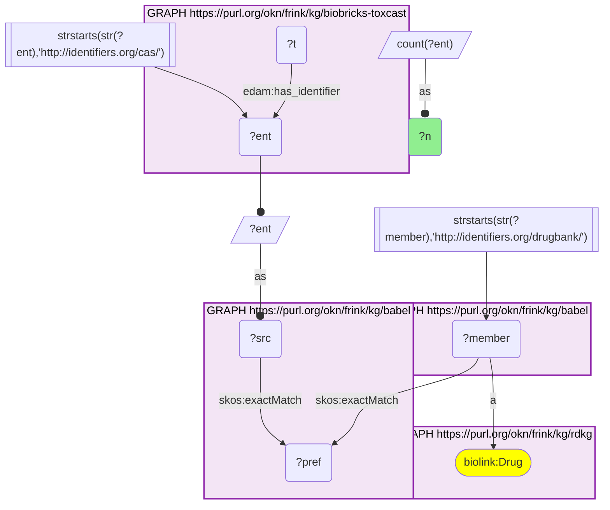
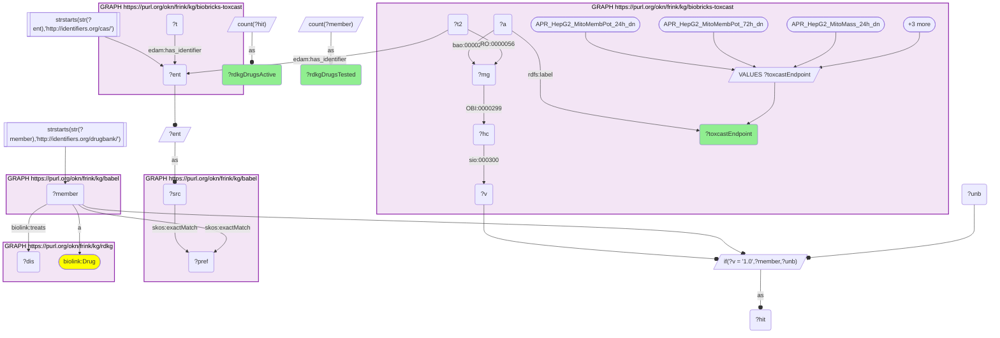
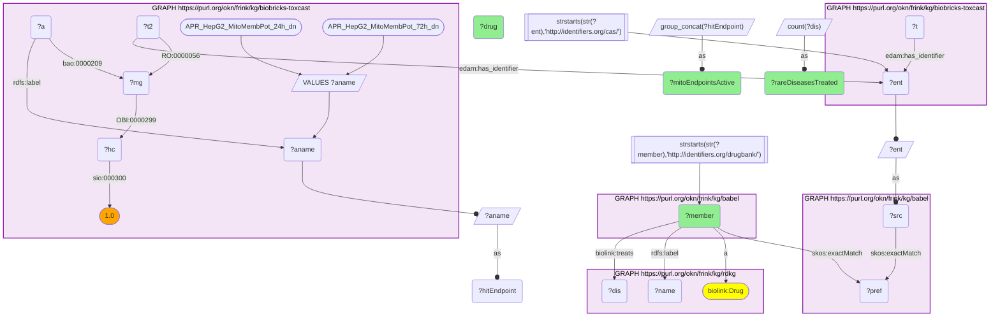
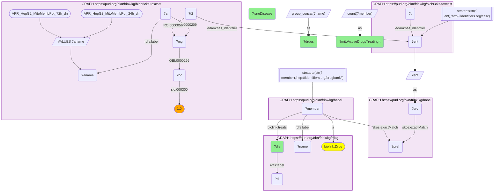

# One ToxCast endpoint family, one rare-disease pharmacopeia: HepG2 mitochondrial membrane potential hits among RDKG drugs, bridged through Babel (CAS → DrugBank)

- **Date:** 2026-09-26
- **Model:** claude-opus-5-5
- **External MCP servers:** PubMed
- **SPARQL endpoint:** https://apps.okn.us/federation/sparql
- **Generated by:** mcp-okn v0.1.0 (build 7d8000e)
- **Contents:** 6 queries · 6 query diagrams

## Knowledge graphs used

- `biobricks-toxcast` — <https://purl.org/okn/frink/kg/biobricks-toxcast>
- `babel` — <https://purl.org/okn/frink/kg/babel>
- `rdkg` — <https://purl.org/okn/frink/kg/rdkg>

## Conversation

👤 **User**

Crosswalk: `biobricks-toxcast` × `rdkg` on **CAS → DrugBank, bridged through `babel`** (crosswalk `DB4-cas-toxcast-rdkg-via-babel`, verified_count 928). ToxCast keys every chemical on a CAS IRI hung off its `Chemical_Entity` node by `edam:has_identifier` (`http://identifiers.org/cas/{cas}`); RDKG keys its drugs on DrugBank IRIs (`http://identifiers.org/drugbank/DB{n}`, typed `biolink:Drug`). Both sit in babel's identifiers.org form already, so neither side needs an IRI rewrite. RDKG carries no CAS and ToxCast carries no DrugBank id: babel is the only link, via a clique whose preferred id both the CAS IRI and the DrugBank IRI `skos:exactMatch`. Both hops must be staged in nested `SELECT DISTINCT` subqueries with the scheme FILTER outside them, or the join times out.

Research question: For one ToxCast endpoint family — the HepG2 high-content mitochondrial readouts — which active chemicals are RDKG rare-disease drugs, which rare diseases do they treat, and is the mitochondrial signal separable from plain cytotoxicity?

Why the join is required: ToxCast records the hitcall for `APR_HepG2_MitoMembPot_24h_dn` and its siblings against a CAS-keyed chemical and stops there — it has no idea whether that chemical is a medicine or what it is used for. RDKG knows the drug and the rare diseases it treats (`biolink:treats` → MONDO) but holds no assay data. Only across the babel bridge can an endpoint's active list be read as a list of therapies with indications attached.

---

🧠 **Assistant**

The babel bridge joins **928 ToxCast chemicals to RDKG DrugBank drugs** (the skeleton reproduces the verified count exactly). Of these, **91 rare-disease drugs were run through the APR HepG2 high-content panel**, and **20 of them depolarise the mitochondrial membrane** in at least one of the two `MitoMembPot_dn` endpoints.

## The endpoint family, censused

| ToxCast endpoint | RDKG rare-disease drugs tested | active |
| --- | --- | --- |
| APR_HepG2_CellLoss_72h_dn | 91 | 36 |
| APR_HepG2_CellLoss_24h_dn | 91 | 27 |
| APR_HepG2_MitoMass_24h_dn | 91 | 17 |
| APR_HepG2_MitoMembPot_24h_dn | 91 | 13 |
| APR_HepG2_MitoMass_72h_dn | 90 | 12 |
| APR_HepG2_MitoMembPot_72h_dn | 90 | 11 |

## Who is active, and what do they treat?

Every RDKG rare-disease drug active in either mitochondrial-membrane-potential endpoint:

| RDKG drug | DrugBank | Mito-membrane-potential endpoints hit | Rare diseases treated |
| --- | --- | --- | --- |
| Tamoxifen | DB00675 | 24h | 43 |
| Simvastatin | DB00641 | 24h | 31 |
| Spironolactone | DB00421 | 24h + 72h | 25 |
| Fulvestrant | DB00947 | 72h | 19 |
| Lovastatin | DB00227 | 24h | 18 |
| Tretinoin | DB00755 | 24h | 17 |
| Clotrimazole | DB00257 | 72h | 12 |
| Haloperidol | DB00502 | 72h | 11 |
| Testosterone propionate | DB01420 | 72h | 8 |
| Reserpine | DB00206 | 24h + 72h | 7 |
| Stanolone | DB02901 | 24h | 7 |
| Permethrin | DB04930 | 24h | 6 |
| Troglitazone | DB00197 | 24h + 72h | 3 |
| Acetic acid | DB03166 | 72h | 3 |
| Anthralin | DB11157 | 24h + 72h | 3 |
| Clofibrate | DB00636 | 24h | 2 |
| Tetramethrin | DB13752 | 72h | 2 |
| Disulfiram | DB00822 | 72h | 1 |
| Nilutamide | DB00665 | 24h | 1 |
| Quercetin | DB04216 | 24h | 1 |

No single rare disease is served by more than two of these drugs, but several are served by exactly two — i.e. two of that disease's RDKG treatment options are mitochondrially active in this assay:

| Rare disease (MONDO) | Mito-active RDKG drugs treating it |
| --- | --- |
| schizoaffective disorder | Reserpine; Haloperidol |
| hormone-resistant breast carcinoma | Fulvestrant; Tamoxifen |
| hypoalphalipoproteinemia | Simvastatin; Lovastatin |
| hypertension | Reserpine; Spironolactone |
| Pediculus humanus capitis infestation | Tetramethrin; Permethrin |
| estrogen-receptor negative breast cancer | Tamoxifen; Fulvestrant |
| cerebral infarction | Lovastatin; Simvastatin |
| hyperlipidemia | Clofibrate; Lovastatin |
| arteriosclerosis disorder | Simvastatin; Lovastatin |
| hypertensive disorder | Spironolactone; Reserpine |
| mental disorder | Reserpine; Haloperidol |

## Is the mitochondrial signal separable from cytotoxicity?

Mostly not — and this is the result that keeps the table above honest:

| Mito-membrane-potential active | Cell-loss active | RDKG rare-disease drugs |
| --- | --- | --- |
| yes | yes | 18 |
| yes | no | **2** |
| no | yes | 19 |
| no | no | 52 |

The two drugs that depolarise mitochondria **without** triggering the cell-loss endpoint in the same panel are:

| RDKG drug | DrugBank | Rare diseases treated |
| --- | --- | --- |
| Fulvestrant | DB00947 | 19 |
| Anthralin | DB11157 | 3 |

**Why it answers the question.** The endpoint's active list is a list of CAS numbers in ToxCast and nothing more; across the bridge it becomes 20 named medicines with indications attached, and the rare diseases those medicines serve become visible — breast cancer (tamoxifen, fulvestrant), the lipid disorders (simvastatin, lovastatin, clofibrate), hypertension (spironolactone, reserpine), psychiatric disease (haloperidol, reserpine), psoriasis (anthralin). RDKG alone cannot say which of its drugs are mitochondrially active; ToxCast alone cannot say that any of them are drugs.

The cross-tabulation is the substantive finding. Of the 20 mito-active drugs, **18 also hit the cell-loss endpoint in the same panel**, so for those 18 the loss of membrane potential cannot be separated from general cytotoxicity in this dataset — it may be a cause of the cell death, a consequence of it, or an artefact of a dying well. Only **two drugs, fulvestrant and anthralin, show the mitochondrial readout without the cell-loss readout**, which makes them the only two candidates here for a mitochondria-specific effect at the tested concentrations. Anthralin is a striking hit: it is independently documented to accumulate in keratinocyte mitochondria and dissipate the mitochondrial membrane potential (see literature validation), so the one drug in this set with the cleanest mitochondria-specific profile is the one whose published mechanism is exactly that.

**What this is not.** It is not a safety signal for any listed drug. These are in-vitro HepG2 readouts at screening concentrations, and several of the mito-active drugs (statins, tretinoin) have well-documented mitochondrial pharmacology that is managed clinically rather than disqualifying.

**Caveats.** (a) Coverage is the binding constraint: only 91 of the 928 bridged RDKG rare-disease drugs went through the APR HepG2 panel at all, so absence from the active list usually means untested, not negative. (b) The two `MitoMembPot_dn` endpoints are separate 24-hour and 72-hour readouts; the table reports which of the two a drug hit, and a drug counted at 72h may simply not have been run at 24h. (c) `MitoMass_dn` and `CellLoss_dn` are shown for context; the active list is built only on the membrane-potential endpoints. (d) The cross-tab collapses both timepoints of each readout with MAX, so "cell-loss active" means active at 24h or 72h. (e) Disease labels are RDKG's MONDO labels; a few are RDKG's own grouped nodes (`rdaccelerate.org/resource/MONDO_GROUPED_...`), and one row in the RDKG data is a term marked obsolete upstream — the grouped and obsolete nodes are RDKG's modelling, not ours. (f) "Rare diseases treated" counts DISTINCT `biolink:treats` objects. (g) babel can place one id in two cliques, so every count is of DISTINCT chemicals, drugs, endpoints or diseases, never cliques.

## Literature validation

The identifier join is **validated by construction**. CAS and DrugBank are registered, exact-string identifiers and babel asserts their equivalence through a shared clique; no name matching is used. The hand-verified crosswalk `DB4-cas-toxcast-rdkg-via-babel` (verified_count 928) reproduced live in the first logged query.

The assay and mechanism claims were checked against PubMed:

- **What the endpoint family measures.** Multiparametric high-content assays in HepG2 cells are an established model for drug-induced liver injury, covering cell count, mitochondrial membrane potential and structure, nuclear morphology, vacuolar density, ROS and glutathione (PMID 33315311, [DOI](https://doi.org/10.1002/cpch.90)). This is the basis for reading `MitoMembPot`, `MitoMass` and `CellLoss` as one panel of cell-health markers in which the cytotoxicity control must be read alongside the mechanistic readout.
- **Anthralin is a genuine mitochondrial agent.** Anthralin accumulates in keratinocyte mitochondria, dissipates the mitochondrial membrane potential, releases cytochrome c and induces apoptosis through a pathway that requires a functional respiratory chain, interacting with the ubiquinone pool; 143B rho-zero cells lacking mitochondrial DNA are resistant (PMID 15802490, [DOI](https://doi.org/10.1096/fj.04-2664fje)). This independently corroborates the single cleanest mitochondria-specific hit in the table.
- **Statins impair mitochondrial respiration.** In muscle from statin-treated patients, mitochondrial respiration is impaired, chiefly at complex I of the respiratory chain, alongside altered calcium signalling; the same authors previously showed acute simvastatin impairs mitochondrial function in vitro (PMID 22269104, [DOI](https://doi.org/10.1016/j.taap.2012.01.008)). Consistent with simvastatin and lovastatin both appearing as mito-active here.
- **Tretinoin (all-trans retinoic acid) affects liver mitochondrial bioenergetics.** Above 10 nmol/mg protein, retinoic acid depresses mitochondrial phosphorylation capacity, and at 20 nmol/mg it decreases the membrane potential and increases state-4 respiration, consistent with proton permeabilisation; the authors link RA hepatotoxicity to induction of the mitochondrial permeability transition (PMID 23764110, [DOI](https://doi.org/10.1016/j.lfs.2013.05.027)).
- **Fulvestrant is a selective estrogen receptor degrader** (PMID 42657161, [DOI](https://doi.org/10.3389/fonc.2026.1855542)). Its mitochondria-without-cytotoxicity profile here is reported as an observation; **no literature was found linking fulvestrant to a direct mitochondrial mechanism**, so that pairing is explicitly not claimed.
- Not verified: the mitochondrial hits for tamoxifen, spironolactone, haloperidol, reserpine, clotrimazole and the remaining drugs were not individually checked against the literature and are reported as ToxCast hitcalls only.

Sources retrieved from PubMed.

**Validated.** The join runs on shared registered identifiers bridged by babel, every number came from a query that ran live against both graphs, and the one drug whose profile most clearly implies a mitochondria-specific mechanism (anthralin) is independently documented to dissipate the mitochondrial membrane potential — while the 18 drugs whose mitochondrial signal is confounded by cytotoxicity are flagged as such rather than presented as mitochondrial toxicants.

## SPARQL queries executed

#### Query 1

_2026-09-27T00:37:12+00:00 · `biobricks-toxcast`, `babel`, `rdkg`_

```sparql
SELECT (COUNT(DISTINCT ?ent) AS ?n) WHERE {
  { SELECT DISTINCT ?ent ?member WHERE {
    { SELECT DISTINCT ?ent ?pref WHERE {
        { SELECT DISTINCT ?ent ?src WHERE { GRAPH <https://purl.org/okn/frink/kg/biobricks-toxcast> { ?t <http://edamontology.org/has_identifier> ?ent } FILTER(STRSTARTS(STR(?ent),'http://identifiers.org/cas/')) BIND(?ent AS ?src) } }
        GRAPH <https://purl.org/okn/frink/kg/babel> { ?src <http://www.w3.org/2004/02/skos/core#exactMatch> ?pref } } }
    GRAPH <https://purl.org/okn/frink/kg/babel> { ?member <http://www.w3.org/2004/02/skos/core#exactMatch> ?pref } } }
  FILTER(STRSTARTS(STR(?member),'http://identifiers.org/drugbank/'))
  GRAPH <https://purl.org/okn/frink/kg/rdkg> { ?member a <https://w3id.org/biolink/vocab/Drug> }
}
```



_1 row(s)_

| n |
| --- |
| 928 |

#### Query 2

_2026-09-27T00:37:23+00:00 · `biobricks-toxcast`, `babel`, `rdkg`_

```sparql
PREFIX skos: <http://www.w3.org/2004/02/skos/core#>
PREFIX rdfs: <http://www.w3.org/2000/01/rdf-schema#>
PREFIX biolink: <https://w3id.org/biolink/vocab/>
SELECT ?toxcastEndpoint (COUNT(DISTINCT ?member) AS ?rdkgDrugsTested) (COUNT(DISTINCT ?hit) AS ?rdkgDrugsActive) WHERE {
  { SELECT DISTINCT ?ent ?member WHERE {
    { SELECT DISTINCT ?ent ?pref WHERE {
        { SELECT DISTINCT ?ent ?src WHERE { GRAPH <https://purl.org/okn/frink/kg/biobricks-toxcast> { ?t <http://edamontology.org/has_identifier> ?ent } FILTER(STRSTARTS(STR(?ent),'http://identifiers.org/cas/')) BIND(?ent AS ?src) } }
        GRAPH <https://purl.org/okn/frink/kg/babel> { ?src skos:exactMatch ?pref } } }
    GRAPH <https://purl.org/okn/frink/kg/babel> { ?member skos:exactMatch ?pref } } }
  FILTER(STRSTARTS(STR(?member),'http://identifiers.org/drugbank/'))
  GRAPH <https://purl.org/okn/frink/kg/rdkg> { ?member a biolink:Drug ; biolink:treats ?dis }
  GRAPH <https://purl.org/okn/frink/kg/biobricks-toxcast> {
    ?t2 <http://edamontology.org/has_identifier> ?ent ; <http://purl.obolibrary.org/obo/RO_0000056> ?mg .
    ?a <http://www.bioassayontology.org/bao#BAO_0000209> ?mg ; rdfs:label ?toxcastEndpoint .
    VALUES ?toxcastEndpoint { "APR_HepG2_MitoMembPot_24h_dn" "APR_HepG2_MitoMembPot_72h_dn" "APR_HepG2_MitoMass_24h_dn" "APR_HepG2_MitoMass_72h_dn" "APR_HepG2_CellLoss_24h_dn" "APR_HepG2_CellLoss_72h_dn" }
    ?mg <http://purl.obolibrary.org/obo/OBI_0000299> ?hc . ?hc <http://semanticscience.org/resource/SIO_000300> ?v }
  BIND(IF(?v = "1.0", ?member, ?unb) AS ?hit)
} GROUP BY ?toxcastEndpoint ORDER BY DESC(?rdkgDrugsActive)
```



_6 row(s) — showing first 3_

| toxcastEndpoint | rdkgDrugsTested | rdkgDrugsActive |
| --- | --- | --- |
| APR_HepG2_CellLoss_72h_dn | 91 | 36 |
| APR_HepG2_CellLoss_24h_dn | 91 | 27 |
| APR_HepG2_MitoMass_24h_dn | 91 | 17 |

#### Query 3

_2026-09-27T00:37:34+00:00 · `biobricks-toxcast`, `babel`, `rdkg`_

```sparql
PREFIX skos: <http://www.w3.org/2004/02/skos/core#>
PREFIX rdfs: <http://www.w3.org/2000/01/rdf-schema#>
PREFIX biolink: <https://w3id.org/biolink/vocab/>
SELECT ?member (SAMPLE(?name) AS ?drug) (GROUP_CONCAT(DISTINCT ?hitEndpoint; separator="; ") AS ?mitoEndpointsActive)
       (COUNT(DISTINCT ?dis) AS ?rareDiseasesTreated) WHERE {
  { SELECT DISTINCT ?ent ?member WHERE {
    { SELECT DISTINCT ?ent ?pref WHERE {
        { SELECT DISTINCT ?ent ?src WHERE { GRAPH <https://purl.org/okn/frink/kg/biobricks-toxcast> { ?t <http://edamontology.org/has_identifier> ?ent } FILTER(STRSTARTS(STR(?ent),'http://identifiers.org/cas/')) BIND(?ent AS ?src) } }
        GRAPH <https://purl.org/okn/frink/kg/babel> { ?src skos:exactMatch ?pref } } }
    GRAPH <https://purl.org/okn/frink/kg/babel> { ?member skos:exactMatch ?pref } } }
  FILTER(STRSTARTS(STR(?member),'http://identifiers.org/drugbank/'))
  GRAPH <https://purl.org/okn/frink/kg/rdkg> { ?member a biolink:Drug ; rdfs:label ?name ; biolink:treats ?dis }
  GRAPH <https://purl.org/okn/frink/kg/biobricks-toxcast> {
    ?t2 <http://edamontology.org/has_identifier> ?ent ; <http://purl.obolibrary.org/obo/RO_0000056> ?mg .
    ?a <http://www.bioassayontology.org/bao#BAO_0000209> ?mg ; rdfs:label ?aname .
    VALUES ?aname { "APR_HepG2_MitoMembPot_24h_dn" "APR_HepG2_MitoMembPot_72h_dn" }
    ?mg <http://purl.obolibrary.org/obo/OBI_0000299> ?hc . ?hc <http://semanticscience.org/resource/SIO_000300> "1.0" }
  BIND(?aname AS ?hitEndpoint)
} GROUP BY ?member ORDER BY DESC(?rareDiseasesTreated)
```



_20 row(s) — showing first 3_

| member | drug | mitoEndpointsActive | rareDiseasesTreated |
| --- | --- | --- | --- |
| http://identifiers.org/drugbank/DB00675 | Tamoxifen | APR_HepG2_MitoMembPot_24h_dn | 43 |
| http://identifiers.org/drugbank/DB00641 | Simvastatin | APR_HepG2_MitoMembPot_24h_dn | 31 |
| http://identifiers.org/drugbank/DB00421 | Spironolactone | APR_HepG2_MitoMembPot_24h_dn; APR_HepG2_MitoMembPot_72h_dn | 25 |

#### Query 4

_2026-09-27T00:37:45+00:00 · `biobricks-toxcast`, `babel`, `rdkg`_

```sparql
PREFIX skos: <http://www.w3.org/2004/02/skos/core#>
PREFIX rdfs: <http://www.w3.org/2000/01/rdf-schema#>
PREFIX biolink: <https://w3id.org/biolink/vocab/>
SELECT ?dis (SAMPLE(?dl) AS ?rareDisease) (COUNT(DISTINCT ?member) AS ?mitoActiveDrugsTreatingIt)
       (GROUP_CONCAT(DISTINCT ?name; separator="; ") AS ?drugs) WHERE {
  { SELECT DISTINCT ?ent ?member WHERE {
    { SELECT DISTINCT ?ent ?pref WHERE {
        { SELECT DISTINCT ?ent ?src WHERE { GRAPH <https://purl.org/okn/frink/kg/biobricks-toxcast> { ?t <http://edamontology.org/has_identifier> ?ent } FILTER(STRSTARTS(STR(?ent),'http://identifiers.org/cas/')) BIND(?ent AS ?src) } }
        GRAPH <https://purl.org/okn/frink/kg/babel> { ?src skos:exactMatch ?pref } } }
    GRAPH <https://purl.org/okn/frink/kg/babel> { ?member skos:exactMatch ?pref } } }
  FILTER(STRSTARTS(STR(?member),'http://identifiers.org/drugbank/'))
  GRAPH <https://purl.org/okn/frink/kg/rdkg> { ?member a biolink:Drug ; rdfs:label ?name ; biolink:treats ?dis . ?dis rdfs:label ?dl }
  GRAPH <https://purl.org/okn/frink/kg/biobricks-toxcast> {
    ?t2 <http://edamontology.org/has_identifier> ?ent ; <http://purl.obolibrary.org/obo/RO_0000056> ?mg .
    ?a <http://www.bioassayontology.org/bao#BAO_0000209> ?mg ; rdfs:label ?aname .
    VALUES ?aname { "APR_HepG2_MitoMembPot_24h_dn" "APR_HepG2_MitoMembPot_72h_dn" }
    ?mg <http://purl.obolibrary.org/obo/OBI_0000299> ?hc . ?hc <http://semanticscience.org/resource/SIO_000300> "1.0" }
} GROUP BY ?dis ORDER BY DESC(?mitoActiveDrugsTreatingIt) LIMIT 12
```



_12 row(s) — showing first 3_

| dis | rareDisease | mitoActiveDrugsTreatingIt | drugs |
| --- | --- | --- | --- |
| http://purl.obolibrary.org/obo/MONDO_0005487 | schizoaffective disorder | 2 | Reserpine; Haloperidol |
| http://purl.obolibrary.org/obo/MONDO_0056813 | hormone-resistant breast carcinoma | 2 | Fulvestrant; Tamoxifen |
| https://rdaccelerate.org/resource/MONDO_GROUPED_11393_17773_32766 | hypoalphalipoproteinemia | 2 | Simvastatin; Lovastatin |

#### Query 5

_2026-09-27T00:38:06+00:00 · `biobricks-toxcast`, `babel`, `rdkg`_

```sparql
PREFIX skos: <http://www.w3.org/2004/02/skos/core#>
PREFIX rdfs: <http://www.w3.org/2000/01/rdf-schema#>
PREFIX biolink: <https://w3id.org/biolink/vocab/>
SELECT ?mitoMembPotActive ?cellLossActive (COUNT(?member) AS ?rdkgRareDiseaseDrugs) WHERE {
 { SELECT ?member (MAX(?mmp) AS ?mitoMembPotActive) (MAX(?cl) AS ?cellLossActive) WHERE {
   { SELECT DISTINCT ?ent ?member WHERE {
     { SELECT DISTINCT ?ent ?pref WHERE {
         { SELECT DISTINCT ?ent ?src WHERE { GRAPH <https://purl.org/okn/frink/kg/biobricks-toxcast> { ?t <http://edamontology.org/has_identifier> ?ent } FILTER(STRSTARTS(STR(?ent),'http://identifiers.org/cas/')) BIND(?ent AS ?src) } }
         GRAPH <https://purl.org/okn/frink/kg/babel> { ?src skos:exactMatch ?pref } } }
     GRAPH <https://purl.org/okn/frink/kg/babel> { ?member skos:exactMatch ?pref } } }
   FILTER(STRSTARTS(STR(?member),'http://identifiers.org/drugbank/'))
   GRAPH <https://purl.org/okn/frink/kg/rdkg> { ?member a biolink:Drug ; biolink:treats ?dis }
   GRAPH <https://purl.org/okn/frink/kg/biobricks-toxcast> {
     ?t2 <http://edamontology.org/has_identifier> ?ent ; <http://purl.obolibrary.org/obo/RO_0000056> ?mg .
     ?a <http://www.bioassayontology.org/bao#BAO_0000209> ?mg ; rdfs:label ?aname .
     VALUES ?aname { "APR_HepG2_MitoMembPot_24h_dn" "APR_HepG2_MitoMembPot_72h_dn" "APR_HepG2_CellLoss_24h_dn" "APR_HepG2_CellLoss_72h_dn" }
     ?mg <http://purl.obolibrary.org/obo/OBI_0000299> ?hc . ?hc <http://semanticscience.org/resource/SIO_000300> ?v }
   BIND(IF(STRSTARTS(?aname,"APR_HepG2_MitoMembPot") && ?v = "1.0", true, false) AS ?mmp)
   BIND(IF(STRSTARTS(?aname,"APR_HepG2_CellLoss") && ?v = "1.0", true, false) AS ?cl)
 } GROUP BY ?member }
} GROUP BY ?mitoMembPotActive ?cellLossActive ORDER BY DESC(?mitoMembPotActive) DESC(?cellLossActive)
```



```mermaid
graph TD
classDef projected fill:lightgreen;
classDef literal fill:orange;
classDef iri fill:yellow;
  q4v17("?a")
  q4v9("?aname")
  q4v2("?cellLossActive"):::projected 
  q4v8("?cl")
  q4v16("?dis")
  q4v12("?ent")
  q4v20("?hc")
  q4v7("?member")
  q4v18("?mg")
  q4v3("?mitoMembPotActive"):::projected 
  q4v11("?mmp")
  q4v15("?pref")
  q4v1("?rdkgRareDiseaseDrugs"):::projected 
  q4v13("?src")
  q4v14("?t")
  q4v19("?t2")
  q4v10("?v")
  q4f0[["strstarts(str(?member),'http://identifiers.org/drugbank/')"]]
  q4f0 --> q4v7
  q4f1[["strstarts(str(?ent),'http://identifiers.org/cas/')"]]
  q4f1 --> q4v12
  subgraph q4graph0["GRAPH https://purl.org/okn/frink/kg/biobricks-toxcast"]
    style q4graph0 fill:#f3e5f5,stroke:#8e24aa,stroke-width:2px,color:#000;
    q4v14 --"edam:has_identifier"--> q4v12
  end
  q4bind0[/"?ent"/]
  q4v12 --o q4bind0
  q4bind0 --as--o q4v13
  subgraph q4graph1["GRAPH https://purl.org/okn/frink/kg/babel"]
    style q4graph1 fill:#f3e5f5,stroke:#8e24aa,stroke-width:2px,color:#000;
    q4v13 --"skos:exactMatch"--> q4v15
  end
  subgraph q4graph2["GRAPH https://purl.org/okn/frink/kg/babel"]
    style q4graph2 fill:#f3e5f5,stroke:#8e24aa,stroke-width:2px,color:#000;
    q4v7 --"skos:exactMatch"--> q4v15
  end
  subgraph q4graph3["GRAPH https://purl.org/okn/frink/kg/rdkg"]
    style q4graph3 fill:#f3e5f5,stroke:#8e24aa,stroke-width:2px,color:#000;
    q4graph3c2(["biolink:Drug"]):::iri 
    q4v7 --"a"--> q4graph3c2
    q4v7 --"biolink:treats"--> q4v16
  end
  subgraph q4graph4["GRAPH https://purl.org/okn/frink/kg/biobricks-toxcast"]
    style q4graph4 fill:#f3e5f5,stroke:#8e24aa,stroke-width:2px,color:#000;
    q4v17 --"bao:0000209"--> q4v18
    q4v19 --"RO:0000056"--> q4v18
    q4v17 --"rdfs:label"--> q4v9
    q4v19 --"edam:has_identifier"--> q4v12
    q4graph4bind1[/"VALUES ?aname"/]
    q4graph4bind1-->q4v9
    q4graph4bind10(["APR_HepG2_MitoMembPot_24h_dn"])
    q4graph4bind10 --> q4graph4bind1
    q4graph4bind11(["APR_HepG2_MitoMembPot_72h_dn"])
    q4graph4bind11 --> q4graph4bind1
    q4graph4bind12(["APR_HepG2_CellLoss_24h_dn"])
    q4graph4bind12 --> q4graph4bind1
    q4graph4bind13(["APR_HepG2_CellLoss_72h_dn"])
    q4graph4bind13 --> q4graph4bind1
    q4v20 --"sio:000300"--> q4v10
    q4v18 --"OBI:0000299"--> q4v20
  end
  q4bind2[/"if(strstarts(?aname,'APR_HepG2_MitoMembPot') && ?v = '1.0','true^^xsd:boolean','false^^xsd:boolean')"/]
  q4v9 --o q4bind2
  q4v10 --o q4bind2
  q4bind2 --as--o q4v11
  q4bind3[/"if(strstarts(?aname,'APR_HepG2_CellLoss') && ?v = '1.0','true^^xsd:boolean','false^^xsd:boolean')"/]
  q4v9 --o q4bind3
  q4v10 --o q4bind3
  q4bind3 --as--o q4v8
  q4bind4[/"max(?mmp)"/]
  q4bind4 --as--o q4v3
  q4bind5[/"max(?mmp)"/]
  q4bind5 --as--o q4v1
```

_4 row(s) — showing first 3_

| mitoMembPotActive | cellLossActive | rdkgRareDiseaseDrugs |
| --- | --- | --- |
| True | True | 18 |
| True | False | 2 |
| False | True | 19 |

#### Query 6

_2026-09-27T00:38:36+00:00 · `biobricks-toxcast`, `babel`, `rdkg`_

```sparql
PREFIX skos: <http://www.w3.org/2004/02/skos/core#>
PREFIX rdfs: <http://www.w3.org/2000/01/rdf-schema#>
PREFIX biolink: <https://w3id.org/biolink/vocab/>
SELECT ?member (SAMPLE(?name) AS ?drug) (MAX(?mmp) AS ?mitoMembPotActive) (MAX(?cl) AS ?cellLossActive) (COUNT(DISTINCT ?dis) AS ?rareDiseasesTreated) WHERE {
   { SELECT DISTINCT ?ent ?member WHERE {
     { SELECT DISTINCT ?ent ?pref WHERE {
         { SELECT DISTINCT ?ent ?src WHERE { GRAPH <https://purl.org/okn/frink/kg/biobricks-toxcast> { ?t <http://edamontology.org/has_identifier> ?ent } FILTER(STRSTARTS(STR(?ent),'http://identifiers.org/cas/')) BIND(?ent AS ?src) } }
         GRAPH <https://purl.org/okn/frink/kg/babel> { ?src skos:exactMatch ?pref } } }
     GRAPH <https://purl.org/okn/frink/kg/babel> { ?member skos:exactMatch ?pref } } }
   FILTER(STRSTARTS(STR(?member),'http://identifiers.org/drugbank/'))
   GRAPH <https://purl.org/okn/frink/kg/rdkg> { ?member a biolink:Drug ; rdfs:label ?name ; biolink:treats ?dis }
   GRAPH <https://purl.org/okn/frink/kg/biobricks-toxcast> {
     ?t2 <http://edamontology.org/has_identifier> ?ent ; <http://purl.obolibrary.org/obo/RO_0000056> ?mg .
     ?a <http://www.bioassayontology.org/bao#BAO_0000209> ?mg ; rdfs:label ?aname .
     VALUES ?aname { "APR_HepG2_MitoMembPot_24h_dn" "APR_HepG2_MitoMembPot_72h_dn" "APR_HepG2_CellLoss_24h_dn" "APR_HepG2_CellLoss_72h_dn" }
     ?mg <http://purl.obolibrary.org/obo/OBI_0000299> ?hc . ?hc <http://semanticscience.org/resource/SIO_000300> ?v }
   BIND(IF(STRSTARTS(?aname,"APR_HepG2_MitoMembPot") && ?v = "1.0", true, false) AS ?mmp)
   BIND(IF(STRSTARTS(?aname,"APR_HepG2_CellLoss") && ?v = "1.0", true, false) AS ?cl)
} GROUP BY ?member HAVING(MAX(?mmp) = true && MAX(?cl) = false)
```



```mermaid
graph TD
classDef projected fill:lightgreen;
classDef literal fill:orange;
classDef iri fill:yellow;
  q5v23("?a")
  q5v14("?aname")
  q5v2("?cellLossActive"):::projected 
  q5v13("?cl")
  q5v22("?dis")
  q5v4("?drug"):::projected 
  q5v17("?ent")
  q5v26("?hc")
  q5v5("?member"):::projected 
  q5v24("?mg")
  q5v3("?mitoMembPotActive"):::projected 
  q5v16("?mmp")
  q5v21("?name")
  q5v20("?pref")
  q5v1("?rareDiseasesTreated"):::projected 
  q5v18("?src")
  q5v19("?t")
  q5v25("?t2")
  q5v15("?v")
  q5f0[["max(?mmp) = 'true^^xsd:boolean' && max(?cl) = 'false^^xsd:boolean'"]]
  q5f1[["strstarts(str(?member),'http://identifiers.org/drugbank/')"]]
  q5f1 --> q5v5
  q5f2[["strstarts(str(?ent),'http://identifiers.org/cas/')"]]
  q5f2 --> q5v17
  subgraph q5graph0["GRAPH https://purl.org/okn/frink/kg/biobricks-toxcast"]
    style q5graph0 fill:#f3e5f5,stroke:#8e24aa,stroke-width:2px,color:#000;
    q5v19 --"edam:has_identifier"--> q5v17
  end
  q5bind0[/"?ent"/]
  q5v17 --o q5bind0
  q5bind0 --as--o q5v18
  subgraph q5graph1["GRAPH https://purl.org/okn/frink/kg/babel"]
    style q5graph1 fill:#f3e5f5,stroke:#8e24aa,stroke-width:2px,color:#000;
    q5v18 --"skos:exactMatch"--> q5v20
  end
  subgraph q5graph2["GRAPH https://purl.org/okn/frink/kg/babel"]
    style q5graph2 fill:#f3e5f5,stroke:#8e24aa,stroke-width:2px,color:#000;
    q5v5 --"skos:exactMatch"--> q5v20
  end
  subgraph q5graph3["GRAPH https://purl.org/okn/frink/kg/rdkg"]
    style q5graph3 fill:#f3e5f5,stroke:#8e24aa,stroke-width:2px,color:#000;
    q5graph3c2(["biolink:Drug"]):::iri 
    q5v5 --"a"--> q5graph3c2
    q5v5 --"rdfs:label"--> q5v21
    q5v5 --"biolink:treats"--> q5v22
  end
  subgraph q5graph4["GRAPH https://purl.org/okn/frink/kg/biobricks-toxcast"]
    style q5graph4 fill:#f3e5f5,stroke:#8e24aa,stroke-width:2px,color:#000;
    q5v23 --"bao:0000209"--> q5v24
    q5v25 --"RO:0000056"--> q5v24
    q5v23 --"rdfs:label"--> q5v14
    q5v25 --"edam:has_identifier"--> q5v17
    q5graph4bind1[/"VALUES ?aname"/]
    q5graph4bind1-->q5v14
    q5graph4bind10(["APR_HepG2_MitoMembPot_24h_dn"])
    q5graph4bind10 --> q5graph4bind1
    q5graph4bind11(["APR_HepG2_MitoMembPot_72h_dn"])
    q5graph4bind11 --> q5graph4bind1
    q5graph4bind12(["APR_HepG2_CellLoss_24h_dn"])
    q5graph4bind12 --> q5graph4bind1
    q5graph4bind13(["APR_HepG2_CellLoss_72h_dn"])
    q5graph4bind13 --> q5graph4bind1
    q5v26 --"sio:000300"--> q5v15
    q5v24 --"OBI:0000299"--> q5v26
  end
  q5bind2[/"if(strstarts(?aname,'APR_HepG2_MitoMembPot') && ?v = '1.0','true^^xsd:boolean','false^^xsd:boolean')"/]
  q5v14 --o q5bind2
  q5v15 --o q5bind2
  q5bind2 --as--o q5v16
  q5bind3[/"if(strstarts(?aname,'APR_HepG2_CellLoss') && ?v = '1.0','true^^xsd:boolean','false^^xsd:boolean')"/]
  q5v14 --o q5bind3
  q5v15 --o q5bind3
  q5bind3 --as--o q5v13
  q5bind4[/"max(?mmp)"/]
  q5bind4 --as--o q5v3
  q5bind5[/"max(?cl)"/]
  q5bind5 --as--o q5v2
  q5bind6[/"count(?dis)"/]
  q5bind6 --as--o q5v1
```

_2 row(s)_

| member | drug | mitoMembPotActive | cellLossActive | rareDiseasesTreated |
| --- | --- | --- | --- | --- |
| http://identifiers.org/drugbank/DB00947 | Fulvestrant | True | False | 19 |
| http://identifiers.org/drugbank/DB11157 | Anthralin | True | False | 3 |
