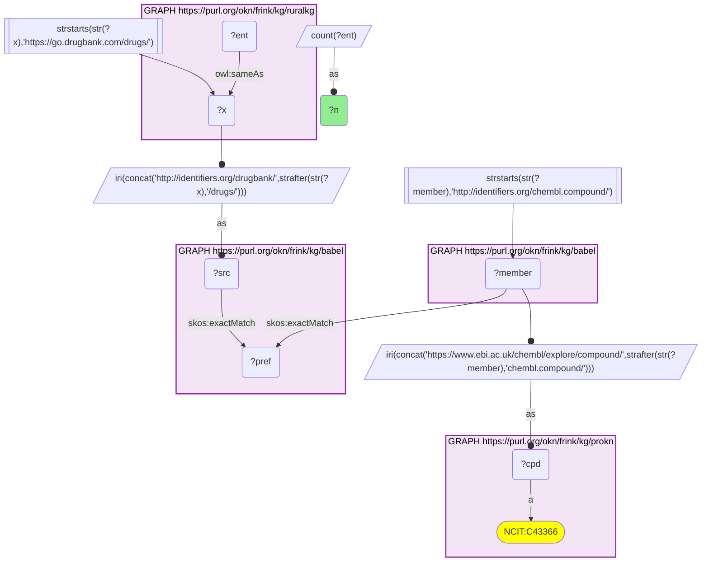
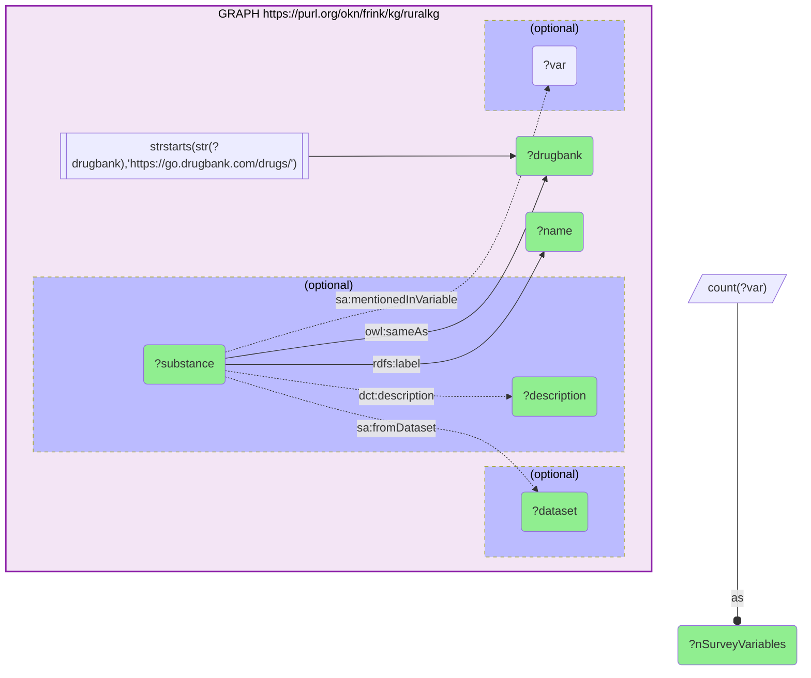
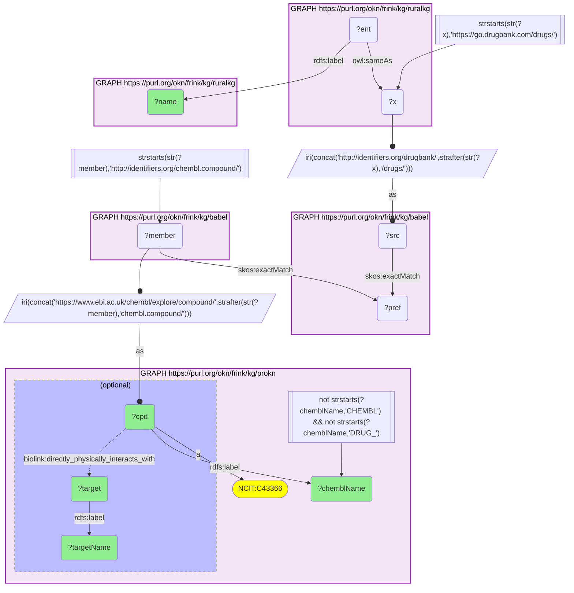

# RuralKG substances of abuse and the protein targets ProKN records for them, joined through Babel (DrugBank → ChEMBL)

- **Date:** 2026-09-26
- **Model:** claude-opus-5-5
- **External MCP servers:** PubMed
- **SPARQL endpoint:** https://apps.okn.us/federation/sparql
- **Generated by:** mcp-okn v0.1.0 (build 7d8000e)
- **Contents:** 3 queries · 3 query diagrams

## Knowledge graphs used

- `ruralkg` — <https://purl.org/okn/frink/kg/ruralkg>
- `babel` — <https://purl.org/okn/frink/kg/babel>
- `prokn` — <https://purl.org/okn/frink/kg/prokn>

## Conversation

👤 **User**

Crosswalk: `ruralkg` × `prokn` on **DrugBank → ChEMBL, bridged through `babel`** (crosswalk `DB5-drugbank-ruralkg-prokn-via-babel`, verified_count 6). ruralkg's substance-abuse layer links a handful of its NSDUH `Substance` nodes to DrugBank through `owl:sameAs` objects of the form `https://go.drugbank.com/drugs/DB{n}`; prokn keys its compounds on ChEMBL IRIs (`https://www.ebi.ac.uk/chembl/explore/compound/CHEMBL{n}`, `obo:NCIT_C43366`). The two graphs share no chemical identifier scheme. babel (the Translator Babel identifier cliques) links them: the DrugBank id is rewritten to `http://identifiers.org/drugbank/DB{n}`, which `skos:exactMatch`es its clique's preferred id; the same clique holds an `http://identifiers.org/chembl.compound/CHEMBL{n}` member, which is rewritten to prokn's form. Both babel hops are staged in nested `SELECT DISTINCT` subqueries so the join does not time out.

Research question: Which of RuralKG's DrugBank-linked substances of abuse resolve to ProKN compounds (DrugBank → ChEMBL via Babel), and which proteins does ProKN say each one directly physically interacts with?

Why the join is required: RuralKG knows *which substances rural-health survey data asks about* (the NSDUH variables that mention each substance) but records nothing about their molecular pharmacology. ProKN knows *which proteins a compound physically binds* (`biolink:directly_physically_interacts_with`, from ChEMBL mechanism data) but nothing about substance-use surveillance. RuralKG uses DrugBank and ProKN uses ChEMBL, so without the babel bridge the survey substance and its molecular target cannot be read together.

---

🧠 **Assistant**

The babel bridge joins **6 of RuralKG's 7 DrugBank-linked substances** to ProKN compounds (the crosswalk skeleton reproduces its verified count of 6 exactly). ProKN records a direct physical-interaction target for **3 of the 6**, five substance–target pairs in all:

| RuralKG substance | DrugBank | NSDUH variables (RuralKG) | ProKN compound (ChEMBL) | ProKN target (UniProt) |
| --- | --- | --- | --- | --- |
| Heroin | DB01452 | 101 | DIACETYLMORPHINE (CHEMBL459324) | Mu-type opioid receptor (P35372) |
| MDMA | DB01454 | 4 | MIDOMAFETAMINE (CHEMBL43048) | Sodium-dependent serotonin transporter (P31645) |
| MDMA | DB01454 | 4 | MIDOMAFETAMINE (CHEMBL43048) | Sodium-dependent noradrenaline transporter (P23975) |
| MDMA | DB01454 | 4 | MIDOMAFETAMINE (CHEMBL43048) | Sodium-dependent dopamine transporter (Q01959) |
| Psilocybin | DB11664 | 2 | PSILOCYBIN (CHEMBL194378) | 5-hydroxytryptamine receptor 2A (P28223) |
| Cocaine | DB00907 | 95 | COCAINE (CHEMBL370805) | none recorded in ProKN |
| Ketamine | DB01221 | 7 | KETAMINE (CHEMBL742) | none recorded in ProKN |
| DMT/AMT/FOXY | DB01488 | 1 | N,N-DIMETHYLTRYPTAMINE (CHEMBL12420) | none recorded in ProKN |

The seventh DrugBank-linked RuralKG substance, **Mescaline (DB19083, 2 NSDUH variables)**, does not reach a ProKN compound through the bridge.

**Why it answers the question.** Each row sets RuralKG's survey context for a substance (how many NSDUH variables ask about it) beside ProKN's molecular target for the same chemical. Neither graph can produce the row alone. The three targeted substances fall into three different mechanistic classes: heroin acts on the **mu-opioid receptor**, MDMA on all **three monoamine transporters** (serotonin, noradrenaline, dopamine), and psilocybin on the **serotonin 2A receptor**. The join also shows a mismatch between the two graphs' emphasis. Cocaine is one of the most heavily surveyed substances in RuralKG (95 NSDUH variables, second only to heroin's 101), yet ProKN attaches no physical-interaction target to it.

**Caveats.**
- The crosswalk is small by construction: RuralKG's substance-abuse layer links only 7 of its substances to DrugBank. The rest are drug classes (e.g. hallucinogens, stimulants) or carry only a Wikidata id.
- "None recorded in ProKN" is a statement about ProKN's coverage, not about pharmacology. ProKN carries ChEMBL mechanism-of-action targets for only part of its compounds, and cocaine, ketamine and DMT are among those without one here.
- The "NSDUH variables" column counts distinct RuralKG survey variables linked to the substance by `mentionedInVariable`. It measures survey attention, not prevalence of use.
- RuralKG's "DMT/AMT/FOXY" node is a survey category spanning three tryptamines, but its DrugBank link (DB01488) is to N,N-dimethyltryptamine alone, so the ProKN match is to DMT only.
- babel can put one id in two cliques, so every query counts substances, never cliques.

## Literature validation

The identifier join is **validated by construction**. DrugBank and ChEMBL are registered, exact-string compound identifiers, and babel asserts their equivalence through a shared clique; no name matching is used. The crosswalk `DB5-drugbank-ruralkg-prokn-via-babel` (verified_count 6) reproduces live.

Each ProKN substance–target pair was checked against PubMed:

- **Heroin → mu-opioid receptor**: heroin produced no place preference or locomotor stimulation in mu-opioid-receptor-deficient mice, which supports an essential role for that receptor in heroin's rewarding effects (PMID 12098591, [DOI](https://doi.org/10.1016/s0014-2999(02)01812-5)). A review of opioid-system knockouts concludes that genetic data set the mu receptor as the primary target for morphine and heroin (PMID 24035914, [DOI](https://doi.org/10.1016/j.neuropharm.2013.08.028)).
- **MDMA → SERT, NET and DAT**: MDMA acts on the neuronal membrane monoamine transporters NET, DAT and SERT, inhibiting reuptake or causing release by reverse transport (PMID 34396557, [DOI](https://doi.org/10.1002/jcph.1918)).
- **Psilocybin → 5-HT2A receptor**: in healthy volunteers, the 5-HT2A antagonist ketanserin blocked psilocybin's psychotomimetic effects dose-dependently, evidence that they are due to 5-HT2A receptor activation (PMID 9875725, [DOI](https://doi.org/10.1097/00001756-199812010-00024)). This supports the receptor as psilocybin's functional target. Psilocybin itself is a prodrug, and the bound species is its metabolite psilocin, which ProKN's compound-level edge does not distinguish.
- **Cocaine (no ProKN target)**: the gap is ProKN's, not the literature's. Monoamine transporters are described as high-affinity molecular targets for cocaine, amphetamine and MDMA (PMID 16353949, [DOI](https://doi.org/10.1208/aapsj070373)).

Ketamine and DMT targets were not checked, because the answer makes no claim about them beyond ProKN's lack of a recorded target.

Sources retrieved from PubMed.

**Validated.** The join uses shared registered identifiers bridged by babel, the rows ran live against all three graphs, and every substance–target pair ProKN reports is supported by the literature.

## SPARQL queries executed

#### Query 1

_2026-09-27T00:17:48+00:00 · `ruralkg`, `babel`, `prokn`_

```sparql
SELECT (COUNT(DISTINCT ?ent) AS ?n) WHERE {
  { SELECT DISTINCT ?ent ?member WHERE {
    { SELECT DISTINCT ?ent ?pref WHERE {
        { SELECT DISTINCT ?ent ?src WHERE { GRAPH <https://purl.org/okn/frink/kg/ruralkg> { ?ent <http://www.w3.org/2002/07/owl#sameAs> ?x } FILTER(STRSTARTS(STR(?x),'https://go.drugbank.com/drugs/')) BIND(IRI(CONCAT('http://identifiers.org/drugbank/', STRAFTER(STR(?x),'/drugs/'))) AS ?src) } }
        GRAPH <https://purl.org/okn/frink/kg/babel> { ?src <http://www.w3.org/2004/02/skos/core#exactMatch> ?pref } } }
    GRAPH <https://purl.org/okn/frink/kg/babel> { ?member <http://www.w3.org/2004/02/skos/core#exactMatch> ?pref } } }
  FILTER(STRSTARTS(STR(?member),'http://identifiers.org/chembl.compound/'))
  BIND(IRI(CONCAT('https://www.ebi.ac.uk/chembl/explore/compound/',STRAFTER(STR(?member),'chembl.compound/'))) AS ?cpd)
  GRAPH <https://purl.org/okn/frink/kg/prokn> { ?cpd a <http://purl.obolibrary.org/obo/NCIT_C43366> }
}
```



_1 row(s)_

| n |
| --- |
| 6 |

#### Query 2

_2026-09-27T00:17:49+00:00 · `ruralkg`_

```sparql
PREFIX rdfs: <http://www.w3.org/2000/01/rdf-schema#>
PREFIX owl: <http://www.w3.org/2002/07/owl#>
PREFIX sa: <http://sail.ua.edu/ruralkg/substanceabuse/>
PREFIX dct: <http://purl.org/dc/terms/>
SELECT ?substance ?name ?drugbank ?description ?dataset (COUNT(DISTINCT ?var) AS ?nSurveyVariables) WHERE {
  GRAPH <https://purl.org/okn/frink/kg/ruralkg> {
    ?substance owl:sameAs ?drugbank ; rdfs:label ?name .
    FILTER(STRSTARTS(STR(?drugbank),'https://go.drugbank.com/drugs/'))
    OPTIONAL { ?substance dct:description ?description }
    OPTIONAL { ?substance sa:fromDataset ?dataset }
    OPTIONAL { ?substance sa:mentionedInVariable ?var }
  }
} GROUP BY ?substance ?name ?drugbank ?description ?dataset ORDER BY DESC(?nSurveyVariables)
```



_7 row(s) — showing first 3_

| substance | name | drugbank | description | dataset | nSurveyVariables |
| --- | --- | --- | --- | --- | --- |
| http://sail.ua.edu/ruralkg/substanceabuse/Substance_c829f3d1-da4d-4885-b511-786e59b494d9 | Heroin | https://go.drugbank.com/drugs/DB01452 | Heroin is a potent opioid compound, often illicitly used for its psychoactive and euphoric effects. | NSDUH | 101 |
| http://sail.ua.edu/ruralkg/substanceabuse/Substance_26fc25b2-4e4f-48b5-b539-e0040b348f5d | Cocaine | https://go.drugbank.com/drugs/DB00907 | tropane alkaloid and stimulant drug | NSDUH | 95 |
| http://sail.ua.edu/ruralkg/substanceabuse/Substance_ef8d9978-3e0c-4a52-aabb-08d7e3f53692 | Ketamine | https://go.drugbank.com/drugs/DB01221 | Ketamine is a chiral compound, existing as a pair of enantiomers with distinct pharmacological properties. | NSDUH | 7 |

#### Query 3

_2026-09-27T00:18:21+00:00 · `ruralkg`, `babel`, `prokn`_

```sparql
PREFIX rdfs: <http://www.w3.org/2000/01/rdf-schema#>
PREFIX skos: <http://www.w3.org/2004/02/skos/core#>
PREFIX biolink: <https://w3id.org/biolink/vocab/>
SELECT ?name ?cpd ?chemblName ?target ?targetName WHERE {
  { SELECT DISTINCT ?ent ?member WHERE {
    { SELECT DISTINCT ?ent ?pref WHERE {
        { SELECT DISTINCT ?ent ?src WHERE { GRAPH <https://purl.org/okn/frink/kg/ruralkg> { ?ent <http://www.w3.org/2002/07/owl#sameAs> ?x } FILTER(STRSTARTS(STR(?x),'https://go.drugbank.com/drugs/')) BIND(IRI(CONCAT('http://identifiers.org/drugbank/', STRAFTER(STR(?x),'/drugs/'))) AS ?src) } }
        GRAPH <https://purl.org/okn/frink/kg/babel> { ?src skos:exactMatch ?pref } } }
    GRAPH <https://purl.org/okn/frink/kg/babel> { ?member skos:exactMatch ?pref } } }
  FILTER(STRSTARTS(STR(?member),'http://identifiers.org/chembl.compound/'))
  BIND(IRI(CONCAT('https://www.ebi.ac.uk/chembl/explore/compound/',STRAFTER(STR(?member),'chembl.compound/'))) AS ?cpd)
  GRAPH <https://purl.org/okn/frink/kg/prokn> {
    ?cpd a <http://purl.obolibrary.org/obo/NCIT_C43366> ; rdfs:label ?chemblName .
    FILTER(!STRSTARTS(?chemblName,'CHEMBL') && !STRSTARTS(?chemblName,'DRUG_'))
    OPTIONAL { ?cpd biolink:directly_physically_interacts_with ?target .
               ?target rdfs:label ?targetName .
               FILTER(!REGEX(?targetName, '^[A-Z][0-9][A-Z0-9]{3}[0-9]$')) } }
  GRAPH <https://purl.org/okn/frink/kg/ruralkg> { ?ent rdfs:label ?name }
} ORDER BY ?name ?targetName
```



_8 row(s) — showing first 5_

| name | cpd | chemblName | target | targetName |
| --- | --- | --- | --- | --- |
| Cocaine | https://www.ebi.ac.uk/chembl/explore/compound/CHEMBL370805 | COCAINE |  |  |
| DMT/AMT/FOXY | https://www.ebi.ac.uk/chembl/explore/compound/CHEMBL12420 | N,N-DIMETHYLTRYPTAMINE |  |  |
| Heroin | https://www.ebi.ac.uk/chembl/explore/compound/CHEMBL459324 | DIACETYLMORPHINE | http://purl.uniprot.org/uniprot/P35372 | Mu-type opioid receptor |
| Ketamine | https://www.ebi.ac.uk/chembl/explore/compound/CHEMBL742 | KETAMINE |  |  |
| MDMA | https://www.ebi.ac.uk/chembl/explore/compound/CHEMBL43048 | MIDOMAFETAMINE | http://purl.uniprot.org/uniprot/Q01959 | Sodium-dependent dopamine transporter |
