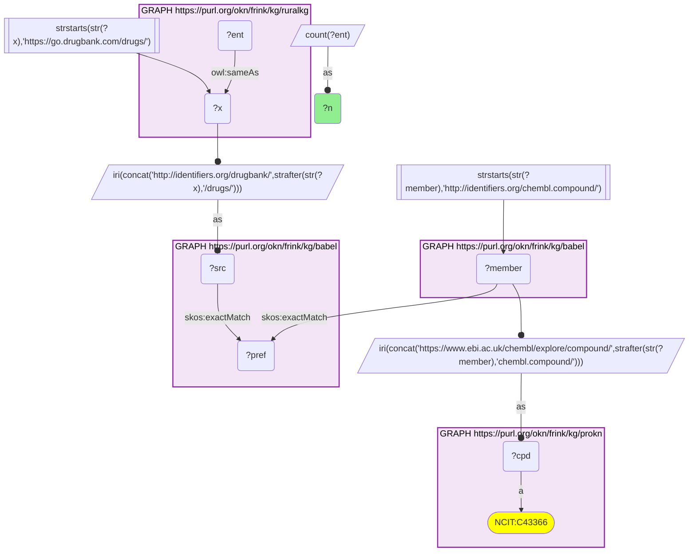
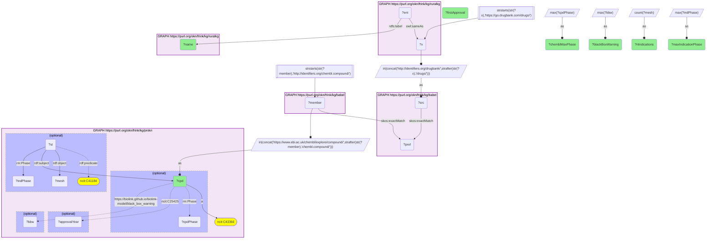
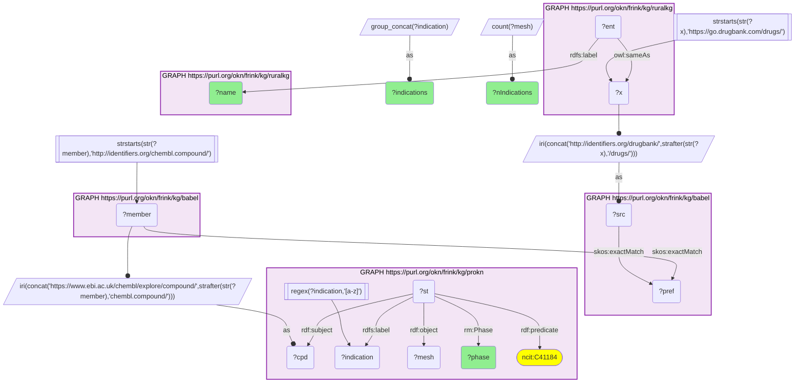
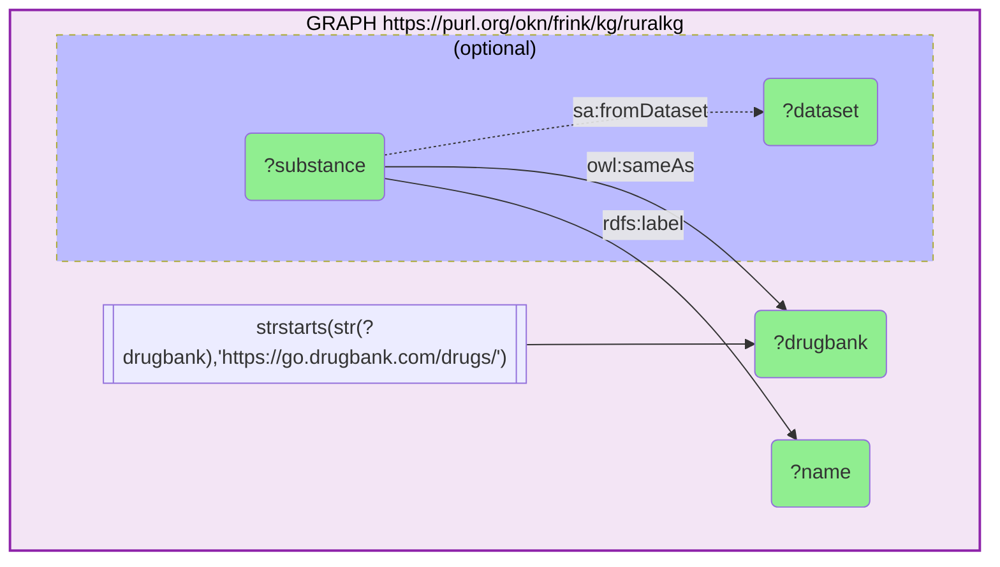

# Medical indications ProKN records for RuralKG's substances of abuse, joined through Babel (DrugBank → ChEMBL)

- **Date:** 2026-09-26
- **Model:** claude-opus-5-5
- **External MCP servers:** PubMed
- **SPARQL endpoint:** https://apps.okn.us/federation/sparql
- **Generated by:** mcp-okn v0.1.0 (build 7d8000e)
- **Contents:** 4 queries · 4 query diagrams

## Knowledge graphs used

- `ruralkg` — <https://purl.org/okn/frink/kg/ruralkg>
- `babel` — <https://purl.org/okn/frink/kg/babel>
- `prokn` — <https://purl.org/okn/frink/kg/prokn>

## Conversation

👤 **User**

Crosswalk: `ruralkg` × `prokn` on **DrugBank → ChEMBL, bridged through `babel`** (crosswalk `DB5-drugbank-ruralkg-prokn-via-babel`, verified_count 6). ruralkg's substance-abuse layer links a handful of its NSDUH `Substance` nodes to DrugBank through `owl:sameAs` objects of the form `https://go.drugbank.com/drugs/DB{n}`; prokn keys its compounds on ChEMBL IRIs (`https://www.ebi.ac.uk/chembl/explore/compound/CHEMBL{n}`, `obo:NCIT_C43366`). The two graphs share no chemical identifier scheme. babel (the Translator Babel identifier cliques) links them: the DrugBank id is rewritten to `http://identifiers.org/drugbank/DB{n}`, which `skos:exactMatch`es its clique's preferred id; the same clique holds an `http://identifiers.org/chembl.compound/CHEMBL{n}` member, which is rewritten to prokn's form. Both babel hops are staged in nested `SELECT DISTINCT` subqueries so the join does not time out.

Research question: For the RuralKG substances of abuse that bridge to ProKN, which indications (MeSH, with clinical phase) does ChEMBL list for them in ProKN — i.e. which abused substances are also being tested or used as medicines?

Why the join is required: RuralKG frames these substances as drugs of abuse (NSDUH survey substances) and records nothing about their medical use. ProKN carries ChEMBL's drug data for the same chemicals: indications as MeSH headings on reified `NCIT_C41184` (Indication) statements, each with a clinical `Phase`, plus the compound's maximum phase, first-approval year and black-box-warning flag. RuralKG uses DrugBank and ProKN uses ChEMBL, so the babel bridge is the only way to read the abuse framing and the therapeutic record together.

---

🧠 **Assistant**

RuralKG links **7 NSDUH substances** to DrugBank, and **6 of them** bridge to ProKN compounds (the skeleton reproduces the crosswalk's verified count of 6). All 6 carry ChEMBL indication statements in ProKN, **123 distinct substance–indication pairs** in all. Two of the six are approved medicines (ChEMBL max phase 4), and the other four have reached clinical trials (phase 2–3):

| RuralKG substance | ProKN compound | ChEMBL max phase | First approval | Black-box warning | Indications listed | Highest indication phase |
| --- | --- | --- | --- | --- | --- | --- |
| Ketamine | CHEMBL742 | 4 | 1970 | no | 73 | 3 |
| Psilocybin | CHEMBL194378 | 3 | — | no | 28 | 3 |
| MDMA | CHEMBL43048 | 3 | — | no | 13 | 3 |
| Cocaine | CHEMBL370805 | 4 | 2017 | yes | 4 | 2 |
| DMT/AMT/FOXY | CHEMBL12420 | 2 | — | no | 3 | 2 |
| Heroin | CHEMBL459324 | 3 | — | no | 2 | 3 |

The furthest-advanced indications per substance (from the per-phase breakdown):

| RuralKG substance | Phase | Indications (MeSH) |
| --- | --- | --- |
| Heroin | 3 | Heroin Dependence; Opioid-Related Disorders |
| MDMA | 3 | Stress Disorders, Post-Traumatic |
| MDMA | 2 | Anorexia Nervosa; Anxiety; Feeding and Eating Disorders; Phobia, Social |
| Psilocybin | 3 | Depressive Disorder; Depressive Disorder, Major; Depressive Disorder, Treatment-Resistant |
| Psilocybin | 2 | 12 indications, including Stress Disorders, Post-Traumatic; Alcoholism; Tobacco Use Disorder; Opioid-Related Disorders; Cocaine-Related Disorders; Anorexia Nervosa |
| Ketamine | 3 | 27 indications, including Depressive Disorder, Major; Suicidal Ideation; Depression, Postpartum; Chronic Pain; Postoperative Complications; Status Epilepticus; Alcoholism |
| DMT/AMT/FOXY | 2 | Depressive Disorder; Depressive Disorder, Major |
| Cocaine | 2 | Cocaine-Related Disorders; Opioid-Related Disorders |

Ketamine's 73 indications split 27 / 26 / 15 / 5 across phases 3 / 2 / 1 / early phase 1 (0.5). Psilocybin's 28 split 3 / 12 / 13 across phases 3 / 2 / 1.

**Why it answers the question.** Every substance RuralKG tracks as a drug of abuse, and that reaches ProKN, is also a medicine or a medicine candidate in ChEMBL. The indications cluster in psychiatry and addiction. MDMA's most advanced indication is PTSD and psilocybin's is depression (both phase 3). DMT has reached phase 2 in depression. Heroin, as diacetylmorphine, is at phase 3 for heroin and opioid dependence, i.e. as a maintenance treatment for the addiction it causes. Ketamine has the broadest profile by far: 73 indications, dominated by depression, pain, and emergency and perioperative uses. Cocaine and ketamine are the two approved drugs (first approvals 1970 for ketamine and 2017 for cocaine), and cocaine is the only one of the six with a black-box warning.

**Caveats.**
- **Indication phases stop at 3 in ProKN.** Ketamine and cocaine have a compound-level ChEMBL max phase of 4, yet none of the 123 indication statements carries phase 4, and neither drug's established clinical use (anaesthesia for ketamine, topical local anaesthesia for cocaine) appears in its indication list. ProKN's indication statements therefore appear to carry ChEMBL's investigational indications rather than the approved-label ones. Read "highest indication phase" as "most advanced investigational indication", not as approval status; the max-phase column is the approval signal.
- An investigational indication in ChEMBL records that the compound has been in clinical development for that condition. It is not evidence of efficacy. Some entries (cocaine under "Cocaine-Related Disorders", ketamine under "Marijuana Abuse") may reflect mechanistic or challenge studies rather than therapeutic intent; this was not checked.
- The indication count is DISTINCT MeSH headings per compound; the per-phase counts sum exactly to those totals here.
- RuralKG's "DMT/AMT/FOXY" node is a survey category spanning three tryptamines, but its DrugBank link (DB01488) is to N,N-dimethyltryptamine alone.
- Mescaline (DB19083), the seventh DrugBank-linked RuralKG substance, does not reach a ProKN compound and so has no indications here. babel can put one id in two cliques, so every query counts substances, never cliques.

## Literature validation

The identifier join is **validated by construction**. DrugBank and ChEMBL are registered, exact-string compound identifiers, and babel asserts their equivalence through a shared clique; no name matching is used. The crosswalk `DB5-drugbank-ruralkg-prokn-via-babel` (verified_count 6) reproduces live.

The headline therapeutic claims were checked against PubMed:

- **MDMA → PTSD (phase 3)**: a randomized, double-blind, placebo-controlled phase 3 trial found MDMA-assisted therapy highly efficacious in severe PTSD (PMID 33972795, [DOI](https://doi.org/10.1038/s41591-021-01336-3)). A confirmatory phase 3 trial replicated the result in moderate-to-severe PTSD (PMID 37709999, [DOI](https://doi.org/10.1038/s41591-023-02565-4)).
- **Psilocybin → treatment-resistant depression**: in a 233-participant randomized phase 2 trial (COMP360), a single 25 mg dose improved depression severity and related measures at week 3 compared with 1 mg (PMID 36740140, [DOI](https://doi.org/10.1016/j.jad.2023.01.108)). That paper is phase 2; ProKN's phase 3 label for psilocybin's depression indications was not confirmed from a phase 3 publication here.
- **Heroin (diacetylmorphine) → opioid dependence**: diacetylmorphine has been shown to be more effective than methadone maintenance for chronic, treatment-refractory opioid dependence, and was modelled as cost-effective in the North American Opiate Medication Initiative (NAOMI) population (PMID 22410375, [DOI](https://doi.org/10.1503/cmaj.110669)).
- **Ketamine → anaesthetic, repositioned for depression**: ketamine was introduced as a dissociative anaesthetic and repositioned as a rapid-acting antidepressant for treatment-resistant depression; intranasal esketamine was FDA-approved for TRD in 2019 (PMID 41394981, [DOI](https://doi.org/10.1177/20451253251392429)).
- **DMT → major depression (phase 2)**: a systematic review of early-phase DMT trials, in healthy volunteers and MDD patients, found DMT generally well tolerated and called for larger trials to establish efficacy in treatment-resistant depression (PMID 40484114, [DOI](https://doi.org/10.1016/j.pnpbp.2025.111419)). This supports an early-phase, not an established, therapeutic status.
- **Cocaine → topical local anaesthetic** (the clinical use missing from ProKN's indication list): a systematic review of local anaesthesia for nasal-fracture manipulation included topical intranasal cocaine solution among the local anaesthetic methods compared (PMID 19470190, [DOI](https://doi.org/10.1017/S002221510900560X)). The 2017 approval year itself comes from ProKN and was not checked against PubMed.

Sources retrieved from PubMed.

**Validated, with one qualification.** The join uses shared registered identifiers bridged by babel, the rows ran live against all three graphs, and the therapeutic uses highlighted are literature-supported. The exception is psilocybin's phase 3 status: the evidence found here is phase 2.

## SPARQL queries executed

#### Query 1

_2026-09-27T00:21:32+00:00 · `ruralkg`, `babel`, `prokn`_

```sparql
SELECT (COUNT(DISTINCT ?ent) AS ?n) WHERE {
  { SELECT DISTINCT ?ent ?member WHERE {
    { SELECT DISTINCT ?ent ?pref WHERE {
        { SELECT DISTINCT ?ent ?src WHERE { GRAPH <https://purl.org/okn/frink/kg/ruralkg> { ?ent <http://www.w3.org/2002/07/owl#sameAs> ?x } FILTER(STRSTARTS(STR(?x),'https://go.drugbank.com/drugs/')) BIND(IRI(CONCAT('http://identifiers.org/drugbank/', STRAFTER(STR(?x),'/drugs/'))) AS ?src) } }
        GRAPH <https://purl.org/okn/frink/kg/babel> { ?src <http://www.w3.org/2004/02/skos/core#exactMatch> ?pref } } }
    GRAPH <https://purl.org/okn/frink/kg/babel> { ?member <http://www.w3.org/2004/02/skos/core#exactMatch> ?pref } } }
  FILTER(STRSTARTS(STR(?member),'http://identifiers.org/chembl.compound/'))
  BIND(IRI(CONCAT('https://www.ebi.ac.uk/chembl/explore/compound/',STRAFTER(STR(?member),'chembl.compound/'))) AS ?cpd)
  GRAPH <https://purl.org/okn/frink/kg/prokn> { ?cpd a <http://purl.obolibrary.org/obo/NCIT_C43366> }
}
```



_1 row(s)_

| n |
| --- |
| 6 |

#### Query 2

_2026-09-27T00:21:33+00:00 · `ruralkg`, `babel`, `prokn`_

```sparql
PREFIX rdf: <http://www.w3.org/1999/02/22-rdf-syntax-ns#>
PREFIX rdfs: <http://www.w3.org/2000/01/rdf-schema#>
PREFIX skos: <http://www.w3.org/2004/02/skos/core#>
PREFIX ncit: <http://purl.obolibrary.org/obo/NCIT_>
PREFIX rm: <https://w3id.org/reproduceme#>
SELECT ?name ?cpd (MAX(?cpdPhase) AS ?chemblMaxPhase) (SAMPLE(?approvalYear) AS ?firstApproval) (MAX(?bbw) AS ?blackBoxWarning)
       (COUNT(DISTINCT ?mesh) AS ?nIndications) (MAX(?indPhase) AS ?maxIndicationPhase) WHERE {
  { SELECT DISTINCT ?ent ?member WHERE {
    { SELECT DISTINCT ?ent ?pref WHERE {
        { SELECT DISTINCT ?ent ?src WHERE { GRAPH <https://purl.org/okn/frink/kg/ruralkg> { ?ent <http://www.w3.org/2002/07/owl#sameAs> ?x } FILTER(STRSTARTS(STR(?x),'https://go.drugbank.com/drugs/')) BIND(IRI(CONCAT('http://identifiers.org/drugbank/', STRAFTER(STR(?x),'/drugs/'))) AS ?src) } }
        GRAPH <https://purl.org/okn/frink/kg/babel> { ?src skos:exactMatch ?pref } } }
    GRAPH <https://purl.org/okn/frink/kg/babel> { ?member skos:exactMatch ?pref } } }
  FILTER(STRSTARTS(STR(?member),'http://identifiers.org/chembl.compound/'))
  BIND(IRI(CONCAT('https://www.ebi.ac.uk/chembl/explore/compound/',STRAFTER(STR(?member),'chembl.compound/'))) AS ?cpd)
  GRAPH <https://purl.org/okn/frink/kg/prokn> {
    ?cpd a ncit:C43366 .
    OPTIONAL { ?cpd rm:Phase ?cpdPhase }
    OPTIONAL { ?cpd ncit:C25425 ?approvalYear }
    OPTIONAL { ?cpd <https://biolink.github.io/biolink-model/black_box_warning> ?bbw }
    OPTIONAL { ?st rdf:subject ?cpd ; rdf:predicate ncit:C41184 ; rdf:object ?mesh ; rm:Phase ?indPhase } }
  GRAPH <https://purl.org/okn/frink/kg/ruralkg> { ?ent rdfs:label ?name }
} GROUP BY ?name ?cpd ORDER BY DESC(?nIndications)
```



_6 row(s) — showing first 3_

| name | cpd | chemblMaxPhase | firstApproval | blackBoxWarning | nIndications | maxIndicationPhase |
| --- | --- | --- | --- | --- | --- | --- |
| Ketamine | https://www.ebi.ac.uk/chembl/explore/compound/CHEMBL742 | 4.0 | 1970.0 | 0 | 73 | 3.0 |
| Psilocybin | https://www.ebi.ac.uk/chembl/explore/compound/CHEMBL194378 | 3.0 |  | 0 | 28 | 3.0 |
| MDMA | https://www.ebi.ac.uk/chembl/explore/compound/CHEMBL43048 | 3.0 |  | 0 | 13 | 3.0 |

#### Query 3

_2026-09-27T00:21:42+00:00 · `ruralkg`, `babel`, `prokn`_

```sparql
PREFIX rdf: <http://www.w3.org/1999/02/22-rdf-syntax-ns#>
PREFIX rdfs: <http://www.w3.org/2000/01/rdf-schema#>
PREFIX skos: <http://www.w3.org/2004/02/skos/core#>
PREFIX ncit: <http://purl.obolibrary.org/obo/NCIT_>
PREFIX rm: <https://w3id.org/reproduceme#>
SELECT ?name ?phase (COUNT(DISTINCT ?mesh) AS ?nIndications) (GROUP_CONCAT(DISTINCT ?indication; separator='; ') AS ?indications) WHERE {
  { SELECT DISTINCT ?ent ?member WHERE {
    { SELECT DISTINCT ?ent ?pref WHERE {
        { SELECT DISTINCT ?ent ?src WHERE { GRAPH <https://purl.org/okn/frink/kg/ruralkg> { ?ent <http://www.w3.org/2002/07/owl#sameAs> ?x } FILTER(STRSTARTS(STR(?x),'https://go.drugbank.com/drugs/')) BIND(IRI(CONCAT('http://identifiers.org/drugbank/', STRAFTER(STR(?x),'/drugs/'))) AS ?src) } }
        GRAPH <https://purl.org/okn/frink/kg/babel> { ?src skos:exactMatch ?pref } } }
    GRAPH <https://purl.org/okn/frink/kg/babel> { ?member skos:exactMatch ?pref } } }
  FILTER(STRSTARTS(STR(?member),'http://identifiers.org/chembl.compound/'))
  BIND(IRI(CONCAT('https://www.ebi.ac.uk/chembl/explore/compound/',STRAFTER(STR(?member),'chembl.compound/'))) AS ?cpd)
  GRAPH <https://purl.org/okn/frink/kg/prokn> {
    ?st rdf:subject ?cpd ; rdf:predicate ncit:C41184 ; rdf:object ?mesh ; rm:Phase ?phase ; rdfs:label ?indication .
    FILTER(REGEX(?indication, '[a-z]')) }
  GRAPH <https://purl.org/okn/frink/kg/ruralkg> { ?ent rdfs:label ?name }
} GROUP BY ?name ?phase ORDER BY ?name DESC(?phase)
```



_16 row(s) — showing first 3_

| name | phase | nIndications | indications |
| --- | --- | --- | --- |
| Cocaine | 2.0 | 2 | Cocaine-Related Disorders; Opioid-Related Disorders |
| Cocaine | 1.0 | 2 | Substance Withdrawal Syndrome; Hypersensitivity |
| DMT/AMT/FOXY | 2.0 | 2 | Depressive Disorder, Major; Depressive Disorder |

#### Query 4

_2026-09-27T00:23:10+00:00 · `ruralkg`_

```sparql
PREFIX rdfs: <http://www.w3.org/2000/01/rdf-schema#>
PREFIX owl: <http://www.w3.org/2002/07/owl#>
PREFIX sa: <http://sail.ua.edu/ruralkg/substanceabuse/>
SELECT ?substance ?name ?drugbank ?dataset WHERE {
  GRAPH <https://purl.org/okn/frink/kg/ruralkg> {
    ?substance owl:sameAs ?drugbank ; rdfs:label ?name .
    FILTER(STRSTARTS(STR(?drugbank),'https://go.drugbank.com/drugs/'))
    OPTIONAL { ?substance sa:fromDataset ?dataset }
  }
} ORDER BY ?name
```



_7 row(s) — showing first 5_

| substance | name | drugbank | dataset |
| --- | --- | --- | --- |
| http://sail.ua.edu/ruralkg/substanceabuse/Substance_26fc25b2-4e4f-48b5-b539-e0040b348f5d | Cocaine | https://go.drugbank.com/drugs/DB00907 | NSDUH |
| http://sail.ua.edu/ruralkg/substanceabuse/Substance_e6ede5dd-3969-44b7-ab2f-30c6fde476aa | DMT/AMT/FOXY | https://go.drugbank.com/drugs/DB01488 | NSDUH |
| http://sail.ua.edu/ruralkg/substanceabuse/Substance_c829f3d1-da4d-4885-b511-786e59b494d9 | Heroin | https://go.drugbank.com/drugs/DB01452 | NSDUH |
| http://sail.ua.edu/ruralkg/substanceabuse/Substance_ef8d9978-3e0c-4a52-aabb-08d7e3f53692 | Ketamine | https://go.drugbank.com/drugs/DB01221 | NSDUH |
| http://sail.ua.edu/ruralkg/substanceabuse/Substance_53a283ea-18ad-46c3-8d2e-d036c4af1c83 | MDMA | https://go.drugbank.com/drugs/DB01454 | NSDUH |
