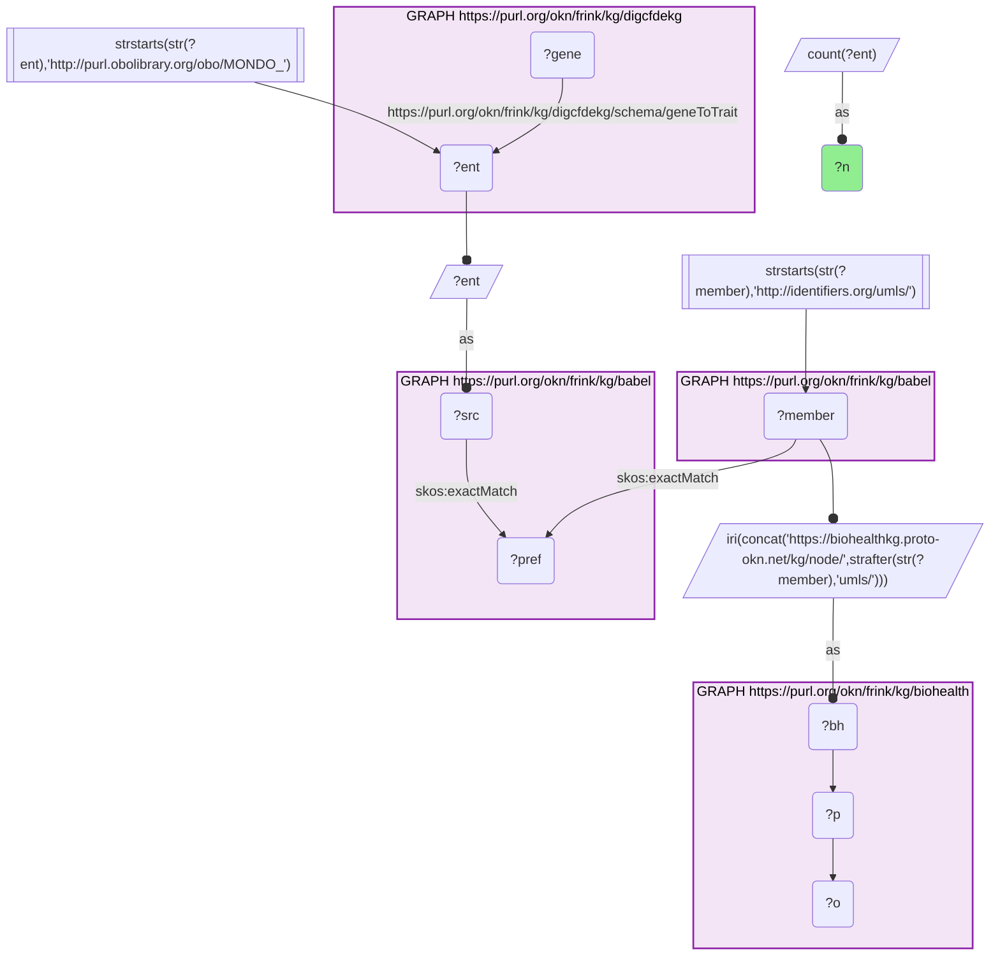
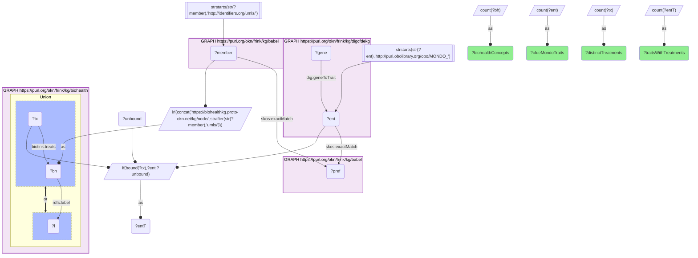
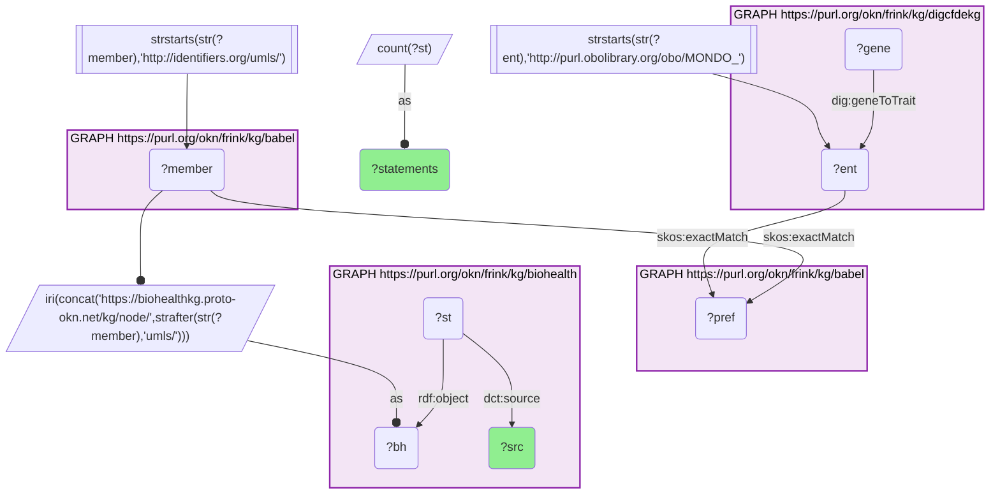

# CFDE gene-trait diseases that are BioHealthKG concepts, and what BioHealthKG adds, joined through Babel (MONDO → UMLS)

- **Date:** 2026-09-26
- **Model:** claude-opus-5-5
- **External MCP servers:** PubMed
- **SPARQL endpoint:** https://apps.okn.us/federation/sparql
- **Generated by:** mcp-okn v0.1.0 (build 7d8000e)
- **Contents:** 4 queries · 4 query diagrams

## Knowledge graphs used

- `digcfdekg` — <https://purl.org/okn/frink/kg/digcfdekg>
- `babel` — <https://purl.org/okn/frink/kg/babel>
- `biohealth` — <https://purl.org/okn/frink/kg/biohealth>

## Conversation

👤 **User**

Crosswalk: `biohealth` × `digcfdekg` on **UMLS ↔ MONDO, bridged through `babel`** (crosswalk `BH20-umls-mondo-biohealth-digcfdekg-via-babel`, verified_count 208). digcfdekg (the CFDE Data Distillery gene-trait KG) names many of its disease traits with MONDO IRIs (`http://purl.obolibrary.org/obo/MONDO_{id}`, the object of `geneToTrait`); biohealth (BioHealthKG) keys every entity on its UMLS CUI (`https://biohealthkg.proto-okn.net/kg/node/C{cui}`). The two graphs share no disease identifier scheme. babel (the Translator Babel identifier cliques) links them: each MONDO trait `skos:exactMatch`es its disease clique's preferred id, and the same clique holds an `http://identifiers.org/umls/C{cui}` member, which is rewritten to BioHealthKG's node IRI. Both babel hops are staged in nested `SELECT DISTINCT` subqueries, with the scheme filter applied outside them, or the join times out.

Research question: Which CFDE gene-trait diseases (digcfdekg, MONDO) are also BioHealthKG concepts (MONDO → UMLS via Babel), and what does BioHealthKG add about them?

Why the join is required: the CFDE KG knows *which genes* are inferred relevant to each disease trait (PIGEAN `geneToTrait`) but records nothing about treatments, causes or risk factors. BioHealthKG knows *what the literature and clinical records say about a disease* (subject–predicate–object statements such as `treats`, `causes` and `predisposes_to_condition`, with PubMed or MIMIC provenance) but has no gene-trait model. The disease is the only thing they share, named in MONDO on one side and UMLS on the other, so the babel bridge is what lets a CFDE disease's gene list be read next to BioHealthKG's clinical knowledge.

---

🧠 **Assistant**

The babel bridge joins **208 CFDE MONDO traits** to **286 BioHealthKG UMLS concepts** (the crosswalk skeleton reproduces its verified count of 208 exactly). BioHealthKG records at least one `treats` statement for **205 of the 208 traits**, naming **18,222 distinct treating entities** across them. The statements BioHealthKG holds about the 286 bridged concepts come almost entirely from the literature:

| BioHealthKG provenance (`dc:source`) | Statements about bridged concepts |
| --- | --- |
| PubMed | 543,214 |
| MIMIC;PubMed | 4,656 |
| MIMIC | 4,400 |
| MIMIC_SDoH | 1 |

The 15 bridged CFDE traits with the most CFDE genes, with what BioHealthKG adds (distinct subjects of `treats`, `causes` and `predisposes_to_condition`, pooled across each trait's BioHealthKG concepts, so a subject shared by two concepts counts once):

| CFDE trait (MONDO) | CFDE genes | BioHealthKG concepts | Treated by | Caused by | Predisposed by |
| --- | --- | --- | --- | --- | --- |
| major depressive disorder (MONDO:0002009) | 1,466 | 4 | 836 | 128 | 397 |
| color vision disorder (MONDO:0001703) | 1,336 | 3 | 19 | 38 | 12 |
| irritable bowel syndrome (MONDO:0005052) | 1,251 | 1 | 625 | 234 | 182 |
| Diabetic retinopathy (MONDO:0005266) | 1,125 | 1 | 589 | 401 | 390 |
| Multiple sclerosis (MONDO:0005301) | 1,059 | 1 | 1,500 | 621 | 519 |
| Age-related macular degeneration (MONDO:0005150) | 1,041 | 1 | 475 | 262 | 360 |
| Carpal tunnel syndrome (MONDO:0007275) | 1,027 | 1 | 338 | 261 | 100 |
| Hyperaldosteronism (MONDO:0003009) | 991 | 1 | 58 | 72 | 5 |
| chronic obstructive pulmonary disease (MONDO:0005002) | 974 | 1 | 1,700 | 628 | 535 |
| type 2 diabetes mellitus (MONDO:0005148) | 849 | 2 | 3,574 | 2,149 | 2,096 |
| Adolescent idiopathic scoliosis (MONDO:0005488) | 846 | 1 | 144 | 18 | 0 |
| Peripheral vascular disease (MONDO:0005294) | 808 | 7 | 919 | 222 | 347 |
| Dermatophytosis (MONDO:0004678) | 788 | 1 | 122 | 68 | 11 |
| Senile cataract (MONDO:0004847) | 768 | 1 | 34 | 25 | 1 |
| inflammatory bowel disease (MONDO:0005265) | 751 | 1 | 1,368 | 592 | 412 |

**Why it answers the question.** Every row joins a CFDE fact (how many genes PIGEAN ties to this disease) with BioHealthKG facts about the same disease (how many treatments, causes and predisposing factors the literature and clinical records name). Neither graph has both. For nearly every bridged disease (205 of 208), BioHealthKG supplies treatment knowledge that the CFDE KG lacks entirely. The two axes are largely independent. Colour-vision disorder and hyperaldosteronism have large CFDE gene sets but few BioHealthKG treatments. Type 2 diabetes, COPD and multiple sclerosis are heavily described on both sides, which makes them the natural diseases for gene-plus-clinical questions.

**Caveats.** babel can put one MONDO id in more than one clique, so a trait can fan out to several UMLS concepts. The fan-out is usually synonyms or subtypes (four major-depression concepts; seven peripheral-vascular concepts), but it is sometimes broader: type 2 diabetes mellitus reaches both "Diabetes Mellitus, Non-Insulin-Dependent" and the generic "Diabetes" concept, so its BioHealthKG counts include statements about diabetes in general. The table pools distinct subjects across a trait's concepts, so a subject linked to two of the trait's concepts counts once. BioHealthKG counts are counts of distinct subjects named in statements, not of supporting papers, and include broad or non-drug subjects (a `treats` subject can be a procedure or "follow-up"). Only CFDE's MONDO traits are in the crosswalk: CFDE traits keyed on EFO, Orphanet, HP or local trait ids are not bridged here. CFDE's trait labels are shown as stored ("Peripheral vascular disease (heterodominant model)" is abbreviated in the table).

## Literature validation

The identifier join is **validated by construction**. MONDO and UMLS are registered disease identifiers, and babel asserts their equivalence through a shared clique; no label matching is used. The hand-verified crosswalk `BH20-umls-mondo-biohealth-digcfdekg-via-babel` (verified_count 208, landing on 286 BioHealthKG concepts) reproduces live, and both counts are logged.

This answer is a coverage and content profile of the join. It makes one interpretive biological claim, which was checked against PubMed:

- **The gene-richest bridged traits are polygenic common diseases.** Major depressive disorder, the top CFDE trait here (1,466 genes), is confirmed as highly polygenic: a genome-wide meta-analysis of 807,553 individuals found 102 independent variants and 269 genes associated with depression (PMID 30718901, [DOI](https://doi.org/10.1038/s41593-018-0326-7)).

Individual BioHealthKG `treats` / `causes` / `predisposes_to_condition` statements were not checked one by one; they are counted here, not asserted as true.

Sources retrieved from PubMed.

**Validated.** The join uses shared registered disease identifiers bridged by babel, every number comes from a logged live query, and the one interpretive claim is supported by the literature.

## SPARQL queries executed

#### Query 1

_2026-09-27T00:26:52+00:00 · `digcfdekg`, `babel`, `biohealth`_

```sparql
SELECT (COUNT(DISTINCT ?ent) AS ?n) WHERE {
  { SELECT DISTINCT ?ent ?member WHERE {
    { SELECT DISTINCT ?ent ?pref WHERE {
        { SELECT DISTINCT ?ent ?src WHERE { GRAPH <https://purl.org/okn/frink/kg/digcfdekg> { ?gene <https://purl.org/okn/frink/kg/digcfdekg/schema/geneToTrait> ?ent } FILTER(STRSTARTS(STR(?ent),'http://purl.obolibrary.org/obo/MONDO_')) BIND(?ent AS ?src) } }
        GRAPH <https://purl.org/okn/frink/kg/babel> { ?src <http://www.w3.org/2004/02/skos/core#exactMatch> ?pref } } }
    GRAPH <https://purl.org/okn/frink/kg/babel> { ?member <http://www.w3.org/2004/02/skos/core#exactMatch> ?pref } } }
  FILTER(STRSTARTS(STR(?member),'http://identifiers.org/umls/'))
  BIND(IRI(CONCAT('https://biohealthkg.proto-okn.net/kg/node/', STRAFTER(STR(?member),'umls/'))) AS ?bh)
  GRAPH <https://purl.org/okn/frink/kg/biohealth> { ?bh ?p ?o }
}
```



_1 row(s)_

| n |
| --- |
| 208 |

#### Query 2

_2026-09-27T00:29:54+00:00 · `digcfdekg`, `babel`, `biohealth`_

```sparql
PREFIX skos: <http://www.w3.org/2004/02/skos/core#>
PREFIX rdfs: <http://www.w3.org/2000/01/rdf-schema#>
PREFIX biolink: <https://w3id.org/biolink/vocab/>
PREFIX dig: <https://purl.org/okn/frink/kg/digcfdekg/schema/>
SELECT (COUNT(DISTINCT ?ent) AS ?cfdeMondoTraits) (COUNT(DISTINCT ?bh) AS ?biohealthConcepts) (COUNT(DISTINCT ?entT) AS ?traitsWithTreatments) (COUNT(DISTINCT ?tx) AS ?distinctTreatments) WHERE {
  { SELECT DISTINCT ?ent ?bh WHERE {
  { SELECT DISTINCT ?ent ?member WHERE {
    { SELECT DISTINCT ?ent ?pref WHERE {
        { SELECT DISTINCT ?ent WHERE { GRAPH <https://purl.org/okn/frink/kg/digcfdekg> { ?gene dig:geneToTrait ?ent } FILTER(STRSTARTS(STR(?ent),'http://purl.obolibrary.org/obo/MONDO_')) } }
        GRAPH <https://purl.org/okn/frink/kg/babel> { ?ent skos:exactMatch ?pref } } }
    GRAPH <https://purl.org/okn/frink/kg/babel> { ?member skos:exactMatch ?pref } } }
  FILTER(STRSTARTS(STR(?member),'http://identifiers.org/umls/'))
  BIND(IRI(CONCAT('https://biohealthkg.proto-okn.net/kg/node/', STRAFTER(STR(?member),'umls/'))) AS ?bh) } }
  GRAPH <https://purl.org/okn/frink/kg/biohealth> {
    { ?bh rdfs:label ?l } UNION { ?tx biolink:treats ?bh } }
  BIND(IF(BOUND(?tx), ?ent, ?unbound) AS ?entT)
}
```



_1 row(s)_

| cfdeMondoTraits | biohealthConcepts | traitsWithTreatments | distinctTreatments |
| --- | --- | --- | --- |
| 208 | 286 | 205 | 18222 |

#### Query 3

_2026-09-27T00:29:54+00:00 · `digcfdekg`, `babel`, `biohealth`_

```sparql
PREFIX skos: <http://www.w3.org/2004/02/skos/core#>
PREFIX rdf: <http://www.w3.org/1999/02/22-rdf-syntax-ns#>
PREFIX dct: <http://purl.org/dc/terms/>
PREFIX dig: <https://purl.org/okn/frink/kg/digcfdekg/schema/>
SELECT ?src (COUNT(DISTINCT ?st) AS ?statements) WHERE {
  { SELECT DISTINCT ?bh WHERE {
  { SELECT DISTINCT ?ent ?member WHERE {
    { SELECT DISTINCT ?ent ?pref WHERE {
        { SELECT DISTINCT ?ent WHERE { GRAPH <https://purl.org/okn/frink/kg/digcfdekg> { ?gene dig:geneToTrait ?ent } FILTER(STRSTARTS(STR(?ent),'http://purl.obolibrary.org/obo/MONDO_')) } }
        GRAPH <https://purl.org/okn/frink/kg/babel> { ?ent skos:exactMatch ?pref } } }
    GRAPH <https://purl.org/okn/frink/kg/babel> { ?member skos:exactMatch ?pref } } }
  FILTER(STRSTARTS(STR(?member),'http://identifiers.org/umls/'))
  BIND(IRI(CONCAT('https://biohealthkg.proto-okn.net/kg/node/', STRAFTER(STR(?member),'umls/'))) AS ?bh) } }
  GRAPH <https://purl.org/okn/frink/kg/biohealth> { ?st rdf:object ?bh ; dct:source ?src }
} GROUP BY ?src ORDER BY DESC(?statements)
```



_4 row(s) — showing first 3_

| src | statements |
| --- | --- |
| PubMed | 543214 |
| MIMIC;PubMed | 4656 |
| MIMIC | 4400 |

#### Query 4

_2026-09-27T00:30:06+00:00 · `digcfdekg`, `babel`, `biohealth`_

```sparql
PREFIX skos: <http://www.w3.org/2004/02/skos/core#>
PREFIX rdfs: <http://www.w3.org/2000/01/rdf-schema#>
PREFIX biolink: <https://w3id.org/biolink/vocab/>
PREFIX dig: <https://purl.org/okn/frink/kg/digcfdekg/schema/>
SELECT ?ent ?cfdeTrait ?nCfdeGenes (COUNT(DISTINCT ?bh) AS ?nBiohealthConcepts) (GROUP_CONCAT(DISTINCT ?bhLabel; separator=" | ") AS ?biohealthConcepts) (COUNT(DISTINCT ?tx) AS ?treatedBy) (COUNT(DISTINCT ?cx) AS ?causedBy) (COUNT(DISTINCT ?px) AS ?predisposedBy) WHERE {
  { SELECT ?ent (SAMPLE(?tl) AS ?cfdeTrait) (COUNT(DISTINCT ?gene) AS ?nCfdeGenes) WHERE {
      GRAPH <https://purl.org/okn/frink/kg/digcfdekg> { ?gene dig:geneToTrait ?ent . ?ent rdfs:label ?tl }
      FILTER(STRSTARTS(STR(?ent),'http://purl.obolibrary.org/obo/MONDO_')) } GROUP BY ?ent ORDER BY DESC(?nCfdeGenes) LIMIT 40 }
  { SELECT DISTINCT ?ent ?bh WHERE {
  { SELECT DISTINCT ?ent ?member WHERE {
    { SELECT DISTINCT ?ent ?pref WHERE {
        { SELECT DISTINCT ?ent WHERE { GRAPH <https://purl.org/okn/frink/kg/digcfdekg> { ?gene dig:geneToTrait ?ent } FILTER(STRSTARTS(STR(?ent),'http://purl.obolibrary.org/obo/MONDO_')) } }
        GRAPH <https://purl.org/okn/frink/kg/babel> { ?ent skos:exactMatch ?pref } } }
    GRAPH <https://purl.org/okn/frink/kg/babel> { ?member skos:exactMatch ?pref } } }
  FILTER(STRSTARTS(STR(?member),'http://identifiers.org/umls/'))
  BIND(IRI(CONCAT('https://biohealthkg.proto-okn.net/kg/node/', STRAFTER(STR(?member),'umls/'))) AS ?bh) } }
  GRAPH <https://purl.org/okn/frink/kg/biohealth> {
    ?bh rdfs:label ?bhLabel .
    { ?x biolink:treats ?bh BIND(?x AS ?tx) } UNION { ?x biolink:causes ?bh BIND(?x AS ?cx) } UNION { ?x biolink:predisposes_to_condition ?bh BIND(?x AS ?px) } }
} GROUP BY ?ent ?cfdeTrait ?nCfdeGenes ORDER BY DESC(?nCfdeGenes) LIMIT 15
```



```mermaid
graph TD
classDef projected fill:lightgreen;
classDef literal fill:orange;
classDef iri fill:yellow;
  q3v20("?bh")
  q3v22("?bhLabel")
  q3v4("?biohealthConcepts"):::projected 
  q3v2("?causedBy"):::projected 
  q3v7("?cfdeTrait"):::projected 
  q3v25("?cx")
  q3v8("?ent"):::projected 
  q3v18("?gene")
  q3v19("?member")
  q3v5("?nBiohealthConcepts"):::projected 
  q3v6("?nCfdeGenes"):::projected 
  q3v1("?predisposedBy"):::projected 
  q3v21("?pref")
  q3v26("?px")
  q3v17("?tl")
  q3v3("?treatedBy"):::projected 
  q3v23("?tx")
  q3v24("?x")
  q3f0[["strstarts(str(?ent),'http://purl.obolibrary.org/obo/MONDO_')"]]
  q3f0 --> q3v8
  subgraph q3graph0["GRAPH https://purl.org/okn/frink/kg/digcfdekg"]
    style q3graph0 fill:#f3e5f5,stroke:#8e24aa,stroke-width:2px,color:#000;
    q3v8 --"rdfs:label"--> q3v17
    q3v18 --"dig:geneToTrait"--> q3v8
  end
  q3bind0[/"count(?gene)"/]
  q3bind0 --as--o q3v6
  q3f1[["strstarts(str(?member),'http://identifiers.org/umls/')"]]
  q3f1 --> q3v19
  q3f2[["strstarts(str(?ent),'http://purl.obolibrary.org/obo/MONDO_')"]]
  q3f2 --> q3v8
  subgraph q3graph1["GRAPH https://purl.org/okn/frink/kg/digcfdekg"]
    style q3graph1 fill:#f3e5f5,stroke:#8e24aa,stroke-width:2px,color:#000;
    q3v18 --"dig:geneToTrait"--> q3v8
  end
  subgraph q3graph2["GRAPH https://purl.org/okn/frink/kg/babel"]
    style q3graph2 fill:#f3e5f5,stroke:#8e24aa,stroke-width:2px,color:#000;
    q3v8 --"skos:exactMatch"--> q3v21
  end
  subgraph q3graph3["GRAPH https://purl.org/okn/frink/kg/babel"]
    style q3graph3 fill:#f3e5f5,stroke:#8e24aa,stroke-width:2px,color:#000;
    q3v19 --"skos:exactMatch"--> q3v21
  end
  q3bind1[/"iri(concat('https://biohealthkg.proto-okn.net/kg/node/',strafter(str(?member),'umls/')))"/]
  q3v19 --o q3bind1
  q3bind1 --as--o q3v20
  subgraph q3graph4["GRAPH https://purl.org/okn/frink/kg/biohealth"]
    style q3graph4 fill:#f3e5f5,stroke:#8e24aa,stroke-width:2px,color:#000;
    q3v20 --"rdfs:label"--> q3v22
    subgraph q3uniongraph40[" Union "]
    style q3uniongraph40 color:#000;
    subgraph q3uniongraph40l[" "]
      style q3uniongraph40l fill:#abf,stroke-dasharray: 3 3;
      q3v24 --"biolink:predisposes_to_condition"--> q3v20
      q3graph4bind2[/"?x"/]
      q3v24 --o q3graph4bind2
      q3graph4bind2 --as--o q3v26
    end
      subgraph q3uniongraph41[" Union "]
      style q3uniongraph41 color:#000;
      subgraph q3uniongraph41l[" "]
        style q3uniongraph41l fill:#abf,stroke-dasharray: 3 3;
        q3v24 --"biolink:causes"--> q3v20
        q3graph4bind3[/"?x"/]
        q3v24 --o q3graph4bind3
        q3graph4bind3 --as--o q3v25
      end
      subgraph q3uniongraph41r[" "]
        style q3uniongraph41r fill:#abf,stroke-dasharray: 3 3;
        q3v24 --"biolink:treats"--> q3v20
        q3graph4bind4[/"?x"/]
        q3v24 --o q3graph4bind4
        q3graph4bind4 --as--o q3v23
      end
      q3uniongraph41r <== or ==> q3uniongraph41l
      end
    end
  end
  q3bind5[/"count(?gene)"/]
  q3bind5 --as--o q3v4
  q3bind6[/"count(?cx)"/]
  q3bind6 --as--o q3v2
  q3bind7[/"count(?px)"/]
  q3bind7 --as--o q3v1
```

_15 row(s) — showing first 5_

| ent | cfdeTrait | nCfdeGenes | nBiohealthConcepts | biohealthConcepts | treatedBy | causedBy | predisposedBy |
| --- | --- | --- | --- | --- | --- | --- | --- |
| http://purl.obolibrary.org/obo/MONDO_0002009 | major depressive disorder | 1466 | 4 | Major Depressive Disorder, Single Episode, Unspecified \| Major Depressive Disorder \| Unipolar Depression \| Major Depressive Disorder, Recurrent, Unspecified | 836 | 128 | 397 |
| http://purl.obolibrary.org/obo/MONDO_0001703 | color vision disorder | 1336 | 3 | Color vision defect \| Color blindness \| Abnormal color vision | 19 | 38 | 12 |
| http://purl.obolibrary.org/obo/MONDO_0005052 | irritable bowel syndrome | 1251 | 1 | Irritable Bowel Syndrome | 625 | 234 | 182 |
| http://purl.obolibrary.org/obo/MONDO_0005266 | Diabetic retinopathy | 1125 | 1 | Diabetic Retinopathy | 589 | 401 | 390 |
| http://purl.obolibrary.org/obo/MONDO_0005301 | Multiple sclerosis | 1059 | 1 | Multiple Sclerosis | 1500 | 621 | 519 |
