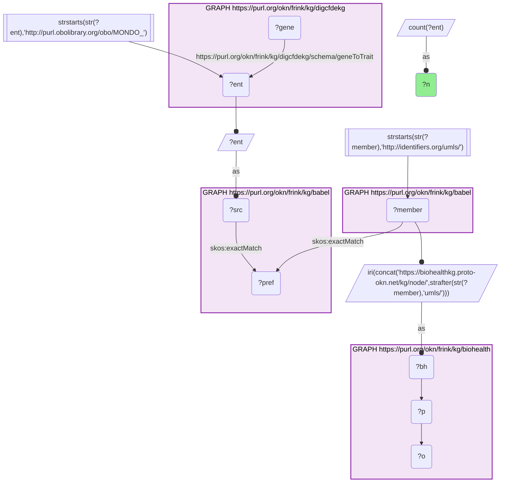
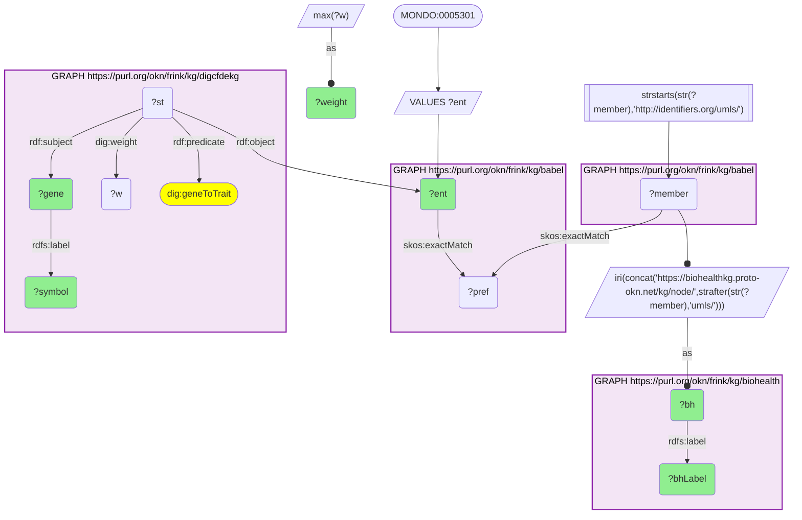
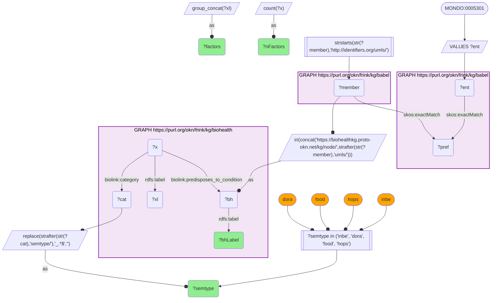
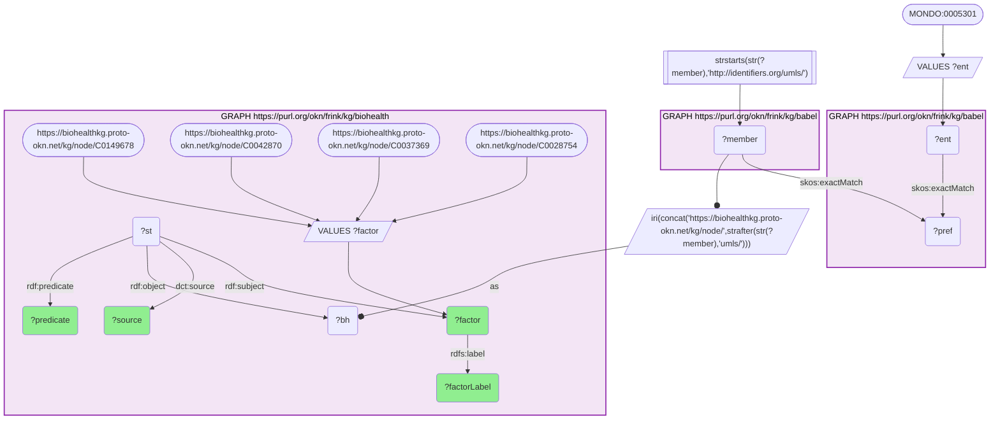
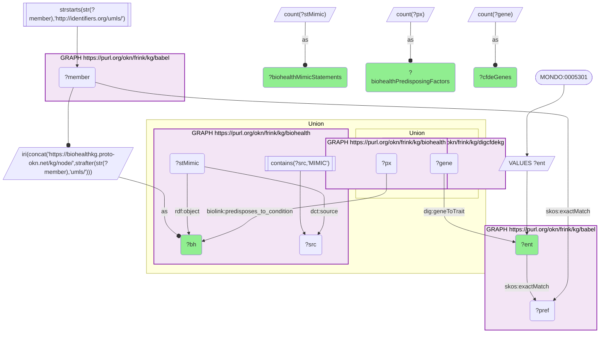

# Multiple sclerosis: CFDE genes beside BioHealthKG's behavioural and environmental risk factors, joined through Babel (MONDO → UMLS)

- **Date:** 2026-09-26
- **Model:** claude-opus-5-5
- **External MCP servers:** PubMed
- **SPARQL endpoint:** https://apps.okn.us/federation/sparql
- **Generated by:** mcp-okn v0.1.0 (build 7d8000e)
- **Contents:** 5 queries · 5 query diagrams

## Knowledge graphs used

- `digcfdekg` — <https://purl.org/okn/frink/kg/digcfdekg>
- `babel` — <https://purl.org/okn/frink/kg/babel>
- `biohealth` — <https://purl.org/okn/frink/kg/biohealth>

## Conversation

👤 **User**

Crosswalk: `biohealth` × `digcfdekg` on **UMLS ↔ MONDO, bridged through `babel`** (crosswalk `BH20-umls-mondo-biohealth-digcfdekg-via-babel`, verified_count 208). digcfdekg (the CFDE Data Distillery gene-trait KG) names many of its disease traits with MONDO IRIs (`http://purl.obolibrary.org/obo/MONDO_{id}`, the object of `geneToTrait`); biohealth (BioHealthKG) keys every entity on its UMLS CUI (`https://biohealthkg.proto-okn.net/kg/node/C{cui}`). The two graphs share no disease identifier scheme. babel (the Translator Babel identifier cliques) links them: each MONDO trait `skos:exactMatch`es its disease clique's preferred id, and the same clique holds an `http://identifiers.org/umls/C{cui}` member, which is rewritten to BioHealthKG's node IRI. Both babel hops are staged in nested `SELECT DISTINCT` subqueries, with the scheme filter applied outside them, or the join times out.

Research question: For a digcfdekg disease trait, multiple sclerosis (MONDO:0005301), which genes does the CFDE KG associate with it, and which clinical, behavioural and environmental concepts does BioHealthKG link to the same disease?

Why the join is required: the CFDE KG scores *genes* against the MS trait (PIGEAN `geneToTrait` weights) but says nothing about lifestyle, exposure or infection. BioHealthKG records *what the literature and MIMIC clinical notes say predisposes to, causes or accompanies* MS, typed by UMLS semantic type, but has no gene-trait model. MS is the only thing they share, named MONDO:0005301 on one side and UMLS C0026769 on the other, so the babel bridge is what puts MS's genetic and non-genetic risk side by side.

---

🧠 **Assistant**

The babel bridge joins **208 CFDE MONDO traits** to BioHealthKG (the crosswalk skeleton reproduces its verified count exactly). Multiple sclerosis (MONDO:0005301) resolves to a single BioHealthKG concept, **"Multiple Sclerosis" (UMLS C0026769)**. For that one disease, the CFDE KG scores **1,059 genes**. BioHealthKG names **519 distinct entities that predispose to it** and holds **18 statements about it that draw on MIMIC clinical records**.

**The genetic side (CFDE KG).** The highest-weighted CFDE genes for MS:

| Gene (Entrez) | PIGEAN weight |
| --- | --- |
| CD28 (940) | 10.6 |
| IL7R (3575) | 10.0 |
| IKZF3 (22806) | 9.76 |
| HLA-A (3105) | 9.26 |
| CD27 (939) | 9.07 |
| SOCS1 (8651) | 8.8 |
| CD40 (958) | 8.73 |
| TCF7 (6932) | 8.65 |
| CD5 (921) | 8.56 |
| CD86 (942) | 8.5 |
| IL2RA (3559) | 8.47 |
| HLA-DQB1 (3119) | 8.37 |
| RGS1 (5996) | 8.11 |
| CXCR5 (643) | 8.08 |
| CD6 (923) | 7.98 |

**The behavioural and environmental side (BioHealthKG).** Of the 519 predisposing entities, those whose first-listed UMLS semantic type is behavioural, activity, dietary or hazardous-exposure:

| UMLS semantic type | Predisposing factors | Examples (BioHealthKG labels) |
| --- | --- | --- |
| Individual Behavior (inbe) | 16 | Smoking; Tobacco use; Cigarette smoker; Cessation of smoking; Alcohol consumption; Dietary Habits; Milk intake; Physical Activity:behavior |
| Food (food) | 10 | Diet; Cod Liver Oil; Coffee; Meat; Processed meat; Soft Drinks; Fruit; Vegetables |
| Hazardous or Poisonous Substance (hops) | 10 | Tobacco smoke; Environmental Tobacco Smoke; Cigarette smoke; Nicotine; Air Pollutants; Rodenticides |
| Daily or Recreational Activity (dora) | 4 | Cigarette Smoking; Exercise; Physical activity; Fitness |

A check of four established MS risk factors shows what BioHealthKG asserts about each, and that it also carries **negated** statements (all PubMed-derived):

| Risk factor (UMLS) | Positive statements to MS | Negated statements to MS |
| --- | --- | --- |
| Epstein-Barr Virus Infections (C0149678) | predisposes_to_condition, causes, affects, coexists_with, precedes, increases_amount_or_activity_of, manifestation_of | NEG_CAUSES, NEG_AFFECTS, NEG_COEXISTS_WITH, NEG_PRECEDES |
| Vitamin D Deficiency (C0042870) | predisposes_to_condition, causes, affects, coexists_with | none |
| Smoking (C0037369) | predisposes_to_condition | NEG_PREDISPOSES |
| Obesity (C0028754) | predisposes_to_condition, causes, affects, coexists_with, increases_amount_or_activity_of | NEG_PREDISPOSES, NEG_AFFECTS, NEG_COEXISTS_WITH |

**Why it answers the question.** The CFDE side shows MS's genetic risk concentrated in adaptive-immune genes: T-cell co-stimulation (CD28, CD27, CD86, CD40, CD5, CD6), cytokine receptors and signalling (IL7R, IL2RA, SOCS1), lymphocyte transcription factors (IKZF3, TCF7) and HLA class I and II (HLA-A, HLA-DQB1). The BioHealthKG side supplies what the genes cannot: 40 behavioural, dietary, exposure and activity factors, among them smoking and tobacco exposure, diet and cod liver oil, and physical activity. It also records the infection (Epstein-Barr virus) and nutritional (vitamin D deficiency) factors that dominate MS epidemiology. Neither graph holds both halves, and the MONDO–UMLS bridge through babel is what lines them up.

**Caveats.** BioHealthKG statements are extracted from text, so they include contradictions: EBV, smoking and obesity each carry negated statements ("does not predispose", "does not cause") alongside positive ones. They are extractions, not curated conclusions, and a factor's presence says nothing about effect size. The semantic-type slice uses the *first* type in each entity's `biolink:category`; an entity whose first type is something else (for example Mercury, typed element first) is not counted. The four-factor check was a targeted look-up of chosen UMLS concepts, not a ranking. The CFDE weights are PIGEAN model scores, not GWAS statistics; HLA-DRB1 is not in this top 15, and why was not investigated. The 18 MIMIC-sourced statements are few beside the PubMed-derived ones, so the clinical-record side of BioHealthKG adds little for MS.

## Literature validation

The identifier join is **validated by construction**. MONDO:0005301 and UMLS C0026769 are registered identifiers for multiple sclerosis, and babel asserts their equivalence through a shared clique; no label matching is used. The hand-verified crosswalk `BH20-umls-mondo-biohealth-digcfdekg-via-babel` (verified_count 208) reproduces live.

The biomedical claims were checked against PubMed:

- **MS genetic risk is concentrated in immune genes, with HLA**: the IMSGC genomic map found 200 non-MHC autosomal variants plus 32 variants in the extended MHC. Its 551 prioritized genes implicate innate and adaptive pathways across the immune system (PMID 31604244, [DOI](https://doi.org/10.1126/science.aav7188)).
- **IL2RA and IL7R are MS risk loci**: IL2RA and CD58 effects were replicated in multiplex families, and the aggregate of IL2RA, IL7R, EVI5, KIAA0350 and CD58 risk genotypes differed sharply from controls (p = 1×10⁻²²) (PMID 19506219, [DOI](https://doi.org/10.1212/WNL.0b013e3181a92c25)).
- **Epstein-Barr virus**: in a cohort of more than 10 million US military personnel, MS risk rose 32-fold after EBV infection but not after other viruses (PMID 35025605, [DOI](https://doi.org/10.1126/science.abj8222)).
- **Vitamin D deficiency**: vitamin D has been associated with lower adult MS risk, and maternal vitamin D deficiency in early pregnancy was associated with a nearly 2-fold higher MS risk in offspring (RR 1.90) (PMID 26953778, [DOI](https://doi.org/10.1001/jamaneurol.2015.4800)).
- **Smoking**: a 2026 meta-analysis of 11 studies found smoking associated with higher MS risk (pooled OR 1.40, 95% CI 1.33–1.49); alcohol showed no significant association (PMID 42085349, [DOI](https://doi.org/10.1159/000552063)). BioHealthKG's `predisposes_to_condition` for alcohol consumption is therefore *not* supported by this review.
- **Obesity**: Mendelian randomization found a 1-SD increase in genetically determined BMI raised MS odds by 41% (OR 1.41) (PMID 27351487, [DOI](https://doi.org/10.1371/journal.pmed.1002053)).

The dietary, coffee and air-pollution factors in the semantic-type table were not checked individually and are reported as BioHealthKG content only.

Sources retrieved from PubMed.

**Validated.** The join uses shared registered identifiers bridged by babel, every number comes from a logged live query, and the immune-gene profile and the four established risk factors (EBV, vitamin D deficiency, smoking, obesity) are backed by literature. BioHealthKG's alcohol link is not supported, and its negated statements show that its predisposing factors need case-by-case review.

## SPARQL queries executed

#### Query 1

_2026-09-27T00:33:26+00:00 · `digcfdekg`, `babel`, `biohealth`_

```sparql
SELECT (COUNT(DISTINCT ?ent) AS ?n) WHERE {
  { SELECT DISTINCT ?ent ?member WHERE {
    { SELECT DISTINCT ?ent ?pref WHERE {
        { SELECT DISTINCT ?ent ?src WHERE { GRAPH <https://purl.org/okn/frink/kg/digcfdekg> { ?gene <https://purl.org/okn/frink/kg/digcfdekg/schema/geneToTrait> ?ent } FILTER(STRSTARTS(STR(?ent),'http://purl.obolibrary.org/obo/MONDO_')) BIND(?ent AS ?src) } }
        GRAPH <https://purl.org/okn/frink/kg/babel> { ?src <http://www.w3.org/2004/02/skos/core#exactMatch> ?pref } } }
    GRAPH <https://purl.org/okn/frink/kg/babel> { ?member <http://www.w3.org/2004/02/skos/core#exactMatch> ?pref } } }
  FILTER(STRSTARTS(STR(?member),'http://identifiers.org/umls/'))
  BIND(IRI(CONCAT('https://biohealthkg.proto-okn.net/kg/node/', STRAFTER(STR(?member),'umls/'))) AS ?bh)
  GRAPH <https://purl.org/okn/frink/kg/biohealth> { ?bh ?p ?o }
}
```



_1 row(s)_

| n |
| --- |
| 208 |

#### Query 2

_2026-09-27T00:33:36+00:00 · `babel`, `biohealth`, `digcfdekg`_

```sparql
PREFIX skos: <http://www.w3.org/2004/02/skos/core#>
PREFIX rdf: <http://www.w3.org/1999/02/22-rdf-syntax-ns#>
PREFIX rdfs: <http://www.w3.org/2000/01/rdf-schema#>
PREFIX dig: <https://purl.org/okn/frink/kg/digcfdekg/schema/>
SELECT ?ent ?bh ?bhLabel ?gene ?symbol (MAX(?w) AS ?weight) WHERE {
  { SELECT DISTINCT ?ent ?bh WHERE {
  { SELECT DISTINCT ?ent ?member WHERE {
    { SELECT DISTINCT ?ent ?pref WHERE {
        VALUES ?ent { <http://purl.obolibrary.org/obo/MONDO_0005301> }
        GRAPH <https://purl.org/okn/frink/kg/babel> { ?ent skos:exactMatch ?pref } } }
    GRAPH <https://purl.org/okn/frink/kg/babel> { ?member skos:exactMatch ?pref } } }
  FILTER(STRSTARTS(STR(?member),'http://identifiers.org/umls/'))
  BIND(IRI(CONCAT('https://biohealthkg.proto-okn.net/kg/node/', STRAFTER(STR(?member),'umls/'))) AS ?bh) } }
  GRAPH <https://purl.org/okn/frink/kg/biohealth> { ?bh rdfs:label ?bhLabel }
  GRAPH <https://purl.org/okn/frink/kg/digcfdekg> {
    ?st rdf:subject ?gene ; rdf:predicate dig:geneToTrait ; rdf:object ?ent ; dig:weight ?w .
    ?gene rdfs:label ?symbol }
} GROUP BY ?ent ?bh ?bhLabel ?gene ?symbol ORDER BY DESC(?weight) LIMIT 15
```



_15 row(s) — showing first 3_

| ent | bh | bhLabel | gene | symbol | weight |
| --- | --- | --- | --- | --- | --- |
| http://purl.obolibrary.org/obo/MONDO_0005301 | https://biohealthkg.proto-okn.net/kg/node/C0026769 | Multiple Sclerosis | http://www.ncbi.nlm.nih.gov/gene/940 | CD28 | 10.6 |
| http://purl.obolibrary.org/obo/MONDO_0005301 | https://biohealthkg.proto-okn.net/kg/node/C0026769 | Multiple Sclerosis | http://www.ncbi.nlm.nih.gov/gene/3575 | IL7R | 10.0 |
| http://purl.obolibrary.org/obo/MONDO_0005301 | https://biohealthkg.proto-okn.net/kg/node/C0026769 | Multiple Sclerosis | http://www.ncbi.nlm.nih.gov/gene/22806 | IKZF3 | 9.76 |

#### Query 3

_2026-09-27T00:34:00+00:00 · `babel`, `biohealth`_

```sparql
PREFIX skos: <http://www.w3.org/2004/02/skos/core#>
PREFIX rdfs: <http://www.w3.org/2000/01/rdf-schema#>
PREFIX biolink: <https://w3id.org/biolink/vocab/>
SELECT ?bhLabel ?semtype (COUNT(DISTINCT ?x) AS ?nFactors) (GROUP_CONCAT(DISTINCT ?xl; separator="; ") AS ?factors) WHERE {
  { SELECT DISTINCT ?ent ?bh WHERE {
  { SELECT DISTINCT ?ent ?member WHERE {
    { SELECT DISTINCT ?ent ?pref WHERE {
        VALUES ?ent { <http://purl.obolibrary.org/obo/MONDO_0005301> }
        GRAPH <https://purl.org/okn/frink/kg/babel> { ?ent skos:exactMatch ?pref } } }
    GRAPH <https://purl.org/okn/frink/kg/babel> { ?member skos:exactMatch ?pref } } }
  FILTER(STRSTARTS(STR(?member),'http://identifiers.org/umls/'))
  BIND(IRI(CONCAT('https://biohealthkg.proto-okn.net/kg/node/', STRAFTER(STR(?member),'umls/'))) AS ?bh) } }
  GRAPH <https://purl.org/okn/frink/kg/biohealth> {
    ?bh rdfs:label ?bhLabel .
    ?x biolink:predisposes_to_condition ?bh ; biolink:category ?cat ; rdfs:label ?xl . }
  BIND(REPLACE(STRAFTER(STR(?cat),'semtype/'), '_.*$', '') AS ?semtype)
  FILTER(?semtype IN ('inbe', 'dora', 'food', 'hops'))
} GROUP BY ?bhLabel ?semtype ORDER BY DESC(?nFactors)
```



_4 row(s) — showing first 3_

| bhLabel | semtype | nFactors | factors |
| --- | --- | --- | --- |
| Multiple Sclerosis | inbe | 16 | Health behavior; Physical Activity:behavior; skill; Confident; Psychological adjustment; Performance; healthful behavior; Tobacco use; Cigarette smoker; Milk intake; Behaviorial Habits; Cessation of smoking; Alcohol consumption; Smoking; Dietary Habits; Conflict (Psychology) |
| Multiple Sclerosis | food | 10 | Diet; Nutrients; Soft Drinks; Processed meat; Meat; Vegetables; Cod Liver Oil; Fruit; Coffee; Food |
| Multiple Sclerosis | hops | 10 | Smoke; Environmental Tobacco Smoke; Smoking tobacco; Tobacco smoke; Cigarette smoke (substance); Air Pollutants; Rodenticides; Irritants; Nicotine; Tobacco |

#### Query 4

_2026-09-27T00:34:01+00:00 · `babel`, `biohealth`_

```sparql
PREFIX skos: <http://www.w3.org/2004/02/skos/core#>
PREFIX rdf: <http://www.w3.org/1999/02/22-rdf-syntax-ns#>
PREFIX rdfs: <http://www.w3.org/2000/01/rdf-schema#>
PREFIX dct: <http://purl.org/dc/terms/>
SELECT ?factor ?factorLabel ?predicate ?source WHERE {
  { SELECT DISTINCT ?ent ?bh WHERE {
  { SELECT DISTINCT ?ent ?member WHERE {
    { SELECT DISTINCT ?ent ?pref WHERE {
        VALUES ?ent { <http://purl.obolibrary.org/obo/MONDO_0005301> }
        GRAPH <https://purl.org/okn/frink/kg/babel> { ?ent skos:exactMatch ?pref } } }
    GRAPH <https://purl.org/okn/frink/kg/babel> { ?member skos:exactMatch ?pref } } }
  FILTER(STRSTARTS(STR(?member),'http://identifiers.org/umls/'))
  BIND(IRI(CONCAT('https://biohealthkg.proto-okn.net/kg/node/', STRAFTER(STR(?member),'umls/'))) AS ?bh) } }
  GRAPH <https://purl.org/okn/frink/kg/biohealth> {
    VALUES ?factor { <https://biohealthkg.proto-okn.net/kg/node/C0149678> <https://biohealthkg.proto-okn.net/kg/node/C0042870> <https://biohealthkg.proto-okn.net/kg/node/C0037369> <https://biohealthkg.proto-okn.net/kg/node/C0028754> }
    ?st rdf:subject ?factor ; rdf:predicate ?predicate ; rdf:object ?bh ; dct:source ?source .
    ?factor rdfs:label ?factorLabel }
} ORDER BY ?factorLabel ?predicate
```



_25 row(s) — showing first 3_

| factor | factorLabel | predicate | source |
| --- | --- | --- | --- |
| https://biohealthkg.proto-okn.net/kg/node/C0149678 | Epstein-Barr Virus Infections | https://biohealthkg.proto-okn.net/kg/schema/NEG_AFFECTS | PubMed |
| https://biohealthkg.proto-okn.net/kg/node/C0149678 | Epstein-Barr Virus Infections | https://biohealthkg.proto-okn.net/kg/schema/NEG_CAUSES | PubMed |
| https://biohealthkg.proto-okn.net/kg/node/C0149678 | Epstein-Barr Virus Infections | https://biohealthkg.proto-okn.net/kg/schema/NEG_COEXISTS_WITH | PubMed |

#### Query 5

_2026-09-27T00:34:37+00:00 · `babel`, `digcfdekg`, `biohealth`_

```sparql
PREFIX skos: <http://www.w3.org/2004/02/skos/core#>
PREFIX rdf: <http://www.w3.org/1999/02/22-rdf-syntax-ns#>
PREFIX dct: <http://purl.org/dc/terms/>
PREFIX biolink: <https://w3id.org/biolink/vocab/>
PREFIX dig: <https://purl.org/okn/frink/kg/digcfdekg/schema/>
SELECT ?ent ?bh (COUNT(DISTINCT ?gene) AS ?cfdeGenes) (COUNT(DISTINCT ?px) AS ?biohealthPredisposingFactors) (COUNT(DISTINCT ?stMimic) AS ?biohealthMimicStatements) WHERE {
  { SELECT DISTINCT ?ent ?bh WHERE {
  { SELECT DISTINCT ?ent ?member WHERE {
    { SELECT DISTINCT ?ent ?pref WHERE {
        VALUES ?ent { <http://purl.obolibrary.org/obo/MONDO_0005301> }
        GRAPH <https://purl.org/okn/frink/kg/babel> { ?ent skos:exactMatch ?pref } } }
    GRAPH <https://purl.org/okn/frink/kg/babel> { ?member skos:exactMatch ?pref } } }
  FILTER(STRSTARTS(STR(?member),'http://identifiers.org/umls/'))
  BIND(IRI(CONCAT('https://biohealthkg.proto-okn.net/kg/node/', STRAFTER(STR(?member),'umls/'))) AS ?bh) } }
  { GRAPH <https://purl.org/okn/frink/kg/digcfdekg> { ?gene dig:geneToTrait ?ent } }
  UNION
  { GRAPH <https://purl.org/okn/frink/kg/biohealth> { ?px biolink:predisposes_to_condition ?bh } }
  UNION
  { GRAPH <https://purl.org/okn/frink/kg/biohealth> { ?stMimic rdf:object ?bh ; dct:source ?src FILTER(CONTAINS(?src, 'MIMIC')) } }
} GROUP BY ?ent ?bh
```



_1 row(s)_

| ent | bh | cfdeGenes | biohealthPredisposingFactors | biohealthMimicStatements |
| --- | --- | --- | --- | --- |
| http://purl.obolibrary.org/obo/MONDO_0005301 | https://biohealthkg.proto-okn.net/kg/node/C0026769 | 1059 | 519 | 18 |
