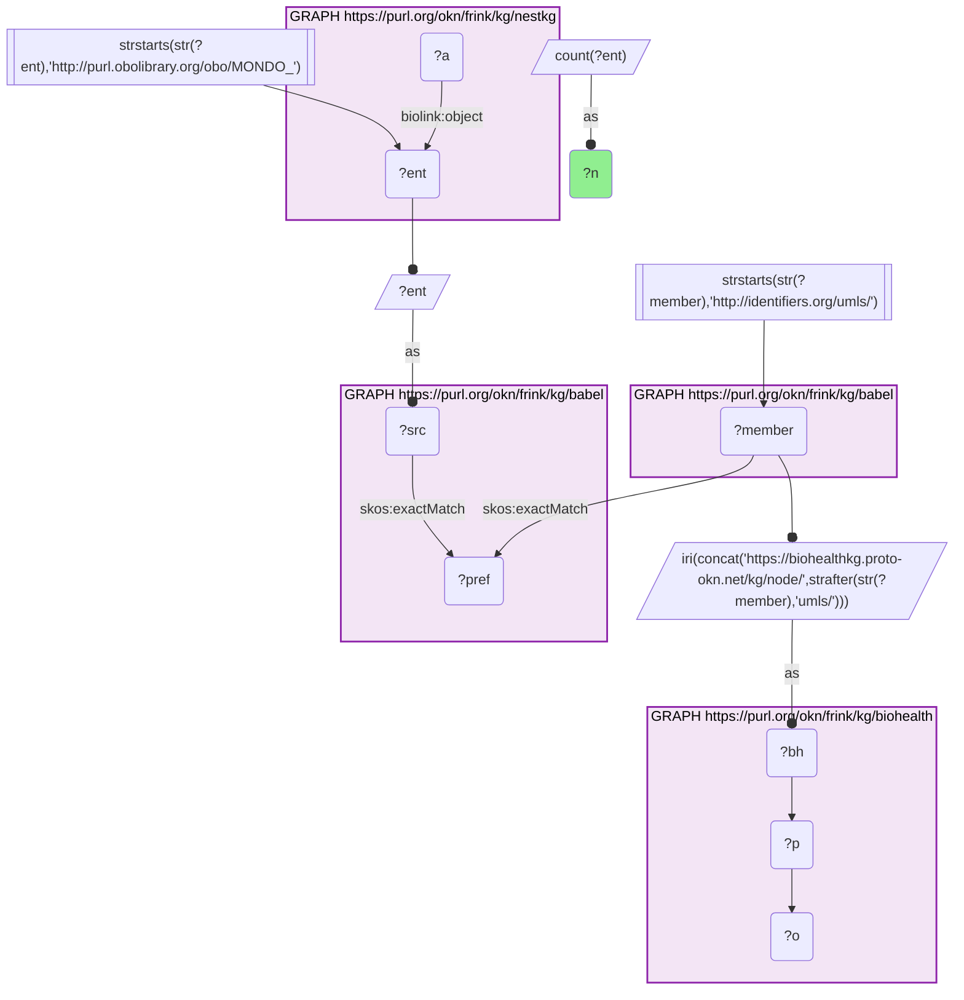
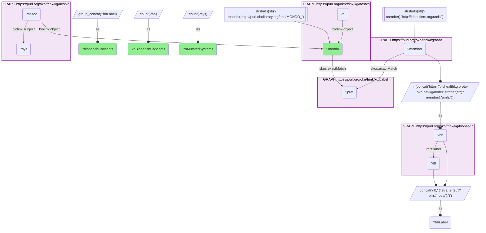
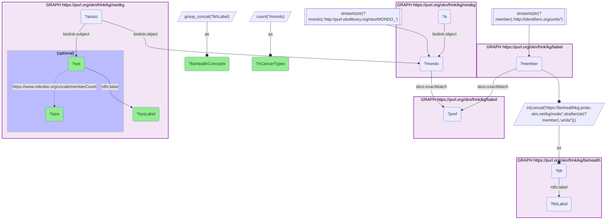
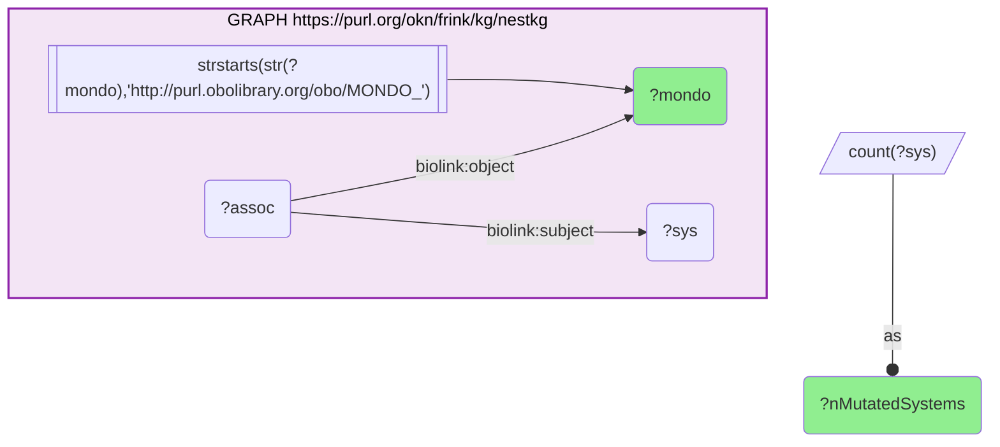
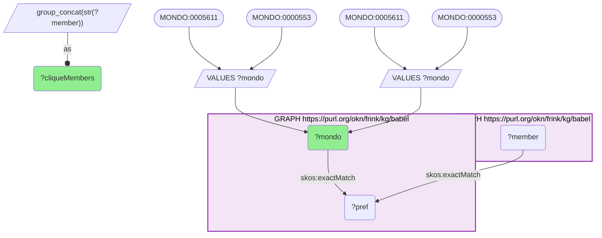

# NeST cancer types as BioHealthKG concepts and the protein systems mutated in them, joined through Babel (MONDO → UMLS)

- **Date:** 2026-09-26
- **Model:** claude-opus-5-5
- **External MCP servers:** PubMed
- **SPARQL endpoint:** https://apps.okn.us/federation/sparql
- **Generated by:** mcp-okn v0.1.0 (build 7d8000e)
- **Contents:** 5 queries · 5 query diagrams

## Knowledge graphs used

- `nestkg` — <https://purl.org/okn/frink/kg/nestkg>
- `babel` — <https://purl.org/okn/frink/kg/babel>
- `biohealth` — <https://purl.org/okn/frink/kg/biohealth>

## Conversation

👤 **User**

Crosswalk: `biohealth` × `nestkg` on **UMLS ↔ MONDO, bridged through `babel`** (crosswalk `BH21-umls-mondo-biohealth-nestkg-via-babel`, verified_count 12). nestkg (NeST, Nested Systems in Tumors) records which protein systems are under mutational selection in each cancer type as `biolink:Association` nodes whose `biolink:object` is a MONDO cancer type (`http://purl.obolibrary.org/obo/MONDO_{id}`) and whose `biolink:subject` is a NeST protein system. biohealth (BioHealthKG, literature-mined predications) keys its concepts on UMLS CUIs as the node IRI itself (`https://biohealthkg.proto-okn.net/kg/node/C{cui}`). The two graphs share no disease identifier. babel links them: each MONDO id `skos:exactMatch`es its clique's preferred id, the same clique holds `http://identifiers.org/umls/C{cui}` members, and each is rewritten to BioHealthKG's node IRI. Both babel hops are staged in nested `SELECT DISTINCT` subqueries so the join does not time out.

Research question: Which NeST cancer types (MONDO) are BioHealthKG concepts (MONDO ↔ UMLS via Babel), and which NeST protein systems are mutated in them?

Why the join is required: NeST knows *which protein systems are mutated in a cancer type* but names each cancer only by a bare MONDO IRI, with no label and no clinical context. BioHealthKG knows *what the literature says about a disease concept* (named UMLS concepts with treats / causes / associated-with predications) but has no MONDO ids and no NeST systems. Only the babel clique connects NeST's MONDO key to BioHealthKG's UMLS key.

---

🧠 **Assistant**

The babel bridge maps **12 of NeST's 14 MONDO cancer types** to **18 BioHealthKG UMLS concepts** (the skeleton reproduces the crosswalk's verified count of 12). Each bridged cancer type, the BioHealthKG concept(s) it lands on, and the number of NeST protein systems under mutational selection in it:

| NeST cancer type (MONDO) | BioHealthKG concept(s) (UMLS) | NeST systems mutated |
| --- | --- | --- |
| MONDO_0004992 | Malignant Neoplasms (C0006826); Neoplasms by Site (C0027653) | 112 |
| MONDO_0006256 | Invasive carcinoma of breast (C0853879) | 74 |
| MONDO_0006046 | Serous cystadenocarcinoma ovary (C0279663) | 61 |
| MONDO_0007256 | Liver carcinoma (C2239176) | 60 |
| MONDO_0005005 | Conventional (Clear Cell) Renal Cell Carcinoma (C0279702) | 54 |
| MONDO_0010150 | Squamous cell carcinoma of the head and neck (C1168401) | 45 |
| MONDO_0002271 | Adenocarcinoma of colon (C0338106) | 43 |
| MONDO_0005061 | Adenocarcinoma of lung (disorder) (C0152013); Non-Small Cell Adenocarcinoma (C1335060) | 30 |
| MONDO_0018177 | Glioblastoma Multiforme (C1621958); Glioblastoma (C0017636) | 30 |
| MONDO_0005036 | Gastric Adenocarcinoma (C0278701) | 28 |
| MONDO_0005097 | Squamous cell carcinoma of lung (C0149782) | 22 |
| MONDO_0005012 | Dysplastic Nevus Syndrome (C0013403); Familial Atypical Mole Melanoma Syndrome (C2314896); Familial Atypical Multiple Mole-Melanoma (C0205747); [X]Malignant melanoma of skin, unspecified (C0151779) | 11 |

The NeST protein systems mutated in the most bridged cancer types:

| NeST system | Size (proteins) | Bridged cancer types it is mutated in (of 12) |
| --- | --- | --- |
| MDM2-p53 pathway (NEST:186) | 11 | 11 |
| EGF/FGF stimulation of cell proliferation (NEST:132) | 19 | 8 |
| Resolution of D-loop structures (NEST:193) | 10 | 8 |
| Oncogene induced senescence (NEST:199) | 10 | 7 |
| Transmembrane receptor tyrosine kinase signaling (NEST:38) | 143 | 7 |
| AKT/activin signaling (NEST:52) | 92 | 6 |
| NEST:78 (unnamed) | 50 | 6 |
| Non-canonical BAF complex (NEST:267) | 5 | 6 |
| PIK3-cyclin signaling (NEST:335) | 4 | 6 |
| PIK3-insulin receptor signaling (NEST:375) | 4 | 6 |

**Why it answers the question.** The join gives NeST's unlabeled MONDO keys a readable, literature-grounded identity in BioHealthKG, and shows which protein systems NeST finds under selection in each. For 8 of the 12 cancer types the match is a single, specific BioHealthKG concept (breast, ovarian, liver, renal, head-and-neck, colon, gastric, lung squamous). The **MDM2-p53 pathway** is the most widely shared system: it is mutated in 11 of the 12 bridged cancer types, every one except melanoma. After it come growth-factor and kinase signalling systems (EGF/FGF stimulation, receptor tyrosine kinase signalling, PI3K sub-systems, AKT/activin) and DNA-repair and senescence systems (D-loop resolution, oncogene-induced senescence). Breast carcinoma has the most mutated systems of any specific tumour type (74); melanoma has the fewest (11).

**Caveats.**
- **Two NeST cancer types do not bridge.** MONDO_0005611 (81 NeST systems) and MONDO_0000553 (50 NeST systems) have babel cliques with no UMLS member. Besides the MONDO id itself, their cliques hold only DOID, NCIT, EFO or MedGen ids, so BioHealthKG cannot be reached from them through babel.
- **MONDO_0004992 is the pan-cancer term.** It lands on BioHealthKG's generic "Malignant Neoplasms" and "Neoplasms by Site" concepts, and its 112 systems are NeST's pan-cancer set, not a single tumour type. It is one of the 11 types that share the MDM2-p53 pathway.
- **The melanoma mapping is loose.** Babel's clique for MONDO_0005012 includes UMLS CUIs for dysplastic nevus / familial atypical mole-melanoma syndrome as well as cutaneous melanoma, so 3 of its 4 BioHealthKG concepts are hereditary-predisposition syndromes rather than the tumour. The clique, not BioHealthKG, is the source of that breadth. Treat those three concepts as a clique over-merge.
- One MONDO type can land on several BioHealthKG concepts (12 types → 18 concepts), because babel groups several UMLS CUIs in one clique. Counts are of distinct cancer types and systems, never cliques.
- NeST associations are `biolink:genetically_associated_with` with `statistical_association` knowledge level: they mark systems under mutational selection, not proof that each system drives that cancer. "NEST:78" has no descriptive name in nestkg.

## Literature validation

The identifier join is **validated by construction**. MONDO and UMLS are registered identifiers, and babel asserts their equivalence through a shared clique; no name matching is used. The crosswalk `BH21-umls-mondo-biohealth-nestkg-via-babel` (verified_count 12) reproduces live. The melanoma over-merge noted above is a property of the clique.

Checked against PubMed:

- **What NeST is**: NeST (Nested Systems in Tumors) is a multiscale map of cancer protein systems with a statistical model that pinpoints 395 systems under mutational selection across 13 cancer types, implicating 548 genes (PMID 34591613, [DOI](https://doi.org/10.1126/science.abf3067)). This confirms that nestkg's cancer-type associations are mutational-selection calls.
- **p53 pathway altered across many cancer types**: TCGA's pan-cancer analysis of ten canonical oncogenic pathways, including p53, across 33 cancer types found that 89% of tumours carry at least one driver alteration in these pathways (PMID 29625050, [DOI](https://doi.org/10.1016/j.cell.2018.03.035)). That is consistent with the MDM2-p53 pathway being the most widely shared NeST system here.
- **RTK and PI3K signalling among recurrently mutated processes**: the 12-cancer-type TCGA mutational analysis identified 127 significantly mutated genes, drawn from receptor tyrosine kinase, PI3K, MAPK, Wnt/β-catenin and cell-cycle-control processes, among others (PMID 24132290, [DOI](https://doi.org/10.1038/nature12634)). This supports the growth-factor / RTK / PI3K systems appearing across many bridged types.

The melanoma exception for MDM2-p53 is a NeST-specific finding and was not separately confirmed in the literature.

Sources retrieved from PubMed.

**Validated.** The join uses shared registered identifiers bridged by babel, the rows ran live against all three graphs, and the biological pattern (p53 and RTK/PI3K systems recurring across cancer types) is consistent with the literature.

## SPARQL queries executed

#### Query 1

_2026-09-27T00:25:21+00:00 · `nestkg`, `babel`, `biohealth`_

```sparql
SELECT (COUNT(DISTINCT ?ent) AS ?n) WHERE {
  { SELECT DISTINCT ?ent ?member WHERE {
    { SELECT DISTINCT ?ent ?pref WHERE {
        { SELECT DISTINCT ?ent ?src WHERE { GRAPH <https://purl.org/okn/frink/kg/nestkg> { ?a <https://w3id.org/biolink/vocab/object> ?ent } FILTER(STRSTARTS(STR(?ent),'http://purl.obolibrary.org/obo/MONDO_')) BIND(?ent AS ?src) } }
        GRAPH <https://purl.org/okn/frink/kg/babel> { ?src <http://www.w3.org/2004/02/skos/core#exactMatch> ?pref } } }
    GRAPH <https://purl.org/okn/frink/kg/babel> { ?member <http://www.w3.org/2004/02/skos/core#exactMatch> ?pref } } }
  FILTER(STRSTARTS(STR(?member),'http://identifiers.org/umls/'))
  BIND(IRI(CONCAT('https://biohealthkg.proto-okn.net/kg/node/', STRAFTER(STR(?member),'umls/'))) AS ?bh)
  GRAPH <https://purl.org/okn/frink/kg/biohealth> { ?bh ?p ?o }
}
```



_1 row(s)_

| n |
| --- |
| 12 |

#### Query 2

_2026-09-27T00:25:21+00:00 · `nestkg`, `babel`, `biohealth`_

```sparql
PREFIX rdfs: <http://www.w3.org/2000/01/rdf-schema#>
PREFIX biolink: <https://w3id.org/biolink/vocab/>
SELECT ?mondo (GROUP_CONCAT(DISTINCT ?bhLabel; separator=' | ') AS ?biohealthConcepts) (COUNT(DISTINCT ?bh) AS ?nBiohealthConcepts) (COUNT(DISTINCT ?sys) AS ?nMutatedSystems) WHERE {
  { SELECT DISTINCT ?mondo ?bh WHERE {
    { SELECT DISTINCT ?mondo ?member WHERE {
      { SELECT DISTINCT ?mondo ?pref WHERE {
          { SELECT DISTINCT ?mondo WHERE { GRAPH <https://purl.org/okn/frink/kg/nestkg> { ?a biolink:object ?mondo } FILTER(STRSTARTS(STR(?mondo),'http://purl.obolibrary.org/obo/MONDO_')) } }
          GRAPH <https://purl.org/okn/frink/kg/babel> { ?mondo <http://www.w3.org/2004/02/skos/core#exactMatch> ?pref } } }
      GRAPH <https://purl.org/okn/frink/kg/babel> { ?member <http://www.w3.org/2004/02/skos/core#exactMatch> ?pref } } }
    FILTER(STRSTARTS(STR(?member),'http://identifiers.org/umls/'))
    BIND(IRI(CONCAT('https://biohealthkg.proto-okn.net/kg/node/', STRAFTER(STR(?member),'umls/'))) AS ?bh) } }
  GRAPH <https://purl.org/okn/frink/kg/biohealth> { ?bh rdfs:label ?l0 }
  BIND(CONCAT(?l0,' (',STRAFTER(STR(?bh),'/node/'),')') AS ?bhLabel)
  GRAPH <https://purl.org/okn/frink/kg/nestkg> { ?assoc biolink:object ?mondo ; biolink:subject ?sys }
} GROUP BY ?mondo ORDER BY DESC(?nMutatedSystems)
```



_12 row(s) — showing first 3_

| mondo | biohealthConcepts | nBiohealthConcepts | nMutatedSystems |
| --- | --- | --- | --- |
| http://purl.obolibrary.org/obo/MONDO_0004992 | Malignant Neoplasms (C0006826) \| Neoplasms by Site (C0027653) | 2 | 112 |
| http://purl.obolibrary.org/obo/MONDO_0006256 | Invasive carcinoma of breast (C0853879) | 1 | 74 |
| http://purl.obolibrary.org/obo/MONDO_0006046 | Serous cystadenocarcinoma ovary (C0279663) | 1 | 61 |

#### Query 3

_2026-09-27T00:25:33+00:00 · `nestkg`, `babel`, `biohealth`_

```sparql
PREFIX rdfs: <http://www.w3.org/2000/01/rdf-schema#>
PREFIX biolink: <https://w3id.org/biolink/vocab/>
SELECT ?sys ?sysLabel ?size (COUNT(DISTINCT ?mondo) AS ?nCancerTypes) (GROUP_CONCAT(DISTINCT ?bhLabel; separator='; ') AS ?biohealthConcepts) WHERE {
  { SELECT DISTINCT ?mondo ?bh WHERE {
    { SELECT DISTINCT ?mondo ?member WHERE {
      { SELECT DISTINCT ?mondo ?pref WHERE {
          { SELECT DISTINCT ?mondo WHERE { GRAPH <https://purl.org/okn/frink/kg/nestkg> { ?a biolink:object ?mondo } FILTER(STRSTARTS(STR(?mondo),'http://purl.obolibrary.org/obo/MONDO_')) } }
          GRAPH <https://purl.org/okn/frink/kg/babel> { ?mondo <http://www.w3.org/2004/02/skos/core#exactMatch> ?pref } } }
      GRAPH <https://purl.org/okn/frink/kg/babel> { ?member <http://www.w3.org/2004/02/skos/core#exactMatch> ?pref } } }
    FILTER(STRSTARTS(STR(?member),'http://identifiers.org/umls/'))
    BIND(IRI(CONCAT('https://biohealthkg.proto-okn.net/kg/node/', STRAFTER(STR(?member),'umls/'))) AS ?bh) } }
  GRAPH <https://purl.org/okn/frink/kg/biohealth> { ?bh rdfs:label ?bhLabel }
  GRAPH <https://purl.org/okn/frink/kg/nestkg> {
    ?assoc biolink:object ?mondo ; biolink:subject ?sys .
    ?sys rdfs:label ?sysLabel .
    OPTIONAL { ?sys <https://www.ndexbio.org/vocab/memberCount> ?size } }
} GROUP BY ?sys ?sysLabel ?size ORDER BY DESC(?nCancerTypes) ?sysLabel LIMIT 15
```



_15 row(s) — showing first 3_

| sys | sysLabel | size | nCancerTypes | biohealthConcepts |
| --- | --- | --- | --- | --- |
| https://www.ndexbio.org/identifiers/NEST-186 | MDM2-p53 pathway | 11 | 11 | Invasive carcinoma of breast; Gastric Adenocarcinoma; Glioblastoma Multiforme; Squamous cell carcinoma of lung; Squamous cell carcinoma of the head and neck; Adenocarcinoma of lung (disorder); Adenocarcinoma of colon; Conventional (Clear Cell) Renal Cell Carcinoma; Serous cystadenocarcinoma ovary; Non-Small Cell Adenocarcinoma; Neoplasms by Site; Glioblastoma; Liver carcinoma; Malignant Neoplasms |
| https://www.ndexbio.org/identifiers/NEST-132 | EGF/FGF stimulation of cell proliferation | 19 | 8 | Serous cystadenocarcinoma ovary; Non-Small Cell Adenocarcinoma; Liver carcinoma; Adenocarcinoma of lung (disorder); Squamous cell carcinoma of lung; Invasive carcinoma of breast; Glioblastoma; Glioblastoma Multiforme; Squamous cell carcinoma of the head and neck; Gastric Adenocarcinoma |
| https://www.ndexbio.org/identifiers/NEST-193 | Resolution of D-loop structures | 10 | 8 | Non-Small Cell Adenocarcinoma; Conventional (Clear Cell) Renal Cell Carcinoma; Neoplasms by Site; Invasive carcinoma of breast; Squamous cell carcinoma of the head and neck; Adenocarcinoma of lung (disorder); Malignant Neoplasms; Gastric Adenocarcinoma; Squamous cell carcinoma of lung; Serous cystadenocarcinoma ovary |

#### Query 4

_2026-09-27T00:25:33+00:00 · `nestkg`_

```sparql
PREFIX biolink: <https://w3id.org/biolink/vocab/>
SELECT ?mondo (COUNT(DISTINCT ?sys) AS ?nMutatedSystems) WHERE {
  GRAPH <https://purl.org/okn/frink/kg/nestkg> {
    ?assoc biolink:object ?mondo ; biolink:subject ?sys .
    FILTER(STRSTARTS(STR(?mondo),'http://purl.obolibrary.org/obo/MONDO_')) }
} GROUP BY ?mondo ORDER BY DESC(?nMutatedSystems)
```



_14 row(s) — showing first 3_

| mondo | nMutatedSystems |
| --- | --- |
| http://purl.obolibrary.org/obo/MONDO_0004992 | 112 |
| http://purl.obolibrary.org/obo/MONDO_0005611 | 81 |
| http://purl.obolibrary.org/obo/MONDO_0006256 | 74 |

#### Query 5

_2026-09-27T00:25:50+00:00 · `babel`_

```sparql
SELECT ?mondo (GROUP_CONCAT(DISTINCT STR(?member); separator=' | ') AS ?cliqueMembers) WHERE {
  VALUES ?mondo { <http://purl.obolibrary.org/obo/MONDO_0005611> <http://purl.obolibrary.org/obo/MONDO_0000553> }
  { SELECT DISTINCT ?mondo ?pref WHERE { VALUES ?mondo { <http://purl.obolibrary.org/obo/MONDO_0005611> <http://purl.obolibrary.org/obo/MONDO_0000553> } GRAPH <https://purl.org/okn/frink/kg/babel> { ?mondo <http://www.w3.org/2004/02/skos/core#exactMatch> ?pref } } }
  GRAPH <https://purl.org/okn/frink/kg/babel> { ?member <http://www.w3.org/2004/02/skos/core#exactMatch> ?pref }
} GROUP BY ?mondo
```



_2 row(s)_

| mondo | cliqueMembers |
| --- | --- |
| http://purl.obolibrary.org/obo/MONDO_0000553 | http://purl.obolibrary.org/obo/DOID_0050939 \| http://purl.obolibrary.org/obo/MONDO_0000553 |
| http://purl.obolibrary.org/obo/MONDO_0005611 | http://purl.obolibrary.org/obo/DOID_4006 \| http://purl.obolibrary.org/obo/MONDO_0005611 \| http://purl.obolibrary.org/obo/NCIT_C39851 \| http://www.ebi.ac.uk/efo/EFO_0006544 \| https://www.ncbi.nlm.nih.gov/medgen/76013 |
