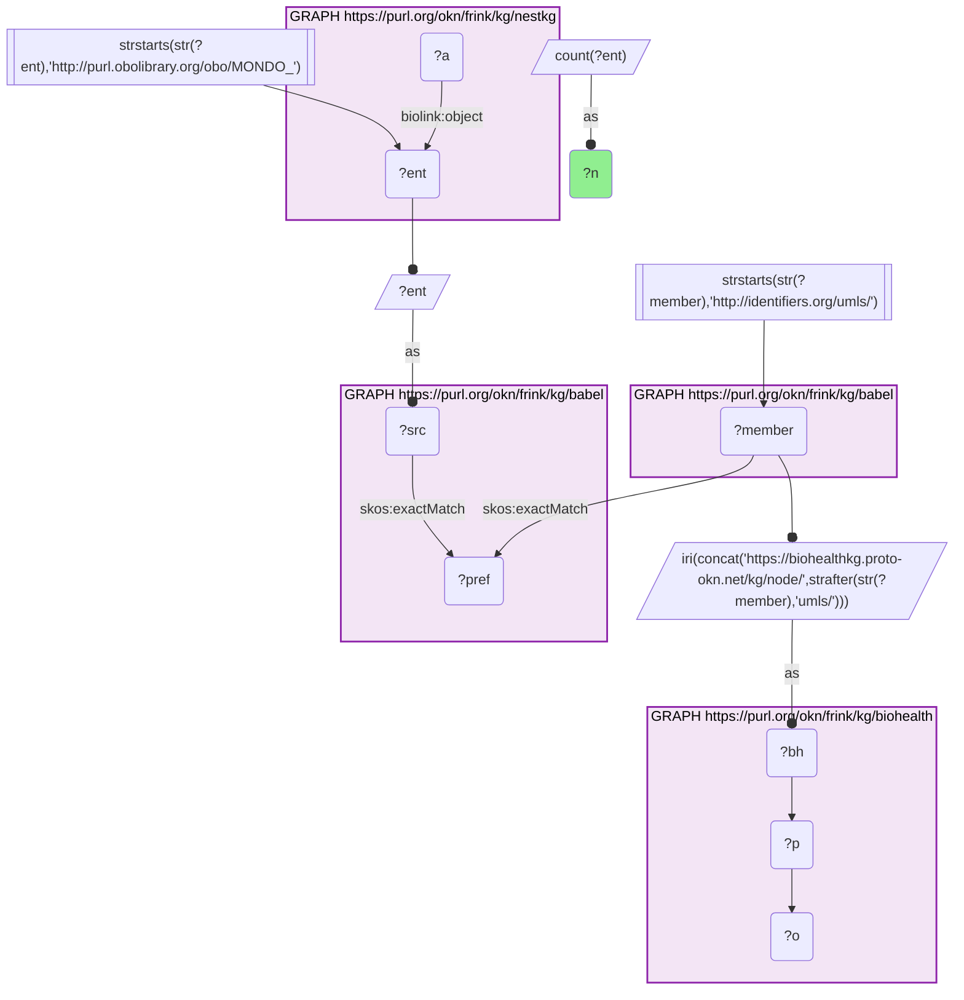
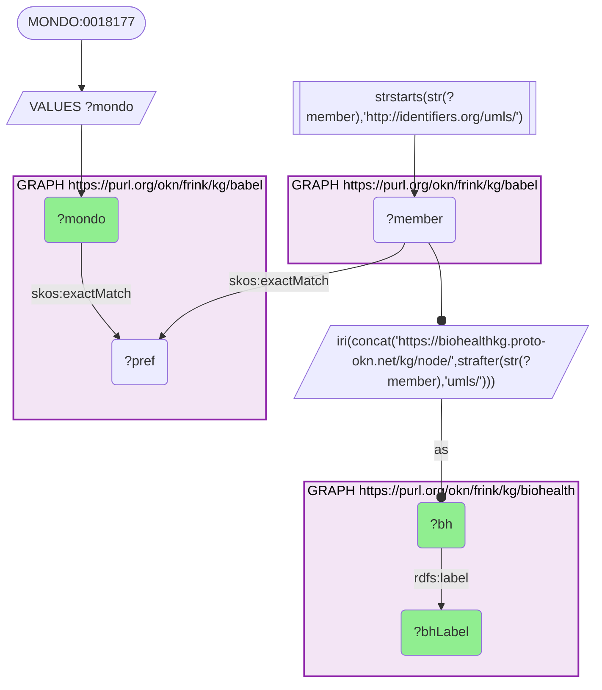
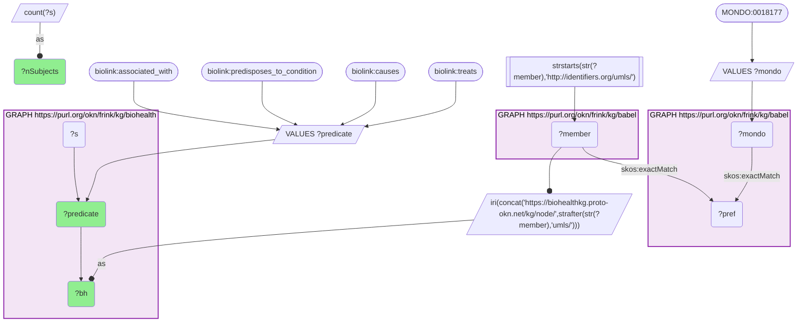
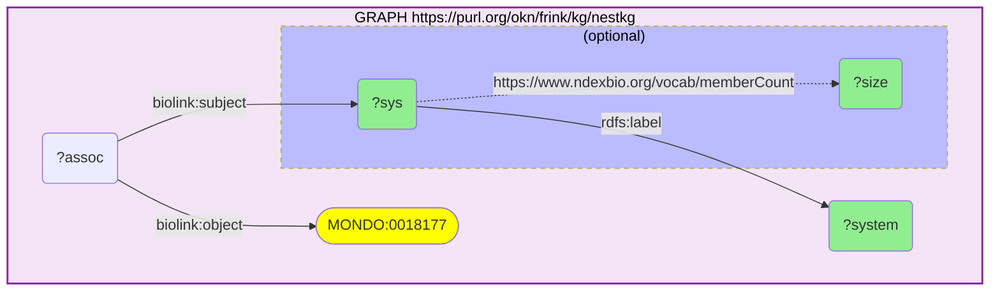
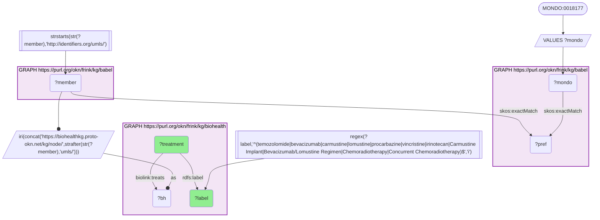
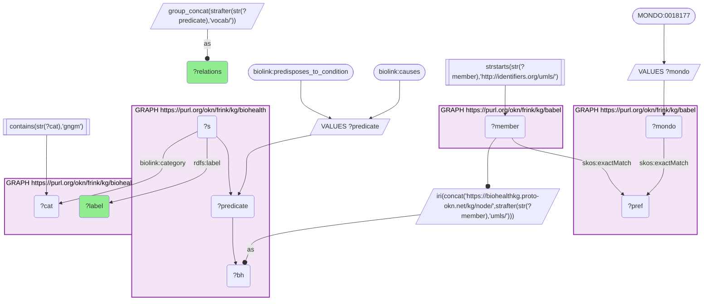

# Glioblastoma in BioHealthKG and NeST: literature-mined treatments and causes beside mutated protein systems, joined through Babel (MONDO → UMLS)

- **Date:** 2026-09-26
- **Model:** claude-opus-5-5
- **External MCP servers:** PubMed
- **SPARQL endpoint:** https://apps.okn.us/federation/sparql
- **Generated by:** mcp-okn v0.1.0 (build 7d8000e)
- **Contents:** 6 queries · 6 query diagrams

## Knowledge graphs used

- `nestkg` — <https://purl.org/okn/frink/kg/nestkg>
- `babel` — <https://purl.org/okn/frink/kg/babel>
- `biohealth` — <https://purl.org/okn/frink/kg/biohealth>

## Conversation

👤 **User**

Crosswalk: `biohealth` × `nestkg` on **UMLS ↔ MONDO, bridged through `babel`** (crosswalk `BH21-umls-mondo-biohealth-nestkg-via-babel`, verified_count 12). nestkg (NeST, Nested Systems in Tumors) records which protein systems are under mutational selection in each cancer type as `biolink:Association` nodes whose `biolink:object` is a MONDO cancer type (`http://purl.obolibrary.org/obo/MONDO_{id}`) and whose `biolink:subject` is a NeST protein system. biohealth (BioHealthKG, literature-mined predications) keys its concepts on UMLS CUIs as the node IRI itself (`https://biohealthkg.proto-okn.net/kg/node/C{cui}`). The two graphs share no disease identifier. babel links them: each MONDO id `skos:exactMatch`es its clique's preferred id, the same clique holds `http://identifiers.org/umls/C{cui}` members, and each is rewritten to BioHealthKG's node IRI. Both babel hops are staged in nested `SELECT DISTINCT` subqueries so the join does not time out.

Research question: For glioblastoma, one of NeST's cancer types (MONDO_0018177), what does BioHealthKG record about the disease — its literature-mined treatments and the gene/protein concepts said to cause or predispose to it — alongside the protein systems NeST finds mutated in it?

Why the join is required: NeST knows *which protein systems are under mutational selection in glioblastoma* but nothing about how the disease is treated or what the literature says causes it. BioHealthKG knows *what PubMed-mined predications say treats, causes or predisposes to glioblastoma* but has no MONDO id and no protein-system map. The only link between NeST's MONDO key and BioHealthKG's UMLS concepts is the babel clique.

---

🧠 **Assistant**

The crosswalk skeleton reproduces its verified count (12 NeST cancer types reach BioHealthKG). For glioblastoma, babel maps NeST's **MONDO_0018177** to **two BioHealthKG concepts**, *Glioblastoma* (C0017636) and *Glioblastoma Multiforme* (C1621958). Almost all of BioHealthKG's knowledge sits on the first:

| BioHealthKG concept | treats (distinct subjects) | associated_with | predisposes_to_condition | causes |
| --- | --- | --- | --- | --- |
| Glioblastoma (C0017636) | 1,206 | 1,080 | 148 | 119 |
| Glioblastoma Multiforme (C1621958) | 3 | 3 | — | — |

**NeST side: 30 protein systems under mutational selection in glioblastoma.** Grouped by theme (system size in proteins):

| Theme | NeST systems mutated in glioblastoma |
| --- | --- |
| EGFR / ERBB | PIK3-EGFR signaling (15); Erb and JAK-STAT signaling (41); EGFR-insulin receptor cross-talk (6); EGFR/Her4 signaling (5); EGFR/Her2/Her3 signaling (4) |
| Receptor tyrosine kinases / growth factors | Transmembrane receptor tyrosine kinase signaling (143); Proximal RTK signaling (5); Platelet-derived growth factor binding (5); EGF/FGF stimulation of cell proliferation (19) |
| PI3K / AKT | AKT1 activation (13); PIK3-cyclin signaling (4); PIK3-insulin receptor signaling (4) |
| p53 / cell cycle / senescence | MDM2-p53 pathway (11); JNK pathway regulation of TP53 (17); CDK holoenzyme complex I (30); Oncogene induced senescence (10); BH domain binding (5) |
| Chromatin / genome maintenance | DNA replication dependent nucleosome assembly (37); SMC5/6 and condensin co-complex (15); Cohesin complex (10); Cohesin loading complex formation (4); Histone and DNA methyltransferases (10) |
| Other | Collagens I, III, V, VI (8); Fibronectin-collagen (5); Cornified envelope part (5); Muscle filament sliding (4); RNAse L activation (4); unnamed NEST:156 (15), NEST:263 (5), NEST:324 (4) |

**BioHealthKG side: treatments.** Among the 1,206 subjects that `treats` glioblastoma, BioHealthKG records the core glioblastoma agents: **temozolomide**, **bevacizumab**, **lomustine**, **carmustine** (and the carmustine implant), **procarbazine**, **vincristine**, **irinotecan**, a **bevacizumab/lomustine regimen**, and **chemoradiotherapy** / **concurrent chemoradiotherapy** (11 concepts in all, from a targeted lookup of these names).

**BioHealthKG side: gene/protein concepts that cause or predispose to glioblastoma.** 48 distinct gene/protein-class concepts carry a `causes` or `predisposes_to_condition` edge to the disease. Those that line up with NeST's mutated systems, plus three that do not:

| BioHealthKG concept | Relation(s) | Matching NeST theme |
| --- | --- | --- |
| Receptor Protein-Tyrosine Kinases | causes, predisposes_to_condition | RTK signalling (Transmembrane / Proximal RTK) |
| Platelet-Derived Growth Factor Receptor | causes | Platelet-derived growth factor binding |
| Growth Factor Receptors; Growth Factor; Insulin-Like Growth Factor I | causes | EGF/FGF stimulation; EGFR-insulin receptor cross-talk; PIK3-insulin receptor |
| Oncogenes; Tumor Suppressor Genes | causes, predisposes_to_condition | MDM2-p53 pathway; oncogene-induced senescence |
| O(6)-Methylguanine-DNA Methyltransferase (MGMT) | causes, predisposes_to_condition | no NeST system is named for DNA-alkylation repair |
| Vascular Endothelial Growth Factor Receptor | predisposes_to_condition | none; it is the pathway bevacizumab targets |
| Telomerase | predisposes_to_condition | none |

The rest of the 48 are mostly broad classes ("Genes", "Proteins", "Enzymes", "Amino Acids") or inflammatory mediators (Interleukin-6, NF-kappa B, Inflammasomes).

**Why it answers the question.** Neither graph alone gives this two-sided picture. NeST says *which protein machinery is mutated*: glioblastoma's 30 systems are dominated by EGFR/ERBB and receptor-tyrosine-kinase signalling, PI3K/AKT, and the p53/cell-cycle axis. BioHealthKG says *how the disease is discussed and treated in the literature*. Read together, the literature-mined causal concepts (receptor tyrosine kinases, the PDGF receptor, growth-factor receptors, oncogenes and tumour suppressors) point at the same signalling axes as NeST's mutated systems. BioHealthKG also adds what a mutation map cannot show: the treatment backbone (temozolomide with radiotherapy, alongside nitrosoureas and bevacizumab) and **MGMT**, whose clinical relevance in glioblastoma is epigenetic (promoter methylation) rather than mutational.

**Caveats.**
- BioHealthKG is literature-mined (SemMedDB-style predications, `dc:source` PubMed). A `treats` or `causes` edge means some sentence asserted it; it is not a curated clinical fact. Many of the 1,206 treating subjects are generic classes or procedures, which is why the treatment list above comes from a targeted name lookup rather than a ranking. BioHealthKG's statements carry no support count to rank by.
- BioHealthKG's gene/protein concepts are mostly *classes* ("Receptor Protein-Tyrosine Kinases", "Oncogenes"), not specific genes. The "matching NeST theme" column is a thematic reading of names, not an identifier join: no gene-level key links BioHealthKG's concepts to NeST's UniProt-keyed system members in this analysis.
- The *Glioblastoma Multiforme* concept (C1621958) is nearly empty (3 + 3 edges). Almost everything comes from *Glioblastoma* (C0017636); babel places both CUIs in the MONDO_0018177 clique.
- The glioblastoma MONDO id is fixed in the payload queries; the MONDO-to-UMLS mapping is still resolved live through babel in every query.
- NeST associations are statistical mutational-selection calls; three of the 30 systems have no descriptive name in nestkg.

## Literature validation

The identifier join is **validated by construction**. MONDO and UMLS are registered identifiers, and babel asserts their equivalence through a shared clique; no name matching is used. The crosswalk `BH21-umls-mondo-biohealth-nestkg-via-babel` (verified_count 12) reproduces live.

Checked against PubMed:

- **Temozolomide + radiotherapy is the glioblastoma backbone**: in a 573-patient randomized phase 3 trial, adding concomitant and adjuvant temozolomide to radiotherapy raised median survival from 12.1 to 14.6 months (HR 0.63) (PMID 15758009, [DOI](https://doi.org/10.1056/NEJMoa043330)).
- **MGMT is an epigenetic predictive biomarker**: MGMT promoter methylation (45% of assessable cases) was an independent favourable prognostic factor, and patients with a methylated promoter benefited from temozolomide (PMID 15758010, [DOI](https://doi.org/10.1056/NEJMoa043331)). This supports reading MGMT as a methylation-driven marker, which a mutation-based map like NeST is not designed to capture.
- **Bevacizumab**: an anti-VEGF-A antibody approved for recurrent glioblastoma; first-line addition did not improve overall survival but prolonged progression-free survival (PMID 24552317, [DOI](https://doi.org/10.1056/NEJMoa1308573)). This is consistent with BioHealthKG's VEGF-receptor and bevacizumab edges, and a reminder that a `treats` predication is not proof of efficacy.
- **EGFR/ERBB, PI3K and p53 as core glioblastoma pathways**: TCGA's first glioblastoma analysis highlighted ERBB2, NF1 and TP53 and frequent mutations in the PI3K regulatory subunit PIK3R1 (PMID 18772890, [DOI](https://doi.org/10.1038/nature07385)). The 500+-tumour follow-up identified rearrangements of the signature receptors EGFR and PDGFRA and TERT promoter mutations linked to telomerase reactivation (PMID 24120142, [DOI](https://doi.org/10.1016/j.cell.2013.09.034)). This supports NeST's EGFR/RTK, PI3K and p53 systems, BioHealthKG's PDGF-receptor and telomerase concepts, and the thematic alignment between the two graphs.

Lomustine, carmustine, procarbazine, vincristine and irinotecan were not individually checked; they are reported only as BioHealthKG `treats` predications.

Sources retrieved from PubMed.

**Validated.** The join uses shared registered identifiers bridged by babel, the rows ran live against all three graphs, and the headline biology (temozolomide-based care, MGMT methylation, EGFR/PDGFRA/PI3K/p53 as core pathways) is literature-supported.

## SPARQL queries executed

#### Query 1

_2026-09-27T00:31:21+00:00 · `nestkg`, `babel`, `biohealth`_

```sparql
SELECT (COUNT(DISTINCT ?ent) AS ?n) WHERE {
  { SELECT DISTINCT ?ent ?member WHERE {
    { SELECT DISTINCT ?ent ?pref WHERE {
        { SELECT DISTINCT ?ent ?src WHERE { GRAPH <https://purl.org/okn/frink/kg/nestkg> { ?a <https://w3id.org/biolink/vocab/object> ?ent } FILTER(STRSTARTS(STR(?ent),'http://purl.obolibrary.org/obo/MONDO_')) BIND(?ent AS ?src) } }
        GRAPH <https://purl.org/okn/frink/kg/babel> { ?src <http://www.w3.org/2004/02/skos/core#exactMatch> ?pref } } }
    GRAPH <https://purl.org/okn/frink/kg/babel> { ?member <http://www.w3.org/2004/02/skos/core#exactMatch> ?pref } } }
  FILTER(STRSTARTS(STR(?member),'http://identifiers.org/umls/'))
  BIND(IRI(CONCAT('https://biohealthkg.proto-okn.net/kg/node/', STRAFTER(STR(?member),'umls/'))) AS ?bh)
  GRAPH <https://purl.org/okn/frink/kg/biohealth> { ?bh ?p ?o }
}
```



_1 row(s)_

| n |
| --- |
| 12 |

#### Query 2

_2026-09-27T00:33:34+00:00 · `babel`, `biohealth`_

```sparql
PREFIX rdfs: <http://www.w3.org/2000/01/rdf-schema#>
SELECT ?mondo ?bh ?bhLabel WHERE {
  { SELECT DISTINCT ?mondo ?bh WHERE {
    { SELECT DISTINCT ?mondo ?member WHERE {
      { SELECT DISTINCT ?mondo ?pref WHERE {
          VALUES ?mondo { <http://purl.obolibrary.org/obo/MONDO_0018177> }
          GRAPH <https://purl.org/okn/frink/kg/babel> { ?mondo <http://www.w3.org/2004/02/skos/core#exactMatch> ?pref } } }
      GRAPH <https://purl.org/okn/frink/kg/babel> { ?member <http://www.w3.org/2004/02/skos/core#exactMatch> ?pref } } }
    FILTER(STRSTARTS(STR(?member),'http://identifiers.org/umls/'))
    BIND(IRI(CONCAT('https://biohealthkg.proto-okn.net/kg/node/', STRAFTER(STR(?member),'umls/'))) AS ?bh) } }
  GRAPH <https://purl.org/okn/frink/kg/biohealth> { ?bh rdfs:label ?bhLabel }
}
```



_2 row(s)_

| mondo | bh | bhLabel |
| --- | --- | --- |
| http://purl.obolibrary.org/obo/MONDO_0018177 | https://biohealthkg.proto-okn.net/kg/node/C0017636 | Glioblastoma |
| http://purl.obolibrary.org/obo/MONDO_0018177 | https://biohealthkg.proto-okn.net/kg/node/C1621958 | Glioblastoma Multiforme |

#### Query 3

_2026-09-27T00:33:34+00:00 · `babel`, `biohealth`_

```sparql
PREFIX rdfs: <http://www.w3.org/2000/01/rdf-schema#>
PREFIX biolink: <https://w3id.org/biolink/vocab/>
SELECT ?bh ?predicate (COUNT(DISTINCT ?s) AS ?nSubjects) WHERE {
  { SELECT DISTINCT ?bh WHERE {
    { SELECT DISTINCT ?member WHERE {
      { SELECT DISTINCT ?pref WHERE {
          VALUES ?mondo { <http://purl.obolibrary.org/obo/MONDO_0018177> }
          GRAPH <https://purl.org/okn/frink/kg/babel> { ?mondo <http://www.w3.org/2004/02/skos/core#exactMatch> ?pref } } }
      GRAPH <https://purl.org/okn/frink/kg/babel> { ?member <http://www.w3.org/2004/02/skos/core#exactMatch> ?pref } } }
    FILTER(STRSTARTS(STR(?member),'http://identifiers.org/umls/'))
    BIND(IRI(CONCAT('https://biohealthkg.proto-okn.net/kg/node/', STRAFTER(STR(?member),'umls/'))) AS ?bh) } }
  { VALUES ?predicate { biolink:treats biolink:causes biolink:predisposes_to_condition biolink:associated_with } GRAPH <https://purl.org/okn/frink/kg/biohealth> { ?s ?predicate ?bh } }
} GROUP BY ?bh ?predicate ORDER BY ?bh DESC(?nSubjects)
```



_6 row(s) — showing first 3_

| bh | predicate | nSubjects |
| --- | --- | --- |
| https://biohealthkg.proto-okn.net/kg/node/C0017636 | https://w3id.org/biolink/vocab/treats | 1206 |
| https://biohealthkg.proto-okn.net/kg/node/C0017636 | https://w3id.org/biolink/vocab/associated_with | 1080 |
| https://biohealthkg.proto-okn.net/kg/node/C0017636 | https://w3id.org/biolink/vocab/predisposes_to_condition | 148 |

#### Query 4

_2026-09-27T00:33:34+00:00 · `nestkg`_

```sparql
PREFIX rdfs: <http://www.w3.org/2000/01/rdf-schema#>
PREFIX biolink: <https://w3id.org/biolink/vocab/>
SELECT ?sys ?system ?size WHERE {
  GRAPH <https://purl.org/okn/frink/kg/nestkg> {
    ?assoc biolink:object <http://purl.obolibrary.org/obo/MONDO_0018177> ; biolink:subject ?sys .
    ?sys rdfs:label ?system .
    OPTIONAL { ?sys <https://www.ndexbio.org/vocab/memberCount> ?size } }
} ORDER BY DESC(?size) ?system
```



_30 row(s) — showing first 3_

| sys | system | size |
| --- | --- | --- |
| https://www.ndexbio.org/identifiers/NEST-38 | Transmembrane receptor tyrosine kinase signaling | 143 |
| https://www.ndexbio.org/identifiers/NEST-89 | Erb and JAK-STAT signaling | 41 |
| https://www.ndexbio.org/identifiers/NEST-94 | DNA replication dependent nucleosome assembly | 37 |

#### Query 5

_2026-09-27T00:33:47+00:00 · `babel`, `biohealth`_

```sparql
PREFIX rdfs: <http://www.w3.org/2000/01/rdf-schema#>
PREFIX biolink: <https://w3id.org/biolink/vocab/>
SELECT ?treatment ?label WHERE {
  { SELECT DISTINCT ?bh WHERE {
    { SELECT DISTINCT ?member WHERE {
      { SELECT DISTINCT ?pref WHERE {
          VALUES ?mondo { <http://purl.obolibrary.org/obo/MONDO_0018177> }
          GRAPH <https://purl.org/okn/frink/kg/babel> { ?mondo <http://www.w3.org/2004/02/skos/core#exactMatch> ?pref } } }
      GRAPH <https://purl.org/okn/frink/kg/babel> { ?member <http://www.w3.org/2004/02/skos/core#exactMatch> ?pref } } }
    FILTER(STRSTARTS(STR(?member),'http://identifiers.org/umls/'))
    BIND(IRI(CONCAT('https://biohealthkg.proto-okn.net/kg/node/', STRAFTER(STR(?member),'umls/'))) AS ?bh) } }
  GRAPH <https://purl.org/okn/frink/kg/biohealth> { ?treatment biolink:treats ?bh . ?treatment rdfs:label ?label }
  FILTER(REGEX(?label, '^(temozolomide|bevacizumab|carmustine|lomustine|procarbazine|vincristine|irinotecan|Carmustine Implant|Bevacizumab/Lomustine Regimen|Chemoradiotherapy|Concurrent Chemoradiotherapy)$', 'i'))
} ORDER BY LCASE(?label)
```



_11 row(s) — showing first 3_

| treatment | label |
| --- | --- |
| https://biohealthkg.proto-okn.net/kg/node/C0796392 | bevacizumab |
| https://biohealthkg.proto-okn.net/kg/node/C5205330 | Bevacizumab/Lomustine Regimen |
| https://biohealthkg.proto-okn.net/kg/node/C0007257 | Carmustine |

#### Query 6

_2026-09-27T00:33:50+00:00 · `babel`, `biohealth`_

```sparql
PREFIX rdfs: <http://www.w3.org/2000/01/rdf-schema#>
PREFIX biolink: <https://w3id.org/biolink/vocab/>
SELECT ?label (GROUP_CONCAT(DISTINCT STRAFTER(STR(?predicate),'vocab/'); separator=', ') AS ?relations) WHERE {
  { SELECT DISTINCT ?bh WHERE {
    { SELECT DISTINCT ?member WHERE {
      { SELECT DISTINCT ?pref WHERE {
          VALUES ?mondo { <http://purl.obolibrary.org/obo/MONDO_0018177> }
          GRAPH <https://purl.org/okn/frink/kg/babel> { ?mondo <http://www.w3.org/2004/02/skos/core#exactMatch> ?pref } } }
      GRAPH <https://purl.org/okn/frink/kg/babel> { ?member <http://www.w3.org/2004/02/skos/core#exactMatch> ?pref } } }
    FILTER(STRSTARTS(STR(?member),'http://identifiers.org/umls/'))
    BIND(IRI(CONCAT('https://biohealthkg.proto-okn.net/kg/node/', STRAFTER(STR(?member),'umls/'))) AS ?bh) } }
  { VALUES ?predicate { biolink:causes biolink:predisposes_to_condition } GRAPH <https://purl.org/okn/frink/kg/biohealth> { ?s ?predicate ?bh } }
  GRAPH <https://purl.org/okn/frink/kg/biohealth> { ?s biolink:category ?cat . ?s rdfs:label ?label }
  FILTER(CONTAINS(STR(?cat), 'gngm'))
} GROUP BY ?label ORDER BY ?label
```



_48 row(s) — showing first 5_

| label | relations |
| --- | --- |
| alpha-methylacyl-CoA racemase | predisposes_to_condition |
| Amino Acids | predisposes_to_condition |
| angiopoietin 4 | predisposes_to_condition |
| Candidate Disease Gene | predisposes_to_condition |
| Collagen | predisposes_to_condition |
