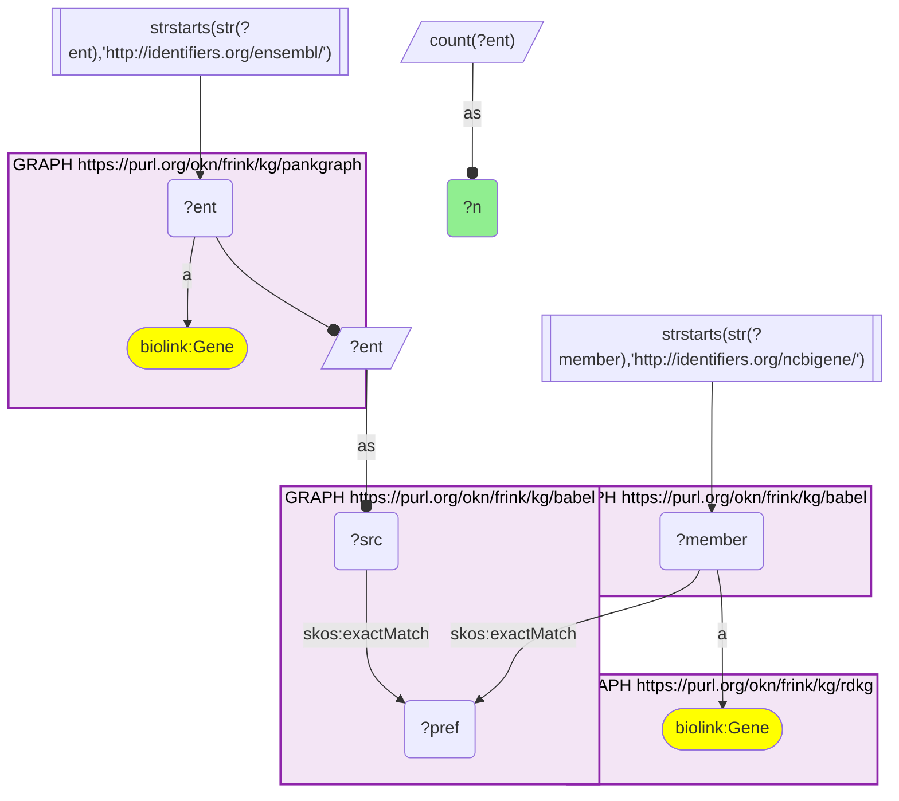
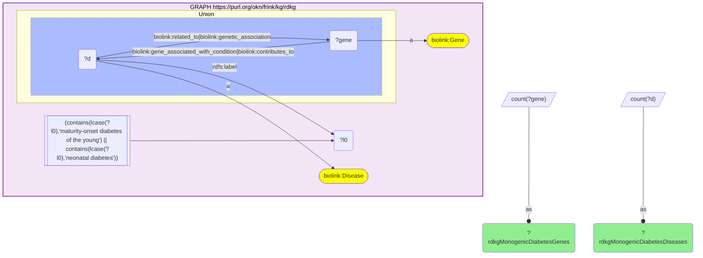

# RDKG monogenic-diabetes genes in PanKgraph's islet expression data, joined through Babel (Entrez → Ensembl)

- **Date:** 2026-09-26
- **Model:** claude-opus-5-5
- **External MCP servers:** PubMed
- **SPARQL endpoint:** https://apps.okn.us/federation/sparql
- **Generated by:** mcp-okn v0.1.0 (build 7d8000e)
- **Contents:** 3 queries · 3 query diagrams

## Knowledge graphs used

- `rdkg` — <https://purl.org/okn/frink/kg/rdkg>
- `babel` — <https://purl.org/okn/frink/kg/babel>
- `pankgraph` — <https://purl.org/okn/frink/kg/pankgraph>

## Conversation

👤 **User**

Crosswalk: `rdkg` × `pankgraph` on **Entrez → Ensembl, bridged through `babel`** (crosswalk `C22-entrez-rdkg-pankgraph-via-babel`, verified_count 9,159). rdkg keys its genes on NCBI Gene (Entrez) node IRIs (`http://identifiers.org/ncbigene/{id}`, `biolink:Gene`); pankgraph's gene nodes ARE Ensembl IRIs (`http://identifiers.org/ensembl/{ENSG}`, `biolink:Gene`). The two graphs share no gene identifier scheme. babel (the Translator Babel identifier cliques) links them: both IRI forms are already babel's own member forms, so each gene `skos:exactMatch`es its gene clique's preferred id and the clique's other member is read off directly, with no IRI rewrite. The two babel hops are staged in nested `SELECT DISTINCT` subqueries with the scheme filter outside both, or the join times out.

Research question: Which RDKG rare-disease genes are expressed or annotated in PanKgraph's pancreas data (Entrez ↔ Ensembl via Babel), taking monogenic diabetes (MODY and neonatal diabetes) as the example?

Why the join is required: RDKG knows *which genes cause which rare diseases* (gene–disease edges for MODY, neonatal diabetes and their subtypes) but has no tissue or cell-type data. PanKgraph knows *how each gene is expressed in human pancreatic islet cell types* (per-cell-type expression summaries, T1D-vs-non-diabetic differential expression) and which genes it annotates to type 1 diabetes, but has no rare-disease catalogue. RDKG identifies genes by Entrez id and PanKgraph by Ensembl id, so without the babel bridge a monogenic-diabetes gene cannot be looked up in the islet data at all.

---

🧠 **Assistant**

The babel bridge links **9,159 genes** between RDKG and PanKgraph (the crosswalk skeleton reproduces its verified count exactly). Taking monogenic diabetes as the example: RDKG attaches **35 genes** to its **8 disease nodes** whose labels name maturity-onset diabetes of the young (MODY) or neonatal diabetes, and **all 35 reach a PanKgraph gene** through babel. In PanKgraph:

- **23 of the 35** carry a beta-cell expression summary (one more, GATA6, has an alpha-cell summary only);
- **7** are differentially expressed between T1D and non-diabetic donors in some islet or exocrine cell type (2 of them in beta cells: INS and HNF4A);
- **5** are among the genes PanKgraph itself annotates to type 1 diabetes (`gene_associated_with_condition` MONDO:0005147): INS, GLIS3, CEL, IL2RA, ZFP57.

| Gene (RDKG) | Ensembl (PanKgraph) | RDKG monogenic-diabetes diseases | Beta-cell mean expr. | Alpha-cell mean expr. | T1D differential expression (PanKgraph) | PanKgraph T1D gene |
| --- | --- | --- | --- | --- | --- | --- |
| INS | ENSG00000254647 | neonatal DM; MODY; permanent neonatal DM | 22.52 | 13.38 | Beta: down in T1D (log2FC −0.799) | yes |
| ABCC8 | ENSG00000006071 | MODY; neonatal DM; transient & permanent neonatal DM | 11.49 | 10.06 | Delta: down in T1D (log2FC −1.651) | |
| GLIS3 | ENSG00000107249 | neonatal DM; neonatal DM with congenital hypothyroidism; permanent neonatal DM | 11.40 | 9.35 | | yes |
| IER3IP1 | ENSG00000134049 | permanent neonatal DM; microcephaly-epilepsy-PNDM syndrome | 10.72 | 10.28 | | |
| STAT3 | ENSG00000168610 | permanent neonatal DM | 10.68 | 11.33 | | |
| NEUROD1 | ENSG00000162992 | neonatal DM; MODY; permanent neonatal DM | 10.48 | 10.73 | Delta: down in T1D (log2FC −1.2063) | |
| MNX1 | ENSG00000130675 | neonatal DM; permanent neonatal DM | 9.92 | 8.57 | | |
| APPL1 | ENSG00000157500 | MODY | 9.77 | 9.82 | | |
| AGPAT2 | ENSG00000169692 | permanent neonatal DM | 9.57 | 8.42 | Acinar: down in T1D (log2FC −0.7256) | |
| PLAGL1 | ENSG00000118495 | transient neonatal DM | 9.43 | 9.74 | Delta: down in T1D (log2FC −1.4738) | |
| YIPF5 (RDKG label "Yip1 domain family member 5") | ENSG00000145817 | microcephaly-epilepsy-PNDM syndrome | 9.42 | 8.74 | | |
| PDX1 | ENSG00000139515 | permanent neonatal DM; MODY | 9.27 | — | | |
| RFX6 | ENSG00000185002 | neonatal DM; permanent neonatal DM | 9.14 | 10.92 | Delta: down in T1D (log2FC −1.0243) | |
| EIF2AK3 | ENSG00000172071 | neonatal DM; permanent neonatal DM | 8.74 | 9.21 | | |
| GCK | ENSG00000106633 | permanent neonatal DM; MODY | 8.26 | 8.31 | | |
| INSR | ENSG00000171105 | permanent neonatal DM | 7.26 | 9.82 | | |
| SLC2A2 | ENSG00000163581 | neonatal DM; permanent neonatal DM | 7.22 | — | | |
| KCNJ11 | ENSG00000187486 | neonatal DM (transient & permanent); MODY | 7.05 | 6.36 | | |
| SLC19A2 | ENSG00000117479 | neonatal DM; permanent neonatal DM | 6.72 | 6.61 | | |
| KLF11 | ENSG00000172059 | MODY | 6.23 | 8.58 | | |
| HNF4A | ENSG00000101076 | MODY; Fanconi renotubular syndrome 4 with MODY | 5.65 | 9.13 | Beta: down in T1D (log2FC −1.8304) | |
| HNF1A | ENSG00000135100 | MODY | 4.52 | 6.68 | | |
| HNF1B | ENSG00000275410 | MODY; permanent neonatal DM | 3.71 | 6.47 | | |

The other 12 bridged genes have no beta-cell expression summary in PanKgraph: GATA6 (alpha-cell summary 8.49 only), and BLK, CEL, FOXP3, GATA4, HYMAI, IL2RA, NEUROG3, NKX2-2, PAX4, PTF1A, ZFP57 (no beta- or alpha-cell summary). CEL, IL2RA and ZFP57 are still reached through PanKgraph's T1D gene annotation.

**Why it answers the question.** Each row joins RDKG's causal fact (this gene causes MODY or neonatal diabetes) to PanKgraph's islet fact (how strongly the gene is expressed in beta and alpha cells, and whether it shifts in T1D donors). Neither graph can produce the row alone. The join shows that the monogenic-diabetes gene set is fully present in PanKgraph and that most of it has a beta-cell expression summary. INS tops the list by a wide margin (22.52, against 11.49 for the next gene, the KATP-channel subunit ABCC8), followed by GLIS3, IER3IP1, STAT3, NEUROD1 and MNX1. Two of the genes, INS and HNF4A, are also lower in T1D beta cells, and GLIS3 and INS appear in both graphs' diabetes annotations (monogenic in RDKG, T1D in PanKgraph). The three HNF MODY genes (HNF1A, HNF1B, HNF4A) sit at the low end of beta-cell expression, and each has a higher alpha-cell mean than beta-cell mean in PanKgraph.

**How to read the numbers.** The expression values are PanKgraph's `All__expression_mean` on the reified `expressed_in` statement for the beta cell (CL:0000169) and alpha cell (CL:0000171), over all donors. PanKgraph does not state the unit, so compare values within this table, not with other datasets. The T1D column lists PanKgraph statements that carry `UpOrDownRegulation` and `Log2FoldChange` (T1D vs non-diabetic donors). All listed changes are downregulation.

**Caveats.** (1) "Monogenic diabetes" here is a label scope on RDKG's own disease nodes: any disease whose label contains *maturity-onset diabetes of the young* or *neonatal diabetes* (8 nodes, including syndromic forms). Gene–disease edges are read in both directions (`related_to`, `genetic_association`, `gene_associated_with_condition`, `contributes_to`). (2) RDKG's set is not only beta-cell genes. FOXP3, IL2RA and STAT3 are monogenic *autoimmune* diabetes genes. PLAGL1 and HYMAI sit at the imprinted 6q24 transient-neonatal-diabetes locus, and ZFP57 causes the same condition through loss of methylation at that locus. (3) A missing expression summary means PanKgraph carries no `expressed_in` summary for that gene and cell type. It does not mean the gene is unexpressed, and the graph does not say why the summaries are absent. (4) babel can place one id in two cliques, so every query counts genes, never cliques. The 35/35 bridge rate is for this disease slice; the crosswalk as a whole links 9,159 genes.

## Literature validation

The identifier join is **validated by construction**. NCBI Gene and Ensembl are registered, exact-string gene identifiers, and babel asserts their equivalence through a shared gene clique; no symbol or name matching is used. The hand-verified crosswalk `C22-entrez-rdkg-pankgraph-via-babel` (verified_count 9,159) reproduces live.

The gene–disease claims the answer relies on were checked against PubMed:

- **INS → permanent neonatal diabetes**: heterozygous INS coding mutations cause PNDM, with misfolded proinsulin and loss of beta-cell identity (PMID 38237895, [DOI](https://doi.org/10.1016/j.molmet.2024.101879)).
- **ABCC8 / KCNJ11 → neonatal diabetes**: activating variants in these two genes, which encode the beta-cell KATP channel subunits, are the most common genetic cause of neonatal diabetes (PMID 32027066, [DOI](https://doi.org/10.1002/humu.23995)). Activating ABCC8 mutations were shown to cause neonatal diabetes, and the patients responded to sulfonylureas (PMID 16885549, [DOI](https://doi.org/10.1056/NEJMoa055068)).
- **GCK → MODY and permanent neonatal diabetes**: heterozygous inactivating GCK mutations cause GCK-MODY, and homozygous ones cause PNDM (PMID 19790256, [DOI](https://doi.org/10.1002/humu.21110)).
- **GCK, HNF1A, HNF4A → MODY**: these three account for >90% of MODY cases (PMID 35638342, [DOI](https://doi.org/10.1111/jdi.13860)).
- **GLIS3 → neonatal diabetes with congenital hypothyroidism, and a T1D/T2D risk locus**: GLIS3 mutations cause a neonatal diabetes–congenital hypothyroidism syndrome, and GWAS associate GLIS3 variation with both T1D and T2D (PMID 27899417, [DOI](https://doi.org/10.1530/JME-16-0232)). GLIS3 knockdown increases beta-cell apoptosis (PMID 23737756, [DOI](https://doi.org/10.1371/journal.pgen.1003532)). This agrees with GLIS3 appearing in both RDKG's neonatal-diabetes set and PanKgraph's T1D gene set.
- **EIF2AK3 → neonatal diabetes (Wolcott-Rallison syndrome)**: WRS, neonatal/early-onset insulin-requiring diabetes with skeletal dysplasia, is caused by mutations in EIF2AK3 (PERK), an ER kinase of the unfolded protein response (PMID 21050479, [DOI](https://doi.org/10.1186/1750-1172-5-29)).
- **PLAGL1, HYMAI, ZFP57 → transient neonatal diabetes**: 6q24-TNDM is attributed to overexpression of the paternally inherited PLAGL1 and HYMAI genes at 6q24, and most TNDM patients with additional imprinting defects carry ZFP57 mutations (PMID 30315371, [DOI](https://doi.org/10.1007/s00592-018-1239-3)).
- **FOXP3, IL2RA, STAT3 → monogenic autoimmune diabetes**: these are among the seven known genes causing monogenic autoimmunity that can include early-onset diabetes (PMID 29417186, [DOI](https://doi.org/10.1007/s00125-018-4551-0)).
- **Monogenic diabetes overview**: MODY has 14 recognised subtypes, and permanent neonatal diabetes is most often due to activating KATP-channel mutations (PMID 40487603, [DOI](https://doi.org/10.4239/wjd.v16.i5.104787)).

The per-cell-type expression values and T1D fold changes are PanKgraph's own data and are reported as the graph states them; they were not independently re-checked against the source study.

Sources retrieved from PubMed.

**Validated.** The join uses registered gene identifiers bridged by babel, the rows ran live against both graphs, and every gene–disease claim highlighted above is supported by the literature.

## SPARQL queries executed

#### Query 1

_2026-09-27T00:14:24+00:00 · `pankgraph`, `babel`, `rdkg`_

```sparql
SELECT (COUNT(DISTINCT ?ent) AS ?n) WHERE {
  { SELECT DISTINCT ?ent ?member WHERE {
    { SELECT DISTINCT ?ent ?pref WHERE {
        { SELECT DISTINCT ?ent ?src WHERE { GRAPH <https://purl.org/okn/frink/kg/pankgraph> { ?ent a <https://w3id.org/biolink/vocab/Gene> } FILTER(STRSTARTS(STR(?ent),'http://identifiers.org/ensembl/')) BIND(?ent AS ?src) } }
        GRAPH <https://purl.org/okn/frink/kg/babel> { ?src <http://www.w3.org/2004/02/skos/core#exactMatch> ?pref } } }
    GRAPH <https://purl.org/okn/frink/kg/babel> { ?member <http://www.w3.org/2004/02/skos/core#exactMatch> ?pref } } }
  FILTER(STRSTARTS(STR(?member),'http://identifiers.org/ncbigene/'))
  GRAPH <https://purl.org/okn/frink/kg/rdkg> { ?member a <https://w3id.org/biolink/vocab/Gene> }
}
```



_1 row(s)_

| n |
| --- |
| 9159 |

#### Query 2

_2026-09-27T00:17:13+00:00 · `rdkg`_

```sparql
PREFIX biolink: <https://w3id.org/biolink/vocab/>
PREFIX rdfs: <http://www.w3.org/2000/01/rdf-schema#>
SELECT (COUNT(DISTINCT ?gene) AS ?rdkgMonogenicDiabetesGenes) (COUNT(DISTINCT ?d) AS ?rdkgMonogenicDiabetesDiseases) WHERE { GRAPH <https://purl.org/okn/frink/kg/rdkg> {
  ?d a biolink:Disease ; rdfs:label ?l0 .
  FILTER(CONTAINS(LCASE(?l0),'maturity-onset diabetes of the young') || CONTAINS(LCASE(?l0),'neonatal diabetes'))
  { ?d biolink:related_to|biolink:genetic_association ?gene } UNION { ?gene biolink:gene_associated_with_condition|biolink:contributes_to ?d }
  ?gene a biolink:Gene } }
```



_1 row(s)_

| rdkgMonogenicDiabetesGenes | rdkgMonogenicDiabetesDiseases |
| --- | --- |
| 35 | 8 |

#### Query 3

_2026-09-27T00:17:48+00:00 · `rdkg`, `babel`, `pankgraph`_

```sparql
PREFIX biolink: <https://w3id.org/biolink/vocab/>
PREFIX rdfs: <http://www.w3.org/2000/01/rdf-schema#>
PREFIX skos: <http://www.w3.org/2004/02/skos/core#>
PREFIX rdf: <http://www.w3.org/1999/02/22-rdf-syntax-ns#>
PREFIX pk: <https://purl.org/okn/frink/kg/pankgraph/schema/>
SELECT ?sym ?ens (GROUP_CONCAT(DISTINCT ?dl; separator="; ") AS ?rdkgMonogenicDiabetes)
       (MAX(?bm) AS ?betaMeanExpr) (MAX(?am) AS ?alphaMeanExpr)
       (GROUP_CONCAT(DISTINCT ?deCell; separator="; ") AS ?t1dDifferentialExpr) (SAMPLE(?t1d) AS ?pankgraphT1DGene) WHERE {
  { SELECT DISTINCT ?gene ?ens WHERE {
    { SELECT DISTINCT ?gene ?member WHERE {
      { SELECT DISTINCT ?gene ?pref WHERE {
          { SELECT DISTINCT ?gene WHERE { GRAPH <https://purl.org/okn/frink/kg/rdkg> {
              ?d a biolink:Disease ; rdfs:label ?l0 .
              FILTER(CONTAINS(LCASE(?l0),'maturity-onset diabetes of the young') || CONTAINS(LCASE(?l0),'neonatal diabetes'))
              { ?d biolink:related_to|biolink:genetic_association ?gene } UNION { ?gene biolink:gene_associated_with_condition|biolink:contributes_to ?d }
              ?gene a biolink:Gene } } }
          GRAPH <https://purl.org/okn/frink/kg/babel> { ?gene skos:exactMatch ?pref } } }
      GRAPH <https://purl.org/okn/frink/kg/babel> { ?member skos:exactMatch ?pref } } }
    FILTER(STRSTARTS(STR(?member),'http://identifiers.org/ensembl/'))
    BIND(?member AS ?ens)
    GRAPH <https://purl.org/okn/frink/kg/pankgraph> { ?ens a biolink:Gene } } }
  GRAPH <https://purl.org/okn/frink/kg/rdkg> {
    ?gene rdfs:label ?sym .
    { ?d2 biolink:related_to|biolink:genetic_association ?gene } UNION { ?gene biolink:gene_associated_with_condition|biolink:contributes_to ?d2 }
    ?d2 rdfs:label ?dl . FILTER(CONTAINS(LCASE(?dl),'maturity-onset diabetes of the young') || CONTAINS(LCASE(?dl),'neonatal diabetes')) }
  OPTIONAL { GRAPH <https://purl.org/okn/frink/kg/pankgraph> { ?sb rdf:subject ?ens ; rdf:object <http://purl.obolibrary.org/obo/CL_0000169> ; pk:All__expression_mean ?bm } }
  OPTIONAL { GRAPH <https://purl.org/okn/frink/kg/pankgraph> { ?sa rdf:subject ?ens ; rdf:object <http://purl.obolibrary.org/obo/CL_0000171> ; pk:All__expression_mean ?am } }
  OPTIONAL { GRAPH <https://purl.org/okn/frink/kg/pankgraph> { ?s rdf:subject ?ens ; rdf:object ?c ; pk:UpOrDownRegulation ?ud ; pk:Log2FoldChange ?lfc . ?c rdfs:label ?cl } BIND(CONCAT(?cl, ': ', ?ud, ' (log2FC ', STR(?lfc), ')') AS ?deCell) }
  OPTIONAL { GRAPH <https://purl.org/okn/frink/kg/pankgraph> { ?ens biolink:gene_associated_with_condition <http://purl.obolibrary.org/obo/MONDO_0005147> } BIND('yes' AS ?t1d) }
} GROUP BY ?sym ?ens ORDER BY DESC(?betaMeanExpr) ?sym
```



```mermaid
graph TD
classDef projected fill:lightgreen;
classDef literal fill:orange;
classDef iri fill:yellow;
  q2v3("?alphaMeanExpr"):::projected 
  q2v25("?am")
  q2v4("?betaMeanExpr"):::projected 
  q2v23("?bm")
  q2v31("?c")
  q2v27("?cl")
  q2v17("?d")
  q2v21("?d2")
  q2v26("?deCell")
  q2v20("?dl")
  q2v6("?ens"):::projected 
  q2v18("?gene")
  q2v16("?l0")
  q2v29("?lfc")
  q2v15("?member")
  q2v1("?pankgraphT1DGene"):::projected 
  q2v19("?pref")
  q2v5("?rdkgMonogenicDiabetes"):::projected 
  q2v30("?s")
  q2v24("?sa")
  q2v22("?sb")
  q2v7("?sym"):::projected 
  q2v32("?t1d")
  q2v2("?t1dDifferentialExpr"):::projected 
  q2v28("?ud")
  q2f0[["strstarts(str(?member),'http://identifiers.org/ensembl/')"]]
  q2f0 --> q2v15
  subgraph q2graph0["GRAPH https://purl.org/okn/frink/kg/rdkg"]
    style q2graph0 fill:#f3e5f5,stroke:#8e24aa,stroke-width:2px,color:#000;
    q2graph0c2(["biolink:Disease"]):::iri 
    q2graph0c4(["biolink:Gene"]):::iri 
    q2graph0f1[["(contains(lcase(?l0),'maturity-onset diabetes of the young') || contains(lcase(?l0),'neonatal diabetes'))"]]
    q2graph0f1 --> q2v16
    q2v17 --"a"--> q2graph0c2
    q2v17 --"rdfs:label"--> q2v16
    subgraph q2uniongraph00[" Union "]
    style q2uniongraph00 color:#000;
      q2v18 --"biolink:gene_associated_with_condition|biolink:contributes_to"--> q2v17
    subgraph q2uniongraph00r[" "]
      style q2uniongraph00r fill:#abf,stroke-dasharray: 3 3;
      q2v17 --"biolink:related_to|biolink:genetic_association"--> q2v18
    end
    end
    q2v18 --"a"--> q2graph0c4
  end
  subgraph q2graph1["GRAPH https://purl.org/okn/frink/kg/babel"]
    style q2graph1 fill:#f3e5f5,stroke:#8e24aa,stroke-width:2px,color:#000;
    q2v18 --"skos:exactMatch"--> q2v19
  end
  subgraph q2graph2["GRAPH https://purl.org/okn/frink/kg/babel"]
    style q2graph2 fill:#f3e5f5,stroke:#8e24aa,stroke-width:2px,color:#000;
    q2v15 --"skos:exactMatch"--> q2v19
  end
  q2bind0[/"?member"/]
  q2v15 --o q2bind0
  q2bind0 --as--o q2v6
  subgraph q2graph3["GRAPH https://purl.org/okn/frink/kg/pankgraph"]
    style q2graph3 fill:#f3e5f5,stroke:#8e24aa,stroke-width:2px,color:#000;
    q2graph3c2(["biolink:Gene"]):::iri 
    q2v6 --"a"--> q2graph3c2
  end
  subgraph q2graph4["GRAPH https://purl.org/okn/frink/kg/rdkg"]
    style q2graph4 fill:#f3e5f5,stroke:#8e24aa,stroke-width:2px,color:#000;
    q2graph4f2[["(contains(lcase(?dl),'maturity-onset diabetes of the young') || contains(lcase(?dl),'neonatal diabetes'))"]]
    q2graph4f2 --> q2v20
    q2v18 --"rdfs:label"--> q2v7
    subgraph q2uniongraph41[" Union "]
    style q2uniongraph41 color:#000;
      q2v18 --"biolink:gene_associated_with_condition|biolink:contributes_to"--> q2v21
    subgraph q2uniongraph41r[" "]
      style q2uniongraph41r fill:#abf,stroke-dasharray: 3 3;
      q2v21 --"biolink:related_to|biolink:genetic_association"--> q2v18
    end
    end
    q2v21 --"rdfs:label"--> q2v20
  end
  subgraph q2optional0["(optional)"]
  style q2optional0 fill:#bbf,stroke-dasharray: 5 5,color:#000;
    subgraph q2graph5["GRAPH https://purl.org/okn/frink/kg/pankgraph"]
      style q2graph5 fill:#f3e5f5,stroke:#8e24aa,stroke-width:2px,color:#000;
      q2graph5c2(["CL:0000169"]):::iri 
      q2v22 --"rdf:object"--> q2graph5c2
      q2v22 --"rdf:subject"--> q2v6
      q2v22 --"pk:All__expression_mean"--> q2v23
    end
  end
  subgraph q2optional1["(optional)"]
  style q2optional1 fill:#bbf,stroke-dasharray: 5 5,color:#000;
    subgraph q2graph6["GRAPH https://purl.org/okn/frink/kg/pankgraph"]
      style q2graph6 fill:#f3e5f5,stroke:#8e24aa,stroke-width:2px,color:#000;
      q2graph6c2(["CL:0000171"]):::iri 
      q2v24 --"rdf:object"--> q2graph6c2
      q2v24 --"rdf:subject"--> q2v6
      q2v24 --"pk:All__expression_mean"--> q2v25
    end
  end
  subgraph q2optional2["(optional)"]
  style q2optional2 fill:#bbf,stroke-dasharray: 5 5,color:#000;
    subgraph q2graph7["GRAPH https://purl.org/okn/frink/kg/pankgraph"]
      style q2graph7 fill:#f3e5f5,stroke:#8e24aa,stroke-width:2px,color:#000;
      q2v30 --"rdf:object"--> q2v31
      q2v30 --"rdf:subject"--> q2v6
      q2v30 --"pk:Log2FoldChange"--> q2v29
      q2v30 --"pk:UpOrDownRegulation"--> q2v28
      q2v31 --"rdfs:label"--> q2v27
    end
    q2bind1[/"concat(?cl,': ',?ud,' (log2FC ',str(?lfc),')')"/]
    q2v27 --o q2bind1
    q2v28 --o q2bind1
    q2v29 --o q2bind1
    q2bind1 --as--o q2v26
  end
  subgraph q2optional3["(optional)"]
  style q2optional3 fill:#bbf,stroke-dasharray: 5 5,color:#000;
    subgraph q2graph8["GRAPH https://purl.org/okn/frink/kg/pankgraph"]
      style q2graph8 fill:#f3e5f5,stroke:#8e24aa,stroke-width:2px,color:#000;
      q2graph8c2(["MONDO:0005147"]):::iri 
      q2v6 --"biolink:gene_associated_with_condition"--> q2graph8c2
    end
    q2bind2[/"'yes'"/]
    q2bind2 --as--o q2v32
  end
  q2bind3[/"group_concat(?dl)"/]
  q2bind3 --as--o q2v5
  q2bind4[/"max(?bm)"/]
  q2bind4 --as--o q2v4
  q2bind5[/"max(?am)"/]
  q2bind5 --as--o q2v3
  q2bind6[/"group_concat(?deCell)"/]
  q2bind6 --as--o q2v2
```

_35 row(s) — showing first 5_

| sym | ens | rdkgMonogenicDiabetes | betaMeanExpr | alphaMeanExpr | t1dDifferentialExpr | pankgraphT1DGene |
| --- | --- | --- | --- | --- | --- | --- |
| INS | http://identifiers.org/ensembl/ENSG00000254647 | neonatal diabetes mellitus; maturity-onset diabetes of the young; permanent neonatal diabetes mellitus | 22.519 | 13.3803 | Beta Cell: Downregulated in T1D (log2FC -0.799) | yes |
| ABCC8 | http://identifiers.org/ensembl/ENSG00000006071 | maturity-onset diabetes of the young; neonatal diabetes mellitus; transient neonatal diabetes mellitus; permanent neonatal diabetes mellitus | 11.4853 | 10.0626 | Delta Cell: Downregulated in T1D (log2FC -1.651) |  |
| GLIS3 | http://identifiers.org/ensembl/ENSG00000107249 | neonatal diabetes mellitus; neonatal diabetes mellitus with congenital hypothyroidism; permanent neonatal diabetes mellitus | 11.4038 | 9.3526 |  | yes |
| IER3IP1 | http://identifiers.org/ensembl/ENSG00000134049 | permanent neonatal diabetes mellitus; neonatal diabetes mellitus; Primary microcephaly-epilepsy-permanent neonatal diabetes syndrome | 10.7163 | 10.2812 |  |  |
| STAT3 | http://identifiers.org/ensembl/ENSG00000168610 | permanent neonatal diabetes mellitus; neonatal diabetes mellitus | 10.6791 | 11.3283 |  |  |
