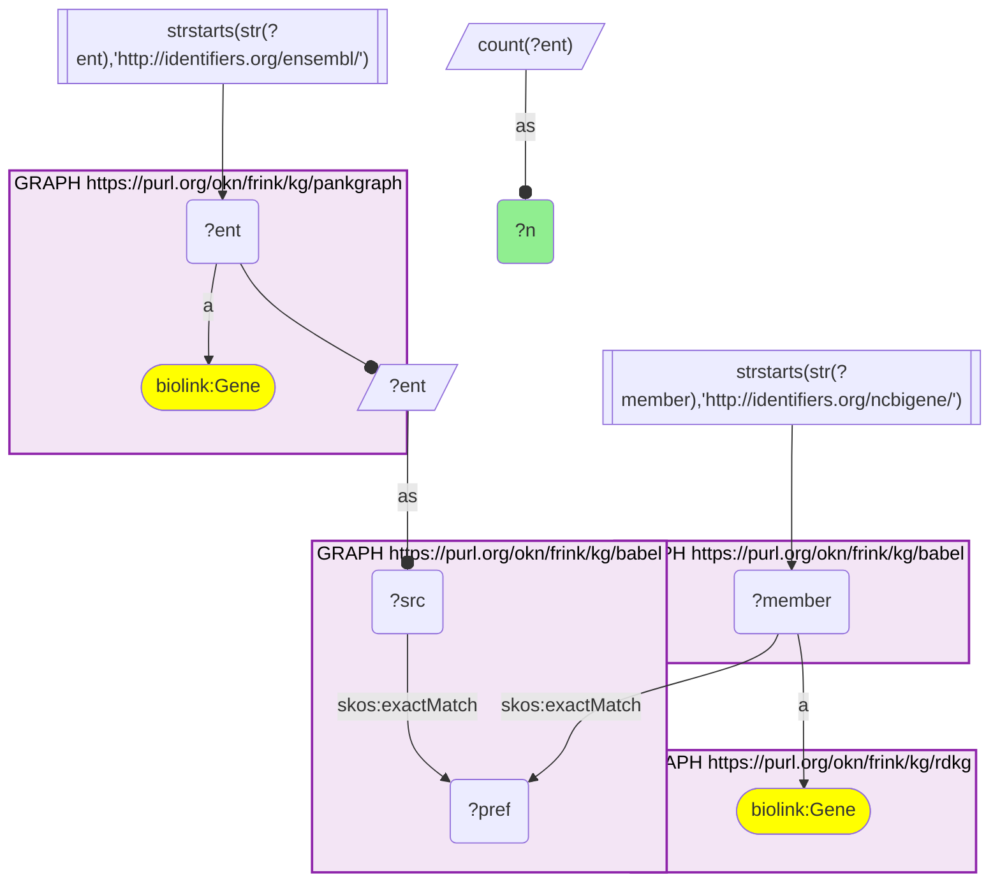
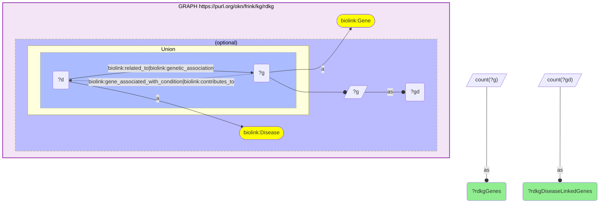
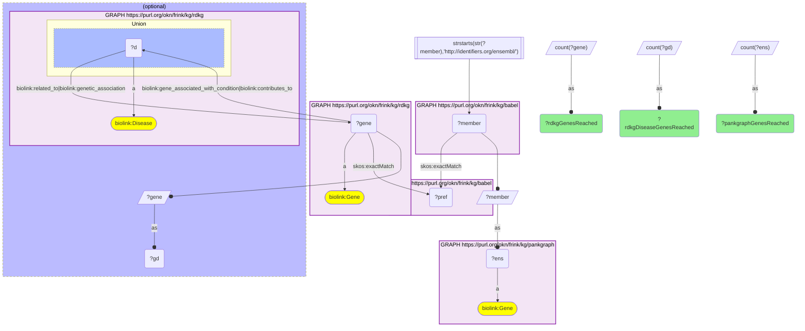
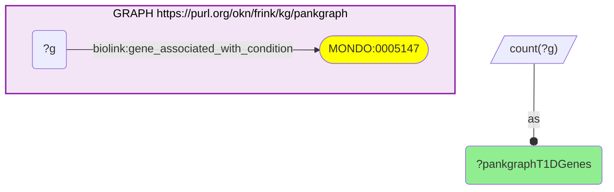
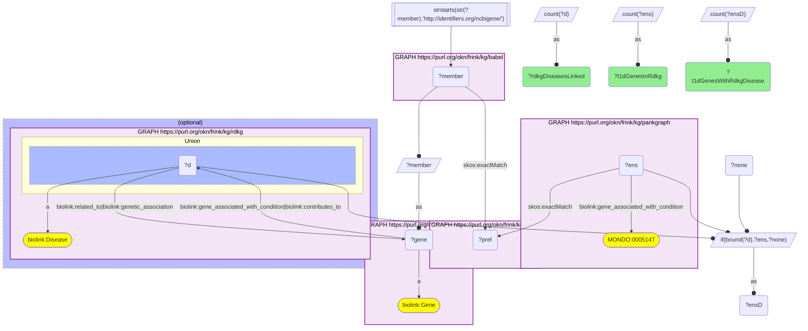
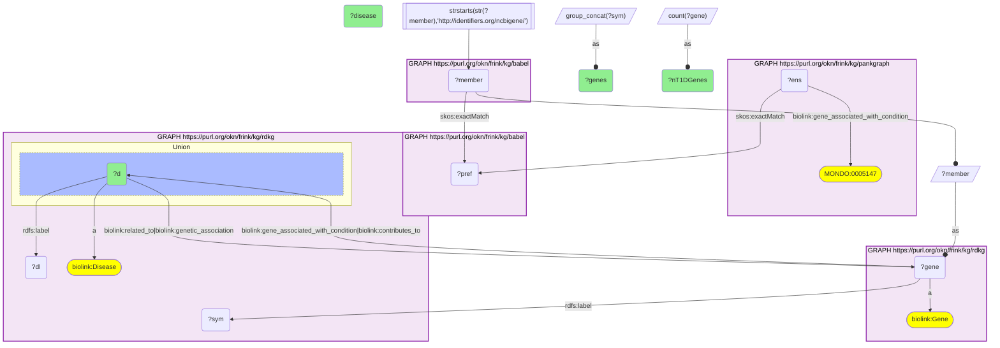
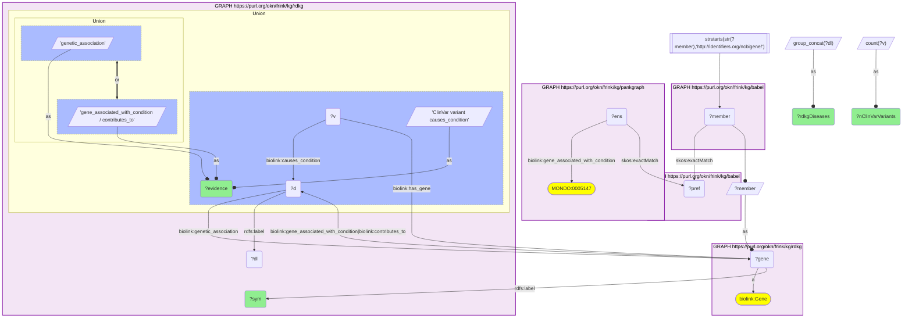
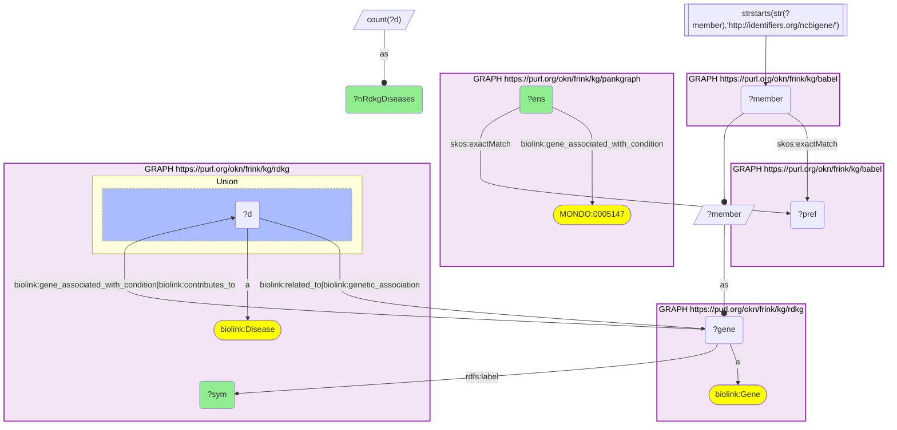

# RDKG disease genes reaching PanKgraph through Babel, and the RDKG diseases of PanKgraph's type 1 diabetes genes

- **Date:** 2026-09-26
- **Model:** claude-opus-5-5
- **External MCP servers:** PubMed
- **SPARQL endpoint:** https://apps.okn.us/federation/sparql
- **Generated by:** mcp-okn v0.1.0 (build 7d8000e)
- **Contents:** 8 queries · 8 query diagrams

## Knowledge graphs used

- `rdkg` — <https://purl.org/okn/frink/kg/rdkg>
- `babel` — <https://purl.org/okn/frink/kg/babel>
- `pankgraph` — <https://purl.org/okn/frink/kg/pankgraph>

## Conversation

👤 **User**

Crosswalk: `rdkg` × `pankgraph` on **Entrez → Ensembl, bridged through `babel`** (crosswalk `C22-entrez-rdkg-pankgraph-via-babel`, verified_count 9,159). rdkg keys its genes on NCBI Gene (Entrez) node IRIs (`http://identifiers.org/ncbigene/{id}`, `biolink:Gene`); pankgraph's gene nodes ARE Ensembl IRIs (`http://identifiers.org/ensembl/{ENSG}`, `biolink:Gene`). The two graphs share no gene identifier scheme. babel (the Translator Babel identifier cliques) links them: both IRI forms are already babel's own member forms, so each gene `skos:exactMatch`es its gene clique's preferred id and the clique's other member is read off directly, with no IRI rewrite. The two babel hops are staged in nested `SELECT DISTINCT` subqueries with the scheme filter outside both, or the join times out.

Research question: How many of RDKG's disease genes reach PanKgraph's Ensembl genes through Babel, and which RDKG diseases are linked to the pancreas-relevant ones (the genes PanKgraph annotates to type 1 diabetes)?

Why the join is required: PanKgraph knows *which genes matter in the pancreas* (its curated type 1 diabetes gene set, `gene_associated_with_condition` MONDO:0005147) but links them to no other disease. RDKG knows *which diseases each gene is associated with or causes* across its whole disease catalogue, but has no pancreas or T1D-specific gene evidence. PanKgraph names genes by Ensembl id and RDKG by Entrez id, so only the babel bridge can carry PanKgraph's T1D genes into RDKG's disease graph.

---

🧠 **Assistant**

**Coverage.** RDKG has **9,326 genes**, of which **9,160** carry at least one disease edge. Through babel, **9,159 RDKG genes** reach a PanKgraph Ensembl gene (98.2%), including **8,993 of the 9,160 disease-linked genes** (98.2%). The crosswalk skeleton reproduces its verified count of 9,159 exactly. So almost all of RDKG's disease genes can be looked up in PanKgraph.

**The pancreas-relevant genes.** PanKgraph annotates **176 genes** to type 1 diabetes. **118** of them reach an RDKG gene through babel, and **116** carry RDKG disease edges, which link them to **654 distinct RDKG diseases**.

The RDKG diseases linked to the most PanKgraph T1D genes (top 20):

| RDKG disease | PanKgraph T1D genes linked | Genes |
| --- | --- | --- |
| type 1 diabetes mellitus | 19 | SH2B3, GLIS3, C1QTNF6, CTSH, CTLA4, CCR5, CLEC16A, HLA-DQB1, HLA-DQA1, IL19, HLA-DRB1, IL27, PTPN22, IL20, IL10, INS, IL2RA, TYK2, BACH2 |
| diabetic ketoacidosis | 17 | same set minus CTLA4 and CCR5 |
| IDDM 1 | 17 | same set minus CTLA4 and CCR5 |
| pediatric systemic lupus erythematosus | 15 | CTLA4, IKZF1, CD226, RASGRP1, SH2B3, PTPN22, HLA-DRB1, ETS1, CLEC16A, HLA-DQA1, IL10, IL4, TNFAIP3, IFIH1, STAT4 |
| subacute bacterial endocarditis | 15 | identical to the SLE set |
| systemic lupus erythematosus | 15 | identical to the pediatric SLE set |
| anxiety disorder | 14 | IL24, CTLA4, ERBB3, LIF, IL2RA, IL20, IL2, PFKFB3, INS, RGS1, RAPH1, TYK2, TIMELESS, TH |
| rheumatoid arthritis | 14 | CTLA4, RASGRP1, HLA-DPB1, RBPJ, PTPN22, HLA-DRB1, AFF3, IL10, IL2RA, STAT4, TYK2, PTPN2, CD28, TNFAIP3 |
| breast cancer / breast neoplasm / hereditary breast carcinoma / hereditary breast-ovarian cancer syndrome | 13 each | TMED1, IL24, TMPRSS6, ERBB3, ZFYVE26, IL10, KCNJ1, ACAP1, RAD51B, TIMELESS, RAPH1, STAT4, DDX59 |
| schizophrenia | 13 | CCR5, CTLA4, IL19, HLA-DQB1, HLA-A, HLA-DRB1, HLA-B, ERBB3, IL2RA, IL10, IL4, PNPO, IL2 |
| squamous cell / undifferentiated carcinoma of the corpus uteri | 13 each | the breast-cancer set |
| unipolar depression | 13 | ERBB3, IL24, CTLA4, IL2, PFKFB3, IL20, LIF, INS, IL2RA, RAPH1, TIMELESS, TYK2, TH |
| multiple sclerosis | 12 | CLEC16A, HLA-DPB1, HLA-DQB1, HLA-DRA, HLA-DRB1, RBPJ, IL10, IL2RA, IL7R, STAT4, TNFAIP3, TYK2 |
| T-cell leukemia | 12 | CCR7, CTLA4, GPR183, ICOS, IL10, IRF4, IL7R, IL2, IL4, TYK2, PTPN2, CD28 |
| endogenous depression | 11 | ERBB3, IL24, CTLA4, PFKFB3, IL2RA, INS, IL20, IL2, TH, TYK2, RAPH1 |
| bipolar disorder | 10 | ADCY3, RASGRP1, CTLA4, HLA-DRB1, ERBB3, PFKFB3, INS, IL2, TH, TIMELESS |

The PanKgraph T1D genes with the broadest RDKG disease reach are INS (78 diseases), IL2 (76), HLA-DRB1 (72), IL10 (71), ERBB3 (55), CTLA4 and SH2B3 (45 each), TH (44), IL4 (39) and HLA-DQB1 (38).

**Which diseases they cause.** Most of these links use RDKG's broad `related_to` edge. Restricting to RDKG's causal or curated edges (`genetic_association`, `gene_associated_with_condition`/`contributes_to`, and ClinVar variants that `causes_condition`) leaves 14 PanKgraph T1D genes, each with a specific named disease:

| PanKgraph T1D gene | RDKG disease | RDKG evidence |
| --- | --- | --- |
| CFTR | cystic fibrosis; hereditary chronic pancreatitis; congenital bilateral aplasia of vas deferens from CFTR mutation; bronchiectasis with or without elevated sweat chloride 1 | 345 ClinVar variants |
| IL7R | immunodeficiency 104 | 8 ClinVar variants |
| ZFP57 | transient neonatal diabetes mellitus | genetic_association |
| CLN3 | CLN3 disease | genetic_association |
| RASGRP1 | EBV-induced lymphoproliferative disease due to RASGRP1 deficiency | genetic_association |
| IFIH1 | IFIH1-related hereditary spastic paraplegia | genetic_association |
| IL2RA, PTPN2, PTPN22, STAT4 | rheumatoid factor-negative polyarticular juvenile idiopathic arthritis | genetic_association |
| CD19, ICOS | common variable immunodeficiency (term marked OBSOLETE in RDKG) | genetic_association |
| IRF1 | IFNG-responsive severe Mendelian susceptibility to mycobacterial diseases (OBSOLETE) | genetic_association |
| HLA-B | pulmonary arterial hypertension associated with connective tissue disease | genetic_association |

**Why it answers the question.** The first half is a coverage count: 98.2% of RDKG's disease genes have a PanKgraph counterpart, so the bridge loses very little. The second half is the join itself: PanKgraph chose these 176 genes as T1D-relevant, and RDKG supplies every disease they are linked to. The result is a check and a finding in one. The check: the RDKG disease hit by the most PanKgraph T1D genes is type 1 diabetes itself (19 genes, with IDDM 1 and diabetic ketoacidosis next at 17), so the two graphs agree on the core genes (INS, the HLA class II genes, PTPN22, IL2RA, CTLA4, CLEC16A, GLIS3, TYK2). The finding: the next tier is other autoimmune diseases (SLE 15, rheumatoid arthritis 14, multiple sclerosis 12), carried by shared immune-regulatory genes such as PTPN22, CTLA4, STAT4, TNFAIP3 and HLA-DRB1. At the causal level, PanKgraph's T1D list also contains genes behind distinct Mendelian diseases, several of them pancreatic (CFTR: cystic fibrosis and hereditary chronic pancreatitis; ZFP57: transient neonatal diabetes) or immune (IL7R, RASGRP1).

**Caveats.** (1) RDKG's `related_to` edge is an unqualified association and dominates the gene–disease links. Several top rows (anxiety, depression, breast and uterine cancers, schizophrenia) are driven by cytokine and signalling genes (IL24, ERBB3, IL2, IL10, TIMELESS) and are not evidence of a T1D connection. Subacute bacterial endocarditis carries exactly the same 15 genes as SLE, which suggests the two share an annotation source, so treat such rows with caution. Only the second table uses causal edges. (2) RDKG's disease catalogue mixes rare and common conditions (type 2 diabetes and breast cancer are present), so "RDKG disease" here means any `biolink:Disease` node, with no separate rare-disease filter. (3) 58 of PanKgraph's 176 T1D genes do not reach an RDKG gene through babel. (4) babel can place one id in two cliques, so every query counts genes, never cliques. The crosswalk skeleton counts distinct PanKgraph genes (9,159), and the RDKG-side count is also 9,159.

## Literature validation

The identifier join is **validated by construction**. NCBI Gene and Ensembl are registered, exact-string gene identifiers, and babel asserts their equivalence through a shared gene clique; no symbol or name matching is used. The hand-verified crosswalk `C22-entrez-rdkg-pankgraph-via-babel` (verified_count 9,159) reproduces live.

The biological claims highlighted above were checked against PubMed:

- **Shared autoimmune genetics (PTPN22 in T1D, RA and SLE)**: PTPN22 is a shared genetic risk factor across autoimmune disorders, and its polymorphisms are associated with rheumatoid arthritis, type 1 diabetes and systemic lupus erythematosus (PMID 33866147, [DOI](https://doi.org/10.1016/j.semarthrit.2021.03.004)).
- **GLIS3 in T1D**: the GLIS3 region is a susceptibility locus for type 1 and type 2 diabetes, and GLIS3 loss increases beta-cell apoptosis (PMID 23737756, [DOI](https://doi.org/10.1371/journal.pgen.1003532)).
- **CFTR → hereditary chronic pancreatitis**: CFTR, alongside PRSS1, PRSS2 and SPINK1, is associated with idiopathic and hereditary chronic pancreatitis (PMID 18206817, [DOI](https://doi.org/10.1016/j.bpg.2007.10.019)); up to half of idiopathic chronic pancreatitis cases carry SPINK1 or CFTR mutations, and diabetes is a long-term sequela in 38–40% (PMID 31860051, [DOI](https://doi.org/10.1001/jama.2019.19411)).
- **ZFP57 → transient neonatal diabetes**: most TNDM patients with hypomethylation at additional imprinted loci carry ZFP57 mutations (PMID 30315371, [DOI](https://doi.org/10.1007/s00592-018-1239-3)).
- **IL7R → immunodeficiency**: deficiencies in the IL-7 pathway cause severe combined immunodeficiency, and excess IL-7 signalling is associated with autoimmune syndromes including T1D and MS (PMID 36201890, [DOI](https://doi.org/10.1016/j.cyto.2022.156049)).
- **RASGRP1 → EBV lymphoproliferative disease**: RASGRP1 deficiency is one of the inherited immunodeficiencies with high predisposition to EBV-driven lymphoproliferative disease (PMID 29942301, [DOI](https://doi.org/10.3389/fimmu.2018.01103)).
- **CLN3 → CLN3 disease**: mutations of CLN3 cause juvenile neuronal ceroid lipofuscinosis (Batten disease) (PMID 17896996, [DOI](https://doi.org/10.2174/156652407781695729)).
- **IFIH1 → neurological disease with spastic paraplegia**: a gain-of-function IFIH1 mutation produced an Aicardi-Goutières / Singleton-Merten overlap phenotype that included spastic paraplegia (PMID 34054923, [DOI](https://doi.org/10.3389/fgene.2021.660953)). This is a single case report, so it supports the link but not its frequency.

Not separately checked: the RF-negative polyarticular JIA links for IL2RA, PTPN2, PTPN22 and STAT4, the obsolete CVID and MSMD terms, and the HLA-B pulmonary-hypertension link. These are reported as RDKG states them. The `related_to` associations in the first table are RDKG's data and were not validated one by one.

Sources retrieved from PubMed.

**Validated, with the stated limits.** The join uses registered gene identifiers bridged by babel, the coverage and disease rows ran live, and every causal gene–disease claim highlighted above is supported by the literature. The broad `related_to` rows are reported as data, not as validated associations.

## SPARQL queries executed

#### Query 1

_2026-09-27T00:21:48+00:00 · `pankgraph`, `babel`, `rdkg`_

```sparql
SELECT (COUNT(DISTINCT ?ent) AS ?n) WHERE {
  { SELECT DISTINCT ?ent ?member WHERE {
    { SELECT DISTINCT ?ent ?pref WHERE {
        { SELECT DISTINCT ?ent ?src WHERE { GRAPH <https://purl.org/okn/frink/kg/pankgraph> { ?ent a <https://w3id.org/biolink/vocab/Gene> } FILTER(STRSTARTS(STR(?ent),'http://identifiers.org/ensembl/')) BIND(?ent AS ?src) } }
        GRAPH <https://purl.org/okn/frink/kg/babel> { ?src <http://www.w3.org/2004/02/skos/core#exactMatch> ?pref } } }
    GRAPH <https://purl.org/okn/frink/kg/babel> { ?member <http://www.w3.org/2004/02/skos/core#exactMatch> ?pref } } }
  FILTER(STRSTARTS(STR(?member),'http://identifiers.org/ncbigene/'))
  GRAPH <https://purl.org/okn/frink/kg/rdkg> { ?member a <https://w3id.org/biolink/vocab/Gene> }
}
```



_1 row(s)_

| n |
| --- |
| 9159 |

#### Query 2

_2026-09-27T00:23:08+00:00 · `rdkg`_

```sparql
PREFIX biolink: <https://w3id.org/biolink/vocab/>
SELECT (COUNT(DISTINCT ?g) AS ?rdkgGenes) (COUNT(DISTINCT ?gd) AS ?rdkgDiseaseLinkedGenes) WHERE { GRAPH <https://purl.org/okn/frink/kg/rdkg> {
  ?g a biolink:Gene .
  OPTIONAL { { ?d biolink:related_to|biolink:genetic_association ?g } UNION { ?g biolink:gene_associated_with_condition|biolink:contributes_to ?d } ?d a biolink:Disease . BIND(?g AS ?gd) } } }
```



_1 row(s)_

| rdkgGenes | rdkgDiseaseLinkedGenes |
| --- | --- |
| 9326 | 9160 |

#### Query 3

_2026-09-27T00:23:08+00:00 · `rdkg`, `babel`, `pankgraph`_

```sparql
PREFIX biolink: <https://w3id.org/biolink/vocab/>
PREFIX skos: <http://www.w3.org/2004/02/skos/core#>
SELECT (COUNT(DISTINCT ?gene) AS ?rdkgGenesReached) (COUNT(DISTINCT ?gd) AS ?rdkgDiseaseGenesReached) (COUNT(DISTINCT ?ens) AS ?pankgraphGenesReached) WHERE {
  { SELECT DISTINCT ?gene ?ens WHERE {
    { SELECT DISTINCT ?gene ?member WHERE {
      { SELECT DISTINCT ?gene ?pref WHERE {
          { SELECT DISTINCT ?gene WHERE { GRAPH <https://purl.org/okn/frink/kg/rdkg> { ?gene a biolink:Gene } } }
          GRAPH <https://purl.org/okn/frink/kg/babel> { ?gene skos:exactMatch ?pref } } }
      GRAPH <https://purl.org/okn/frink/kg/babel> { ?member skos:exactMatch ?pref } } }
    FILTER(STRSTARTS(STR(?member),'http://identifiers.org/ensembl/'))
    BIND(?member AS ?ens)
    GRAPH <https://purl.org/okn/frink/kg/pankgraph> { ?ens a biolink:Gene } } }
  OPTIONAL { SELECT DISTINCT ?gene (?gene AS ?gd) WHERE { GRAPH <https://purl.org/okn/frink/kg/rdkg> { { ?d biolink:related_to|biolink:genetic_association ?gene } UNION { ?gene biolink:gene_associated_with_condition|biolink:contributes_to ?d } ?d a biolink:Disease } } }
}
```



_1 row(s)_

| rdkgGenesReached | rdkgDiseaseGenesReached | pankgraphGenesReached |
| --- | --- | --- |
| 9159 | 8993 | 9159 |

#### Query 4

_2026-09-27T00:23:46+00:00 · `pankgraph`_

```sparql
PREFIX biolink: <https://w3id.org/biolink/vocab/>
SELECT (COUNT(DISTINCT ?g) AS ?pankgraphT1DGenes) WHERE { GRAPH <https://purl.org/okn/frink/kg/pankgraph> { ?g biolink:gene_associated_with_condition <http://purl.obolibrary.org/obo/MONDO_0005147> } }
```



_1 row(s)_

| pankgraphT1DGenes |
| --- |
| 176 |

#### Query 5

_2026-09-27T00:23:46+00:00 · `pankgraph`, `babel`, `rdkg`_

```sparql
PREFIX biolink: <https://w3id.org/biolink/vocab/>
PREFIX skos: <http://www.w3.org/2004/02/skos/core#>
SELECT (COUNT(DISTINCT ?ens) AS ?t1dGenesInRdkg) (COUNT(DISTINCT ?ensD) AS ?t1dGenesWithRdkgDisease) (COUNT(DISTINCT ?d) AS ?rdkgDiseasesLinked) WHERE {
  { SELECT DISTINCT ?ens ?gene WHERE {
    { SELECT DISTINCT ?ens ?member WHERE {
      { SELECT DISTINCT ?ens ?pref WHERE {
          { SELECT DISTINCT ?ens WHERE { GRAPH <https://purl.org/okn/frink/kg/pankgraph> { ?ens biolink:gene_associated_with_condition <http://purl.obolibrary.org/obo/MONDO_0005147> } } }
          GRAPH <https://purl.org/okn/frink/kg/babel> { ?ens skos:exactMatch ?pref } } }
      GRAPH <https://purl.org/okn/frink/kg/babel> { ?member skos:exactMatch ?pref } } }
    FILTER(STRSTARTS(STR(?member),'http://identifiers.org/ncbigene/'))
    BIND(?member AS ?gene)
    GRAPH <https://purl.org/okn/frink/kg/rdkg> { ?gene a biolink:Gene } } }
  OPTIONAL { GRAPH <https://purl.org/okn/frink/kg/rdkg> { { ?d biolink:related_to|biolink:genetic_association ?gene } UNION { ?gene biolink:gene_associated_with_condition|biolink:contributes_to ?d } ?d a biolink:Disease } }
  BIND(IF(BOUND(?d), ?ens, ?none) AS ?ensD)
}
```



_1 row(s)_

| t1dGenesInRdkg | t1dGenesWithRdkgDisease | rdkgDiseasesLinked |
| --- | --- | --- |
| 118 | 116 | 654 |

#### Query 6

_2026-09-27T00:24:00+00:00 · `pankgraph`, `babel`, `rdkg`_

```sparql
PREFIX biolink: <https://w3id.org/biolink/vocab/>
PREFIX skos: <http://www.w3.org/2004/02/skos/core#>
PREFIX rdfs: <http://www.w3.org/2000/01/rdf-schema#>
SELECT ?d (SAMPLE(?dl) AS ?disease) (COUNT(DISTINCT ?gene) AS ?nT1DGenes) (GROUP_CONCAT(DISTINCT ?sym; separator=", ") AS ?genes) WHERE {
  { SELECT DISTINCT ?ens ?gene WHERE {
    { SELECT DISTINCT ?ens ?member WHERE {
      { SELECT DISTINCT ?ens ?pref WHERE {
          { SELECT DISTINCT ?ens WHERE { GRAPH <https://purl.org/okn/frink/kg/pankgraph> { ?ens biolink:gene_associated_with_condition <http://purl.obolibrary.org/obo/MONDO_0005147> } } }
          GRAPH <https://purl.org/okn/frink/kg/babel> { ?ens skos:exactMatch ?pref } } }
      GRAPH <https://purl.org/okn/frink/kg/babel> { ?member skos:exactMatch ?pref } } }
    FILTER(STRSTARTS(STR(?member),'http://identifiers.org/ncbigene/'))
    BIND(?member AS ?gene)
    GRAPH <https://purl.org/okn/frink/kg/rdkg> { ?gene a biolink:Gene } } }
  GRAPH <https://purl.org/okn/frink/kg/rdkg> { ?gene rdfs:label ?sym . { ?d biolink:related_to|biolink:genetic_association ?gene } UNION { ?gene biolink:gene_associated_with_condition|biolink:contributes_to ?d } ?d a biolink:Disease ; rdfs:label ?dl }
} GROUP BY ?d ORDER BY DESC(?nT1DGenes) ?disease LIMIT 20
```



_20 row(s) — showing first 3_

| d | disease | nT1DGenes | genes |
| --- | --- | --- | --- |
| https://rdaccelerate.org/resource/MONDO_GROUPED_GROUP_cb59293cd2fab5e2 | type 1 diabetes mellitus | 19 | SH2B3, GLIS3, C1QTNF6, CTSH, CTLA4, CCR5, CLEC16A, HLA-DQB1, HLA-DQA1, IL19, HLA-DRB1, IL27, PTPN22, IL20, IL10, INS, IL2RA, TYK2, BACH2 |
| http://purl.obolibrary.org/obo/MONDO_0012819 | diabetic ketoacidosis | 17 | C1QTNF6, SH2B3, GLIS3, CTSH, HLA-DRB1, IL27, HLA-DQA1, HLA-DQB1, CLEC16A, PTPN22, IL19, INS, IL10, IL2RA, IL20, TYK2, BACH2 |
| http://purl.obolibrary.org/obo/MONDO_0009100 | IDDM 1 | 17 | GLIS3, SH2B3, CTSH, C1QTNF6, HLA-DQA1, CLEC16A, PTPN22, IL19, IL27, HLA-DRB1, HLA-DQB1, IL20, IL2RA, INS, IL10, TYK2, BACH2 |

#### Query 7

_2026-09-27T00:24:16+00:00 · `pankgraph`, `babel`, `rdkg`_

```sparql
PREFIX biolink: <https://w3id.org/biolink/vocab/>
PREFIX skos: <http://www.w3.org/2004/02/skos/core#>
PREFIX rdfs: <http://www.w3.org/2000/01/rdf-schema#>
SELECT ?sym ?evidence (GROUP_CONCAT(DISTINCT ?dl; separator="; ") AS ?rdkgDiseases) (COUNT(DISTINCT ?v) AS ?nClinVarVariants) WHERE {
  { SELECT DISTINCT ?ens ?gene WHERE {
    { SELECT DISTINCT ?ens ?member WHERE {
      { SELECT DISTINCT ?ens ?pref WHERE {
          { SELECT DISTINCT ?ens WHERE { GRAPH <https://purl.org/okn/frink/kg/pankgraph> { ?ens biolink:gene_associated_with_condition <http://purl.obolibrary.org/obo/MONDO_0005147> } } }
          GRAPH <https://purl.org/okn/frink/kg/babel> { ?ens skos:exactMatch ?pref } } }
      GRAPH <https://purl.org/okn/frink/kg/babel> { ?member skos:exactMatch ?pref } } }
    FILTER(STRSTARTS(STR(?member),'http://identifiers.org/ncbigene/'))
    BIND(?member AS ?gene)
    GRAPH <https://purl.org/okn/frink/kg/rdkg> { ?gene a biolink:Gene } } }
  GRAPH <https://purl.org/okn/frink/kg/rdkg> {
    ?gene rdfs:label ?sym .
    { ?d biolink:genetic_association ?gene BIND('genetic_association' AS ?evidence) }
    UNION { ?gene biolink:gene_associated_with_condition|biolink:contributes_to ?d BIND('gene_associated_with_condition / contributes_to' AS ?evidence) }
    UNION { ?v biolink:has_gene ?gene ; biolink:causes_condition ?d BIND('ClinVar variant causes_condition' AS ?evidence) }
    ?d rdfs:label ?dl }
} GROUP BY ?sym ?evidence ORDER BY ?sym
```



_14 row(s) — showing first 3_

| sym | evidence | rdkgDiseases | nClinVarVariants |
| --- | --- | --- | --- |
| CD19 | genetic_association | OBSOLETE: Common variable immunodeficiency | 0 |
| CFTR | ClinVar variant causes_condition | cystic fibrosis; congenital bilateral aplasia of vas deferens from CFTR mutation; bronchiectasis with or without elevated sweat chloride 1; hereditary chronic pancreatitis | 345 |
| CLN3 | genetic_association | CLN3 disease | 0 |

#### Query 8

_2026-09-27T00:24:25+00:00 · `pankgraph`, `babel`, `rdkg`_

```sparql
PREFIX biolink: <https://w3id.org/biolink/vocab/>
PREFIX skos: <http://www.w3.org/2004/02/skos/core#>
PREFIX rdfs: <http://www.w3.org/2000/01/rdf-schema#>
SELECT ?sym ?ens (COUNT(DISTINCT ?d) AS ?nRdkgDiseases) WHERE {
  { SELECT DISTINCT ?ens ?gene WHERE {
    { SELECT DISTINCT ?ens ?member WHERE {
      { SELECT DISTINCT ?ens ?pref WHERE {
          { SELECT DISTINCT ?ens WHERE { GRAPH <https://purl.org/okn/frink/kg/pankgraph> { ?ens biolink:gene_associated_with_condition <http://purl.obolibrary.org/obo/MONDO_0005147> } } }
          GRAPH <https://purl.org/okn/frink/kg/babel> { ?ens skos:exactMatch ?pref } } }
      GRAPH <https://purl.org/okn/frink/kg/babel> { ?member skos:exactMatch ?pref } } }
    FILTER(STRSTARTS(STR(?member),'http://identifiers.org/ncbigene/'))
    BIND(?member AS ?gene)
    GRAPH <https://purl.org/okn/frink/kg/rdkg> { ?gene a biolink:Gene } } }
  GRAPH <https://purl.org/okn/frink/kg/rdkg> { ?gene rdfs:label ?sym . { ?d biolink:related_to|biolink:genetic_association ?gene } UNION { ?gene biolink:gene_associated_with_condition|biolink:contributes_to ?d } ?d a biolink:Disease }
} GROUP BY ?sym ?ens ORDER BY DESC(?nRdkgDiseases) ?sym LIMIT 10
```



_10 row(s) — showing first 5_

| sym | ens | nRdkgDiseases |
| --- | --- | --- |
| INS | http://identifiers.org/ensembl/ENSG00000254647 | 78 |
| IL2 | http://identifiers.org/ensembl/ENSG00000109471 | 76 |
| HLA-DRB1 | http://identifiers.org/ensembl/ENSG00000196126 | 72 |
| IL10 | http://identifiers.org/ensembl/ENSG00000136634 | 71 |
| ERBB3 | http://identifiers.org/ensembl/ENSG00000065361 | 55 |
