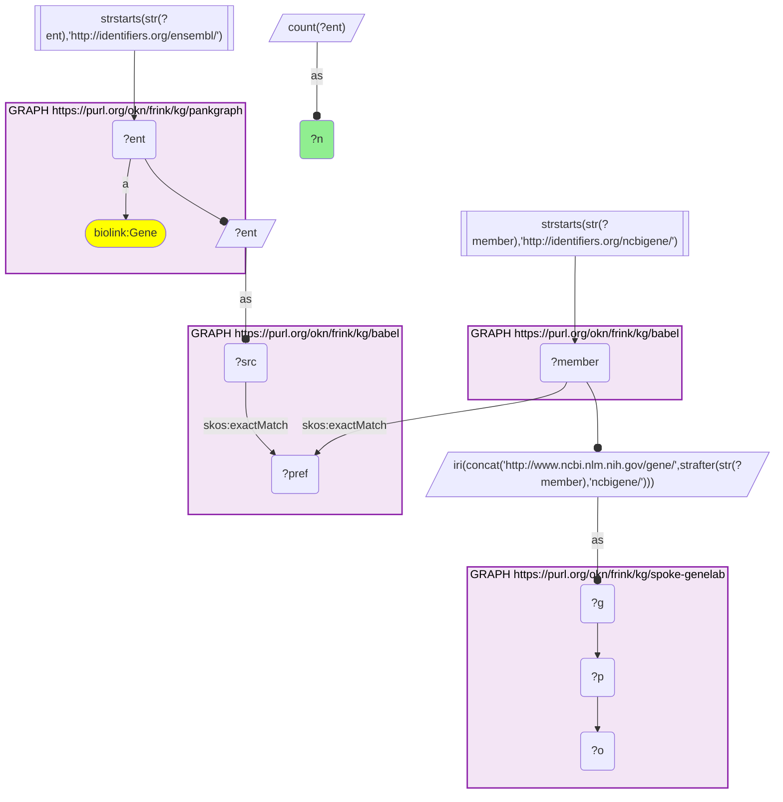
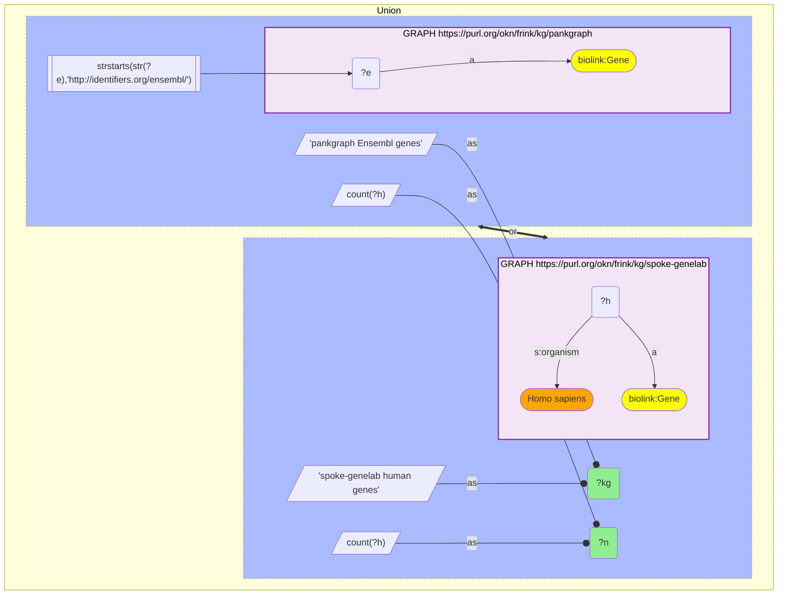
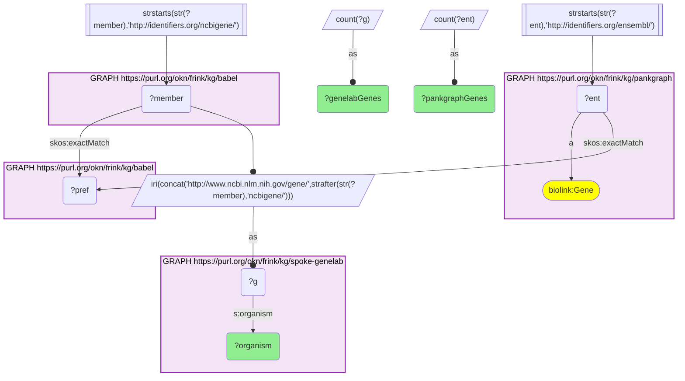

# SPOKE-GeneLab × PanKGraph gene overlap through Babel, and whether spaceflight moves PanKGraph's T1D beta-cell genes the way T1D does

- **Date:** 2026-09-26
- **Model:** claude-opus-5-5
- **External MCP servers:** PubMed
- **SPARQL endpoint:** https://apps.okn.us/federation/sparql
- **Generated by:** mcp-okn v0.1.0 (build 7d8000e)
- **Contents:** 5 queries · 5 query diagrams

## Knowledge graphs used

- `pankgraph` — <https://purl.org/okn/frink/kg/pankgraph>
- `babel` — <https://purl.org/okn/frink/kg/babel>
- `spoke-genelab` — <https://purl.org/okn/frink/kg/spoke-genelab>

## Conversation

👤 **User**

Crosswalk: `spoke-genelab` × `pankgraph` on **Entrez ↔ Ensembl, bridged through `babel`** (crosswalk `C23-entrez-spokegenelab-pankgraph-via-babel`, verified_count 28,554). spoke-genelab keys its genes on NCBI Gene (Entrez) IRIs (`http://www.ncbi.nlm.nih.gov/gene/{id}`, `biolink:Gene`) and maps model-organism genes to human genes with `IS_ORTHOLOG_MGiG`; pankgraph keys its genes on Ensembl IRIs (`http://identifiers.org/ensembl/ENSG…`, `biolink:Gene`). The two graphs share no gene identifier scheme. babel (the Translator Babel identifier cliques) links them: each pankgraph Ensembl gene `skos:exactMatch`es its gene clique's preferred id, and the same clique holds an `http://identifiers.org/ncbigene/{id}` member, which is rewritten to spoke-genelab's `ncbi.nlm.nih.gov/gene/` form. Both babel hops are staged in nested `SELECT DISTINCT` subqueries with the scheme filter outside them, or the join times out.

Research question: How large is the gene overlap between SPOKE-GeneLab and PanKGraph through Babel, and which PanKGraph beta-cell annotation do spaceflight-responsive genes carry? Specifically, does spaceflight move PanKGraph's type 1 diabetes beta-cell differentially expressed genes in the same direction as T1D does?

Why the join is required: PanKGraph carries PanKbase single-cell annotations for human islet cell types, including which genes are up- or down-regulated in beta cells (CL:0000169) of T1D donors (reified `biolink:expressed_in` statements with `UpOrDownRegulation` and `Log2FoldChange`). It has no spaceflight data. SPOKE-GeneLab carries spaceflight-vs-ground-control differential expression from NASA OSDR assays but no islet or T1D annotation. PanKGraph speaks Ensembl and SPOKE-GeneLab speaks Entrez, so only the babel bridge lets one gene's T1D beta-cell direction be set beside its spaceflight direction.

---

🧠 **Assistant**

**Overlap.** Through babel, **28,554** of PanKGraph's **78,687** Ensembl genes reach a SPOKE-GeneLab gene (the crosswalk skeleton reproduces its verified count exactly). Of these, **27,873** land on a SPOKE-GeneLab *Homo sapiens* gene, one-to-one (27,873 PanKGraph genes ↔ 27,873 SPOKE-GeneLab genes). That covers 96% of SPOKE-GeneLab's **29,026** human genes. The other 681 bridged genes land on SPOKE-GeneLab gene nodes with no `organism` value, so they drop out of the by-organism breakdown. The overlap is human gene to human gene. SPOKE-GeneLab's mouse, rat, fly, worm and zebrafish genes enter only through its own `IS_ORTHOLOG_MGiG` edges to those human genes. Only about a third of PanKGraph's Ensembl genes cross (28,554 / 78,687); the rest have no NCBI Gene member in their babel clique that SPOKE-GeneLab holds.

**Direction comparison.** PanKGraph flags genes as up- or down-regulated in T1D beta cells. For each such gene, I counted the clean Space-Flight-vs-Ground-Control transcription-profiling contrasts (the 170 assays `get_valid_contrasts` marks `is_clean_contrast`) in which an ortholog was significantly up or down (adjusted p < 0.05). I then called the gene's spaceflight direction by majority. **945** PanKGraph beta-cell T1D-DE genes have at least one such contrast:

| PanKGraph: beta cells in T1D | Spaceflight majority: up | Spaceflight majority: down | Mixed (tie) | Total |
| --- | --- | --- | --- | --- |
| Upregulated in T1D | 253 | 264 | 64 | 581 |
| Downregulated in T1D | 192 | 136 | 36 | 364 |
| **Total** | 445 | 400 | 100 | 945 |

Only **389 genes (253 + 136) move in the same direction** in spaceflight and in T1D beta cells. **456 (264 + 192) move in opposite directions**, and 100 are tied. **Spaceflight does not reproduce PanKGraph's T1D beta-cell signature**: at the level of majority direction, agreement is no better than disagreement.

The most spaceflight-responsive of those genes (most clean contrasts with a significant ortholog):

| Gene (PanKGraph) | T1D beta cells (PanKGraph) | Beta-cell log2FC in T1D | Clean spaceflight assays | Up / down in spaceflight |
| --- | --- | --- | --- | --- |
| HSPA8 | down | −1.50 | 29 | 11 / 18 |
| NPAS2 | up | 1.18 | 28 | 20 / 12 |
| SLC29A1 | down | −0.60 | 27 | 9 / 18 |
| TUBA1B | down | −0.83 | 27 | 8 / 21 |
| DYNLL1 | down | −0.63 | 27 | 8 / 24 |
| CYCS | down | −0.64 | 26 | 16 / 10 |
| SLC20A2 | down | −0.62 | 26 | 11 / 15 |
| PDLIM1 | down | −0.98 | 25 | 13 / 12 |
| HLA-B | up | 3.71 | 25 | 12 / 14 |
| ARL6IP5 | down | −0.60 | 24 | 14 / 10 |
| TUBB4B | down | −1.49 | 24 | 8 / 16 |
| FBXL22 | up | 1.35 | 24 | 14 / 21 |
| TAF7 | down | −0.42 | 24 | 13 / 11 |
| HLA-C | up | 2.10 | 24 | 11 / 14 |
| SLCO5A1 | up | 0.90 | 24 | 13 / 18 |
| CTSL | up | 0.84 | 24 | 19 / 14 |
| SLC38A2 | up | 1.57 | 24 | 15 / 16 |
| HSPE1 | down | −0.79 | 24 | 10 / 18 |
| ZC3H12C | up | 0.69 | 23 | 11 / 13 |
| HSP90AB1 | down | −0.48 | 23 | 8 / 15 |

**Why it answers the question.** The overlap numbers show the bridge is essentially complete on the SPOKE-GeneLab side (96% of its human genes). Each table row then puts two graphs' facts about one gene side by side: PanKGraph's PanKbase direction and fold change in T1D beta cells, and SPOKE-GeneLab's count of clean spaceflight contrasts that move it. Neither graph can produce the row alone. The answer to the direction question is no, not in aggregate. There is one coherent exception among the most-responsive genes: a **chaperone and cytoskeleton cluster** (HSPA8, HSP90AB1, HSPE1, TUBA1B, TUBB4B, DYNLL1) that is down in T1D beta cells and down in the majority of the spaceflight contrasts that move it. The HLA class I genes (HLA-B, HLA-C), strongly up in T1D beta cells (log2FC 3.71 and 2.10), show no consistent spaceflight direction.

**How to read the counts.** "Up / down in spaceflight" counts clean assays in which at least one ortholog of the gene was significantly up (or down). A gene with several model-organism orthologs can count in both columns in one assay, so up + down can exceed the assay total. Positive log2fc in SPOKE-GeneLab means higher in spaceflight than in ground control; PanKGraph's log2FC is T1D vs non-diabetic beta cells.

**Caveats.**
- *Different tissues and species.* PanKGraph's direction comes from human beta cells. The spaceflight contrasts span several organisms and tissues, and none of the 170 clean contrasts carries a pancreas or islet material id. The direction comparison is therefore a cross-tissue, cross-species heuristic, not a matched experiment.
- *No significance test.* The concordance table is a raw count at adjusted p < 0.05 with no fold-change cut-off and a simple majority rule. It shows that concordance is not dominant; it does not test whether discordance is significant.
- *Clean contrasts only.* The 492 Space-Flight-vs-Ground-Control assays that `get_valid_contrasts` flags as confounded (for example, a genotype or sex difference between arms) are excluded.
- *Count genes, not cliques.* babel can put one id in two cliques, so every query counts distinct genes.

## Literature validation

The identifier join is **validated by construction**. Ensembl and NCBI Gene are registered, exact-string gene identifiers, and babel asserts their equivalence through a shared gene clique; no symbol matching is used. The hand-verified crosswalk `C23-entrez-spokegenelab-pankgraph-via-babel` (verified_count 28,554) reproduces live.

Claims checked against PubMed:

- **HLA class I up in T1D beta cells** (PanKGraph HLA-B log2FC 3.71, HLA-C 2.10): MHC class I hyperexpression is a characteristic feature of islets in T1D, linked to type I interferon (PMID 28959234, [DOI](https://doi.org/10.3389/fendo.2017.00232)). In beta cells, type I IFN signalling produces long-lasting MHC class I hyperexpression (PMID 33832648, [DOI](https://doi.org/10.1016/bs.ircmb.2021.02.011)). **Supported.**
- **Heat-shock proteins down in spaceflight**: in human endothelial cells flown on the ISS, HSP70 and HSP90 were the most down-regulated genes (5.6-fold) (PMID 23913861, [DOI](https://doi.org/10.1096/fj.13-229195)). This is consistent with the majority-down calls for HSPA8 (an HSP70-family gene) and HSP90AB1. The literature is not uniform, though. Heat-shock transcripts were **up** in spaceflight Arabidopsis (PMID 30644539, [DOI](https://doi.org/10.1002/ajb2.1223)), and HSP70 rose in rat paraspinal muscle after 14 days of flight (PMID 10899324, [DOI](https://doi.org/10.1016/s0014-5793(00)01715-4)). That fits the mixed up/down counts seen here: direction depends on tissue and organism. **Partially supported.**
- The claim that spaceflight does not reproduce the T1D beta-cell signature is a result of this join. No published study making this comparison was found, so it is **not independently confirmed**.

Sources retrieved from PubMed.

**Validated with caveats.** The overlap is exact and reproducible through registered identifiers. The HLA class I direction in T1D is well supported, and the heat-shock direction in spaceflight is supported in one human cell system but varies across organisms. The aggregate direction comparison is a cross-tissue heuristic from live data, not a tested hypothesis.

## SPARQL queries executed

#### Query 1

_2026-09-27T00:27:48+00:00 · `pankgraph`, `babel`, `spoke-genelab`_

```sparql
SELECT (COUNT(DISTINCT ?ent) AS ?n) WHERE {
  { SELECT DISTINCT ?ent ?member WHERE {
    { SELECT DISTINCT ?ent ?pref WHERE {
        { SELECT DISTINCT ?ent ?src WHERE { GRAPH <https://purl.org/okn/frink/kg/pankgraph> { ?ent a <https://w3id.org/biolink/vocab/Gene> } FILTER(STRSTARTS(STR(?ent),'http://identifiers.org/ensembl/')) BIND(?ent AS ?src) } }
        GRAPH <https://purl.org/okn/frink/kg/babel> { ?src <http://www.w3.org/2004/02/skos/core#exactMatch> ?pref } } }
    GRAPH <https://purl.org/okn/frink/kg/babel> { ?member <http://www.w3.org/2004/02/skos/core#exactMatch> ?pref } } }
  FILTER(STRSTARTS(STR(?member),'http://identifiers.org/ncbigene/'))
  BIND(IRI(CONCAT('http://www.ncbi.nlm.nih.gov/gene/', STRAFTER(STR(?member),'ncbigene/'))) AS ?g)
  GRAPH <https://purl.org/okn/frink/kg/spoke-genelab> { ?g ?p ?o }
}
```



_1 row(s)_

| n |
| --- |
| 28554 |

#### Query 2

_2026-09-27T00:28:06+00:00 · `pankgraph`, `spoke-genelab`_

```sparql
PREFIX s: <https://purl.org/okn/frink/kg/spoke-genelab/schema/>
SELECT ?kg ?n WHERE {
  { SELECT ("pankgraph Ensembl genes" AS ?kg) (COUNT(DISTINCT ?e) AS ?n) WHERE { GRAPH <https://purl.org/okn/frink/kg/pankgraph> { ?e a <https://w3id.org/biolink/vocab/Gene> } FILTER(STRSTARTS(STR(?e),'http://identifiers.org/ensembl/')) } }
  UNION
  { SELECT ("spoke-genelab human genes" AS ?kg) (COUNT(DISTINCT ?h) AS ?n) WHERE { GRAPH <https://purl.org/okn/frink/kg/spoke-genelab> { ?h a <https://w3id.org/biolink/vocab/Gene> ; s:organism "Homo sapiens" } } }
}
```



_2 row(s)_

| kg | n |
| --- | --- |
| pankgraph Ensembl genes | 78687 |
| spoke-genelab human genes | 29026 |

#### Query 3

_2026-09-27T00:28:08+00:00 · `pankgraph`, `babel`, `spoke-genelab`_

```sparql
PREFIX s: <https://purl.org/okn/frink/kg/spoke-genelab/schema/>
SELECT ?organism (COUNT(DISTINCT ?ent) AS ?pankgraphGenes) (COUNT(DISTINCT ?g) AS ?genelabGenes) WHERE {
  { SELECT DISTINCT ?ent ?member WHERE {
    { SELECT DISTINCT ?ent ?pref WHERE {
        { SELECT DISTINCT ?ent WHERE { GRAPH <https://purl.org/okn/frink/kg/pankgraph> { ?ent a <https://w3id.org/biolink/vocab/Gene> } FILTER(STRSTARTS(STR(?ent),'http://identifiers.org/ensembl/')) } }
        GRAPH <https://purl.org/okn/frink/kg/babel> { ?ent <http://www.w3.org/2004/02/skos/core#exactMatch> ?pref } } }
    GRAPH <https://purl.org/okn/frink/kg/babel> { ?member <http://www.w3.org/2004/02/skos/core#exactMatch> ?pref } } }
  FILTER(STRSTARTS(STR(?member),'http://identifiers.org/ncbigene/'))
  BIND(IRI(CONCAT('http://www.ncbi.nlm.nih.gov/gene/', STRAFTER(STR(?member),'ncbigene/'))) AS ?g)
  GRAPH <https://purl.org/okn/frink/kg/spoke-genelab> { ?g s:organism ?organism }
} GROUP BY ?organism
```



_1 row(s)_

| organism | pankgraphGenes | genelabGenes |
| --- | --- | --- |
| Homo sapiens | 27873 | 27873 |

#### Query 4

_2026-09-27T00:30:05+00:00 · `pankgraph`, `babel`, `spoke-genelab`_

```sparql
PREFIX rdf: <http://www.w3.org/1999/02/22-rdf-syntax-ns#>
PREFIX rdfs: <http://www.w3.org/2000/01/rdf-schema#>
PREFIX skos: <http://www.w3.org/2004/02/skos/core#>
PREFIX biolink: <https://w3id.org/biolink/vocab/>
PREFIX pk: <https://purl.org/okn/frink/kg/pankgraph/schema/>
PREFIX s: <https://purl.org/okn/frink/kg/spoke-genelab/schema/>
PREFIX gl: <https://purl.org/okn/frink/kg/spoke-genelab/node/>
SELECT ?t1dDir ?spaceflightDir (COUNT(?ent) AS ?nGenes) WHERE {
  { SELECT ?ent ?t1dDir (COUNT(DISTINCT IF(?lfc > 0, ?assay, ?none)) AS ?nUp) (COUNT(DISTINCT IF(?lfc < 0, ?assay, ?none)) AS ?nDown) WHERE {
    { SELECT DISTINCT ?ent ?member WHERE {
      { SELECT DISTINCT ?ent ?pref WHERE {
          { SELECT DISTINCT ?ent WHERE { GRAPH <https://purl.org/okn/frink/kg/pankgraph> {
              ?x rdf:subject ?ent ; rdf:predicate biolink:expressed_in ; rdf:object <http://purl.obolibrary.org/obo/CL_0000169> ; pk:UpOrDownRegulation ?d0 } } }
          GRAPH <https://purl.org/okn/frink/kg/babel> { ?ent skos:exactMatch ?pref } } }
      GRAPH <https://purl.org/okn/frink/kg/babel> { ?member skos:exactMatch ?pref } } }
    FILTER(STRSTARTS(STR(?member),'http://identifiers.org/ncbigene/'))
    BIND(IRI(CONCAT('http://www.ncbi.nlm.nih.gov/gene/', STRAFTER(STR(?member),'ncbigene/'))) AS ?hg)
    GRAPH <https://purl.org/okn/frink/kg/spoke-genelab> {
      ?mg s:IS_ORTHOLOG_MGiG ?hg .
      ?st rdf:subject ?assay ; rdf:predicate s:MEASURED_DIFFERENTIAL_EXPRESSION_ASmMG ; rdf:object ?mg ; s:adj_p_value ?p ; s:log2fc ?lfc .
      FILTER(?p < 0.05) }
    # ?assay = the clean Space-Flight-vs-Ground-Control transcription-profiling contrasts returned by get_valid_contrasts()
    VALUES ?assay {
      gl:OSD-1-16ee0a71eda3de3729e553db08a3453f gl:OSD-1-7ba2f6230f758e7d0c8d381bc163446b gl:OSD-1-b006660cea81b77dfcd57b08c59f0249 gl:OSD-100-061ffc525c9e17c392b5ed0b4e770133
      gl:OSD-101-315b0669c5d09d5618b4b25934569250 gl:OSD-102-9ea29268b285ecb277189e5e22cd2053 gl:OSD-103-f007f036b41857967d769f4df2450e35 gl:OSD-104-ec6e344401cc5008b3cb12c08cad9c7f
      gl:OSD-105-cfde96b31f3c39139e213c293fde11e0 gl:OSD-120-18879089a7956889ac097fcea73b50bb gl:OSD-120-36a2a074a6a741fd963d8ecfc7c88597 gl:OSD-120-71a60d09c391f0ad1cffb966dcbd8da2
      gl:OSD-120-caef99d23095998f36414911fc7741b4 gl:OSD-120-dafea3386bf79bc36c0d362878f1614a gl:OSD-120-e594fc852dc3001c7b8d02b50ad3bf3e gl:OSD-121-c7814479a08151dcc90e17649950b557
      gl:OSD-137-2d49c2d99e55a9e2c2729122a7521106 gl:OSD-147-56158470e69d694c13b66af95076b5f0 gl:OSD-147-c0bb88bbf88eb3ae80a2ec2b1a313732 gl:OSD-161-b35ae45a8db5fd73b65f7aacba3b38ea
      gl:OSD-162-8d9c16a7a8374294c91e68646804fdd6 gl:OSD-163-134943402b3359fb84c7f5443b6935b9 gl:OSD-173-ee429909dcdb03b35f1f4b3841e43535 gl:OSD-194-7c13deab3d43973b1f8c841dbe0ee047
      gl:OSD-205-988d8007d6db80d03d8d87c6016b6578 gl:OSD-205-a56714e2a02dc88d927868d9b62afaa1 gl:OSD-207-46bf2f458dd003f328af5b6f7f7566b2 gl:OSD-207-6abfb081980c44e130a5c0f940551ef2
      gl:OSD-207-b85a532693b63036252b8f9e7c546d9f gl:OSD-207-ba2f9251efb7e9053a8dd97f9b3b0245 gl:OSD-218-88f9990112a474fda4b16ce9b72a524d gl:OSD-218-945fda99fce58f1cf7d17211d4e6dc71
      gl:OSD-218-98933966533e32ec9b37d168783e8466 gl:OSD-218-c67daec435b47f8d572271dc0548185c gl:OSD-240-4d31bcc7fdc1c783fcbc7a6e6d38ce61 gl:OSD-241-63f6f3379a848103f51aa7b1d8ebc5df
      gl:OSD-243-2718b5cc29f390670d5f9a91d92c3c89 gl:OSD-244-57da8b7ca3c3b4af08d72a00029a2c70 gl:OSD-245-44db6dca1026abb90902ca4f0dff1440 gl:OSD-246-0017d4ffd48ca6ef6fae63b903918509
      gl:OSD-247-d79de09169ae76c035d92784a80dfc8f gl:OSD-248-a0baa8106f2372c859c64e7c0b2a7426 gl:OSD-25-e4263b3370f6c7cfbb04a37d79742f3f gl:OSD-254-397faa4e4c8ca945720800dda41d5153
      gl:OSD-254-a45f0fd6e21933f03b9ee2b3132ee2d3 gl:OSD-254-f0b48159d0c97eac0140f0ed32b78a5a gl:OSD-254-fbf17d5b601fe016a5a8af5c4c653c5f gl:OSD-255-d6bf4f1469f0ee64c788fee473c04477
      gl:OSD-278-d553079c9d54b0d6aa4a9392534befd3 gl:OSD-281-1a2de112038db9ec8a9b6b1850fc6292 gl:OSD-281-b2acbbdd60545629d0ee413aef8e3169 gl:OSD-281-b480adeb9d6c4642bc3ee1d9fcaa1ca5
      gl:OSD-281-c30fbf80b793db9ac9d5c6e492b1ebe6 gl:OSD-3-7a1afe078481562d0fe6bfb78e349798 gl:OSD-3-a7c0a566dfe76d54eb1d35cdee9947ea gl:OSD-321-038aca8ef2109a45700407f7de5d427f
      gl:OSD-321-0de243359c85f7efa69b33d3c5699ef3 gl:OSD-321-316fc643c936383e8c78614cb0b2730b gl:OSD-321-62bc3ecc187fea8aceaf876bffdce781 gl:OSD-321-a57aa2027dfcbaff835647d6176f8d23
      gl:OSD-323-17d3d37bb3731a423fbfd92b78086c99 gl:OSD-323-7445c8f19649aa10b51d9f732fd6430b gl:OSD-326-0fc1dbed094071ca1f2f41bddd0ac5a7 gl:OSD-347-c29f16b5cd5b5764e1cffecf6d91cf36
      gl:OSD-347-fdbe1cd9dd8c9b24ba22defae84cff75 gl:OSD-352-afd8850e6da09ca718e931905c6569d1 gl:OSD-37-4292ecae9ab98e19c48599e1a4b86a07 gl:OSD-37-9cf34415e7fbc2bd2d4d7e2b9d18cd23
      gl:OSD-37-f6f61e70f31e132ae7d5bcccb0a74441 gl:OSD-37-f70836d1aaef534001b7fe50067d8f93 gl:OSD-379-7027731d151e43a51c7a8d6baa5959ba gl:OSD-379-f94068ab759fb5fcc2518fe1a5ff5fb5
      gl:OSD-397-fcaa50b1d47e999e62e9b5c47dbb8e87 gl:OSD-4-e2de747a72daf5c501b0bfab16c8c798 gl:OSD-419-09b86865fee0ca01d066824227b7a93d gl:OSD-42-70f5f4882b13201cb90d4989a0f28cc9
      gl:OSD-420-5e13f86043e3ddea0aa8bb0b93c0b4af gl:OSD-421-ba86a10fdb67709b39a398993f2842d9 gl:OSD-422-c44d743ac966082af0d193a0b7258e3e gl:OSD-423-a3d12b50d9ca01424024c83d47cc9caa
      gl:OSD-44-53520d9d5f788bc3feab5004d587a57f gl:OSD-44-9543c285dcae55aaca38a7bfb0cbf33d gl:OSD-462-0ced4874659993f56cfa54b3f00ee7ac gl:OSD-462-3931bc4698c05b56497c09dd4eb92a37
      gl:OSD-462-73dc78d4fbd706810a5b2f3d660d7845 gl:OSD-462-8a30a14aabffa36a0c482390727364c6 gl:OSD-462-b171a1bdb66b286e10ca7a4724d52336 gl:OSD-462-c9197bd5d002c2dd571cdd13e50830aa
      gl:OSD-463-74371d7bb5afac495d23f0f48c8c9944 gl:OSD-464-35c94ad1ab9c7e6304f4005f4756412e gl:OSD-469-9d7aba3010d57c1dfa1bad0436c7d3a3 gl:OSD-469-fbec2fd43473eee096e7a363b070aa93
      gl:OSD-47-65754b3ba1b48856d4afd330ef225e46 gl:OSD-48-78339eb44e112247d0884d9dd11fbf66 gl:OSD-48-e5367f6840912de790e4dce3ac16998c gl:OSD-506-54407f43de8e918656697fc058fad416
      gl:OSD-511-48ef4a4fd8015593acf3499bfea7a0a6 gl:OSD-511-f7bfb53f645600eca1403597c2ba071c gl:OSD-512-5b71049298456f170607c9eaab499f14 gl:OSD-513-33389b6efda1d7bc6dee6c8bc75b3aa9
      gl:OSD-515-79b621bb042221f4160c19eaa27ab36b gl:OSD-516-44a80576117f00b0d2f7870f2da6a00a gl:OSD-516-616789d38e1bd4f004acbcaf579c4579 gl:OSD-516-8520272f8f261984cd7362a7f134432f
      gl:OSD-516-8a987f54f58ea23d6fbfab071d7f251c gl:OSD-516-95d4d9591171dc9859496f65970bde11 gl:OSD-516-d25d7087dc3f645403d6da57d410929a gl:OSD-525-06da2a92957b8396556fb0af4aec6537
      gl:OSD-546-5bce2adb9d944899c5961278dd8c92b6 gl:OSD-546-7d689d4277a131607670c3e624202a44 gl:OSD-561-7d663c7ebf1e58f048ff65d1d5c8f174 gl:OSD-561-88e39e1da986726e6bf35b80ff03d568
      gl:OSD-562-1ccd55b102224b7b67cf506acf014264 gl:OSD-562-375e9dd0fbbaa2c659010f23b51ca73d gl:OSD-562-b939fbe8d320aca8146a11c2c3ee1401 gl:OSD-563-90f07ddf134a1c4eb2b3bd13673e2728
      gl:OSD-564-3d5c4773f0c1e95ff63e2798906c2277 gl:OSD-576-df35787540b0077305f2739d53c076ed gl:OSD-580-41e436e99325c15f6e66c4c3aff42ac4 gl:OSD-580-9ceb7dab5b0bad650995af3e34edaad9
      gl:OSD-588-2802d3c5dd52d1788895cc70db30b44b gl:OSD-588-393890e18cd11da8d79a2b4b792a3769 gl:OSD-588-3cf27d163053bd75c8f7a5ee510549e8 gl:OSD-588-65319aa9e46316691400ae70d711e1ce
      gl:OSD-588-7cc014853d56ec35916cfcf6b7bb5778 gl:OSD-588-7ee122a37364cbf82b790fe309cf1c2c gl:OSD-588-da6e59fc170ce56da0a90a6cb8ca25ae gl:OSD-588-e74d269d0fbeb07a645441be31c839cd
      gl:OSD-599-621963480c79760998ad99ecc59f72a6 gl:OSD-612-6345c5c7bcabe53264da1a63ae723b94 gl:OSD-613-6bc16dad3df8e92daec6c022196a9f49 gl:OSD-613-b41c0dfcfe90893067d80500887b987f
      gl:OSD-62-0bf65b668180599f0d258bdaf39aea10 gl:OSD-62-69120f258a2638162c43e265ebb1eabf gl:OSD-62-9b765be2be99d9b44ebe89bab05b6565 gl:OSD-635-159bf905a3e07ed00552594f52b4072d
      gl:OSD-665-a4167284b0876ec8d3daba0d0e4a567f gl:OSD-666-c82351edcee1ddd508c2e56d39337eaf gl:OSD-667-21ca74e1a6697b3aa05c0dbcab029609 gl:OSD-667-b02f80b88ab91e5c6842306e920ff7f7
      gl:OSD-678-1ff4ba0a5ff52a7ea88b3d1c9c1f2eb8 gl:OSD-678-5340769bd8d293eb7ba5903ec01b9618 gl:OSD-678-6280bbedf2a57016cd097f69c93e4280 gl:OSD-678-8265e003e8878dd7d65ccb9f250d9550
      gl:OSD-678-926f12d8b8198fc69266a6dd0556b335 gl:OSD-678-e06db040c6872710c31b3698bd1e8cfa gl:OSD-684-63c407861b72ca8f4857d9a52f38eae6 gl:OSD-684-b5e341cd470f99cdd152317be570e865
      gl:OSD-690-d89cbb20c4b7855f3f955e4adbb6515d gl:OSD-690-f82a89dc82f2903149d2d11cbd6a130d gl:OSD-770-10b02918dd6677725691e274c83a7eaf gl:OSD-771-34f5b62b925beae65bb46d3419236afa
      gl:OSD-771-931d196562c662985fba1a7d5a14a698 gl:OSD-781-3d49f04b1d073ced5c9ab6023e8f947a gl:OSD-863-55baaee7ad38b7b0a384949202e3d917 gl:OSD-863-91a7ffb1f511b8cab33b6dd55aee28fd
      gl:OSD-863-a59b741b8c1e261e6344aa6ac186d8c4 gl:OSD-863-fa57aefff2959e092dac505d5f7c9dd9 gl:OSD-867-0bd740830246906afee091a724ce4794 gl:OSD-867-b59411979655391b908b61f00df5c56a
      gl:OSD-871-22d7d119f7f882ccc4deb6fac3317882 gl:OSD-871-27f478cc10db1ed7e79cb943852887ab gl:OSD-871-4a9d5c595f351a57f6b4095a0451fbf1 gl:OSD-871-80893ac9151f1feb3557106929ecb7d5
      gl:OSD-937-264b29b667c81c6dd5a8cf26dfc92884 gl:OSD-937-6830b519e3f6ef2d0a2695cbdbbf09a0 gl:OSD-937-9f7c573ca381fa68267cb877673af24a gl:OSD-937-bc1e36ad50c0e60744307ade5e69a405
      gl:OSD-98-77323e65ae30343f99be303e279f9a92 gl:OSD-99-69f6c3ba8382c8668e921659326759d7
    }
    GRAPH <https://purl.org/okn/frink/kg/pankgraph> {
      ?b rdf:subject ?ent ; rdf:predicate biolink:expressed_in ; rdf:object <http://purl.obolibrary.org/obo/CL_0000169> ;
         pk:UpOrDownRegulation ?t1dDir ; pk:Log2FoldChange ?t1dLfc }
  } GROUP BY ?ent ?t1dDir }
  BIND(IF(?nUp > ?nDown, "up in spaceflight", IF(?nDown > ?nUp, "down in spaceflight", "mixed")) AS ?spaceflightDir)
} GROUP BY ?t1dDir ?spaceflightDir ORDER BY ?t1dDir ?spaceflightDir
```



```mermaid
graph TD
classDef projected fill:lightgreen;
classDef literal fill:orange;
classDef iri fill:yellow;
  q3v19("?assay")
  q3v21("?b")
  q3v14("?d0")
  q3v9("?ent")
  q3v12("?hg")
  q3v20("?lfc")
  q3v11("?member")
  q3v18("?mg")
  q3v8("?nDown")
  q3v1("?nGenes"):::projected 
  q3v7("?nUp")
  q3v16("?p")
  q3v15("?pref")
  q3v2("?spaceflightDir"):::projected 
  q3v17("?st")
  q3v3("?t1dDir"):::projected 
  q3v22("?t1dLfc")
  q3v13("?x")
  q3f0[["strstarts(str(?member),'http://identifiers.org/ncbigene/')"]]
  q3f0 --> q3v11
  subgraph q3graph0["GRAPH https://purl.org/okn/frink/kg/pankgraph"]
    style q3graph0 fill:#f3e5f5,stroke:#8e24aa,stroke-width:2px,color:#000;
    q3graph0c2(["CL:0000169"]):::iri 
    q3graph0c4(["biolink:expressed_in"]):::iri 
    q3v13 --"rdf:object"--> q3graph0c2
    q3v13 --"rdf:predicate"--> q3graph0c4
    q3v13 --"rdf:subject"--> q3v9
    q3v13 --"pk:UpOrDownRegulation"--> q3v14
  end
  subgraph q3graph1["GRAPH https://purl.org/okn/frink/kg/babel"]
    style q3graph1 fill:#f3e5f5,stroke:#8e24aa,stroke-width:2px,color:#000;
    q3v9 --"skos:exactMatch"--> q3v15
  end
  subgraph q3graph2["GRAPH https://purl.org/okn/frink/kg/babel"]
    style q3graph2 fill:#f3e5f5,stroke:#8e24aa,stroke-width:2px,color:#000;
    q3v11 --"skos:exactMatch"--> q3v15
  end
  q3bind0[/"iri(concat('http://www.ncbi.nlm.nih.gov/gene/',strafter(str(?member),'ncbigene/')))"/]
  q3v11 --o q3bind0
  q3bind0 --as--o q3v12
  subgraph q3graph3["GRAPH https://purl.org/okn/frink/kg/spoke-genelab"]
    style q3graph3 fill:#f3e5f5,stroke:#8e24aa,stroke-width:2px,color:#000;
    q3graph3c2(["s:MEASURED_DIFFERENTIAL_EXPRESSION_ASmMG"]):::iri 
    q3graph3f1[["?p < '0.05^^xsd:decimal'"]]
    q3graph3f1 --> q3v16
    q3v17 --"rdf:predicate"--> q3graph3c2
    q3v17 --"rdf:object"--> q3v18
    q3v17 --"rdf:subject"--> q3v19
    q3v17 --"s:adj_p_value"--> q3v16
    q3v17 --"s:log2fc"--> q3v20
    q3v18 --"s:IS_ORTHOLOG_MGiG"--> q3v12
  end
  q3bind1[/"VALUES ?assay"/]
  q3bind1-->q3v19
  q3bind10(["gl:OSD-1-16ee0a71eda3de3729e553db08a3453f"])
  q3bind10 --> q3bind1
  q3bind11(["gl:OSD-1-7ba2f6230f758e7d0c8d381bc163446b"])
  q3bind11 --> q3bind1
  q3bind12(["gl:OSD-1-b006660cea81b77dfcd57b08c59f0249"])
  q3bind12 --> q3bind1
  q3bind1more([+167 more])
  q3bind1more --> q3bind1
  subgraph q3graph4["GRAPH https://purl.org/okn/frink/kg/pankgraph"]
    style q3graph4 fill:#f3e5f5,stroke:#8e24aa,stroke-width:2px,color:#000;
    q3graph4c2(["CL:0000169"]):::iri 
    q3graph4c4(["biolink:expressed_in"]):::iri 
    q3v21 --"rdf:object"--> q3graph4c2
    q3v21 --"rdf:predicate"--> q3graph4c4
    q3v21 --"rdf:subject"--> q3v9
    q3v21 --"pk:Log2FoldChange"--> q3v22
    q3v21 --"pk:UpOrDownRegulation"--> q3v3
  end
  q3bind2[/"count(if(?lfc > '0^^xsd:integer',?assay,?none))"/]
  q3bind2 --as--o q3v7
  q3bind3[/"if(?nUp > ?nDown,'up in spaceflight',if(?nDown > ?nUp,'down in spaceflight','mixed'))"/]
  q3v7 --o q3bind3
  q3v8 --o q3bind3
  q3bind3 --as--o q3v2
  q3bind4[/"count(if(?lfc > '0^^xsd:integer',?assay,?none))"/]
  q3bind4 --as--o q3v1
```

_6 row(s) — showing first 3_

| t1dDir | spaceflightDir | nGenes |
| --- | --- | --- |
| Downregulated in T1D | down in spaceflight | 136 |
| Downregulated in T1D | mixed | 36 |
| Downregulated in T1D | up in spaceflight | 192 |

#### Query 5

_2026-09-27T00:31:30+00:00 · `pankgraph`, `babel`, `spoke-genelab`_

```sparql
PREFIX rdf: <http://www.w3.org/1999/02/22-rdf-syntax-ns#>
PREFIX rdfs: <http://www.w3.org/2000/01/rdf-schema#>
PREFIX skos: <http://www.w3.org/2004/02/skos/core#>
PREFIX biolink: <https://w3id.org/biolink/vocab/>
PREFIX pk: <https://purl.org/okn/frink/kg/pankgraph/schema/>
PREFIX s: <https://purl.org/okn/frink/kg/spoke-genelab/schema/>
PREFIX gl: <https://purl.org/okn/frink/kg/spoke-genelab/node/>
SELECT ?ent (SAMPLE(?sym) AS ?gene) ?t1dDir (SAMPLE(?t1dLfc) AS ?betaCellLog2FC_T1D) (COUNT(DISTINCT ?assay) AS ?nCleanAssaysDE)
       (COUNT(DISTINCT IF(?lfc > 0, ?assay, ?none)) AS ?nUp) (COUNT(DISTINCT IF(?lfc < 0, ?assay, ?none)) AS ?nDown) WHERE {
    { SELECT DISTINCT ?ent ?member WHERE {
      { SELECT DISTINCT ?ent ?pref WHERE {
          { SELECT DISTINCT ?ent WHERE { GRAPH <https://purl.org/okn/frink/kg/pankgraph> {
              ?x rdf:subject ?ent ; rdf:predicate biolink:expressed_in ; rdf:object <http://purl.obolibrary.org/obo/CL_0000169> ; pk:UpOrDownRegulation ?d0 } } }
          GRAPH <https://purl.org/okn/frink/kg/babel> { ?ent skos:exactMatch ?pref } } }
      GRAPH <https://purl.org/okn/frink/kg/babel> { ?member skos:exactMatch ?pref } } }
    FILTER(STRSTARTS(STR(?member),'http://identifiers.org/ncbigene/'))
    BIND(IRI(CONCAT('http://www.ncbi.nlm.nih.gov/gene/', STRAFTER(STR(?member),'ncbigene/'))) AS ?hg)
    GRAPH <https://purl.org/okn/frink/kg/spoke-genelab> {
      ?mg s:IS_ORTHOLOG_MGiG ?hg .
      ?st rdf:subject ?assay ; rdf:predicate s:MEASURED_DIFFERENTIAL_EXPRESSION_ASmMG ; rdf:object ?mg ; s:adj_p_value ?p ; s:log2fc ?lfc .
      FILTER(?p < 0.05) }
    # ?assay = the clean Space-Flight-vs-Ground-Control transcription-profiling contrasts returned by get_valid_contrasts()
    VALUES ?assay {
      gl:OSD-1-16ee0a71eda3de3729e553db08a3453f gl:OSD-1-7ba2f6230f758e7d0c8d381bc163446b gl:OSD-1-b006660cea81b77dfcd57b08c59f0249 gl:OSD-100-061ffc525c9e17c392b5ed0b4e770133
      gl:OSD-101-315b0669c5d09d5618b4b25934569250 gl:OSD-102-9ea29268b285ecb277189e5e22cd2053 gl:OSD-103-f007f036b41857967d769f4df2450e35 gl:OSD-104-ec6e344401cc5008b3cb12c08cad9c7f
      gl:OSD-105-cfde96b31f3c39139e213c293fde11e0 gl:OSD-120-18879089a7956889ac097fcea73b50bb gl:OSD-120-36a2a074a6a741fd963d8ecfc7c88597 gl:OSD-120-71a60d09c391f0ad1cffb966dcbd8da2
      gl:OSD-120-caef99d23095998f36414911fc7741b4 gl:OSD-120-dafea3386bf79bc36c0d362878f1614a gl:OSD-120-e594fc852dc3001c7b8d02b50ad3bf3e gl:OSD-121-c7814479a08151dcc90e17649950b557
      gl:OSD-137-2d49c2d99e55a9e2c2729122a7521106 gl:OSD-147-56158470e69d694c13b66af95076b5f0 gl:OSD-147-c0bb88bbf88eb3ae80a2ec2b1a313732 gl:OSD-161-b35ae45a8db5fd73b65f7aacba3b38ea
      gl:OSD-162-8d9c16a7a8374294c91e68646804fdd6 gl:OSD-163-134943402b3359fb84c7f5443b6935b9 gl:OSD-173-ee429909dcdb03b35f1f4b3841e43535 gl:OSD-194-7c13deab3d43973b1f8c841dbe0ee047
      gl:OSD-205-988d8007d6db80d03d8d87c6016b6578 gl:OSD-205-a56714e2a02dc88d927868d9b62afaa1 gl:OSD-207-46bf2f458dd003f328af5b6f7f7566b2 gl:OSD-207-6abfb081980c44e130a5c0f940551ef2
      gl:OSD-207-b85a532693b63036252b8f9e7c546d9f gl:OSD-207-ba2f9251efb7e9053a8dd97f9b3b0245 gl:OSD-218-88f9990112a474fda4b16ce9b72a524d gl:OSD-218-945fda99fce58f1cf7d17211d4e6dc71
      gl:OSD-218-98933966533e32ec9b37d168783e8466 gl:OSD-218-c67daec435b47f8d572271dc0548185c gl:OSD-240-4d31bcc7fdc1c783fcbc7a6e6d38ce61 gl:OSD-241-63f6f3379a848103f51aa7b1d8ebc5df
      gl:OSD-243-2718b5cc29f390670d5f9a91d92c3c89 gl:OSD-244-57da8b7ca3c3b4af08d72a00029a2c70 gl:OSD-245-44db6dca1026abb90902ca4f0dff1440 gl:OSD-246-0017d4ffd48ca6ef6fae63b903918509
      gl:OSD-247-d79de09169ae76c035d92784a80dfc8f gl:OSD-248-a0baa8106f2372c859c64e7c0b2a7426 gl:OSD-25-e4263b3370f6c7cfbb04a37d79742f3f gl:OSD-254-397faa4e4c8ca945720800dda41d5153
      gl:OSD-254-a45f0fd6e21933f03b9ee2b3132ee2d3 gl:OSD-254-f0b48159d0c97eac0140f0ed32b78a5a gl:OSD-254-fbf17d5b601fe016a5a8af5c4c653c5f gl:OSD-255-d6bf4f1469f0ee64c788fee473c04477
      gl:OSD-278-d553079c9d54b0d6aa4a9392534befd3 gl:OSD-281-1a2de112038db9ec8a9b6b1850fc6292 gl:OSD-281-b2acbbdd60545629d0ee413aef8e3169 gl:OSD-281-b480adeb9d6c4642bc3ee1d9fcaa1ca5
      gl:OSD-281-c30fbf80b793db9ac9d5c6e492b1ebe6 gl:OSD-3-7a1afe078481562d0fe6bfb78e349798 gl:OSD-3-a7c0a566dfe76d54eb1d35cdee9947ea gl:OSD-321-038aca8ef2109a45700407f7de5d427f
      gl:OSD-321-0de243359c85f7efa69b33d3c5699ef3 gl:OSD-321-316fc643c936383e8c78614cb0b2730b gl:OSD-321-62bc3ecc187fea8aceaf876bffdce781 gl:OSD-321-a57aa2027dfcbaff835647d6176f8d23
      gl:OSD-323-17d3d37bb3731a423fbfd92b78086c99 gl:OSD-323-7445c8f19649aa10b51d9f732fd6430b gl:OSD-326-0fc1dbed094071ca1f2f41bddd0ac5a7 gl:OSD-347-c29f16b5cd5b5764e1cffecf6d91cf36
      gl:OSD-347-fdbe1cd9dd8c9b24ba22defae84cff75 gl:OSD-352-afd8850e6da09ca718e931905c6569d1 gl:OSD-37-4292ecae9ab98e19c48599e1a4b86a07 gl:OSD-37-9cf34415e7fbc2bd2d4d7e2b9d18cd23
      gl:OSD-37-f6f61e70f31e132ae7d5bcccb0a74441 gl:OSD-37-f70836d1aaef534001b7fe50067d8f93 gl:OSD-379-7027731d151e43a51c7a8d6baa5959ba gl:OSD-379-f94068ab759fb5fcc2518fe1a5ff5fb5
      gl:OSD-397-fcaa50b1d47e999e62e9b5c47dbb8e87 gl:OSD-4-e2de747a72daf5c501b0bfab16c8c798 gl:OSD-419-09b86865fee0ca01d066824227b7a93d gl:OSD-42-70f5f4882b13201cb90d4989a0f28cc9
      gl:OSD-420-5e13f86043e3ddea0aa8bb0b93c0b4af gl:OSD-421-ba86a10fdb67709b39a398993f2842d9 gl:OSD-422-c44d743ac966082af0d193a0b7258e3e gl:OSD-423-a3d12b50d9ca01424024c83d47cc9caa
      gl:OSD-44-53520d9d5f788bc3feab5004d587a57f gl:OSD-44-9543c285dcae55aaca38a7bfb0cbf33d gl:OSD-462-0ced4874659993f56cfa54b3f00ee7ac gl:OSD-462-3931bc4698c05b56497c09dd4eb92a37
      gl:OSD-462-73dc78d4fbd706810a5b2f3d660d7845 gl:OSD-462-8a30a14aabffa36a0c482390727364c6 gl:OSD-462-b171a1bdb66b286e10ca7a4724d52336 gl:OSD-462-c9197bd5d002c2dd571cdd13e50830aa
      gl:OSD-463-74371d7bb5afac495d23f0f48c8c9944 gl:OSD-464-35c94ad1ab9c7e6304f4005f4756412e gl:OSD-469-9d7aba3010d57c1dfa1bad0436c7d3a3 gl:OSD-469-fbec2fd43473eee096e7a363b070aa93
      gl:OSD-47-65754b3ba1b48856d4afd330ef225e46 gl:OSD-48-78339eb44e112247d0884d9dd11fbf66 gl:OSD-48-e5367f6840912de790e4dce3ac16998c gl:OSD-506-54407f43de8e918656697fc058fad416
      gl:OSD-511-48ef4a4fd8015593acf3499bfea7a0a6 gl:OSD-511-f7bfb53f645600eca1403597c2ba071c gl:OSD-512-5b71049298456f170607c9eaab499f14 gl:OSD-513-33389b6efda1d7bc6dee6c8bc75b3aa9
      gl:OSD-515-79b621bb042221f4160c19eaa27ab36b gl:OSD-516-44a80576117f00b0d2f7870f2da6a00a gl:OSD-516-616789d38e1bd4f004acbcaf579c4579 gl:OSD-516-8520272f8f261984cd7362a7f134432f
      gl:OSD-516-8a987f54f58ea23d6fbfab071d7f251c gl:OSD-516-95d4d9591171dc9859496f65970bde11 gl:OSD-516-d25d7087dc3f645403d6da57d410929a gl:OSD-525-06da2a92957b8396556fb0af4aec6537
      gl:OSD-546-5bce2adb9d944899c5961278dd8c92b6 gl:OSD-546-7d689d4277a131607670c3e624202a44 gl:OSD-561-7d663c7ebf1e58f048ff65d1d5c8f174 gl:OSD-561-88e39e1da986726e6bf35b80ff03d568
      gl:OSD-562-1ccd55b102224b7b67cf506acf014264 gl:OSD-562-375e9dd0fbbaa2c659010f23b51ca73d gl:OSD-562-b939fbe8d320aca8146a11c2c3ee1401 gl:OSD-563-90f07ddf134a1c4eb2b3bd13673e2728
      gl:OSD-564-3d5c4773f0c1e95ff63e2798906c2277 gl:OSD-576-df35787540b0077305f2739d53c076ed gl:OSD-580-41e436e99325c15f6e66c4c3aff42ac4 gl:OSD-580-9ceb7dab5b0bad650995af3e34edaad9
      gl:OSD-588-2802d3c5dd52d1788895cc70db30b44b gl:OSD-588-393890e18cd11da8d79a2b4b792a3769 gl:OSD-588-3cf27d163053bd75c8f7a5ee510549e8 gl:OSD-588-65319aa9e46316691400ae70d711e1ce
      gl:OSD-588-7cc014853d56ec35916cfcf6b7bb5778 gl:OSD-588-7ee122a37364cbf82b790fe309cf1c2c gl:OSD-588-da6e59fc170ce56da0a90a6cb8ca25ae gl:OSD-588-e74d269d0fbeb07a645441be31c839cd
      gl:OSD-599-621963480c79760998ad99ecc59f72a6 gl:OSD-612-6345c5c7bcabe53264da1a63ae723b94 gl:OSD-613-6bc16dad3df8e92daec6c022196a9f49 gl:OSD-613-b41c0dfcfe90893067d80500887b987f
      gl:OSD-62-0bf65b668180599f0d258bdaf39aea10 gl:OSD-62-69120f258a2638162c43e265ebb1eabf gl:OSD-62-9b765be2be99d9b44ebe89bab05b6565 gl:OSD-635-159bf905a3e07ed00552594f52b4072d
      gl:OSD-665-a4167284b0876ec8d3daba0d0e4a567f gl:OSD-666-c82351edcee1ddd508c2e56d39337eaf gl:OSD-667-21ca74e1a6697b3aa05c0dbcab029609 gl:OSD-667-b02f80b88ab91e5c6842306e920ff7f7
      gl:OSD-678-1ff4ba0a5ff52a7ea88b3d1c9c1f2eb8 gl:OSD-678-5340769bd8d293eb7ba5903ec01b9618 gl:OSD-678-6280bbedf2a57016cd097f69c93e4280 gl:OSD-678-8265e003e8878dd7d65ccb9f250d9550
      gl:OSD-678-926f12d8b8198fc69266a6dd0556b335 gl:OSD-678-e06db040c6872710c31b3698bd1e8cfa gl:OSD-684-63c407861b72ca8f4857d9a52f38eae6 gl:OSD-684-b5e341cd470f99cdd152317be570e865
      gl:OSD-690-d89cbb20c4b7855f3f955e4adbb6515d gl:OSD-690-f82a89dc82f2903149d2d11cbd6a130d gl:OSD-770-10b02918dd6677725691e274c83a7eaf gl:OSD-771-34f5b62b925beae65bb46d3419236afa
      gl:OSD-771-931d196562c662985fba1a7d5a14a698 gl:OSD-781-3d49f04b1d073ced5c9ab6023e8f947a gl:OSD-863-55baaee7ad38b7b0a384949202e3d917 gl:OSD-863-91a7ffb1f511b8cab33b6dd55aee28fd
      gl:OSD-863-a59b741b8c1e261e6344aa6ac186d8c4 gl:OSD-863-fa57aefff2959e092dac505d5f7c9dd9 gl:OSD-867-0bd740830246906afee091a724ce4794 gl:OSD-867-b59411979655391b908b61f00df5c56a
      gl:OSD-871-22d7d119f7f882ccc4deb6fac3317882 gl:OSD-871-27f478cc10db1ed7e79cb943852887ab gl:OSD-871-4a9d5c595f351a57f6b4095a0451fbf1 gl:OSD-871-80893ac9151f1feb3557106929ecb7d5
      gl:OSD-937-264b29b667c81c6dd5a8cf26dfc92884 gl:OSD-937-6830b519e3f6ef2d0a2695cbdbbf09a0 gl:OSD-937-9f7c573ca381fa68267cb877673af24a gl:OSD-937-bc1e36ad50c0e60744307ade5e69a405
      gl:OSD-98-77323e65ae30343f99be303e279f9a92 gl:OSD-99-69f6c3ba8382c8668e921659326759d7
    }
    GRAPH <https://purl.org/okn/frink/kg/pankgraph> {
      ?b rdf:subject ?ent ; rdf:predicate biolink:expressed_in ; rdf:object <http://purl.obolibrary.org/obo/CL_0000169> ;
         pk:UpOrDownRegulation ?t1dDir ; pk:Log2FoldChange ?t1dLfc }
  OPTIONAL { GRAPH <https://purl.org/okn/frink/kg/pankgraph> { ?ent rdfs:label ?sym } }
} GROUP BY ?ent ?t1dDir ORDER BY DESC(?nCleanAssaysDE) LIMIT 20
```



```mermaid
graph TD
classDef projected fill:lightgreen;
classDef literal fill:orange;
classDef iri fill:yellow;
  q4v23("?assay")
  q4v25("?b")
  q4v4("?betaCellLog2FC_T1D"):::projected 
  q4v18("?d0")
  q4v7("?ent"):::projected 
  q4v5("?gene"):::projected 
  q4v16("?hg")
  q4v24("?lfc")
  q4v15("?member")
  q4v22("?mg")
  q4v3("?nCleanAssaysDE"):::projected 
  q4v1("?nDown"):::projected 
  q4v2("?nUp"):::projected 
  q4v20("?p")
  q4v19("?pref")
  q4v21("?st")
  q4v27("?sym")
  q4v6("?t1dDir"):::projected 
  q4v26("?t1dLfc")
  q4v17("?x")
  q4f0[["strstarts(str(?member),'http://identifiers.org/ncbigene/')"]]
  q4f0 --> q4v15
  subgraph q4graph0["GRAPH https://purl.org/okn/frink/kg/pankgraph"]
    style q4graph0 fill:#f3e5f5,stroke:#8e24aa,stroke-width:2px,color:#000;
    q4graph0c2(["CL:0000169"]):::iri 
    q4graph0c4(["biolink:expressed_in"]):::iri 
    q4v17 --"rdf:object"--> q4graph0c2
    q4v17 --"rdf:predicate"--> q4graph0c4
    q4v17 --"rdf:subject"--> q4v7
    q4v17 --"pk:UpOrDownRegulation"--> q4v18
  end
  subgraph q4graph1["GRAPH https://purl.org/okn/frink/kg/babel"]
    style q4graph1 fill:#f3e5f5,stroke:#8e24aa,stroke-width:2px,color:#000;
    q4v7 --"skos:exactMatch"--> q4v19
  end
  subgraph q4graph2["GRAPH https://purl.org/okn/frink/kg/babel"]
    style q4graph2 fill:#f3e5f5,stroke:#8e24aa,stroke-width:2px,color:#000;
    q4v15 --"skos:exactMatch"--> q4v19
  end
  q4bind0[/"iri(concat('http://www.ncbi.nlm.nih.gov/gene/',strafter(str(?member),'ncbigene/')))"/]
  q4v15 --o q4bind0
  q4bind0 --as--o q4v16
  subgraph q4graph3["GRAPH https://purl.org/okn/frink/kg/spoke-genelab"]
    style q4graph3 fill:#f3e5f5,stroke:#8e24aa,stroke-width:2px,color:#000;
    q4graph3c2(["s:MEASURED_DIFFERENTIAL_EXPRESSION_ASmMG"]):::iri 
    q4graph3f1[["?p < '0.05^^xsd:decimal'"]]
    q4graph3f1 --> q4v20
    q4v21 --"rdf:predicate"--> q4graph3c2
    q4v21 --"rdf:object"--> q4v22
    q4v21 --"rdf:subject"--> q4v23
    q4v21 --"s:adj_p_value"--> q4v20
    q4v21 --"s:log2fc"--> q4v24
    q4v22 --"s:IS_ORTHOLOG_MGiG"--> q4v16
  end
  q4bind1[/"VALUES ?assay"/]
  q4bind1-->q4v23
  q4bind10(["gl:OSD-1-16ee0a71eda3de3729e553db08a3453f"])
  q4bind10 --> q4bind1
  q4bind11(["gl:OSD-1-7ba2f6230f758e7d0c8d381bc163446b"])
  q4bind11 --> q4bind1
  q4bind12(["gl:OSD-1-b006660cea81b77dfcd57b08c59f0249"])
  q4bind12 --> q4bind1
  q4bind1more([+167 more])
  q4bind1more --> q4bind1
  subgraph q4graph4["GRAPH https://purl.org/okn/frink/kg/pankgraph"]
    style q4graph4 fill:#f3e5f5,stroke:#8e24aa,stroke-width:2px,color:#000;
    q4graph4c2(["CL:0000169"]):::iri 
    q4graph4c4(["biolink:expressed_in"]):::iri 
    q4v25 --"rdf:object"--> q4graph4c2
    q4v25 --"rdf:predicate"--> q4graph4c4
    q4v25 --"rdf:subject"--> q4v7
    q4v25 --"pk:Log2FoldChange"--> q4v26
    q4v25 --"pk:UpOrDownRegulation"--> q4v6
  end
  subgraph q4optional0["(optional)"]
  style q4optional0 fill:#bbf,stroke-dasharray: 5 5,color:#000;
    subgraph q4graph5["GRAPH https://purl.org/okn/frink/kg/pankgraph"]
      style q4graph5 fill:#f3e5f5,stroke:#8e24aa,stroke-width:2px,color:#000;
      q4v7 --"rdfs:label"--> q4v27
    end
  end
  q4bind2[/"count(?assay)"/]
  q4bind2 --as--o q4v3
  q4bind3[/"count(if(?lfc > '0^^xsd:integer',?assay,?none))"/]
  q4bind3 --as--o q4v2
  q4bind4[/"count(if(?lfc < '0^^xsd:integer',?assay,?none))"/]
  q4bind4 --as--o q4v1
```

_20 row(s) — showing first 5_

| ent | gene | t1dDir | betaCellLog2FC_T1D | nCleanAssaysDE | nUp | nDown |
| --- | --- | --- | --- | --- | --- | --- |
| http://identifiers.org/ensembl/ENSG00000109971 | HSPA8 | Downregulated in T1D | -1.5034 | 29 | 11 | 18 |
| http://identifiers.org/ensembl/ENSG00000170485 | NPAS2 | Upregulated in T1D | 1.1778 | 28 | 20 | 12 |
| http://identifiers.org/ensembl/ENSG00000112759 | SLC29A1 | Downregulated in T1D | -0.6004 | 27 | 9 | 18 |
| http://identifiers.org/ensembl/ENSG00000123416 | TUBA1B | Downregulated in T1D | -0.8286 | 27 | 8 | 21 |
| http://identifiers.org/ensembl/ENSG00000088986 | DYNLL1 | Downregulated in T1D | -0.6349 | 27 | 8 | 24 |
