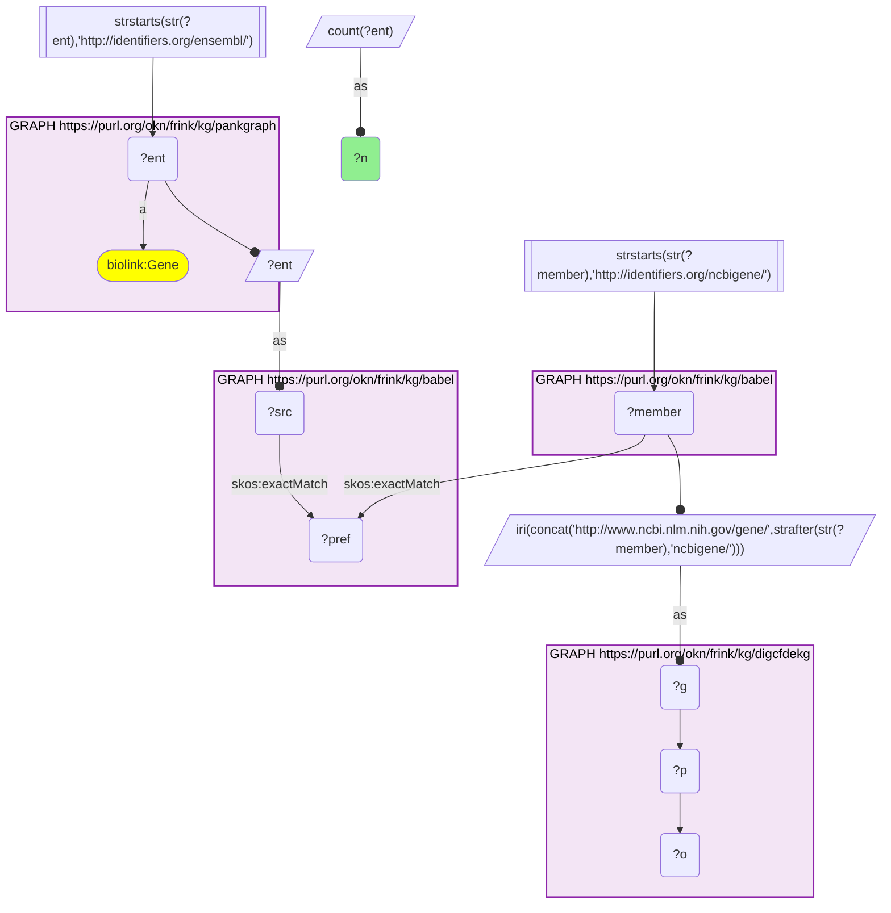
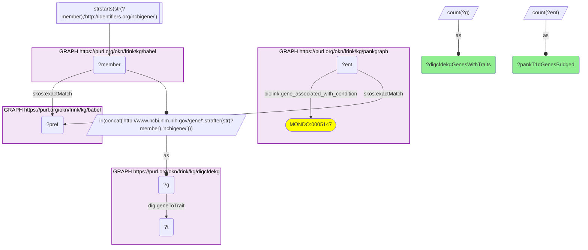
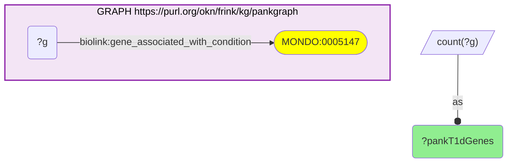
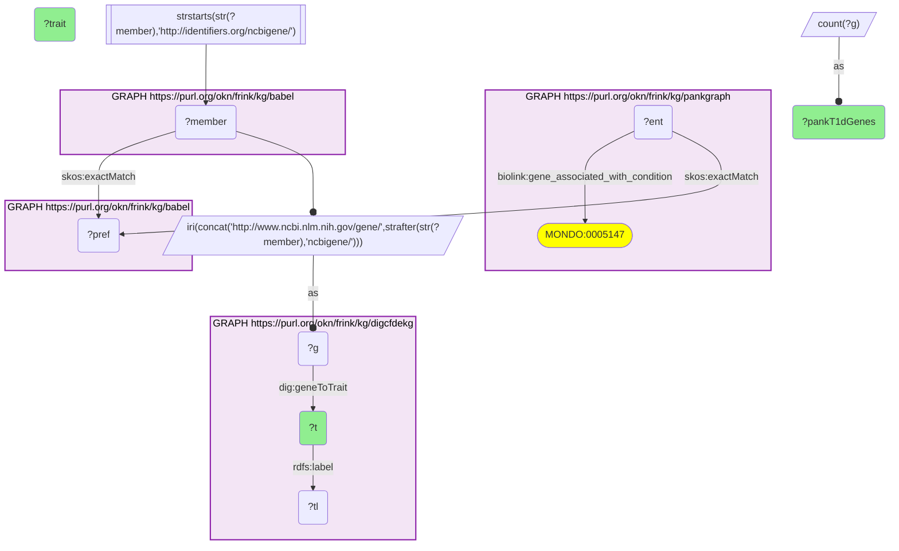
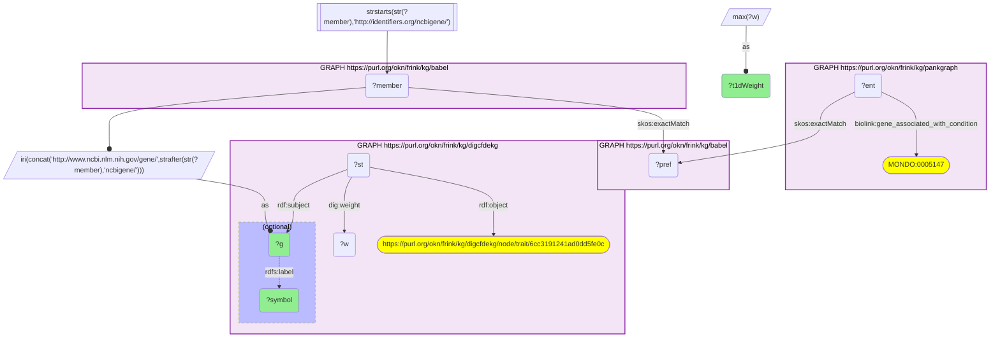
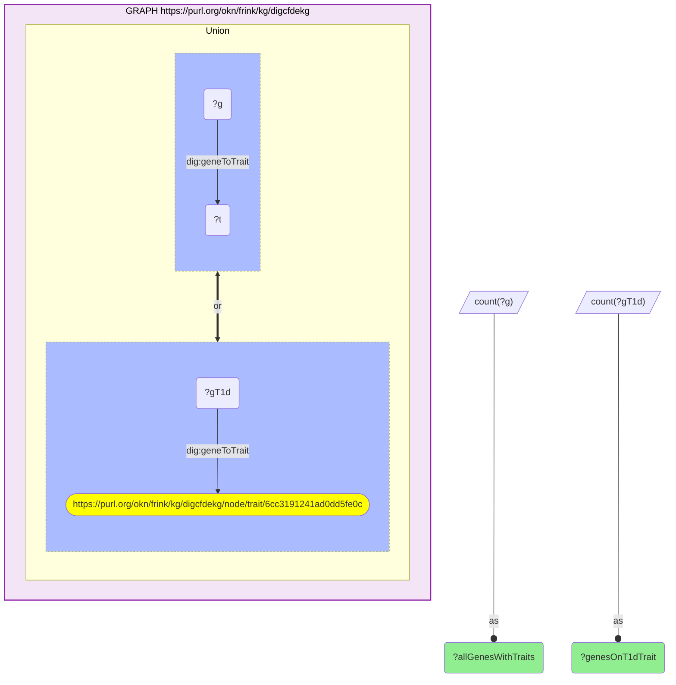

# PanKGraph type 1 diabetes genes and the traits the CFDE KG attaches to them, joined through Babel (Ensembl → Entrez)

- **Date:** 2026-09-26
- **Model:** claude-opus-5-5
- **External MCP servers:** PubMed
- **SPARQL endpoint:** https://apps.okn.us/federation/sparql
- **Generated by:** mcp-okn v0.1.0 (build 7d8000e)
- **Contents:** 6 queries · 6 query diagrams

## Knowledge graphs used

- `pankgraph` — <https://purl.org/okn/frink/kg/pankgraph>
- `babel` — <https://purl.org/okn/frink/kg/babel>
- `digcfdekg` — <https://purl.org/okn/frink/kg/digcfdekg>

## Conversation

👤 **User**

Crosswalk: `digcfdekg` × `pankgraph` on **Entrez → Ensembl, bridged through `babel`** (crosswalk `C24-entrez-digcfdekg-pankgraph-via-babel`, verified_count 34,013). digcfdekg (the CFDE Data Distillery gene-trait KG) keys its genes on NCBI Gene node IRIs (`http://www.ncbi.nlm.nih.gov/gene/{entrez}`); pankgraph (the pancreas / type 1 diabetes KG) keys its `biolink:Gene` nodes on Ensembl IRIs (`http://identifiers.org/ensembl/{ENSG}`). The two graphs share no gene identifier scheme. babel (the Translator Babel identifier cliques) links them: each Ensembl gene `skos:exactMatch`es its gene clique's preferred id, and the same clique holds an `http://identifiers.org/ncbigene/{id}` member, which is rewritten to digcfdekg's `ncbi.nlm.nih.gov/gene/` form. Both babel hops are staged in nested `SELECT DISTINCT` subqueries, with the scheme filter applied outside them, or the join times out.

Research question: Which CFDE gene-trait associations (digcfdekg) involve PanKGraph's type 1 diabetes genes (Ensembl → Entrez via Babel)? Does CFDE's model tie those genes to diabetes, and which other traits do they share?

Why the join is required: PanKGraph knows *which genes are associated with type 1 diabetes* (`biolink:gene_associated_with_condition` MONDO:0005147, taken from the HuGeAMP T1D effector-gene list) but records no genome-wide trait profile for them. The CFDE KG knows *which of ~7,000 human traits each gene is inferred to be relevant to* (PIGEAN `geneToTrait`, with a probability weight) but has no notion of a curated T1D gene list. The gene is the only thing they have in common, and they name it in different schemes, so without the babel bridge PanKGraph's T1D genes cannot be looked up in CFDE's trait associations.

---

🧠 **Assistant**

The babel bridge links **34,013 PanKGraph Ensembl genes** to CFDE KG Entrez genes (the crosswalk skeleton reproduces its verified count exactly). PanKGraph attaches **176 genes** to type 1 diabetes (MONDO:0005147); **175 of them** reach the CFDE KG through babel, and all 175 carry CFDE gene-trait associations.

CFDE's own model agrees with PanKGraph: the trait the CFDE KG attaches to the most PanKGraph T1D genes is **"Type 1 diabetes (T1D)"**, with **90 of the 175 genes (51%)**. Across the whole CFDE KG only **1,193 of 21,710 genes (5.5%)** carry that trait, so PanKGraph's T1D genes are about nine times more likely than an average gene to be tied to T1D by CFDE. The traits that follow are almost all other immune-mediated diseases:

| CFDE trait (digcfdekg) | PanKGraph T1D genes carrying it (of 175) |
| --- | --- |
| Type 1 diabetes (T1D) | 90 |
| Crohn's disease (HP:0100280) | 74 |
| Seropositive rheumatoid arthritis | 71 |
| Hypothyroidism (HP:0000821) | 68 |
| Hypothyroidism; not otherwise specified | 67 |
| Rheumatoid arthritis | 66 |
| Childhood-onset asthma | 65 |
| Multiple sclerosis (MONDO:0005301) | 64 |
| Systemic lupus erythematosus (SLE) | 63 |
| eosinophil count (EFO:0004842) | 62 |
| Eczematoid dermatitis (HP:0000964) | 62 |
| rheumatoid arthritis | 62 |
| Ulcerative colitis | 62 |
| Asthma | 61 |
| rare v2 | 61 |
| childhood onset asthma (MONDO:0005405) | 60 |
| Atopic dermatitis (HP:0001047) | 59 |
| Inflammatory bowel disease (IBD) | 59 |
| Thyroid preparation use measurement (EFO:0009933) | 57 |
| Adult-onset asthma (EFO:1002011) | 57 |

The PanKGraph T1D genes with the strongest CFDE weight on the "Type 1 diabetes (T1D)" trait (PIGEAN combined score, highest per gene):

| Gene (Entrez) | CFDE T1D weight |
| --- | --- |
| RASGRP1 (10125) | 10.2 |
| IL7R (3575) | 10.2 |
| IL2RA (3559) | 8.94 |
| SOCS1 (8651) | 8.42 |
| IRF4 (3662) | 8.17 |
| IL10 (3586) | 8.07 |
| UBASH3A (53347) | 7.94 |
| CD28 (940) | 7.74 |
| TNFAIP3 (7128) | 7.65 |
| CCR7 (1236) | 7.64 |
| FLI1 (2313) | 7.58 |
| PTPN22 (26191) | 7.55 |
| ICOS (29851) | 7.46 |
| SIRPG (55423) | 7.43 |
| INS (3630) | 7.25 |

**Why it answers the question.** Each row joins a PanKGraph fact (this gene is a curated T1D gene) to a CFDE fact (this gene is inferred relevant to this trait, with this weight), and neither graph holds both. The join shows that the two resources agree: half of PanKGraph's T1D genes are independently scored as T1D genes by CFDE's genome-wide PIGEAN model, against a 5.5% background. It also shows what PanKGraph alone cannot: the same genes form a **shared autoimmune module**. After T1D itself, CFDE ties them most often to Crohn's disease, rheumatoid arthritis, hypothyroidism, multiple sclerosis, lupus, ulcerative colitis and atopic traits. The top-weighted genes are overwhelmingly T-cell and cytokine-signalling genes (IL7R, IL2RA, CD28, ICOS, CCR7, SOCS1, IL10, PTPN22, UBASH3A, RASGRP1), with the insulin gene INS as the one islet-specific gene in the top 15.

**Caveats.** The 34,013 skeleton count is the number of PanKGraph Ensembl genes that reach a CFDE gene node. The per-question counts here are distinct genes, never cliques, and the 175 bridged T1D genes land on 175 distinct CFDE genes. CFDE trait nodes are not deduplicated: the same disease can appear several times under different source labels ("Rheumatoid arthritis", "rheumatoid arthritis", "Seropositive rheumatoid arthritis"), and some traits are opaque dataset labels ("rare v2"). The trait table therefore counts genes per trait node, not per disease. CFDE weights are PIGEAN combined scores, a model output, not GWAS p-values; ties (RASGRP1 and IL7R both at 10.2) are as stored. The ~9-fold enrichment is a simple ratio of two logged proportions (90/175 against 1,193/21,710), not a statistical test.

## Literature validation

The identifier join is **validated by construction**. Ensembl and NCBI Gene ids are registered, exact-string gene identifiers, and babel asserts their equivalence through a shared gene clique; no symbol matching is used. The hand-verified crosswalk `C24-entrez-digcfdekg-pankgraph-via-babel` (verified_count 34,013) reproduces live.

The biological claims the answer rests on were checked against PubMed:

- **IL2RA is a T1D locus**: tag-SNP analysis localized a T1D locus to the IL2RA/CD25 region of chromosome 10p15 (combined P = 1.3×10⁻¹⁰) (PMID 15776395, [DOI](https://doi.org/10.1086/429843)).
- **RASGRP1 is a T1D locus**: combined follow-up of two genome-wide studies identified RASGRP1 at 15q14 as a novel T1D locus (meta-analysis P = 5.83×10⁻⁹) (PMID 19465406, [DOI](https://doi.org/10.1136/jmg.2009.067140)).
- **IL7R is associated with T1D**: a gene-based pathway analysis of T1D GWAS data found and replicated support for an IL7R variant (PMID 25371288, [DOI](https://doi.org/10.1002/gepi.21853)).
- **INS is associated with T1D**: a meta-analysis of INS VNTR polymorphisms supports an association of the insulin gene with T1D and LADA (PMID 26362169, [DOI](https://doi.org/10.1007/s00592-015-0805-1)).
- **The same genes carry risk for several autoimmune diseases**: the PTPN22 R620W variant is associated with SLE, rheumatoid arthritis, T1D and autoimmune thyroid disease (PMID 21044313, [DOI](https://doi.org/10.1186/1471-2199-11-78)). Non-MHC T1D loci including PTPN22, IL2RA, UBASH3A and RASGRP1 also associate with thyroid-peroxidase or islet autoantibodies, and UBASH3A was confirmed as an autoimmune-thyroid-disease locus (PMID 21829393, [DOI](https://doi.org/10.1371/journal.pgen.1002216)). This supports the T1D–hypothyroidism overlap in the table. Shared risk between T1D and Crohn's disease, multiple sclerosis or lupus specifically was not checked gene by gene here.

Sources retrieved from PubMed.

**Validated.** The join uses shared registered gene identifiers bridged by babel, every number comes from a logged live query, and the T1D gene associations and the cross-autoimmune sharing shown are backed by literature. The weights themselves are CFDE model scores and were not independently re-derived.

## SPARQL queries executed

#### Query 1

_2026-09-27T00:15:38+00:00 · `pankgraph`, `babel`, `digcfdekg`_

```sparql
SELECT (COUNT(DISTINCT ?ent) AS ?n) WHERE {
  { SELECT DISTINCT ?ent ?member WHERE {
    { SELECT DISTINCT ?ent ?pref WHERE {
        { SELECT DISTINCT ?ent ?src WHERE { GRAPH <https://purl.org/okn/frink/kg/pankgraph> { ?ent a <https://w3id.org/biolink/vocab/Gene> } FILTER(STRSTARTS(STR(?ent),'http://identifiers.org/ensembl/')) BIND(?ent AS ?src) } }
        GRAPH <https://purl.org/okn/frink/kg/babel> { ?src <http://www.w3.org/2004/02/skos/core#exactMatch> ?pref } } }
    GRAPH <https://purl.org/okn/frink/kg/babel> { ?member <http://www.w3.org/2004/02/skos/core#exactMatch> ?pref } } }
  FILTER(STRSTARTS(STR(?member),'http://identifiers.org/ncbigene/'))
  BIND(IRI(CONCAT('http://www.ncbi.nlm.nih.gov/gene/', STRAFTER(STR(?member),'ncbigene/'))) AS ?g)
  GRAPH <https://purl.org/okn/frink/kg/digcfdekg> { ?g ?p ?o }
}
```



_1 row(s)_

| n |
| --- |
| 34013 |

#### Query 2

_2026-09-27T00:17:06+00:00 · `pankgraph`, `babel`, `digcfdekg`_

```sparql
PREFIX skos: <http://www.w3.org/2004/02/skos/core#>
PREFIX biolink: <https://w3id.org/biolink/vocab/>
PREFIX dig: <https://purl.org/okn/frink/kg/digcfdekg/schema/>
SELECT (COUNT(DISTINCT ?ent) AS ?pankT1dGenesBridged) (COUNT(DISTINCT ?g) AS ?digcfdekgGenesWithTraits) WHERE {
  { SELECT DISTINCT ?ent ?member WHERE {
    { SELECT DISTINCT ?ent ?pref WHERE {
        { SELECT DISTINCT ?ent WHERE { GRAPH <https://purl.org/okn/frink/kg/pankgraph> { ?ent biolink:gene_associated_with_condition <http://purl.obolibrary.org/obo/MONDO_0005147> } } }
        GRAPH <https://purl.org/okn/frink/kg/babel> { ?ent skos:exactMatch ?pref } } }
    GRAPH <https://purl.org/okn/frink/kg/babel> { ?member skos:exactMatch ?pref } } }
  FILTER(STRSTARTS(STR(?member),'http://identifiers.org/ncbigene/'))
  BIND(IRI(CONCAT('http://www.ncbi.nlm.nih.gov/gene/', STRAFTER(STR(?member),'ncbigene/'))) AS ?g)
  GRAPH <https://purl.org/okn/frink/kg/digcfdekg> { ?g dig:geneToTrait ?t }
}
```



_1 row(s)_

| pankT1dGenesBridged | digcfdekgGenesWithTraits |
| --- | --- |
| 175 | 175 |

#### Query 3

_2026-09-27T00:17:06+00:00 · `pankgraph`_

```sparql
SELECT (COUNT(DISTINCT ?g) AS ?pankT1dGenes) WHERE {
  GRAPH <https://purl.org/okn/frink/kg/pankgraph> { ?g <https://w3id.org/biolink/vocab/gene_associated_with_condition> <http://purl.obolibrary.org/obo/MONDO_0005147> }
}
```



_1 row(s)_

| pankT1dGenes |
| --- |
| 176 |

#### Query 4

_2026-09-27T00:17:48+00:00 · `pankgraph`, `babel`, `digcfdekg`_

```sparql
PREFIX skos: <http://www.w3.org/2004/02/skos/core#>
PREFIX biolink: <https://w3id.org/biolink/vocab/>
PREFIX rdfs: <http://www.w3.org/2000/01/rdf-schema#>
PREFIX dig: <https://purl.org/okn/frink/kg/digcfdekg/schema/>
SELECT ?t (SAMPLE(?tl) AS ?trait) (COUNT(DISTINCT ?g) AS ?pankT1dGenes) WHERE {
  { SELECT DISTINCT ?g WHERE {
  { SELECT DISTINCT ?ent ?member WHERE {
    { SELECT DISTINCT ?ent ?pref WHERE {
        { SELECT DISTINCT ?ent WHERE { GRAPH <https://purl.org/okn/frink/kg/pankgraph> { ?ent biolink:gene_associated_with_condition <http://purl.obolibrary.org/obo/MONDO_0005147> } } }
        GRAPH <https://purl.org/okn/frink/kg/babel> { ?ent skos:exactMatch ?pref } } }
    GRAPH <https://purl.org/okn/frink/kg/babel> { ?member skos:exactMatch ?pref } } }
  FILTER(STRSTARTS(STR(?member),'http://identifiers.org/ncbigene/'))
  BIND(IRI(CONCAT('http://www.ncbi.nlm.nih.gov/gene/', STRAFTER(STR(?member),'ncbigene/'))) AS ?g) } }
  GRAPH <https://purl.org/okn/frink/kg/digcfdekg> { ?g dig:geneToTrait ?t . ?t rdfs:label ?tl }
} GROUP BY ?t ORDER BY DESC(?pankT1dGenes) LIMIT 20
```



_20 row(s) — showing first 3_

| t | trait | pankT1dGenes |
| --- | --- | --- |
| https://purl.org/okn/frink/kg/digcfdekg/node/trait/6cc3191241ad0dd5fe0c | Type 1 diabetes (T1D) | 90 |
| http://purl.obolibrary.org/obo/HP_0100280 | Crohn's disease | 74 |
| https://purl.org/okn/frink/kg/digcfdekg/node/trait/5b589311e87ab0908de9 | Seropositive rheumatoid arthritis | 71 |

#### Query 5

_2026-09-27T00:17:49+00:00 · `pankgraph`, `babel`, `digcfdekg`_

```sparql
PREFIX skos: <http://www.w3.org/2004/02/skos/core#>
PREFIX biolink: <https://w3id.org/biolink/vocab/>
PREFIX rdfs: <http://www.w3.org/2000/01/rdf-schema#>
PREFIX rdf: <http://www.w3.org/1999/02/22-rdf-syntax-ns#>
PREFIX dig: <https://purl.org/okn/frink/kg/digcfdekg/schema/>
SELECT ?g ?symbol (MAX(?w) AS ?t1dWeight) WHERE {
  { SELECT DISTINCT ?g WHERE {
  { SELECT DISTINCT ?ent ?member WHERE {
    { SELECT DISTINCT ?ent ?pref WHERE {
        { SELECT DISTINCT ?ent WHERE { GRAPH <https://purl.org/okn/frink/kg/pankgraph> { ?ent biolink:gene_associated_with_condition <http://purl.obolibrary.org/obo/MONDO_0005147> } } }
        GRAPH <https://purl.org/okn/frink/kg/babel> { ?ent skos:exactMatch ?pref } } }
    GRAPH <https://purl.org/okn/frink/kg/babel> { ?member skos:exactMatch ?pref } } }
  FILTER(STRSTARTS(STR(?member),'http://identifiers.org/ncbigene/'))
  BIND(IRI(CONCAT('http://www.ncbi.nlm.nih.gov/gene/', STRAFTER(STR(?member),'ncbigene/'))) AS ?g) } }
  GRAPH <https://purl.org/okn/frink/kg/digcfdekg> {
    ?st rdf:subject ?g ; rdf:object <https://purl.org/okn/frink/kg/digcfdekg/node/trait/6cc3191241ad0dd5fe0c> ; dig:weight ?w .
    OPTIONAL { ?g rdfs:label ?symbol } }
} GROUP BY ?g ?symbol ORDER BY DESC(?t1dWeight) LIMIT 15
```



_15 row(s) — showing first 3_

| g | symbol | t1dWeight |
| --- | --- | --- |
| http://www.ncbi.nlm.nih.gov/gene/10125 | RASGRP1 | 10.2 |
| http://www.ncbi.nlm.nih.gov/gene/3575 | IL7R | 10.2 |
| http://www.ncbi.nlm.nih.gov/gene/3559 | IL2RA | 8.94 |

#### Query 6

_2026-09-27T00:18:19+00:00 · `digcfdekg`_

```sparql
PREFIX dig: <https://purl.org/okn/frink/kg/digcfdekg/schema/>
SELECT (COUNT(DISTINCT ?g) AS ?allGenesWithTraits) (COUNT(DISTINCT ?gT1d) AS ?genesOnT1dTrait) WHERE {
  GRAPH <https://purl.org/okn/frink/kg/digcfdekg> {
    { ?g dig:geneToTrait ?t }
    UNION
    { ?gT1d dig:geneToTrait <https://purl.org/okn/frink/kg/digcfdekg/node/trait/6cc3191241ad0dd5fe0c> }
  }
}
```



_1 row(s)_

| allGenesWithTraits | genesOnT1dTrait |
| --- | --- |
| 21710 | 1193 |
