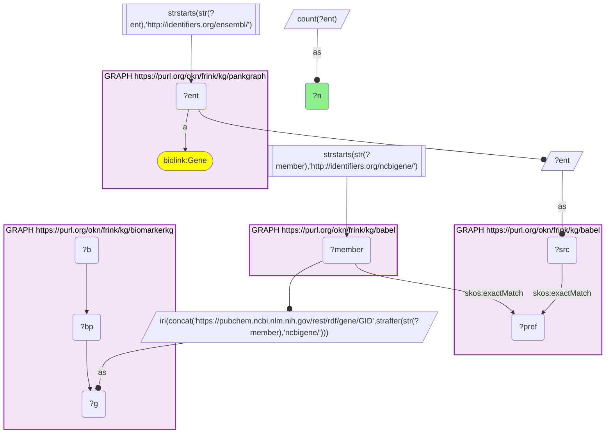

```mermaid
graph TD
classDef projected fill:lightgreen;
classDef literal fill:orange;
classDef iri fill:yellow;
  q1v13("?b")
  q1v14("?bp")
  q1v4("?bridgedGenes"):::projected 
  q1v16("?de")
  q1v19("?deBeta")
  q1v11("?ens")
  q1v10("?g")
  q1v9("?member")
  q1v3("?pankgraphT1DGenes"):::projected 
  q1v12("?pref")
  q1v17("?s")
  q1v20("?s2")
  q1v15("?t1d")
  q1v2("?t1dDiffExprGenes"):::projected 
  q1v1("?t1dDiffExprInBetaCells"):::projected 
  q1v18("?ud")
  q1v21("?ud2")
  q1f0[["strstarts(str(?member),'http://identifiers.org/ncbigene/')"]]
  q1f0 --> q1v9
  q1f1[["strstarts(str(?ens),'http://identifiers.org/ensembl/')"]]
  q1f1 --> q1v11
  subgraph q1graph0["GRAPH https://purl.org/okn/frink/kg/pankgraph"]
    style q1graph0 fill:#f3e5f5,stroke:#8e24aa,stroke-width:2px,color:#000;
    q1graph0c2(["biolink:Gene"]):::iri 
    q1v11 --"a"--> q1graph0c2
  end
  subgraph q1graph1["GRAPH https://purl.org/okn/frink/kg/babel"]
    style q1graph1 fill:#f3e5f5,stroke:#8e24aa,stroke-width:2px,color:#000;
    q1v11 --"skos:exactMatch"--> q1v12
  end
  subgraph q1graph2["GRAPH https://purl.org/okn/frink/kg/babel"]
    style q1graph2 fill:#f3e5f5,stroke:#8e24aa,stroke-width:2px,color:#000;
    q1v9 --"skos:exactMatch"--> q1v12
  end
  q1bind0[/"iri(concat('https://pubchem.ncbi.nlm.nih.gov/rest/rdf/gene/GID',strafter(str(?member),'ncbigene/')))"/]
  q1v9 --o q1bind0
  q1bind0 --as--o q1v10
  subgraph q1graph3["GRAPH https://purl.org/okn/frink/kg/biomarkerkg"]
    style q1graph3 fill:#f3e5f5,stroke:#8e24aa,stroke-width:2px,color:#000;
    q1v13 -->q1v14--> q1v10
  end
  subgraph q1optional0["(optional)"]
  style q1optional0 fill:#bbf,stroke-dasharray: 5 5,color:#000;
    subgraph q1graph4["GRAPH https://purl.org/okn/frink/kg/pankgraph"]
      style q1graph4 fill:#f3e5f5,stroke:#8e24aa,stroke-width:2px,color:#000;
      q1graph4c2(["obo:MONDO_0005147"]):::iri 
      q1v11 --"biolink:gene_associated_with_condition"--> q1graph4c2
    end
    q1bind1[/"?ens"/]
    q1v11 --o q1bind1
    q1bind1 --as--o q1v15
  end
  subgraph q1optional1["(optional)"]
  style q1optional1 fill:#bbf,stroke-dasharray: 5 5,color:#000;
    subgraph q1graph5["GRAPH https://purl.org/okn/frink/kg/pankgraph"]
      style q1graph5 fill:#f3e5f5,stroke:#8e24aa,stroke-width:2px,color:#000;
      q1v17 --"rdf:subject"--> q1v11
      q1v17 --"pk:UpOrDownRegulation"--> q1v18
    end
    q1bind2[/"?ens"/]
    q1v11 --o q1bind2
    q1bind2 --as--o q1v16
  end
  subgraph q1optional2["(optional)"]
  style q1optional2 fill:#bbf,stroke-dasharray: 5 5,color:#000;
    subgraph q1graph6["GRAPH https://purl.org/okn/frink/kg/pankgraph"]
      style q1graph6 fill:#f3e5f5,stroke:#8e24aa,stroke-width:2px,color:#000;
      q1graph6c2(["obo:CL_0000169"]):::iri 
      q1v20 --"rdf:object"--> q1graph6c2
      q1v20 --"rdf:subject"--> q1v11
      q1v20 --"pk:UpOrDownRegulation"--> q1v21
    end
    q1bind3[/"?ens"/]
    q1v11 --o q1bind3
    q1bind3 --as--o q1v19
  end
  q1bind4[/"count(?ens)"/]
  q1bind4 --as--o q1v4
  q1bind5[/"count(?t1d)"/]
  q1bind5 --as--o q1v3
  q1bind6[/"count(?de)"/]
  q1bind6 --as--o q1v2
  q1bind7[/"count(?deBeta)"/]
  q1bind7 --as--o q1v1
```

# BiomarkerKG gene biomarkers that PanKgraph ties to type 1 diabetes, joined through Babel (Entrez → Ensembl)

- **Date:** 2026-09-26
- **Model:** claude-opus-5-5
- **External MCP servers:** PubMed
- **SPARQL endpoint:** https://apps.okn.us/federation/sparql
- **Generated by:** mcp-okn v0.1.0 (build 7d8000e)
- **Contents:** 3 queries · 3 query diagrams

## Knowledge graphs used

- `biomarkerkg` — <https://purl.org/okn/frink/kg/biomarkerkg>
- `babel` — <https://purl.org/okn/frink/kg/babel>
- `pankgraph` — <https://purl.org/okn/frink/kg/pankgraph>

## Conversation

👤 **User**

Crosswalk: `biomarkerkg` × `pankgraph` on **Entrez → Ensembl, bridged through `babel`** (crosswalk `C25-entrez-biomarkerkg-pankgraph-via-babel`, verified_count 200). biomarkerkg names the gene a biomarker assesses with a PubChem gene IRI whose number is the Entrez id (`https://pubchem.ncbi.nlm.nih.gov/rest/rdf/gene/GID{entrez}`, the object of `OBCI:1000009/1000015/1000016` 'indicated by above/below normal level / presence of'); pankgraph's gene nodes ARE Ensembl IRIs (`http://identifiers.org/ensembl/{ENSG}`, `biolink:Gene`). The two graphs share no gene identifier scheme. babel (the Translator Babel identifier cliques) links them: each pankgraph Ensembl gene `skos:exactMatch`es its gene clique's preferred id, the clique's `http://identifiers.org/ncbigene/{id}` member is read off, and its number is rewritten into biomarkerkg's PubChem `GID{id}` form. The two babel hops are staged in nested `SELECT DISTINCT` subqueries with the scheme filter outside both, or the join times out.

Research question: Which BiomarkerKG gene biomarkers are pancreas-relevant in PanKgraph (a PanKgraph type 1 diabetes gene, or differentially expressed between T1D and non-diabetic donors in an islet or acinar cell type), and for which diseases are they biomarkers?

Why the join is required: BiomarkerKG knows *which genes are clinical biomarkers, of which BEST type and for which disease*, but carries no tissue or cell-type data. PanKgraph knows *which genes matter in the human pancreas* (its T1D gene set and T1D-vs-non-diabetic differential expression per islet cell type) but records no biomarker use. BiomarkerKG identifies genes by Entrez (inside a PubChem IRI) and PanKgraph by Ensembl, so only the babel bridge lets a biomarker gene be looked up in the pancreas data.

---

🧠 **Assistant**

The babel bridge links **200 genes** between BiomarkerKG and PanKgraph (the crosswalk skeleton reproduces its verified count exactly). Of those 200 biomarker genes, **24 are pancreas-relevant in PanKgraph**: **5** are PanKgraph type 1 diabetes genes (CCR2, GP2, IL2, IL4, IL10), and **19** are differentially expressed between T1D and non-diabetic donors, **13** of them in beta cells.

| Gene | PanKgraph pancreas evidence | BiomarkerKG biomarker (panel size) | Direction | BEST type | Disease |
| --- | --- | --- | --- | --- | --- |
| NEFL | Beta: up in T1D (log2FC 4.13) | AN6200-1 (8 genes) | above normal | prognostic | brain glioma |
| IL15 | Beta: up in T1D (log2FC 3.04) | AN6233-1 (7) | above normal | prognostic | drug psychosis |
| GZMM | Beta: up in T1D (log2FC 2.69) | AN6203-1 (15) | above normal | prognostic | thyroid cancer |
| MMP9 | Beta: up in T1D (log2FC 2.56) | AN6218-1 (5); AN6237-1 (10); AN6270-1 (8) | above normal | monitoring + prognostic; prognostic; diagnostic | subacute delirium; urinary bladder cancer; non-small cell lung carcinoma |
| ADGRL3 | Beta: up (log2FC 2.42); Acinar: up (2.51) | AN6597-1 (1) | above normal | diagnostic | prostate cancer |
| HLA-C | Beta: up (log2FC 2.10); Alpha: up (1.02) | AN6264-1 (11) | above normal | prognostic | psoriasis |
| SAMD5 | Beta: up in T1D (log2FC 2.04) | AN6632-1 (1) | above normal | prognostic | prostate cancer |
| CD40 | Beta: up in T1D (log2FC 2.02) | AN6227-1 (29) | above normal | prognostic | atrial septal defect |
| IFIT3 | Beta: up (log2FC 1.96); Delta: up (1.87) | AN6244-1 (6) | above normal | diagnostic | pulmonary tuberculosis |
| NFE2L2 | Beta: up in T1D (log2FC 0.67) | AN6524-1 (1) | above normal | prognostic | colorectal cancer |
| PIK3CA | Beta: up in T1D (log2FC 0.55) | BD0262-1 (1) | presence (variant) | prognostic + risk | colorectal cancer |
| ENO2 | Beta: down in T1D (log2FC −0.87) | AN6270-1 (8) | above normal | diagnostic | non-small cell lung carcinoma |
| SULT1A1 | Beta: down in T1D (log2FC −1.17) | AN6227-1 (29) | above normal | prognostic | atrial septal defect |
| GBP1 | Alpha: up (log2FC 4.71); Acinar: up (1.68) | AN6244-1 (6) | above normal | diagnostic | pulmonary tuberculosis |
| ANGPT2 | Delta: up in T1D (log2FC 1.32) | AN6407-1 (1) | presence (variant) | risk | colorectal cancer |
| GPC6 | Delta: down in T1D (log2FC −1.30) | AN6505-1 (1) | above normal | prognostic | skin cancer |
| GPX3 | Delta: down in T1D (log2FC −1.14) | AN6706-1 (1) | below normal | diagnostic | gastric cancer |
| SPHK2 | Acinar: up in T1D (log2FC 1.50) | AN6263-1 (8) | above normal | diagnostic + prognostic | multiple sclerosis |
| EMC1 | Acinar: up in T1D (log2FC 0.92) | AN6669-1 (1) | above normal | diagnostic | thyroid cancer |
| IL2 | T1D gene | AN6220-1 (14) | above normal | prognostic | postpartum depression |
| IL4 | T1D gene | AN6221-1 (8) | below normal | prognostic | postpartum depression |
| IL10 | T1D gene | AN6221-1 (8) | below normal | prognostic | postpartum depression |
| CCR2 | T1D gene | AN6221-1 (8) | below normal | prognostic | postpartum depression |
| GP2 | T1D gene | AN6200-1 (8) | above normal | prognostic | brain glioma |

**Why it answers the question.** Each row joins BiomarkerKG's clinical fact (this gene is part of a diagnostic, prognostic, monitoring or risk biomarker for a named disease) to PanKgraph's pancreas fact (it is a T1D gene, or its expression shifts in T1D islet or acinar cells). Neither graph can produce the row alone. The answer to "for which diseases" is that **none of the 24 is a BiomarkerKG biomarker for diabetes or any pancreatic disease**. Their biomarker uses are in cancers (colorectal, prostate, thyroid, gastric, lung, bladder, skin, glioma), postpartum depression, pulmonary tuberculosis, psoriasis, multiple sclerosis and others. So the join mainly shows genes whose pancreatic T1D signal is not yet used as a biomarker in BiomarkerKG. The beta-cell-upregulated group is dominated by immune and interferon-response genes (HLA-C, IFIT3, CD40, IL15, GZMM), and two of them (IFIT3, and GBP1 in alpha cells) sit in the same six-gene tuberculosis diagnostic panel, AN6244-1.

**Reading the biomarker column.** Many BiomarkerKG biomarkers are multi-gene panels: one biomarker node assesses several genes, and its `rdfs:label` names only one of them. For example, the postpartum-depression biomarker AN6221-1 is labelled after BDNF but also assesses IL4, IL10 and CCR2. So the table reports the biomarker id and its panel size (distinct genes it assesses) instead of the label. A panel size of 1 means a single-gene biomarker. "Direction" is the assessed-entity predicate: above normal level (`OBCI:1000009`), below normal level (`OBCI:1000015`) or presence of a sequence variant (`OBCI:1000016`).

**Caveats.** (1) "Pancreas-relevant" is PanKgraph's own evidence: its T1D gene annotation (`gene_associated_with_condition` MONDO:0005147) or a reified T1D-vs-non-diabetic differential expression statement (`UpOrDownRegulation`, `Log2FoldChange`) on an islet or acinar cell type. PanKgraph holds gene nodes for nearly every human gene, so a bare PanKgraph match would not by itself mean pancreas relevance. (2) The fold changes are PanKgraph's data, reported as stored. (3) The disease link is BiomarkerKG's `diagnostic for`, `monitors status of`, `prognostic for` or `indicates risk of developing` edge, and the BEST type is its `has BEST classification` value. (4) babel can place one id in two cliques, so every query counts genes, never cliques. The query that lists rows uses `SELECT DISTINCT` to collapse the resulting duplicates.

## Literature validation

The identifier join is **validated by construction**. Entrez Gene and Ensembl are registered, exact-string gene identifiers. BiomarkerKG's PubChem gene IRI carries the Entrez number verbatim, and babel asserts the Entrez–Ensembl equivalence through a shared gene clique; no symbol matching is used. The hand-verified crosswalk `C25-entrez-biomarkerkg-pankgraph-via-babel` (verified_count 200) reproduces live.

The interpretive claim, that the beta-cell-upregulated genes reflect an interferon and HLA class I response in T1D islets, was checked against PubMed:

- **Interferon signature in T1D beta cells**: IFN-α and IFN-γ have the largest effect on the human beta-cell transcriptome, and the IFN-induced gene signatures correlate strongly with those in beta cells from people with T1D (PMID 38409439, [DOI](https://doi.org/10.1007/s00125-024-06106-7)).
- **HLA class I hyperexpression**: a viral/interferon signature in T1D islets includes upregulated MDA5, RIG-I, MxA and HLA class I, whose hyperexpression promotes antigen presentation to autoreactive T cells (PMID 30307605, [DOI](https://doi.org/10.1111/cei.13223)); IFN-I and the IFN gene signature have been detected in islets of T1D patients, with MHC class I hyperexpression (PMID 29369915, [DOI](https://doi.org/10.1097/MED.0000000000000399)).
- **Beta-cell "footprints" of the immune assault**: early T1D beta-cell signatures are enriched for antiviral responses and MHC class I antigen presentation (PMID 33042023, [DOI](https://doi.org/10.3389/fendo.2020.568446)).

Not independently checked: the individual biomarker–disease assertions (for example, the AN6244-1 tuberculosis panel and the AN6221-1 postpartum-depression panel) are reported as BiomarkerKG states them, and PanKgraph's per-gene fold changes were not re-derived from the source study.

Sources retrieved from PubMed.

**Validated, with the stated limits.** The join uses registered gene identifiers bridged by babel, every row ran live against both graphs, and the interferon/HLA-I reading of the beta-cell-upregulated genes is supported by the literature. The biomarker–disease rows are BiomarkerKG's data.

## SPARQL queries executed

#### Query 1

_2026-09-27T00:29:30+00:00 · `pankgraph`, `babel`, `biomarkerkg`_

```sparql
SELECT (COUNT(DISTINCT ?ent) AS ?n) WHERE {
  { SELECT DISTINCT ?ent ?member WHERE {
    { SELECT DISTINCT ?ent ?pref WHERE {
        { SELECT DISTINCT ?ent ?src WHERE { GRAPH <https://purl.org/okn/frink/kg/pankgraph> { ?ent a <https://w3id.org/biolink/vocab/Gene> } FILTER(STRSTARTS(STR(?ent),'http://identifiers.org/ensembl/')) BIND(?ent AS ?src) } }
        GRAPH <https://purl.org/okn/frink/kg/babel> { ?src <http://www.w3.org/2004/02/skos/core#exactMatch> ?pref } } }
    GRAPH <https://purl.org/okn/frink/kg/babel> { ?member <http://www.w3.org/2004/02/skos/core#exactMatch> ?pref } } }
  FILTER(STRSTARTS(STR(?member),'http://identifiers.org/ncbigene/'))
  BIND(IRI(CONCAT('https://pubchem.ncbi.nlm.nih.gov/rest/rdf/gene/GID', STRAFTER(STR(?member),'ncbigene/'))) AS ?g)
  GRAPH <https://purl.org/okn/frink/kg/biomarkerkg> { ?b ?bp ?g }
}
```



_1 row(s)_

| n |
| --- |
| 200 |

#### Query 2

_2026-09-27T00:32:12+00:00 · `pankgraph`, `babel`, `biomarkerkg`_

```sparql
PREFIX biolink: <https://w3id.org/biolink/vocab/>
PREFIX skos: <http://www.w3.org/2004/02/skos/core#>
PREFIX rdf: <http://www.w3.org/1999/02/22-rdf-syntax-ns#>
PREFIX pk: <https://purl.org/okn/frink/kg/pankgraph/schema/>
PREFIX obo: <http://purl.obolibrary.org/obo/>
SELECT (COUNT(DISTINCT ?ens) AS ?bridgedGenes) (COUNT(DISTINCT ?t1d) AS ?pankgraphT1DGenes) (COUNT(DISTINCT ?de) AS ?t1dDiffExprGenes) (COUNT(DISTINCT ?deBeta) AS ?t1dDiffExprInBetaCells) WHERE {
  { SELECT DISTINCT ?ens WHERE {
    { SELECT DISTINCT ?ens ?member WHERE {
      { SELECT DISTINCT ?ens ?pref WHERE {
          { SELECT DISTINCT ?ens WHERE { GRAPH <https://purl.org/okn/frink/kg/pankgraph> { ?ens a biolink:Gene } FILTER(STRSTARTS(STR(?ens),'http://identifiers.org/ensembl/')) } }
          GRAPH <https://purl.org/okn/frink/kg/babel> { ?ens skos:exactMatch ?pref } } }
      GRAPH <https://purl.org/okn/frink/kg/babel> { ?member skos:exactMatch ?pref } } }
    FILTER(STRSTARTS(STR(?member),'http://identifiers.org/ncbigene/'))
    BIND(IRI(CONCAT('https://pubchem.ncbi.nlm.nih.gov/rest/rdf/gene/GID', STRAFTER(STR(?member),'ncbigene/'))) AS ?g)
    GRAPH <https://purl.org/okn/frink/kg/biomarkerkg> { ?b ?bp ?g } } }
  OPTIONAL { GRAPH <https://purl.org/okn/frink/kg/pankgraph> { ?ens biolink:gene_associated_with_condition obo:MONDO_0005147 } BIND(?ens AS ?t1d) }
  OPTIONAL { GRAPH <https://purl.org/okn/frink/kg/pankgraph> { ?s rdf:subject ?ens ; pk:UpOrDownRegulation ?ud } BIND(?ens AS ?de) }
  OPTIONAL { GRAPH <https://purl.org/okn/frink/kg/pankgraph> { ?s2 rdf:subject ?ens ; rdf:object obo:CL_0000169 ; pk:UpOrDownRegulation ?ud2 } BIND(?ens AS ?deBeta) }
}
```



_1 row(s)_

| bridgedGenes | pankgraphT1DGenes | t1dDiffExprGenes | t1dDiffExprInBetaCells |
| --- | --- | --- | --- |
| 200 | 5 | 19 | 13 |

#### Query 3

_2026-09-27T00:32:29+00:00 · `pankgraph`, `babel`, `biomarkerkg`_

```sparql
PREFIX biolink: <https://w3id.org/biolink/vocab/>
PREFIX skos: <http://www.w3.org/2004/02/skos/core#>
PREFIX rdf: <http://www.w3.org/1999/02/22-rdf-syntax-ns#>
PREFIX pk: <https://purl.org/okn/frink/kg/pankgraph/schema/>
PREFIX rdfs: <http://www.w3.org/2000/01/rdf-schema#>
PREFIX obo: <http://purl.obolibrary.org/obo/>
SELECT DISTINCT ?sym ?pankgraphEvidence ?biomarker ?direction ?bestType ?disease ?panelGenes WHERE {
  { SELECT DISTINCT ?ens ?g WHERE {
    { SELECT DISTINCT ?ens ?member WHERE {
      { SELECT DISTINCT ?ens ?pref WHERE {
          { SELECT DISTINCT ?ens WHERE { GRAPH <https://purl.org/okn/frink/kg/pankgraph> { ?ens a biolink:Gene } FILTER(STRSTARTS(STR(?ens),'http://identifiers.org/ensembl/')) } }
          GRAPH <https://purl.org/okn/frink/kg/babel> { ?ens skos:exactMatch ?pref } } }
      GRAPH <https://purl.org/okn/frink/kg/babel> { ?member skos:exactMatch ?pref } } }
    FILTER(STRSTARTS(STR(?member),'http://identifiers.org/ncbigene/'))
    BIND(IRI(CONCAT('https://pubchem.ncbi.nlm.nih.gov/rest/rdf/gene/GID', STRAFTER(STR(?member),'ncbigene/'))) AS ?g)
    GRAPH <https://purl.org/okn/frink/kg/biomarkerkg> { ?b0 ?bp0 ?g } } }
  { SELECT ?ens (GROUP_CONCAT(DISTINCT ?ev; separator="; ") AS ?pankgraphEvidence) WHERE { GRAPH <https://purl.org/okn/frink/kg/pankgraph> {
      { ?ens biolink:gene_associated_with_condition obo:MONDO_0005147 BIND('T1D gene' AS ?ev) }
      UNION { ?s rdf:subject ?ens ; rdf:object ?c ; pk:UpOrDownRegulation ?ud ; pk:Log2FoldChange ?lfc . ?c rdfs:label ?cl BIND(CONCAT(?cl, ': ', ?ud, ' (log2FC ', STR(?lfc), ')') AS ?ev) } } } GROUP BY ?ens }
  GRAPH <https://purl.org/okn/frink/kg/pankgraph> { ?ens rdfs:label ?sym }
  GRAPH <https://purl.org/okn/frink/kg/biomarkerkg> {
    ?b ?bp ?g ; obo:OBCI_1000011 ?best ; ?rel ?d .
    FILTER(?bp IN (obo:OBCI_1000009, obo:OBCI_1000015, obo:OBCI_1000016))
    FILTER(?rel IN (obo:OBCI_1000002, obo:OBCI_1000003, obo:OBCI_1000006, obo:OBCI_1000008))
    ?d rdfs:label ?disease }
  { SELECT ?b (COUNT(DISTINCT ?pg) AS ?panelGenes) WHERE { GRAPH <https://purl.org/okn/frink/kg/biomarkerkg> { ?b ?pp ?pg FILTER(STRSTARTS(STR(?pg),'https://pubchem.ncbi.nlm.nih.gov/rest/rdf/gene/')) } } GROUP BY ?b }
  BIND(STRAFTER(STR(?b),'/biomarker/') AS ?biomarker)
  BIND(IF(?bp = obo:OBCI_1000009, 'above normal', IF(?bp = obo:OBCI_1000015, 'below normal', 'presence (variant)')) AS ?direction)
  BIND(REPLACE(REPLACE(REPLACE(REPLACE(REPLACE(REPLACE(STR(?best), '.*OBCI_0000002$', 'diagnostic'), '.*OBCI_0000003$', 'monitoring'), '.*OBCI_0000004$', 'response'), '.*OBCI_0000005$', 'predictive'), '.*OBCI_0000006$', 'prognostic'), '.*OBCI_0000008$', 'risk') AS ?bestType)
} ORDER BY ?sym ?biomarker ?bestType
```



```mermaid
graph TD
classDef projected fill:lightgreen;
classDef literal fill:orange;
classDef iri fill:yellow;
  q2v6("?b")
  q2v11("?b0")
  q2v2("?best")
  q2v1("?bestType"):::projected 
  q2v5("?biomarker"):::projected 
  q2v4("?bp")
  q2v12("?bp0")
  q2v21("?c")
  q2v17("?cl")
  q2v24("?d")
  q2v3("?direction"):::projected 
  q2v25("?disease"):::projected 
  q2v9("?ens")
  q2v16("?ev")
  q2v8("?g")
  q2v19("?lfc")
  q2v7("?member")
  q2v26("?panelGenes"):::projected 
  q2v13("?pankgraphEvidence"):::projected 
  q2v27("?pg")
  q2v28("?pp")
  q2v10("?pref")
  q2v23("?rel")
  q2v20("?s")
  q2v22("?sym"):::projected 
  q2v18("?ud")
  q2f0[["strstarts(str(?member),'http://identifiers.org/ncbigene/')"]]
  q2f0 --> q2v7
  q2f1[["strstarts(str(?ens),'http://identifiers.org/ensembl/')"]]
  q2f1 --> q2v9
  subgraph q2graph0["GRAPH https://purl.org/okn/frink/kg/pankgraph"]
    style q2graph0 fill:#f3e5f5,stroke:#8e24aa,stroke-width:2px,color:#000;
    q2graph0c2(["biolink:Gene"]):::iri 
    q2v9 --"a"--> q2graph0c2
  end
  subgraph q2graph1["GRAPH https://purl.org/okn/frink/kg/babel"]
    style q2graph1 fill:#f3e5f5,stroke:#8e24aa,stroke-width:2px,color:#000;
    q2v9 --"skos:exactMatch"--> q2v10
  end
  subgraph q2graph2["GRAPH https://purl.org/okn/frink/kg/babel"]
    style q2graph2 fill:#f3e5f5,stroke:#8e24aa,stroke-width:2px,color:#000;
    q2v7 --"skos:exactMatch"--> q2v10
  end
  q2bind0[/"iri(concat('https://pubchem.ncbi.nlm.nih.gov/rest/rdf/gene/GID',strafter(str(?member),'ncbigene/')))"/]
  q2v7 --o q2bind0
  q2bind0 --as--o q2v8
  subgraph q2graph3["GRAPH https://purl.org/okn/frink/kg/biomarkerkg"]
    style q2graph3 fill:#f3e5f5,stroke:#8e24aa,stroke-width:2px,color:#000;
    q2v11 -->q2v12--> q2v8
  end
  subgraph q2graph4["GRAPH https://purl.org/okn/frink/kg/pankgraph"]
    style q2graph4 fill:#f3e5f5,stroke:#8e24aa,stroke-width:2px,color:#000;
    q2graph4c2(["obo:MONDO_0005147"]):::iri 
    subgraph q2uniongraph40[" Union "]
    style q2uniongraph40 color:#000;
    subgraph q2uniongraph40l[" "]
      style q2uniongraph40l fill:#abf,stroke-dasharray: 3 3;
      q2v20 --"rdf:object"--> q2v21
      q2v20 --"rdf:subject"--> q2v9
      q2v20 --"pk:Log2FoldChange"--> q2v19
      q2v20 --"pk:UpOrDownRegulation"--> q2v18
      q2v21 --"rdfs:label"--> q2v17
      q2graph4bind1[/"concat(?cl,': ',?ud,' (log2FC ',str(?lfc),')')"/]
      q2v17 --o q2graph4bind1
      q2v18 --o q2graph4bind1
      q2v19 --o q2graph4bind1
      q2graph4bind1 --as--o q2v16
    end
    subgraph q2uniongraph40r[" "]
      style q2uniongraph40r fill:#abf,stroke-dasharray: 3 3;
      q2v9 --"biolink:gene_associated_with_condition"--> q2graph4c2
      q2graph4bind2[/"'T1D gene'"/]
      q2graph4bind2 --as--o q2v16
    end
    q2uniongraph40r <== or ==> q2uniongraph40l
    end
  end
  q2bind3[/"count(?pg)"/]
  q2bind3 --as--o q2v13
  subgraph q2graph5["GRAPH https://purl.org/okn/frink/kg/pankgraph"]
    style q2graph5 fill:#f3e5f5,stroke:#8e24aa,stroke-width:2px,color:#000;
    q2v9 --"rdfs:label"--> q2v22
  end
  subgraph q2graph6["GRAPH https://purl.org/okn/frink/kg/biomarkerkg"]
    style q2graph6 fill:#f3e5f5,stroke:#8e24aa,stroke-width:2px,color:#000;
    q2graph6c4(["obo:OBCI_1000002"]):::iri 
    q2graph6c5(["obo:OBCI_1000003"]):::iri 
    q2graph6c6(["obo:OBCI_1000006"]):::iri 
    q2graph6c7(["obo:OBCI_1000008"]):::iri 
    q2graph6c1(["obo:OBCI_1000009"]):::iri 
    q2graph6c2(["obo:OBCI_1000015"]):::iri 
    q2graph6c3(["obo:OBCI_1000016"]):::iri 
    q2graph6f2[["?bp in ('obo:OBCI_1000009', 'obo:OBCI_1000015', 'obo:OBCI_1000016') && ?rel in ('obo:OBCI_1000002', 'obo:OBCI_1000003', 'obo:OBCI_1000006', 'obo:OBCI_1000008')"]]
    q2graph6c1 --o q2graph6f2
    q2graph6c2 --o q2graph6f2
    q2graph6c3 --o q2graph6f2
    q2graph6c4 --o q2graph6f2
    q2graph6c5 --o q2graph6f2
    q2graph6c6 --o q2graph6f2
    q2graph6c7 --o q2graph6f2
    q2graph6f2 --> q2v4
    q2graph6f2 --> q2v23
    q2v6 --"obo:OBCI_1000011"--> q2v2
    q2v24 --"rdfs:label"--> q2v25
    q2v6 -->q2v23--> q2v24
    q2v6 -->q2v4--> q2v8
  end
  subgraph q2graph7["GRAPH https://purl.org/okn/frink/kg/biomarkerkg"]
    style q2graph7 fill:#f3e5f5,stroke:#8e24aa,stroke-width:2px,color:#000;
    q2graph7f3[["strstarts(str(?pg),'https://pubchem.ncbi.nlm.nih.gov/rest/rdf/gene/')"]]
    q2graph7f3 --> q2v27
    q2v6 -->q2v28--> q2v27
  end
  q2bind4[/"count(?pg)"/]
  q2bind4 --as--o q2v26
  q2bind5[/"strafter(str(?b),'/biomarker/')"/]
  q2v6 --o q2bind5
  q2bind5 --as--o q2v5
  q2bind6[/"if(?bp = 'obo:OBCI_1000009','above normal',if(?bp = 'obo:OBCI_1000015','below normal','presence (variant)'))"/]
  q2v4 --o q2bind6
  q2bind6 --as--o q2v3
  q2bind7[/"replace(replace(replace(replace(replace(replace(str(?best),'.*OBCI_0000002$','diagnostic'),'.*OBCI_0000003$','monitoring'),'.*OBCI_0000004$','response'),'.*OBCI_0000005$','predictive'),'.*OBCI_0000006$','prognostic'),'.*OBCI_0000008$','risk')"/]
  q2v2 --o q2bind7
  q2bind7 --as--o q2v1
```

_29 row(s) — showing first 5_

| sym | pankgraphEvidence | biomarker | direction | bestType | disease | panelGenes |
| --- | --- | --- | --- | --- | --- | --- |
| ADGRL3 | Beta Cell: Upregulated in T1D (log2FC 2.4177); Acinar Cell: Upregulated in T1D (log2FC 2.5059) | AN6597-1 | above normal | diagnostic | prostate cancer | 1 |
| ANGPT2 | Delta Cell: Upregulated in T1D (log2FC 1.3248) | AN6407-1 | presence (variant) | risk | colorectal cancer | 1 |
| CCR2 | T1D gene | AN6221-1 | below normal | prognostic | postpartum depression | 8 |
| CD40 | Beta Cell: Upregulated in T1D (log2FC 2.0226) | AN6227-1 | above normal | prognostic | atrial septal defect | 29 |
| EMC1 | Acinar Cell: Upregulated in T1D (log2FC 0.9169) | AN6669-1 | above normal | diagnostic | thyroid cancer | 1 |
