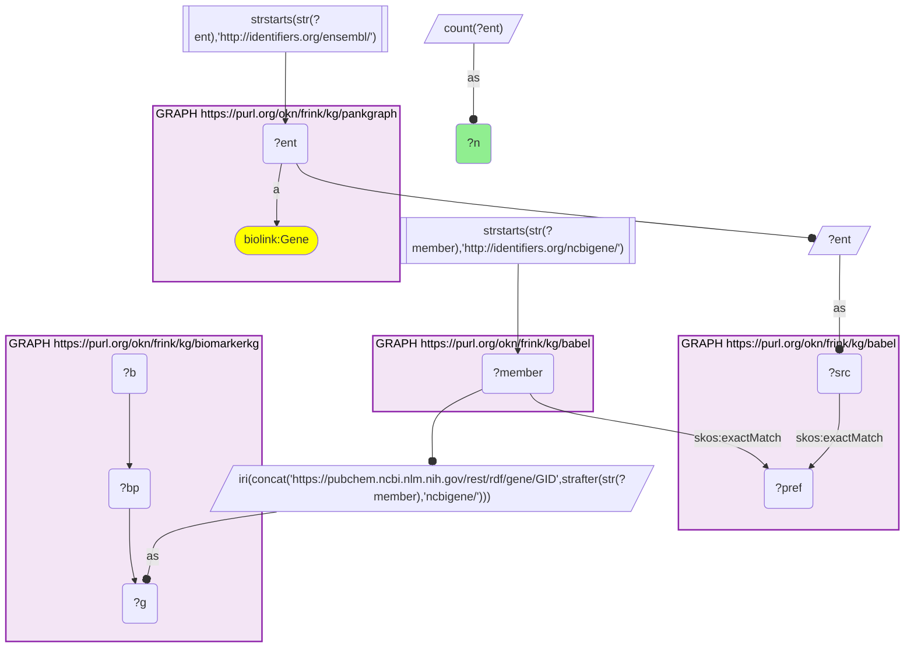
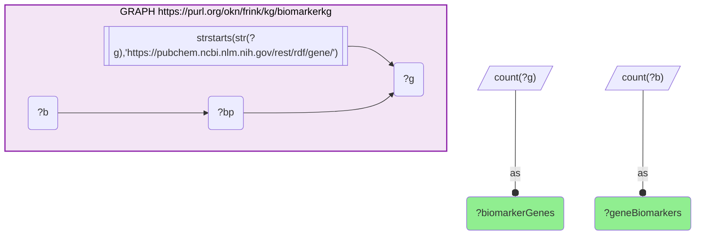
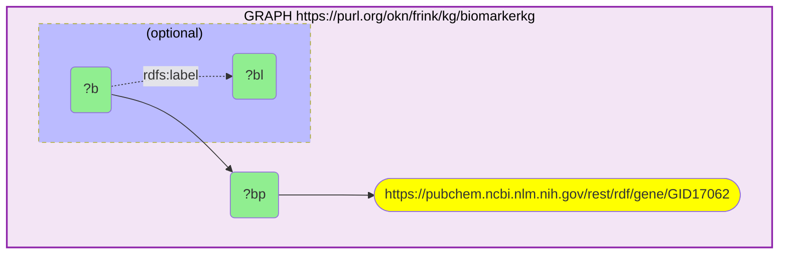
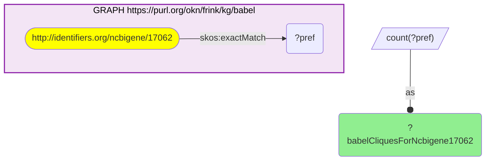
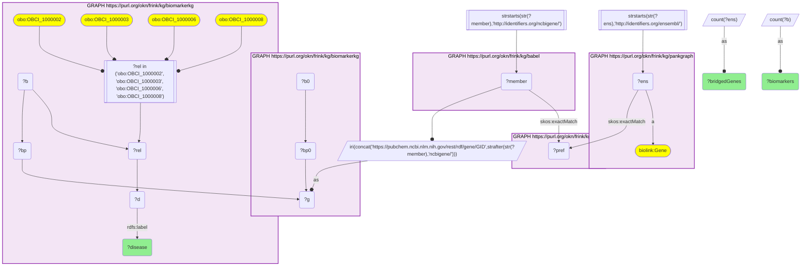

# BiomarkerKG's gene biomarkers in PanKgraph through Babel: coverage, and the diabetes and pancreatic-cancer biomarkers

- **Date:** 2026-09-26
- **Model:** claude-opus-5-5
- **External MCP servers:** PubMed
- **SPARQL endpoint:** https://apps.okn.us/federation/sparql
- **Generated by:** mcp-okn v0.1.0 (build 7d8000e)
- **Contents:** 6 queries · 6 query diagrams

## Knowledge graphs used

- `biomarkerkg` — <https://purl.org/okn/frink/kg/biomarkerkg>
- `babel` — <https://purl.org/okn/frink/kg/babel>
- `pankgraph` — <https://purl.org/okn/frink/kg/pankgraph>

## Conversation

👤 **User**

Crosswalk: `biomarkerkg` × `pankgraph` on **Entrez → Ensembl, bridged through `babel`** (crosswalk `C25-entrez-biomarkerkg-pankgraph-via-babel`, verified_count 200). biomarkerkg names the gene a biomarker assesses with a PubChem gene IRI whose number is the Entrez id (`https://pubchem.ncbi.nlm.nih.gov/rest/rdf/gene/GID{entrez}`); pankgraph's gene nodes ARE Ensembl IRIs (`http://identifiers.org/ensembl/{ENSG}`, `biolink:Gene`). The two graphs share no gene identifier scheme. babel (the Translator Babel identifier cliques) links them: each pankgraph Ensembl gene `skos:exactMatch`es its gene clique's preferred id, the clique's `http://identifiers.org/ncbigene/{id}` member is read off, and its number is rewritten into biomarkerkg's PubChem `GID{id}` form. The two babel hops are staged in nested `SELECT DISTINCT` subqueries with the scheme filter outside both, or the join times out.

Research question: Of the 201 genes that BiomarkerKG's biomarkers assess, how many reach PanKgraph through Babel, which of them are biomarkers for diabetes or pancreatic disease, and what does PanKgraph record about those genes in the pancreas?

Why the join is required: BiomarkerKG knows *which genes are clinical biomarkers, of which BEST type and for which disease* (including pancreatic cancer and diabetes) but has no tissue or cell-type data. PanKgraph knows *how each gene is expressed across human pancreatic cell types* and which genes carry a type 1 diabetes signal, but records no biomarker use. BiomarkerKG identifies genes by Entrez (inside a PubChem IRI) and PanKgraph by Ensembl, so only the babel bridge lets a pancreatic biomarker be read against pancreas expression data.

---

🧠 **Assistant**

**Coverage.** BiomarkerKG's biomarkers assess **201 distinct genes** across **111 gene-based biomarker nodes**. Through babel, **200 of the 201 (99.5%)** reach a PanKgraph Ensembl gene; the crosswalk skeleton reproduces its verified count of 200 exactly. The one gene that does not bridge is NCBI Gene **17062**, which BiomarkerKG labels "Ly6" (biomarkers BB1515-1 and BB1515-2). babel holds **0 cliques** for that Entrez id, so the gap comes from the bridge, not from PanKgraph.

**Which are biomarkers for diabetes or pancreatic disease.** The 200 bridged genes serve biomarkers for 31 BiomarkerKG diseases. The largest are atrial septal defect (29 genes), postpartum depression (22) and thyroid cancer (21), and most of the rest are cancers. Only two of the 31 diseases are pancreatic or diabetic: **malignant pancreatic neoplasm** (7 genes, 8 biomarkers) and **diabetes mellitus** (1 gene, 1 biomarker). That gives **8 genes**, each a single-gene biomarker (panel of 1):

| Gene | BiomarkerKG disease | Biomarker (direction, BEST type) | PanKgraph mean expression by cell type | PanKgraph T1D signal |
| --- | --- | --- | --- | --- |
| IL1B | diabetes mellitus | AN6721-1 (below normal, monitoring) | Ductal 2.24 | none |
| ERBB2 | malignant pancreatic neoplasm | BD0275-1 (above normal, risk) | Ductal 7.00; Acinar 6.70; Beta 3.47; Alpha 2.84 | none |
| NCEH1 | malignant pancreatic neoplasm | AN6515-1 (above normal, prognostic) | Ductal 10.77; Acinar 8.91; Alpha 7.46; Beta 5.93; Delta 4.13 | none |
| SAA1 | malignant pancreatic neoplasm | AN6295-1 and BD0265-1 (above normal, monitoring) | Ductal 3.53; Acinar 3.48 | none |
| TYMS | malignant pancreatic neoplasm | AN6519-1 (above normal, prognostic) | Alpha 4.04; Beta 3.38; Ductal 2.95 | none |
| ACE2 | malignant pancreatic neoplasm | AN6313-1 (below normal, prognostic) | Alpha 2.35 | none |
| ST6GALNAC6 | malignant pancreatic neoplasm | AN6520-1 (above normal, diagnostic) | no summary | none |
| TNFSF9 | malignant pancreatic neoplasm | AN6514-1 (above normal, prognostic) | no summary | none |

**Why it answers the question.** The first part is a coverage count: all but one of BiomarkerKG's gene biomarkers can be looked up in PanKgraph. The second part is the join itself: BiomarkerKG says which of these genes are pancreatic-cancer or diabetes biomarkers, and PanKgraph says where in the pancreas each is expressed. Neither graph alone can connect the two. Of the 7 pancreatic-cancer biomarker genes, the two with the strongest PanKgraph signal, ERBB2 and NCEH1, are highest in **ductal cells** (7.00 and 10.77), then acinar cells. These are the exocrine compartments PanKgraph profiles alongside the islets. The single diabetes biomarker, IL1B, has only a low ductal-cell summary (2.24). **None of the 8 genes is a PanKgraph T1D gene or differentially expressed in T1D.** BiomarkerKG's pancreatic biomarkers are therefore exocrine or oncology markers, not markers of PanKgraph's islet T1D signal.

**Caveats.** (1) The disease scope is a label match on BiomarkerKG's own disease nodes (label contains *diabet* or *pancrea*). It found "malignant pancreatic neoplasm" and "diabetes mellitus" only, and no type-specific diabetes term. (2) Expression values are PanKgraph's `All__expression_mean` on its reified `expressed_in` statements. PanKgraph does not state the unit, so compare values within this table only. "No summary" means PanKgraph has no expression statement for that gene, not that the gene is unexpressed. (3) "T1D signal" means PanKgraph's T1D gene annotation (`gene_associated_with_condition` MONDO:0005147) or a T1D-vs-non-diabetic `UpOrDownRegulation` statement. (4) The one unbridged gene is excluded because babel holds no clique for it. Nothing is inferred about its identity beyond BiomarkerKG's label. (5) babel can place one id in two cliques, so every query counts genes, never cliques.

## Literature validation

The identifier join is **validated by construction**. Entrez Gene and Ensembl are registered, exact-string gene identifiers. BiomarkerKG's PubChem gene IRI carries the Entrez number verbatim, and babel asserts the Entrez–Ensembl equivalence through a shared gene clique; no symbol matching is used. The hand-verified crosswalk `C25-entrez-biomarkerkg-pankgraph-via-babel` (verified_count 200) reproduces live.

The gene–disease biomarker links were checked against PubMed:

- **ERBB2 (HER2) in pancreatic cancer**: HER2 is overexpressed, with gene amplification, in a subset of pancreatic ductal adenocarcinomas (PMID 23702645, [DOI](https://doi.org/10.1097/PAI.0b013e31828dc392)), and HER2/HER3 overexpression co-occurs with perineural invasion in PDAC (PMID 41752651, [DOI](https://doi.org/10.3390/medicina62020251)). This supports the gene–disease link. BiomarkerKG's specific "risk" classification was not confirmed.
- **TYMS (thymidylate synthase) as a prognostic marker**: TS expression was an independent prognostic factor after curative resection of pancreatic head cancer (PMID 22633450, [DOI](https://doi.org/10.1016/j.ejso.2012.04.013)). In that study high TS was associated with a favourable outcome.
- **SAA1 (serum amyloid A)**: baseline serum amyloid A independently predicted overall and progression-free survival in advanced pancreatic cancer (PMID 36998322, [DOI](https://doi.org/10.2147/JIR.S404900)). This supports its use as a monitoring and prognostic marker.
- **IL1B in diabetes**: IL-1β drives beta-cell destruction and insulin resistance and is implicated in both type 1 and type 2 diabetes (PMID 19604125, [DOI](https://doi.org/10.1517/14712590903136688)); NLRP3-driven IL-1β contributes to islet dysfunction in chronic hyperglycaemia (PMID 20075245, [DOI](https://doi.org/10.1126/science.1184003)). This supports IL1B's relevance to diabetes. The literature describes excess IL-1β, so BiomarkerKG's "below normal" direction for AN6721-1 could not be confirmed and is reported as stated.

Not separately checked: the ACE2, NCEH1, ST6GALNAC6 and TNFSF9 pancreatic-cancer biomarkers, which are reported as BiomarkerKG states them.

Sources retrieved from PubMed.

**Partially validated.** The join and the coverage count are validated by construction and ran live. Four of the eight gene–disease links (ERBB2, TYMS, SAA1, IL1B) are literature-supported, but BiomarkerKG's direction or BEST type is not confirmed for ERBB2 and IL1B. The other four are reported as data.

## SPARQL queries executed

#### Query 1

_2026-09-27T00:35:18+00:00 · `pankgraph`, `babel`, `biomarkerkg`_

```sparql
SELECT (COUNT(DISTINCT ?ent) AS ?n) WHERE {
  { SELECT DISTINCT ?ent ?member WHERE {
    { SELECT DISTINCT ?ent ?pref WHERE {
        { SELECT DISTINCT ?ent ?src WHERE { GRAPH <https://purl.org/okn/frink/kg/pankgraph> { ?ent a <https://w3id.org/biolink/vocab/Gene> } FILTER(STRSTARTS(STR(?ent),'http://identifiers.org/ensembl/')) BIND(?ent AS ?src) } }
        GRAPH <https://purl.org/okn/frink/kg/babel> { ?src <http://www.w3.org/2004/02/skos/core#exactMatch> ?pref } } }
    GRAPH <https://purl.org/okn/frink/kg/babel> { ?member <http://www.w3.org/2004/02/skos/core#exactMatch> ?pref } } }
  FILTER(STRSTARTS(STR(?member),'http://identifiers.org/ncbigene/'))
  BIND(IRI(CONCAT('https://pubchem.ncbi.nlm.nih.gov/rest/rdf/gene/GID', STRAFTER(STR(?member),'ncbigene/'))) AS ?g)
  GRAPH <https://purl.org/okn/frink/kg/biomarkerkg> { ?b ?bp ?g }
}
```



_1 row(s)_

| n |
| --- |
| 200 |

#### Query 2

_2026-09-27T00:35:50+00:00 · `biomarkerkg`_

```sparql
SELECT (COUNT(DISTINCT ?g) AS ?biomarkerGenes) (COUNT(DISTINCT ?b) AS ?geneBiomarkers) WHERE { GRAPH <https://purl.org/okn/frink/kg/biomarkerkg> { ?b ?bp ?g FILTER(STRSTARTS(STR(?g),'https://pubchem.ncbi.nlm.nih.gov/rest/rdf/gene/')) } }
```



_1 row(s)_

| biomarkerGenes | geneBiomarkers |
| --- | --- |
| 201 | 111 |

#### Query 3

_2026-09-27T00:40:07+00:00 · `biomarkerkg`_

```sparql
SELECT ?b ?bp ?bl WHERE { GRAPH <https://purl.org/okn/frink/kg/biomarkerkg> { ?b ?bp <https://pubchem.ncbi.nlm.nih.gov/rest/rdf/gene/GID17062> . OPTIONAL { ?b <http://www.w3.org/2000/01/rdf-schema#label> ?bl } } }
```



_2 row(s)_

| b | bp | bl |
| --- | --- | --- |
| https://biomarkerkb.org/biomarker/BB1515-1 | http://purl.obolibrary.org/obo/OBCI_1000009 | Increased expression of gene Ly6/NCBI:17062 |
| https://biomarkerkb.org/biomarker/BB1515-2 | http://purl.obolibrary.org/obo/OBCI_1000009 | Increased expression of gene Ly6/NCBI:17062 |

#### Query 4

_2026-09-27T00:40:07+00:00 · `babel`_

```sparql
SELECT (COUNT(DISTINCT ?pref) AS ?babelCliquesForNcbigene17062) WHERE { GRAPH <https://purl.org/okn/frink/kg/babel> { <http://identifiers.org/ncbigene/17062> <http://www.w3.org/2004/02/skos/core#exactMatch> ?pref } }
```



_1 row(s)_

| babelCliquesForNcbigene17062 |
| --- |
| 0 |

#### Query 5

_2026-09-27T00:40:17+00:00 · `pankgraph`, `babel`, `biomarkerkg`_

```sparql
PREFIX biolink: <https://w3id.org/biolink/vocab/>
PREFIX skos: <http://www.w3.org/2004/02/skos/core#>
PREFIX rdfs: <http://www.w3.org/2000/01/rdf-schema#>
PREFIX obo: <http://purl.obolibrary.org/obo/>
SELECT ?disease (COUNT(DISTINCT ?ens) AS ?bridgedGenes) (COUNT(DISTINCT ?b) AS ?biomarkers) WHERE {
  { SELECT DISTINCT ?ens ?g WHERE {
    { SELECT DISTINCT ?ens ?member WHERE {
      { SELECT DISTINCT ?ens ?pref WHERE {
          { SELECT DISTINCT ?ens WHERE { GRAPH <https://purl.org/okn/frink/kg/pankgraph> { ?ens a biolink:Gene } FILTER(STRSTARTS(STR(?ens),'http://identifiers.org/ensembl/')) } }
          GRAPH <https://purl.org/okn/frink/kg/babel> { ?ens skos:exactMatch ?pref } } }
      GRAPH <https://purl.org/okn/frink/kg/babel> { ?member skos:exactMatch ?pref } } }
    FILTER(STRSTARTS(STR(?member),'http://identifiers.org/ncbigene/'))
    BIND(IRI(CONCAT('https://pubchem.ncbi.nlm.nih.gov/rest/rdf/gene/GID', STRAFTER(STR(?member),'ncbigene/'))) AS ?g)
    GRAPH <https://purl.org/okn/frink/kg/biomarkerkg> { ?b0 ?bp0 ?g } } }
  GRAPH <https://purl.org/okn/frink/kg/biomarkerkg> {
    ?b ?bp ?g ; ?rel ?d .
    FILTER(?rel IN (obo:OBCI_1000002, obo:OBCI_1000003, obo:OBCI_1000006, obo:OBCI_1000008))
    ?d rdfs:label ?disease }
} GROUP BY ?disease ORDER BY DESC(?bridgedGenes) ?disease
```



_31 row(s) — showing first 3_

| disease | bridgedGenes | biomarkers |
| --- | --- | --- |
| atrial septal defect | 29 | 1 |
| postpartum depression | 22 | 2 |
| thyroid cancer | 21 | 7 |

#### Query 6

_2026-09-27T00:40:35+00:00 · `pankgraph`, `babel`, `biomarkerkg`_

```sparql
PREFIX biolink: <https://w3id.org/biolink/vocab/>
PREFIX skos: <http://www.w3.org/2004/02/skos/core#>
PREFIX rdf: <http://www.w3.org/1999/02/22-rdf-syntax-ns#>
PREFIX pk: <https://purl.org/okn/frink/kg/pankgraph/schema/>
PREFIX rdfs: <http://www.w3.org/2000/01/rdf-schema#>
PREFIX obo: <http://purl.obolibrary.org/obo/>
SELECT ?sym ?disease (GROUP_CONCAT(DISTINCT ?bm; separator="; ") AS ?biomarkers) (SAMPLE(?expr) AS ?pankgraphMeanExprByCell) (SAMPLE(?t1dSignal) AS ?pankgraphT1DSignal) WHERE {
  { SELECT DISTINCT ?ens ?g WHERE {
    { SELECT DISTINCT ?ens ?member WHERE {
      { SELECT DISTINCT ?ens ?pref WHERE {
          { SELECT DISTINCT ?ens WHERE { GRAPH <https://purl.org/okn/frink/kg/pankgraph> { ?ens a biolink:Gene } FILTER(STRSTARTS(STR(?ens),'http://identifiers.org/ensembl/')) } }
          GRAPH <https://purl.org/okn/frink/kg/babel> { ?ens skos:exactMatch ?pref } } }
      GRAPH <https://purl.org/okn/frink/kg/babel> { ?member skos:exactMatch ?pref } } }
    FILTER(STRSTARTS(STR(?member),'http://identifiers.org/ncbigene/'))
    BIND(IRI(CONCAT('https://pubchem.ncbi.nlm.nih.gov/rest/rdf/gene/GID', STRAFTER(STR(?member),'ncbigene/'))) AS ?g)
    GRAPH <https://purl.org/okn/frink/kg/biomarkerkg> { ?b0 ?bp0 ?g } } }
  GRAPH <https://purl.org/okn/frink/kg/biomarkerkg> {
    ?b ?bp ?g ; obo:OBCI_1000011 ?best ; ?rel ?d .
    FILTER(?bp IN (obo:OBCI_1000009, obo:OBCI_1000015, obo:OBCI_1000016))
    FILTER(?rel IN (obo:OBCI_1000002, obo:OBCI_1000003, obo:OBCI_1000006, obo:OBCI_1000008))
    ?d rdfs:label ?disease FILTER(CONTAINS(LCASE(?disease),'diabet') || CONTAINS(LCASE(?disease),'pancrea')) }
  GRAPH <https://purl.org/okn/frink/kg/pankgraph> { ?ens rdfs:label ?sym }
  { SELECT ?b (COUNT(DISTINCT ?pg) AS ?panelGenes) WHERE { GRAPH <https://purl.org/okn/frink/kg/biomarkerkg> { ?b ?pp ?pg FILTER(STRSTARTS(STR(?pg),'https://pubchem.ncbi.nlm.nih.gov/rest/rdf/gene/')) } } GROUP BY ?b }
  OPTIONAL { SELECT ?ens (GROUP_CONCAT(DISTINCT ?ce; separator="; ") AS ?expr) WHERE { GRAPH <https://purl.org/okn/frink/kg/pankgraph> { ?s rdf:subject ?ens ; rdf:predicate biolink:expressed_in ; rdf:object ?c ; pk:All__expression_mean ?m . ?c rdfs:label ?cl } BIND(CONCAT(?cl, ' ', STR(?m)) AS ?ce) } GROUP BY ?ens }
  OPTIONAL { SELECT ?ens (GROUP_CONCAT(DISTINCT ?sig; separator="; ") AS ?t1dSignal) WHERE { GRAPH <https://purl.org/okn/frink/kg/pankgraph> { { ?ens biolink:gene_associated_with_condition obo:MONDO_0005147 BIND('T1D gene' AS ?sig) } UNION { ?s2 rdf:subject ?ens ; pk:UpOrDownRegulation ?sig } } } GROUP BY ?ens }
  BIND(CONCAT(STRAFTER(STR(?b),'/biomarker/'), ' (', IF(?bp = obo:OBCI_1000009, 'above normal', IF(?bp = obo:OBCI_1000015, 'below normal', 'variant presence')), ', ',
       REPLACE(REPLACE(REPLACE(REPLACE(REPLACE(REPLACE(STR(?best), '.*OBCI_0000002$', 'diagnostic'), '.*OBCI_0000003$', 'monitoring'), '.*OBCI_0000004$', 'response'), '.*OBCI_0000005$', 'predictive'), '.*OBCI_0000006$', 'prognostic'), '.*OBCI_0000008$', 'risk'),
       ', panel of ', STR(?panelGenes), ')') AS ?bm)
} GROUP BY ?sym ?disease ORDER BY ?disease ?sym
```



```mermaid
graph TD
classDef projected fill:lightgreen;
classDef literal fill:orange;
classDef iri fill:yellow;
  q5v12("?b")
  q5v20("?b0")
  q5v14("?best")
  q5v3("?biomarkers"):::projected 
  q5v11("?bm")
  q5v13("?bp")
  q5v21("?bp0")
  q5v31("?c")
  q5v27("?ce")
  q5v28("?cl")
  q5v23("?d")
  q5v4("?disease"):::projected 
  q5v18("?ens")
  q5v26("?expr")
  q5v17("?g")
  q5v29("?m")
  q5v16("?member")
  q5v15("?panelGenes")
  q5v2("?pankgraphMeanExprByCell"):::projected 
  q5v1("?pankgraphT1DSignal"):::projected 
  q5v24("?pg")
  q5v25("?pp")
  q5v19("?pref")
  q5v22("?rel")
  q5v30("?s")
  q5v34("?s2")
  q5v33("?sig")
  q5v5("?sym"):::projected 
  q5v32("?t1dSignal")
  q5f0[["strstarts(str(?member),'http://identifiers.org/ncbigene/')"]]
  q5f0 --> q5v16
  q5f1[["strstarts(str(?ens),'http://identifiers.org/ensembl/')"]]
  q5f1 --> q5v18
  subgraph q5graph0["GRAPH https://purl.org/okn/frink/kg/pankgraph"]
    style q5graph0 fill:#f3e5f5,stroke:#8e24aa,stroke-width:2px,color:#000;
    q5graph0c2(["biolink:Gene"]):::iri 
    q5v18 --"a"--> q5graph0c2
  end
  subgraph q5graph1["GRAPH https://purl.org/okn/frink/kg/babel"]
    style q5graph1 fill:#f3e5f5,stroke:#8e24aa,stroke-width:2px,color:#000;
    q5v18 --"skos:exactMatch"--> q5v19
  end
  subgraph q5graph2["GRAPH https://purl.org/okn/frink/kg/babel"]
    style q5graph2 fill:#f3e5f5,stroke:#8e24aa,stroke-width:2px,color:#000;
    q5v16 --"skos:exactMatch"--> q5v19
  end
  q5bind0[/"iri(concat('https://pubchem.ncbi.nlm.nih.gov/rest/rdf/gene/GID',strafter(str(?member),'ncbigene/')))"/]
  q5v16 --o q5bind0
  q5bind0 --as--o q5v17
  subgraph q5graph3["GRAPH https://purl.org/okn/frink/kg/biomarkerkg"]
    style q5graph3 fill:#f3e5f5,stroke:#8e24aa,stroke-width:2px,color:#000;
    q5v20 -->q5v21--> q5v17
  end
  subgraph q5graph4["GRAPH https://purl.org/okn/frink/kg/biomarkerkg"]
    style q5graph4 fill:#f3e5f5,stroke:#8e24aa,stroke-width:2px,color:#000;
    q5graph4c4(["obo:OBCI_1000002"]):::iri 
    q5graph4c5(["obo:OBCI_1000003"]):::iri 
    q5graph4c6(["obo:OBCI_1000006"]):::iri 
    q5graph4c7(["obo:OBCI_1000008"]):::iri 
    q5graph4c1(["obo:OBCI_1000009"]):::iri 
    q5graph4c2(["obo:OBCI_1000015"]):::iri 
    q5graph4c3(["obo:OBCI_1000016"]):::iri 
    q5graph4f2[["?bp in ('obo:OBCI_1000009', 'obo:OBCI_1000015', 'obo:OBCI_1000016') && ?rel in ('obo:OBCI_1000002', 'obo:OBCI_1000003', 'obo:OBCI_1000006', 'obo:OBCI_1000008') && (contains(lcase(?disease),'diabet') || contains(lcase(?disease),'pancrea'))"]]
    q5graph4c1 --o q5graph4f2
    q5graph4c2 --o q5graph4f2
    q5graph4c3 --o q5graph4f2
    q5graph4c4 --o q5graph4f2
    q5graph4c5 --o q5graph4f2
    q5graph4c6 --o q5graph4f2
    q5graph4c7 --o q5graph4f2
    q5graph4f2 --> q5v13
    q5graph4f2 --> q5v22
    q5graph4f2 --> q5v4
    q5v12 --"obo:OBCI_1000011"--> q5v14
    q5v23 --"rdfs:label"--> q5v4
    q5v12 -->q5v22--> q5v23
    q5v12 -->q5v13--> q5v17
  end
  subgraph q5graph5["GRAPH https://purl.org/okn/frink/kg/pankgraph"]
    style q5graph5 fill:#f3e5f5,stroke:#8e24aa,stroke-width:2px,color:#000;
    q5v18 --"rdfs:label"--> q5v5
  end
  subgraph q5graph6["GRAPH https://purl.org/okn/frink/kg/biomarkerkg"]
    style q5graph6 fill:#f3e5f5,stroke:#8e24aa,stroke-width:2px,color:#000;
    q5graph6f3[["strstarts(str(?pg),'https://pubchem.ncbi.nlm.nih.gov/rest/rdf/gene/')"]]
    q5graph6f3 --> q5v24
    q5v12 -->q5v25--> q5v24
  end
  q5bind1[/"group_concat(?sig)"/]
  q5bind1 --as--o q5v15
  subgraph q5optional0["(optional)"]
  style q5optional0 fill:#bbf,stroke-dasharray: 5 5,color:#000;
    subgraph q5graph7["GRAPH https://purl.org/okn/frink/kg/pankgraph"]
      style q5graph7 fill:#f3e5f5,stroke:#8e24aa,stroke-width:2px,color:#000;
      q5graph7c2(["biolink:expressed_in"]):::iri 
      q5v30 --"rdf:predicate"--> q5graph7c2
      q5v30 --"rdf:object"--> q5v31
      q5v30 --"rdf:subject"--> q5v18
      q5v30 --"pk:All__expression_mean"--> q5v29
      q5v31 --"rdfs:label"--> q5v28
    end
    q5bind2[/"concat(?cl,' ',str(?m))"/]
    q5v28 --o q5bind2
    q5v29 --o q5bind2
    q5bind2 --as--o q5v27
    q5bind3[/"group_concat(?sig)"/]
    q5bind3 --as--o q5v26
  end
  subgraph q5optional1["(optional)"]
  style q5optional1 fill:#bbf,stroke-dasharray: 5 5,color:#000;
    subgraph q5graph8["GRAPH https://purl.org/okn/frink/kg/pankgraph"]
      style q5graph8 fill:#f3e5f5,stroke:#8e24aa,stroke-width:2px,color:#000;
      q5graph8c2(["obo:MONDO_0005147"]):::iri 
      subgraph q5uniongraph80[" Union "]
      style q5uniongraph80 color:#000;
      subgraph q5uniongraph80l[" "]
        style q5uniongraph80l fill:#abf,stroke-dasharray: 3 3;
        q5v34 --"rdf:subject"--> q5v18
        q5v34 --"pk:UpOrDownRegulation"--> q5v33
      end
      subgraph q5uniongraph80r[" "]
        style q5uniongraph80r fill:#abf,stroke-dasharray: 3 3;
        q5v18 --"biolink:gene_associated_with_condition"--> q5graph8c2
        q5graph8bind4[/"'T1D gene'"/]
        q5graph8bind4 --as--o q5v33
      end
      q5uniongraph80r <== or ==> q5uniongraph80l
      end
    end
    q5bind5[/"group_concat(?sig)"/]
    q5bind5 --as--o q5v32
  end
  q5bind6[/"concat(strafter(str(?b),'/biomarker/'),' (',if(?bp = 'obo:OBCI_1000009','above normal',if(?bp = 'obo:OBCI_1000015','below normal','variant presence')),', ',replace(replace(replace(replace(replace(replace(str(?best),'.*OBCI_0000002$','diagnostic'),'.*OBCI_0000003$','monitoring'),'.*OBCI_0000004$','response'),'.*OBCI_0000005$','predictive'),'.*OBCI_0000006$','prognostic'),'.*OBCI_0000008$','risk'),', panel of ',str(?panelGenes),')')"/]
  q5v12 --o q5bind6
  q5v13 --o q5bind6
  q5v14 --o q5bind6
  q5v15 --o q5bind6
  q5bind6 --as--o q5v11
  q5bind7[/"group_concat(?sig)"/]
  q5bind7 --as--o q5v3
```

_8 row(s) — showing first 5_

| sym | disease | biomarkers | pankgraphMeanExprByCell | pankgraphT1DSignal |
| --- | --- | --- | --- | --- |
| IL1B | diabetes mellitus | AN6721-1 (below normal, monitoring, panel of 1) | Ductal Cell 2.2422 |  |
| ACE2 | malignant pancreatic neoplasm | AN6313-1 (below normal, prognostic, panel of 1) | Alpha Cell 2.3491 |  |
| ERBB2 | malignant pancreatic neoplasm | BD0275-1 (above normal, risk, panel of 1) | Beta Cell 3.4711; Alpha Cell 2.8361; Acinar Cell 6.7033; Ductal Cell 7.0002 |  |
| NCEH1 | malignant pancreatic neoplasm | AN6515-1 (above normal, prognostic, panel of 1) | Beta Cell 5.9345; Alpha Cell 7.463; Delta Cell 4.1332; Acinar Cell 8.9078; Ductal Cell 10.7717 |  |
| SAA1 | malignant pancreatic neoplasm | AN6295-1 (above normal, monitoring, panel of 1); BD0265-1 (above normal, monitoring, panel of 1) | Acinar Cell 3.4781; Ductal Cell 3.5275 |  |
