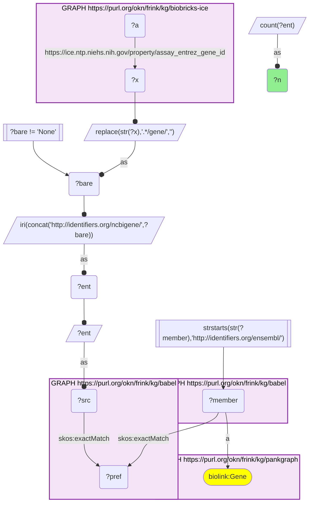
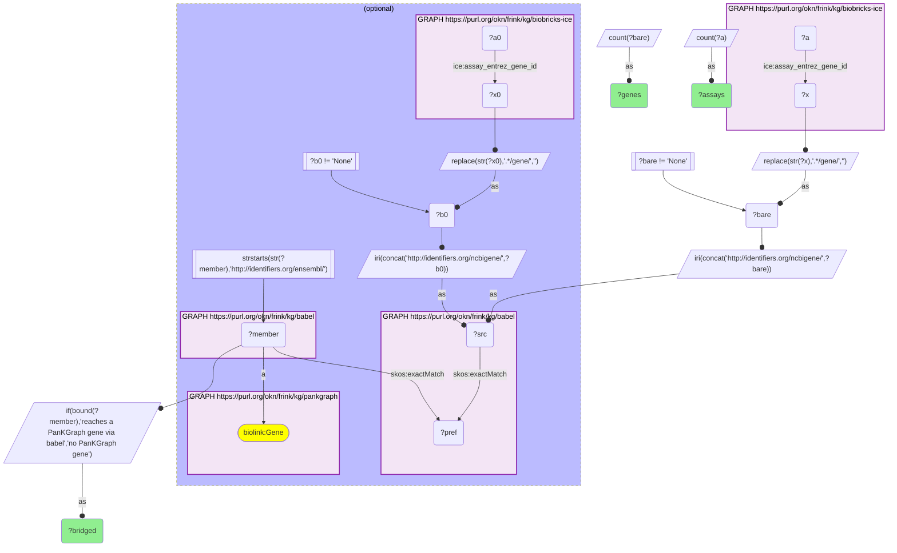
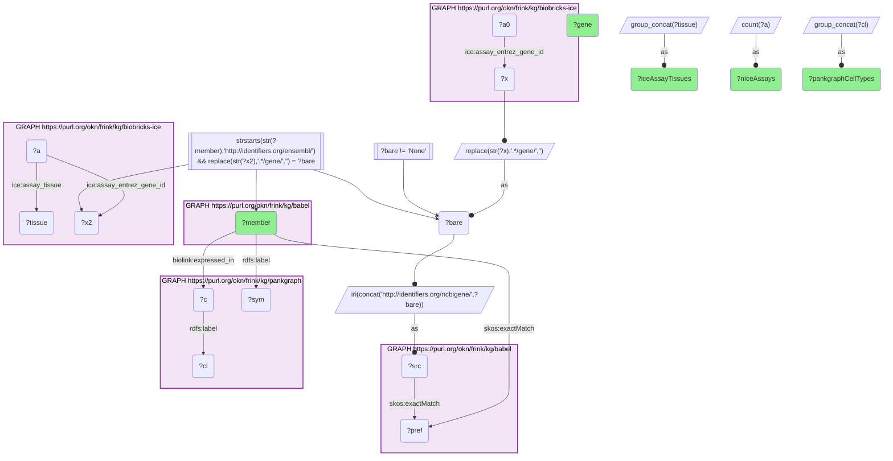

# How much of ICE's assay-target gene axis reaches PanKGraph through Babel, and which pancreas-expressed genes are the most-assayed targets

- **Date:** 2026-09-26
- **Model:** claude-opus-5-5
- **External MCP servers:** PubMed
- **SPARQL endpoint:** https://apps.okn.us/federation/sparql
- **Generated by:** mcp-okn v0.1.0 (build 7d8000e)
- **Contents:** 3 queries · 3 query diagrams

## Knowledge graphs used

- `biobricks-ice` — <https://purl.org/okn/frink/kg/biobricks-ice>
- `babel` — <https://purl.org/okn/frink/kg/babel>
- `pankgraph` — <https://purl.org/okn/frink/kg/pankgraph>

## Conversation

👤 **User**

Crosswalk: `biobricks-ice` x `pankgraph` on **Entrez to Ensembl, bridged through `babel`** (crosswalk `C26-entrez-ice-pankgraph-via-babel`, verified_count 395). ICE (the NTP Integrated Chemical Environment) records each in-vitro assay's mechanistic gene target as an Entrez id on `ice:assay_entrez_gene_id` (`https://www.ncbi.nlm.nih.gov/gene/{id}`, or the literal `None`); pankgraph keys its genes on Ensembl IRIs (`http://identifiers.org/ensembl/ENSG...`, `biolink:Gene`). The two graphs share no gene identifier scheme. babel (the Translator Babel identifier cliques) links them: the bare Entrez id is rebuilt as `http://identifiers.org/ncbigene/{id}`, which `skos:exactMatch`es its gene clique's preferred id, and the clique's `http://identifiers.org/ensembl/ENSG...` member is already in pankgraph's form. Both babel hops are staged in nested `SELECT DISTINCT` subqueries with the scheme filter outside them, or the join times out.

Research question: How many of ICE's assay target genes reach PanKGraph through Babel, and which pancreas-expressed genes are the most-assayed targets (Entrez to Ensembl via Babel)?

Why the join is required: ICE's gene axis is the set of mechanistic targets its in-vitro assays read out; it carries assay platform, tissue and source but nothing about the pancreas. PanKGraph carries PanKbase single-cell expression for the human islet and exocrine pancreas, recording which genes are expressed in beta, alpha, delta, ductal and acinar cells (`biolink:expressed_in` to a CL cell type). PanKGraph holds no assay data. Because ICE speaks Entrez and PanKGraph speaks Ensembl, only the babel bridge can measure how much of ICE's target axis is pancreas-expressed and rank those targets by assay coverage.

---

🧠 **Assistant**

**Bridge coverage.** ICE annotates **525 distinct Entrez gene targets** across its assays (assays whose `assay_entrez_gene_id` is the literal `None` are excluded). **395 of those 525 genes (75%) reach a PanKGraph Ensembl gene through babel**, and they are the targets of **1,231 ICE assays**. The 130 genes that do not bridge account for only **278 assays**. So the bridge covers three quarters of ICE's gene axis and **82% of its gene-annotated assays** (1,231 of 1,509).

| ICE assay target genes | Genes | ICE assays |
| --- | --- | --- |
| Reaches a PanKGraph gene via babel | 395 | 1,231 |
| No PanKGraph gene | 130 | 278 |

**Most-assayed pancreas-expressed targets.** Restricting to the bridged genes that PanKGraph records as expressed in at least one pancreas cell type, and ranking by how many ICE assays target them:

| Gene | ICE assays | PanKGraph pancreas cell types expressing it | ICE assay tissues |
| --- | --- | --- | --- |
| AR | 29 | ductal, alpha | adrenal gland, prostate, liver, bone, ovary, kidney, breast |
| ESR1 | 22 | delta, alpha, beta | liver, ovary, kidney, cervix, breast, mammary gland/breast |
| PGR | 18 | delta, beta, alpha | adrenal gland, liver, kidney |
| TP53 | 15 | delta, acinar, ductal, alpha, beta | intestinal, liver |
| CCL2 | 12 | ductal, acinar | vascular, skin |
| VCAM1 | 12 | ductal | skin, vascular |
| CXCL8 | 12 | acinar, ductal, alpha | vascular, skin |
| THRA | 10 | acinar, delta, ductal, beta, alpha | liver |
| PPARG | 10 | alpha | liver, kidney |
| ESR2 | 10 | delta, acinar, ductal, beta, alpha | kidney, liver |
| THRB | 10 | acinar, delta, ductal, beta, alpha | kidney, liver |
| NR1H4 | 9 | ductal | kidney, liver |
| PLAUR | 8 | acinar, ductal, alpha | lung, vascular |
| NR3C1 | 8 | alpha, acinar, ductal, delta, beta | cervix, liver |
| JUN | 8 | delta, acinar, ductal, beta, alpha | liver |
| CYP3A4 | 8 | acinar | liver |
| CYP1A1 | 7 | ductal, acinar | liver |
| H2AX | 7 | delta, acinar, alpha, ductal, beta | liver, ovary |
| RARA | 7 | acinar, delta, ductal, beta, alpha | liver, ovary (embryo) |
| SERPINE1 | 6 | ductal | lung, vascular |

(Cells listed as `None` in ICE's `assay_tissue` are omitted from the tissue column.)

**Why it answers the question.** The coverage table sizes the crosswalk from ICE's side: three quarters of its gene axis and four fifths of its gene-annotated assays land on a PanKGraph gene, so this is a broad bridge rather than a handful of coincidental matches. The ranked table then combines ICE's assay count with PanKGraph's pancreas cell-type expression, which neither graph holds alone. Two things stand out. First, **ICE's most heavily assayed targets are nuclear receptors** (AR 29 assays, ESR1 22, PGR 18, THRA and THRB 10 each, PPARG 10, NR1H4 9, NR3C1 8, RARA 7), reflecting the endocrine-disruptor focus of ToxCast and Tox21. PanKGraph records nearly all of them as expressed in islet or exocrine pancreas cells, several across all five cell types. Second, the **ICE assay tissue column never contains pancreas**: these assays run in liver, prostate, vascular, kidney, skin and other models. The pancreas relevance comes entirely from PanKGraph.

**Caveats.**
- *Expression, not disease.* "Expressed in" is a PanKbase single-cell expression call, not a disease association. A gene being expressed in beta cells does not make an assay on it a diabetes assay.
- *No pancreatic assay exists in ICE.* Every assay behind these rows was run in a non-pancreatic system. The join identifies assays that read out a gene the pancreas also expresses; it does not show that the assay measures pancreatic biology.
- *Gene axis only.* ICE's gene axis is its assay targets; the 130 non-bridging genes may be non-human targets, withdrawn ids, or genes with no Ensembl member in their babel clique. ICE's much larger chemical axis (~200k CAS numbers) is not part of this crosswalk.
- *Count genes, not cliques.* babel can put one id in two cliques, so every query counts distinct genes and assays.

## Literature validation

The identifier join is **validated by construction**. NCBI Gene and Ensembl are registered, exact-string gene identifiers, and babel asserts their equivalence through a shared gene clique; no symbol matching is used. The hand-verified crosswalk `C26-entrez-ice-pankgraph-via-babel` (verified_count 395) reproduces live.

Claims checked against PubMed:

- **ESR1 in beta cells** (PanKGraph: expressed in delta, alpha and beta cells): estrogen receptor alpha acts in pancreatic beta cells to preserve mitochondrial function, suppress ER stress and protect against apoptosis, shown with islet-specific ERalpha-knockout mice and Esr1-knockdown beta cells (PMID 29378845, [DOI](https://doi.org/10.1074/jbc.M117.805069)); ERalpha is also expressed on human islet-derived precursor cells and regulates their proliferation and differentiation (PMID 20128772, [DOI](https://doi.org/10.1042/CBI20090390)). **Supported.**
- **AR in islet cells** (PanKGraph: expressed in ductal and alpha cells): the androgen receptor is present in male and female beta cells, where testosterone action enhances glucose-stimulated insulin secretion (PMID 30601759, [DOI](https://doi.org/10.1530/JOE-18-0573)); beta-cell-selective AR knockout mice show altered islet expression of insulin-secretion and inflammation genes (PMID 28343791, [DOI](https://doi.org/10.1016/j.jdiacomp.2017.03.002)). **Supported** for islet expression, though PanKGraph's specific cell-type assignment (ductal and alpha, not beta) was not separately confirmed here.
- **ICE assays are a real high-throughput screening resource**: ICE serves ToxCast and Tox21 high-throughput screening data, including the androgen-receptor endpoints used to model endocrine disruption (PMID 32074470, [DOI](https://doi.org/10.1289/EHP5580)). **Supported.**
- The coverage figures (395/525 genes, 1,231/1,509 assays) and the ranking are results of this join and are **not independently confirmed** by any publication.

Sources retrieved from PubMed.

**Validated with caveats.** The coverage counts come from registered identifiers bridged by babel and ran live against both graphs. The nuclear-receptor genes highlighted are genuinely expressed in islet tissue according to the literature, but the pancreatic relevance of any individual ICE assay is an annotation-level inference: none of these assays was run in pancreatic tissue.

## SPARQL queries executed

#### Query 1

_2026-09-27T00:41:45+00:00 · `biobricks-ice`, `babel`, `pankgraph`_

```sparql
SELECT (COUNT(DISTINCT ?ent) AS ?n) WHERE {
  { SELECT DISTINCT ?ent ?member WHERE {
    { SELECT DISTINCT ?ent ?pref WHERE {
        { SELECT DISTINCT ?ent ?src WHERE { GRAPH <https://purl.org/okn/frink/kg/biobricks-ice> { ?a <https://ice.ntp.niehs.nih.gov/property/assay_entrez_gene_id> ?x } BIND(REPLACE(STR(?x),'.*/gene/','') AS ?bare) FILTER(?bare != 'None') BIND(IRI(CONCAT('http://identifiers.org/ncbigene/', ?bare)) AS ?ent) BIND(?ent AS ?src) } }
        GRAPH <https://purl.org/okn/frink/kg/babel> { ?src <http://www.w3.org/2004/02/skos/core#exactMatch> ?pref } } }
    GRAPH <https://purl.org/okn/frink/kg/babel> { ?member <http://www.w3.org/2004/02/skos/core#exactMatch> ?pref } } }
  FILTER(STRSTARTS(STR(?member),'http://identifiers.org/ensembl/'))
  GRAPH <https://purl.org/okn/frink/kg/pankgraph> { ?member a <https://w3id.org/biolink/vocab/Gene> }
}
```



_1 row(s)_

| n |
| --- |
| 395 |

#### Query 2

_2026-09-27T00:41:55+00:00 · `biobricks-ice`, `babel`, `pankgraph`_

```sparql
PREFIX ice: <https://ice.ntp.niehs.nih.gov/property/>
SELECT ?bridged (COUNT(DISTINCT ?bare) AS ?genes) (COUNT(DISTINCT ?a) AS ?assays) WHERE {
  GRAPH <https://purl.org/okn/frink/kg/biobricks-ice> { ?a ice:assay_entrez_gene_id ?x }
  BIND(REPLACE(STR(?x),'.*/gene/','') AS ?bare) FILTER(?bare != 'None')
  BIND(IRI(CONCAT('http://identifiers.org/ncbigene/', ?bare)) AS ?src)
  OPTIONAL {
    { SELECT DISTINCT ?src ?member WHERE {
      { SELECT DISTINCT ?src ?pref WHERE {
          { SELECT DISTINCT ?src WHERE { GRAPH <https://purl.org/okn/frink/kg/biobricks-ice> { ?a0 ice:assay_entrez_gene_id ?x0 } BIND(REPLACE(STR(?x0),'.*/gene/','') AS ?b0) FILTER(?b0 != 'None') BIND(IRI(CONCAT('http://identifiers.org/ncbigene/', ?b0)) AS ?src) } }
          GRAPH <https://purl.org/okn/frink/kg/babel> { ?src <http://www.w3.org/2004/02/skos/core#exactMatch> ?pref } } }
      GRAPH <https://purl.org/okn/frink/kg/babel> { ?member <http://www.w3.org/2004/02/skos/core#exactMatch> ?pref }
      FILTER(STRSTARTS(STR(?member),'http://identifiers.org/ensembl/')) } }
    GRAPH <https://purl.org/okn/frink/kg/pankgraph> { ?member a <https://w3id.org/biolink/vocab/Gene> } }
  BIND(IF(BOUND(?member), "reaches a PanKGraph gene via babel", "no PanKGraph gene") AS ?bridged)
} GROUP BY ?bridged
```



_2 row(s)_

| bridged | genes | assays |
| --- | --- | --- |
| no PanKGraph gene | 130 | 278 |
| reaches a PanKGraph gene via babel | 395 | 1231 |

#### Query 3

_2026-09-27T00:42:05+00:00 · `biobricks-ice`, `babel`, `pankgraph`_

```sparql
PREFIX rdfs: <http://www.w3.org/2000/01/rdf-schema#>
PREFIX biolink: <https://w3id.org/biolink/vocab/>
PREFIX ice: <https://ice.ntp.niehs.nih.gov/property/>
SELECT ?member (SAMPLE(?sym) AS ?gene) (COUNT(DISTINCT ?a) AS ?nIceAssays)
       (GROUP_CONCAT(DISTINCT ?cl; separator="; ") AS ?pankgraphCellTypes)
       (GROUP_CONCAT(DISTINCT ?tissue; separator="; ") AS ?iceAssayTissues) WHERE {
  { SELECT DISTINCT ?bare ?member WHERE {
    { SELECT DISTINCT ?bare ?pref WHERE {
        { SELECT DISTINCT ?bare ?src WHERE { GRAPH <https://purl.org/okn/frink/kg/biobricks-ice> { ?a0 ice:assay_entrez_gene_id ?x } BIND(REPLACE(STR(?x),'.*/gene/','') AS ?bare) FILTER(?bare != 'None') BIND(IRI(CONCAT('http://identifiers.org/ncbigene/', ?bare)) AS ?src) } }
        GRAPH <https://purl.org/okn/frink/kg/babel> { ?src <http://www.w3.org/2004/02/skos/core#exactMatch> ?pref } } }
    GRAPH <https://purl.org/okn/frink/kg/babel> { ?member <http://www.w3.org/2004/02/skos/core#exactMatch> ?pref } } }
  FILTER(STRSTARTS(STR(?member),'http://identifiers.org/ensembl/'))
  GRAPH <https://purl.org/okn/frink/kg/pankgraph> { ?member rdfs:label ?sym ; biolink:expressed_in ?c . ?c rdfs:label ?cl }
  GRAPH <https://purl.org/okn/frink/kg/biobricks-ice> { ?a ice:assay_entrez_gene_id ?x2 ; ice:assay_tissue ?tissue }
  FILTER(REPLACE(STR(?x2),'.*/gene/','') = ?bare)
} GROUP BY ?member ORDER BY DESC(?nIceAssays) LIMIT 20
```



_20 row(s) — showing first 5_

| member | gene | nIceAssays | pankgraphCellTypes | iceAssayTissues |
| --- | --- | --- | --- | --- |
| http://identifiers.org/ensembl/ENSG00000169083 | AR | 29 | Ductal Cell; Alpha Cell | adrenal gland; prostate; liver; bone; None; ovary; kidney; breast |
| http://identifiers.org/ensembl/ENSG00000091831 | ESR1 | 22 | Delta Cell; Alpha Cell; Beta Cell | liver; None; ovary; kidney; cervix; breast; mammary gland/breast |
| http://identifiers.org/ensembl/ENSG00000082175 | PGR | 18 | Delta Cell; Beta Cell; Alpha Cell | adrenal gland; liver; kidney; None |
| http://identifiers.org/ensembl/ENSG00000141510 | TP53 | 15 | Delta Cell; Acinar Cell; Ductal Cell; Alpha Cell; Beta Cell | intestinal; liver |
| http://identifiers.org/ensembl/ENSG00000108691 | CCL2 | 12 | Ductal Cell; Acinar Cell | vascular; skin |
